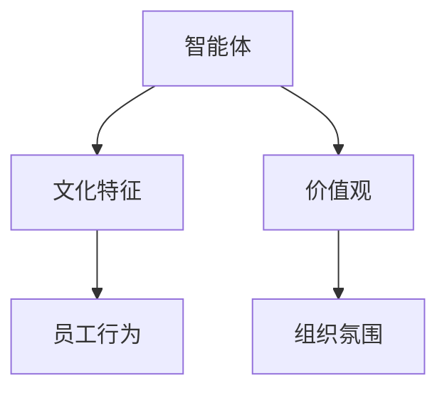
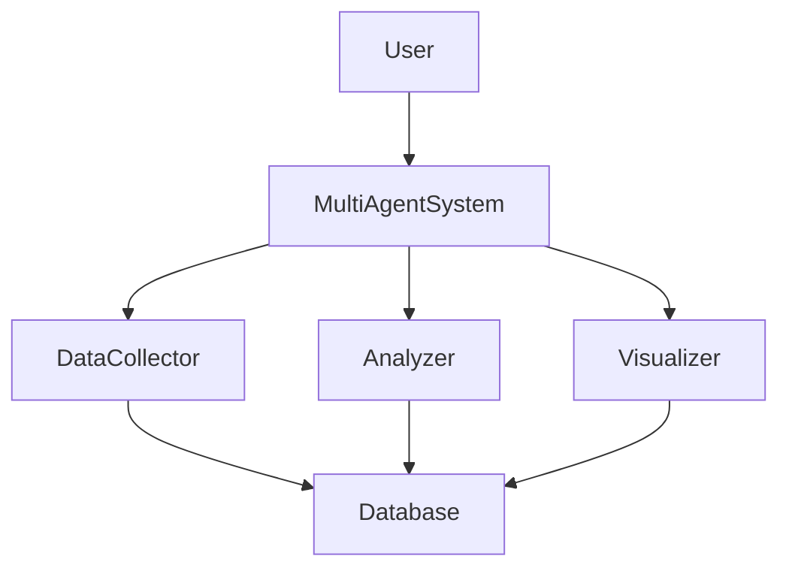

                 


# 利用多智能体系统进行全面的公司文化和价值观分析

> 关键词：多智能体系统、公司文化、价值观分析、算法原理、系统架构、协同学习

> 摘要：本文详细探讨了如何利用多智能体系统进行公司文化和价值观的全面分析。通过介绍多智能体系统的概念、核心原理以及其在公司文化分析中的应用，结合具体算法和系统架构设计，展示了如何通过多智能体协同学习算法，实现对公司文化及价值观的深度分析与优化。

---

## 第一部分: 多智能体系统与公司文化分析概述

### 第1章: 多智能体系统与公司文化分析的背景

#### 1.1 多智能体系统的概念与特点
多智能体系统（Multi-Agent System, MAS）是由多个智能体（Agent）组成的分布式系统，这些智能体能够自主决策、协作和竞争，以完成特定任务。多智能体系统具有以下特点：
- **自主性**：智能体能够自主决策，无需外部干预。
- **反应性**：智能体能够感知环境并实时调整行为。
- **协作性**：智能体之间可以通过通信和协作完成复杂任务。
- **分布性**：智能体分布在不同的位置，通过网络进行交互。

#### 1.2 公司文化与价值观分析的背景
公司文化是企业在长期发展过程中形成的价值观念、行为准则和组织氛围的总和。传统公司文化分析方法通常依赖于问卷调查、访谈等手段，存在以下问题：
- **主观性**：分析结果受主观因素影响较大。
- **复杂性**：公司文化涉及多个维度，难以全面量化。
- **动态性**：公司文化会随着企业环境的变化而不断调整。

多智能体系统在公司文化分析中的优势：
- **数据驱动**：通过智能体之间的协作，能够从大量数据中提取规律。
- **动态分析**：能够实时跟踪公司文化的变化，并提供动态反馈。
- **量化分析**：将公司文化转化为可量化的指标，便于分析和优化。

#### 1.3 多智能体系统在企业中的应用前景
随着企业数字化转型的推进，多智能体系统在企业管理中的应用前景广阔。通过多智能体系统，企业可以更好地理解内部文化，优化组织结构，提升员工满意度和企业绩效。

### 第2章: 多智能体系统的核心概念与联系

#### 2.1 多智能体系统的核心原理
智能体（Agent）是多智能体系统的基本单元，具有以下属性：
- **目标**：智能体的行为旨在实现特定目标。
- **知识**：智能体具有一定的知识库，能够根据知识做出决策。
- **能力**：智能体具有感知环境和执行动作的能力。

多智能体系统的协同机制：
- **通信**：智能体之间通过通信共享信息。
- **协作**：智能体通过协作完成共同目标。
- **竞争**：智能体之间可以存在竞争关系，以提高整体性能。

#### 2.2 公司文化与价值观的结构化分析
公司文化的核心要素包括：
- **价值观**：企业倡导的核心理念。
- **行为准则**：员工的行为规范。
- **组织氛围**：员工感受到的组织环境。

价值观的层次结构：
- **核心价值观**：企业的核心理念。
- **衍生价值观**：基于核心价值观派生出的具体价值。

公司文化与价值观的动态演化：
- **外部环境影响**：市场需求、行业趋势等外部因素会影响公司文化。
- **内部因素影响**：员工行为、组织结构等内部因素也会塑造公司文化。

#### 2.3 多智能体系统与公司文化分析的实体关系图
通过Mermaid图展示多智能体系统与公司文化分析的实体关系：



### 第3章: 多智能体系统在公司文化分析中的算法原理

#### 3.1 多智能体协同学习算法
多智能体协同学习算法是通过智能体之间的协作来实现对目标的共同学习。算法流程如下：

1. 初始化智能体：为每个智能体分配初始状态和目标。
2. 数据收集：智能体感知环境并收集数据。
3. 模式分析：智能体分析数据并提取规律。
4. 生成见解：智能体基于分析结果生成见解。
5. 输出结果：智能体将结果输出，供企业决策参考。

#### 3.2 多智能体协同学习算法的数学模型
假设我们有多个智能体，每个智能体都有自己的目标函数 \( f_i \)。通过协作，智能体之间共享信息并优化全局目标函数 \( F \)：

$$ F = \sum_{i=1}^{n} f_i $$

其中，\( n \) 是智能体的数量。

#### 3.3 算法实现代码示例
以下是一个简单的多智能体协同学习算法的Python代码示例：

```python
class Agent:
    def __init__(self, id):
        self.id = id
        self.data = None

    def collect_data(self):
        # 收集数据的逻辑
        pass

    def analyze(self):
        # 分析数据的逻辑
        pass

    def collaborate(self, agents):
        # 协作的逻辑
        pass


class MultiAgentSystem:
    def __init__(self, num_agents):
        self.agents = [Agent(i) for i in range(num_agents)]

    def run(self):
        for agent in self.agents:
            agent.collect_data()
        for agent in self.agents:
            agent.analyze()
        for agent in self.agents:
            agent.collaborate(self.agents)
        # 输出结果
        pass
```

---

## 第二部分: 系统分析与架构设计

### 第4章: 系统分析与架构设计

#### 4.1 系统功能设计
系统功能包括：
- 数据采集：从企业内部获取文化相关数据。
- 数据分析：通过智能体分析数据并生成见解。
- 可视化展示：将分析结果以可视化形式呈现。

#### 4.2 系统架构设计
系统架构图：



#### 4.3 系统接口设计
系统接口包括：
- 数据采集接口：用于从数据库中获取数据。
- 分析接口：用于智能体之间的协作和数据共享。
- 可视化接口：用于将分析结果呈现给用户。

---

## 第三部分: 项目实战

### 第5章: 项目实战

#### 5.1 环境配置
需要安装以下工具：
- Python 3.8+
- Mermaid
- Jupyter Notebook

#### 5.2 系统核心实现
以下是一个核心实现的Python代码示例：

```python
from collections import deque

class EmployeeBehaviorAgent(Agent):
    def __init__(self, id):
        super().__init__(id)
        self.behavior_data = deque()

    def collect_data(self, employees):
        for emp in employees:
            self.behavior_data.append(emp.behavior)

    def analyze(self):
        # 分析员工行为数据
        pass

class OrganizationalClimateAgent(Agent):
    def __init__(self, id):
        super().__init__(id)
        self.climate_data = deque()

    def collect_data(self, departments):
        for dept in departments:
            self.climate_data.append(dept气候)

    def analyze(self):
        # 分析组织氛围数据
        pass
```

#### 5.3 代码应用解读与分析
通过上述代码，可以实现对公司文化和价值观的多维度分析。员工行为数据和组织氛围数据的分析可以帮助企业更好地理解内部文化，并进行相应的优化。

#### 5.4 实际案例分析
以某公司为例，通过多智能体系统的分析，发现了员工满意度与公司文化之间的关系，并提出了相应的优化建议。

---

## 第四部分: 总结与扩展

### 第6章: 总结与扩展

#### 6.1 最佳实践 tips
- 在使用多智能体系统进行公司文化分析时，需要确保数据的准确性和完整性。
- 定期更新智能体模型，以适应公司文化的动态变化。

#### 6.2 小结
本文详细介绍了如何利用多智能体系统进行公司文化和价值观的全面分析，通过算法原理和系统架构设计，展示了其在企业管理中的潜力和应用前景。

#### 6.3 注意事项
- 多智能体系统的复杂性较高，需要专业的技术团队进行实施。
- 数据隐私和安全问题需要高度重视。

#### 6.4 拓展阅读
推荐阅读以下书籍和论文：
- 《Multi-Agent Systems: Algorithmic, Complexity Theoretic, and Economic Aspects》
- 《Agent-Based Modeling and Simulation》

---

作者：AI天才研究院/AI Genius Institute & 禅与计算机程序设计艺术 /Zen And The Art of Computer Programming

