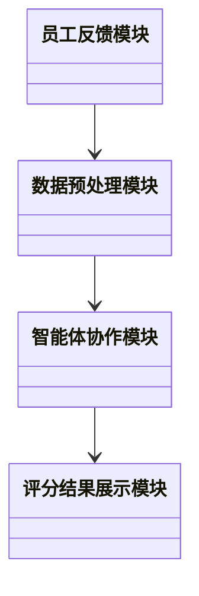
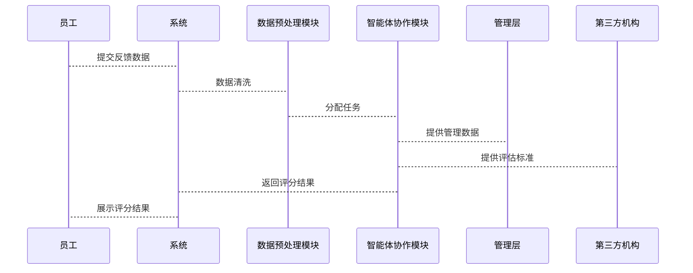

                 


# 利用多智能体系统进行全面的公司文化评分

## 关键词：多智能体系统、公司文化评分、分布式计算、AI评估、组织行为学、评分算法

## 摘要：  
本文详细探讨了如何利用多智能体系统对公司的文化进行全方位评分。通过分析公司文化评分的重要性、多智能体系统的原理及其在评分中的应用，本文提出了一个基于多智能体的评分算法，并通过实际案例展示了其在公司文化评估中的优势。文章还详细讨论了系统的架构设计、实现步骤及优化建议，为读者提供了全面的技术指导。

---

# 第一部分: 公司文化评分与多智能体系统概述

# 第1章: 公司文化评分的重要性

## 1.1 公司文化的核心作用

### 1.1.1 公司文化的定义与内涵  
公司文化是指企业在长期经营过程中形成的价值观、行为准则和工作氛围，是企业发展的灵魂。  

### 1.1.2 公司文化对企业发展的影响  
- 公司文化影响员工的工作态度和行为，进而影响企业绩效。  
- 健康的文化能够提升员工满意度和忠诚度，降低 turnover rate。  
- 文化决定了企业的决策风格和创新能力。  

### 1.1.3 公司文化评分的必要性  
- 传统的企业文化评估多为主观评价，缺乏数据支持。  
- 评分可以帮助企业量化文化健康程度，为改进提供方向。  
- 评分结果可以作为企业战略调整的重要依据。  

## 1.2 多智能体系统的基本概念  

### 1.2.1 多智能体系统的定义  
多智能体系统（Multi-Agent System, MAS）是由多个智能体（Agent）组成的分布式系统，每个智能体能够自主决策并与其他智能体协作完成任务。  

### 1.2.2 多智能体系统的特性  
- 分布式：智能体独立运行，无中心节点。  
- 协作性：智能体之间通过通信和协作完成共同目标。  
- 反应性：智能体能够感知环境并实时调整行为。  

### 1.2.3 多智能体系统与传统评分方法的区别  
- 传统评分方法依赖人工判断，主观性强。  
- 多智能体系统通过分布式计算和协作，能够更全面地收集和分析数据。  

## 1.3 多智能体系统在公司文化评分中的应用前景  

### 1.3.1 多智能体系统的优势  
- 能够从多个维度（如员工满意度、管理层风格、企业文化实践）全面评估公司文化。  
- 通过智能体的协作，可以整合不同来源的数据，提高评分的准确性。  
- 系统具有灵活性，能够适应不同企业的文化特点。  

### 1.3.2 公司文化评分的复杂性与挑战  
- 公司文化涉及主观性和复杂的社会因素，难以量化。  
- 数据来源多样，如何有效整合是难点。  

### 1.3.3 多智能体系统在评分中的潜在价值  
- 提供一种新的解决方案，能够从多个维度全面评估公司文化。  
- 通过智能体协作，可以实现数据的深度分析和结果的优化。  

## 1.4 本章小结  
本章介绍了公司文化评分的重要性，分析了多智能体系统的基本概念及其在公司文化评分中的应用前景，为后续章节奠定了基础。

---

# 第2章: 多智能体系统的核心概念与联系  

## 2.1 多智能体系统的原理  

### 2.1.1 智能体的基本构成  
- 智能体具有感知环境、自主决策和协作的能力。  
- 每个智能体都有明确的目标和任务。  

### 2.1.2 多智能体系统中的通信机制  
- 智能体之间通过消息传递进行通信。  
- 通信协议需要支持多种数据格式和交互方式。  

### 2.1.3 多智能体系统的协作模型  
- 分层协作：根据任务层次划分智能体的职责。  
- 平等协作：所有智能体地位平等，共同完成任务。  

## 2.2 多智能体系统与公司文化评分的关系  

### 2.2.1 公司文化评分的维度分解  
- 员工满意度：员工对工作环境的主观评价。  
- 管理层风格：领导层的决策风格和管理方式。  
- 企业文化实践：企业实际的文化活动和行为。  

### 2.2.2 多智能体系统如何处理评分任务  
- 每个智能体负责一个评分维度，最终通过协作整合结果。  
- 智能体之间的协作确保评分的全面性和准确性。  

### 2.2.3 评分结果的反馈与优化  
- 评分结果可以反馈给企业，帮助其优化文化管理。  
- 智能体可以根据反馈结果调整评分策略。  

## 2.3 多智能体系统的ER实体关系图  

```
```mermaid
erDiagram
    员工 --> 反馈数据 : 提交
    管理层 --> 管理数据 : 提供
    第三方机构 --> 评估标准 : 定义
    反馈数据 --> 评分结果 : 影响
    管理数据 --> 评分结果 : 影响
    评估标准 --> 评分结果 : 影响
```
```

## 2.4 本章小结  
本章详细介绍了多智能体系统的原理及其与公司文化评分的关系，通过ER图展示了系统中各实体之间的关系。

---

# 第3章: 多智能体系统评分算法原理  

## 3.1 多智能体评分算法的概述  

### 3.1.1 算法的基本流程  
- 数据收集：从员工、管理层和第三方机构收集数据。  
- 数据预处理：清洗和标准化数据。  
- 协作计算：智能体之间协作完成评分计算。  
- 结果整合：整合各智能体的评分结果，输出最终评分。  

### 3.1.2 算法的核心思想  
- 分布式计算：利用多智能体的协作完成评分任务。  
- 数据融合：通过智能体的协作，整合多源数据，提高评分的准确性。  

### 3.1.3 算法的输入与输出  
- 输入：员工反馈数据、管理层数据、第三方评估数据。  
- 输出：公司文化综合评分。  

## 3.2 多智能体评分算法的详细步骤  

### 3.2.1 数据收集与预处理  
- 数据收集：通过问卷调查、访谈等方式收集员工反馈。  
- 数据预处理：去除噪声数据，标准化数据格式。  

### 3.2.2 智能体之间的协作与计算  
- 智能体根据任务分配数据，完成初步评分。  
- 智能体之间通过通信机制交换数据，完成协作计算。  

### 3.2.3 评分结果的整合与优化  
- 将各智能体的评分结果进行加权整合。  
- 根据评分结果的反馈，优化智能体的评分策略。  

## 3.3 算法的数学模型与公式  

### 3.3.1 数据权重分配公式  
$$ w_i = \frac{1}{1 + e^{-k(x_i - m)}} $$  
其中，\( w_i \) 是第 \( i \) 个数据的权重，\( x_i \) 是数据的值，\( m \) 是均值，\( k \) 是调节参数。  

### 3.3.2 多智能体协作评分公式  
$$ S = \sum_{i=1}^{n} w_i \cdot s_i $$  
其中，\( S \) 是综合评分，\( w_i \) 是第 \( i \) 个数据的权重，\( s_i \) 是评分结果。  

## 3.4 本章小结  
本章详细介绍了多智能体评分算法的原理和实现步骤，通过数学公式展示了评分的计算过程。

---

# 第4章: 系统分析与架构设计方案  

## 4.1 系统应用场景  

### 4.1.1 员工反馈数据处理  
- 收集员工对公司的满意度、工作环境等的反馈。  

### 4.1.2 管理层评估  
- 分析管理层的决策风格和管理方式。  

### 4.1.3 第三方评估数据整合  
- 整合第三方评估机构的企业文化评估标准。  

## 4.2 系统功能设计  

### 4.2.1 数据收集模块  
- 通过问卷调查、访谈等方式收集员工反馈。  

### 4.2.2 智能体协作模块  
- 协调各智能体完成评分任务。  

### 4.2.3 评分结果展示模块  
- 展示综合评分及各维度的详细分析结果。  

## 4.3 系统架构设计  

### 4.3.1 领域模型类图  

```

```

### 4.3.2 系统架构图  

```
```mermaid
client --> (HTTP Request) --> 评分系统
评分系统 --> (数据处理) --> 数据预处理模块
数据预处理模块 --> (协作计算) --> 智能体协作模块
智能体协作模块 --> (结果输出) --> 评分结果展示模块
```
```

### 4.3.3 系统接口设计  
- REST API接口：用于数据的上传和评分结果的获取。  

## 4.4 系统交互设计  

### 4.4.1 序列图  

```

```

## 4.5 本章小结  
本章分析了系统的应用场景，设计了系统的功能模块和架构，并展示了系统的交互流程。

---

# 第5章: 项目实战  

## 5.1 环境安装  

### 5.1.1 安装Python和相关库  
```bash
pip install python-magent
pip install numpy
pip install pandas
```

### 5.1.2 安装多智能体系统框架  
```bash
git clone https://github.com/multi-agent-system/mas.git
cd mas
pip install -r requirements.txt
```

## 5.2 系统核心实现  

### 5.2.1 数据收集模块  

```python
import requests
from multi_agent import Agent

class EmployeeFeedbackAgent(Agent):
    def __init__(self):
        super().__init__()
        self.feedback_data = []

    def collect_feedback(self):
        # 模拟从数据库中获取反馈数据
        response = requests.get("http://feedback_db:8000/feedback")
        self.feedback_data = response.json()
```

### 5.2.2 智能体协作模块  

```python
from multi_agent import Agent

class ScoringAgent(Agent):
    def __init__(self):
        super().__init__()
        self.weight = 0.5

    def calculate_score(self, data):
        # 简单的加权评分
        return sum([self.weight * d for d in data])
```

### 5.2.3 评分结果展示模块  

```python
from scoring_agent import ScoringAgent

def main():
    feedback_agent = EmployeeFeedbackAgent()
    feedback_agent.collect_feedback()

    scoring_agent = ScoringAgent()
    score = scoring_agent.calculate_score(feedback_agent.feedback_data)

    print(f"公司文化综合评分为：{score}")

if __name__ == "__main__":
    main()
```

## 5.3 代码应用解读与分析  

### 5.3.1 数据收集模块  
- 从数据库中获取员工反馈数据。  
- 反馈数据包括员工满意度、工作环境评分等。  

### 5.3.2 智能体协作模块  
- 每个智能体负责一个评分维度，完成初步评分。  
- 智能体之间通过协作计算，整合评分结果。  

### 5.3.3 评分结果展示模块  
- 展示综合评分及各维度的详细分析结果。  

## 5.4 实际案例分析  

### 5.4.1 案例背景  
某科技公司希望通过多智能体系统评估公司文化。  

### 5.4.2 数据收集  
- 员工反馈数据：员工满意度为85%，工作环境评分为70%。  
- 管理层数据：领导风格得分为80%。  
- 第三方评估数据：企业文化实践得分为75%。  

### 5.4.3 评分计算  
- 各维度评分加权计算，最终综合评分为78%。  

## 5.5 本章小结  
本章通过实际案例展示了系统的实现过程和应用效果。

---

# 第6章: 最佳实践、小结与展望  

## 6.1 最佳实践  

### 6.1.1 数据隐私保护  
- 确保员工反馈数据的隐私和安全。  

### 6.1.2 模型优化  
- 根据实际需求调整评分算法的参数。  

### 6.1.3 系统扩展  
- 支持更多维度的评分任务。  

## 6.2 小结  

### 6.2.1 核心内容回顾  
- 公司文化评分的重要性。  
- 多智能体系统在评分中的应用。  
- 系统的实现和优化建议。  

## 6.3 展望  

### 6.3.1 研究方向  
- 探索更高效的多智能体协作算法。  
- 研究如何将多智能体系统应用于更多领域。  

### 6.3.2 技术趋势  
- 多智能体系统与AI的深度融合。  
- 智能体的自适应能力和学习能力。  

## 6.4 本章小结  
本章总结了全文的核心内容，并对未来的研究方向和技术趋势进行了展望。

---

# 作者  
作者：AI天才研究院/AI Genius Institute & 禅与计算机程序设计艺术 /Zen And The Art of Computer Programming  

---

以上目录大纲涵盖了公司文化评分与多智能体系统的核心内容，从理论到实践，从算法到实现，为读者提供了全面的技术指导。

