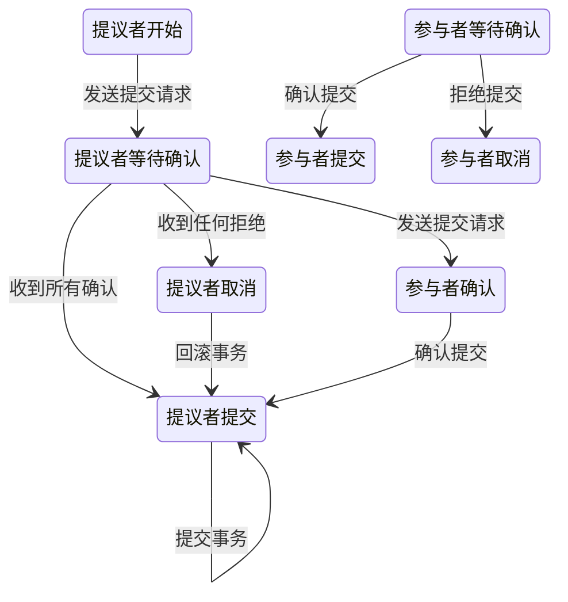
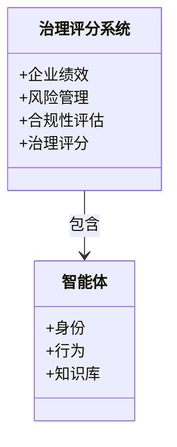
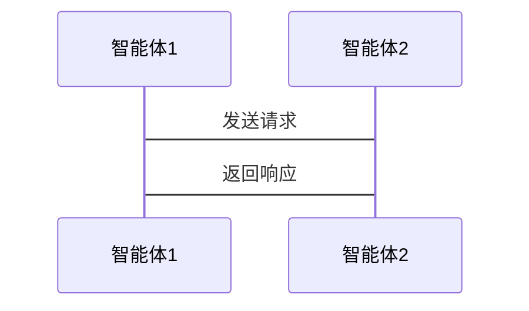

                 


# 利用多智能体系统进行全面的公司治理评分

## 关键词：多智能体系统，公司治理，评分系统，分布式计算，一致性算法，治理评分，系统架构

## 摘要：  
本文详细探讨了如何利用多智能体系统（Multi-Agent Systems, MAS）进行全面的公司治理评分。通过分析MAS的核心概念、算法原理和系统架构，结合实际应用场景，展示了如何构建一个高效、智能的公司治理评分系统。本文内容涵盖背景介绍、核心概念、算法实现、系统设计和项目实战，旨在为读者提供从理论到实践的全面指导。

---

# 第1章: 多智能体系统与公司治理评分的背景

## 1.1 问题背景与问题描述

### 1.1.1 公司治理的传统挑战
现代企业的治理面临着复杂性、多样性和动态性的挑战。传统治理方法依赖于人工评估和经验判断，存在效率低、主观性强、难以量化等问题。特别是在全球化和数字化背景下，企业需要更高效、更智能的治理方式。

### 1.1.2 多智能体系统在治理中的潜在优势
多智能体系统（MAS）通过分布式计算和协作机制，能够将复杂的治理问题分解为多个智能体的协同任务。MAS在治理中的优势包括：
- **分布式计算**：能够处理大规模、多维度的治理数据。
- **协作智能**：智能体之间可以自主协作，优化决策。
- **实时反馈**：能够快速响应治理中的动态变化。

### 1.1.3 问题的边界与外延
公司治理评分的边界包括企业内部的管理、董事会决策、风险管理等方面，而外延则涉及外部环境、行业标准、法律法规等因素。

## 1.2 多智能体系统的核心概念

### 1.2.1 多智能体系统的定义
多智能体系统是由多个智能体（Agent）组成的分布式系统，智能体能够通过交互和协作完成特定任务。

### 1.2.2 多智能体系统与传统AI的区别
| 特性         | 传统AI                         | 多智能体系统（MAS）                 |
|--------------|--------------------------------|------------------------------------|
| 智能体数量   | 单个或少数几个                 | 多个独立智能体                     |
| 任务处理方式 | 中央式处理                     | 分布式协作                         |
| 学习能力     | 单点学习                       | 多点学习与知识共享                 |

### 1.2.3 多智能体系统在公司治理中的应用领域
- **风险管理**：识别和评估企业风险。
- **决策优化**：优化董事会和管理层的决策。
- **合规性评估**：评估企业是否符合法律法规。

## 1.3 多智能体系统与公司治理的联系
- **协作机制**：智能体之间的协作能够提升治理效率。
- **动态适应**：MAS能够快速适应治理环境的变化。
- **数据共享**：智能体之间的数据共享能够提升治理评分的准确性。

---

# 第2章: 多智能体系统的算法原理

## 2.1 分布式计算与一致性算法

### 2.1.1 分布式计算的基本原理
分布式计算通过将任务分解为多个部分，分配给不同的计算节点完成。MAS中的分布式计算需要解决一致性问题。

### 2.1.2 一致性算法的实现原理
一致性算法确保分布式系统中的数据一致性。常用的一致性算法包括：
- **两阶段提交（2PC）**：保证分布式事务的原子性。
- **三阶段提交（3PC）**：提高2PC的吞吐量。

### 2.1.3 一致性算法的数学模型
一致性算法的数学模型可以用图论和逻辑表达式来描述。例如，两阶段提交算法可以用状态机来表示：



## 2.2 多智能体通信协议

### 2.2.1 通信协议的设计原则
- **可靠性**：确保信息的准确传输。
- **实时性**：快速响应通信请求。
- **安全性**：防止信息泄露和篡改。

### 2.2.2 通信协议的实现步骤
1. **建立连接**：智能体之间通过网络建立通信通道。
2. **消息编码**：将信息编码为可传输的格式。
3. **消息解码**：接收方将编码信息解码为原始数据。
4. **消息处理**：根据消息内容进行相应的处理。

### 2.2.3 通信协议的数学模型
通信协议可以用图论中的图模型来表示。例如，智能体之间的通信关系可以用以下公式表示：
$$
\text{通信关系} = \{ (A_i, A_j) | A_i \in \text{Agents}, A_j \in \text{Agents} \}
$$

---

# 第3章: 多智能体系统的系统架构设计

## 3.1 问题场景介绍
公司治理评分系统需要处理大量的动态数据，包括企业绩效、风险管理、合规性评估等。

## 3.2 系统功能设计

### 3.2.1 领域模型设计
领域模型是系统设计的重要部分。以下是领域模型的类图：



### 3.2.2 系统架构设计
系统架构设计是一个多层次的结构，包括：
1. **数据层**：存储企业数据。
2. **逻辑层**：处理业务逻辑。
3. **界面层**：提供用户交互界面。

### 3.2.3 系统接口设计
系统接口设计需要考虑智能体之间的交互。以下是接口设计的序列图：



---

# 第4章: 多智能体系统的项目实战

## 4.1 环境安装与配置
安装Python环境，并安装必要的库，如`numpy`、`pandas`、`scikit-learn`等。

## 4.2 系统核心实现

### 4.2.1 一致性算法的实现
以下是两阶段提交算法的Python代码示例：

```python
def two_phase_commit():
    coordinator = "C"
    participants = ["P1", "P2", "P3"]
    
    # 提议者开始提交
    for p in participants:
        send_request(coordinator, p)
    
    # 提议者等待确认
    responses = []
    for p in participants:
        resp = receive_response(coordinator, p)
        responses.append(resp)
    
    # 提议者提交或回滚
    if all(responses):
        commit()
    else:
        rollback()
```

### 4.2.2 通信协议的实现
以下是基于WebSocket的通信协议实现：

```python
import websockets
import asyncio

async def agent_communicate():
    async with websockets.connect('ws://localhost:8000') as websocket:
        await websocket.send('hello')
        response = await websocket.recv()
        print(response)
```

## 4.3 代码应用解读与分析
通过上述代码，我们可以实现MAS中的分布式计算和通信协议。

## 4.4 实际案例分析
以下是一个实际案例分析，展示了如何利用MAS进行公司治理评分。

### 4.4.1 案例背景
某企业需要对自身的风险管理能力进行评估。

### 4.4.2 案例分析
通过MAS，我们可以将风险管理任务分解为多个智能体的协作任务。

### 4.4.3 案例结果
通过MAS的协作，企业能够快速识别和评估风险，并制定相应的应对策略。

## 4.5 项目小结
通过本项目，我们展示了如何利用MAS进行公司治理评分，证明了MAS在治理中的有效性。

---

# 第5章: 最佳实践、小结、注意事项和拓展阅读

## 5.1 最佳实践
- **模块化设计**：将系统划分为多个模块，便于维护和扩展。
- **容错设计**：设计容错机制，确保系统的稳定性。
- **安全性设计**：保护系统免受网络攻击。

## 5.2 小结
本文详细介绍了如何利用多智能体系统进行全面的公司治理评分，涵盖了MAS的核心概念、算法原理和系统设计。

## 5.3 注意事项
- **数据隐私**：在处理企业数据时，需要注意数据隐私和安全。
- **系统维护**：定期维护系统，确保其正常运行。

## 5.4 拓展阅读
- **推荐书籍**：《Multi-Agent Systems: Complexity, Decentralization, and Adapt性》
- **推荐论文**：《A Survey of Multi-Agent Systems for Business Applications》

---

# 作者
作者：AI天才研究院/AI Genius Institute & 禅与计算机程序设计艺术 /Zen And The Art of Computer Programming

