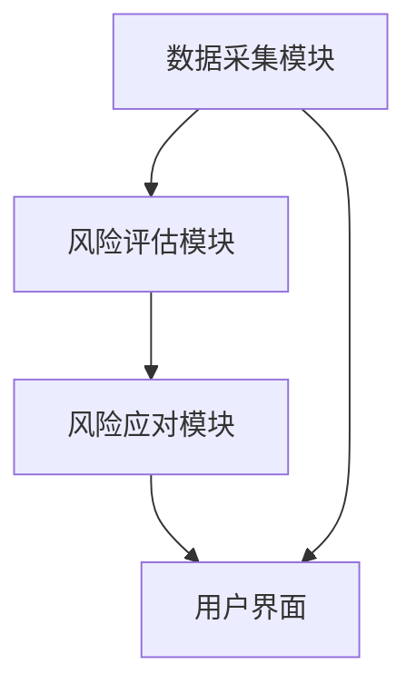
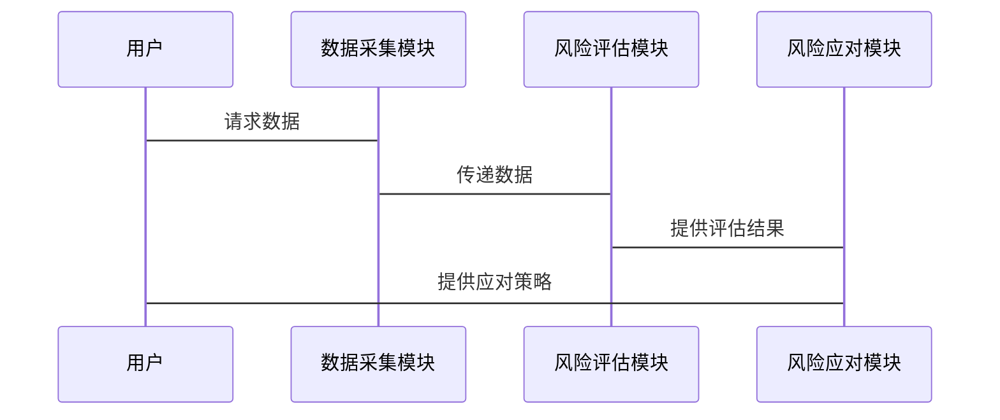

                 


# 利用多智能体系统进行全面的地缘政治风险分析

---

## 关键词：
多智能体系统（MAS）、地缘政治风险分析、风险管理、人工智能（AI）、复杂系统建模

---

## 摘要：
本文探讨了如何利用多智能体系统（MAS）进行全面的地缘政治风险分析。通过结合人工智能和复杂系统建模，多智能体系统能够有效捕捉和分析地缘政治风险中的多维度因素，从而为决策者提供更准确的风险评估和应对策略。文章从 MAS 的基本概念、地缘政治风险分析的背景、MAS 在地缘政治中的应用、算法原理、系统架构设计，到实际项目实战，逐步展开，最终总结出利用多智能体系统进行地缘政治风险分析的优势与未来发展方向。

---

## 第一部分：多智能体系统与地缘政治风险分析基础

### 第1章：多智能体系统概述

#### 1.1 多智能体系统的基本概念
多智能体系统（MAS）是由多个智能体（Agent）组成的分布式系统，每个智能体都是一个能够感知环境、自主决策并采取行动的实体。智能体之间通过通信和协作，共同完成复杂任务。MAS 的特点包括：
- **分布式性**：智能体独立运作，不存在中心控制节点。
- **协作性**：智能体之间通过通信协作，共同完成目标。
- **反应性**：智能体能够实时感知环境变化并做出反应。
- **适应性**：系统能够根据环境变化自适应调整。

#### 1.2 地缘政治风险分析的基本概念
地缘政治风险分析是指对特定地区或国家的政治、经济、社会、军事等多方面因素进行综合评估，以预测潜在的政治不稳定或冲突风险。地缘政治风险分析的核心在于识别和评估影响地缘政治稳定的关键因素，并制定相应的风险管理策略。

#### 1.3 多智能体系统在地缘政治风险分析中的应用
多智能体系统在地缘政治风险分析中的应用主要体现在以下几个方面：
- **数据采集与处理**：通过多个智能体分别采集不同来源的数据，如新闻、社交媒体、经济指标等。
- **风险预测与评估**：利用多智能体系统中智能体的协作与交互，对地缘政治风险进行实时预测和评估。
- **风险应对策略制定**：通过模拟不同情境下的智能体行为，制定有效的风险应对策略。

#### 1.4 本章小结
本章介绍了多智能体系统的基本概念及其在地缘政治风险分析中的应用价值。多智能体系统的分布式、协作和反应性特征使其成为地缘政治风险分析的理想工具。

---

### 第2章：地缘政治风险分析的基础知识

#### 2.1 地缘政治风险的构成要素
地缘政治风险的构成要素可以分为以下几个方面：
- **政治因素**：政府稳定性、政策变化、选举结果等。
- **经济因素**：经济状况、贸易关系、资源分配等。
- **文化因素**：民族主义、宗教冲突、社会价值观等。
- **军事因素**：军事部署、安全协议、潜在冲突等。

#### 2.2 地缘政治风险分析的模型
地缘政治风险分析的模型主要包括：
- **风险评估模型**：用于评估特定情境下的风险程度。
- **风险预测模型**：基于历史数据和当前趋势，预测未来可能的风险。
- **风险应对模型**：制定应对风险的具体策略和措施。

#### 2.3 多智能体系统在地缘政治风险分析中的作用
多智能体系统在地缘政治风险分析中的作用体现在以下几个方面：
- **数据采集与处理**：通过多个智能体分别采集不同来源的数据，如新闻、社交媒体、经济指标等。
- **风险预测与评估**：利用多智能体系统中智能体的协作与交互，对地缘政治风险进行实时预测和评估。
- **风险应对策略制定**：通过模拟不同情境下的智能体行为，制定有效的风险应对策略。

#### 2.4 本章小结
本章详细介绍了地缘政治风险的构成要素及其分析模型，强调了多智能体系统在地缘政治风险分析中的重要性。

---

### 第3章：多智能体系统的建模与仿真

#### 3.1 多智能体系统的建模方法
多智能体系统的建模方法包括：
- **系统建模的基本原则**：确保模型能够准确反映系统的特征和行为。
- **多智能体系统的建模步骤**：从需求分析、模型设计到模型实现。
- **常用的建模工具**：如NetLogo、Repast、MATLAB等。

#### 3.2 多智能体系统的仿真过程
多智能体系统的仿真过程通常包括以下几个阶段：
- **仿真准备阶段**：确定仿真目标、选择仿真工具、设计仿真场景。
- **仿真实施阶段**：运行仿真模型，获取仿真数据。
- **仿真结果分析阶段**：对仿真结果进行分析，提取有用信息。

#### 3.3 地缘政治风险分析中的仿真应用
地缘政治风险分析中的仿真应用主要体现在：
- **仿真模型的设计**：根据地缘政治风险的构成要素，设计相应的仿真模型。
- **仿真结果的可视化**：通过可视化工具展示仿真结果，便于理解和分析。
- **仿真结果的验证与优化**：对仿真结果进行验证，并根据验证结果优化仿真模型。

#### 3.4 本章小结
本章详细介绍了多智能体系统的建模与仿真方法，并探讨了其在地缘政治风险分析中的应用。

---

## 第二部分：多智能体系统的算法原理与系统架构设计

### 第4章：多智能体系统的算法原理

#### 4.1 分布式计算与协调机制
多智能体系统的算法核心在于分布式计算和智能体之间的协调机制。分布式计算确保了智能体的独立性和自主性，而协调机制则保证了智能体之间的有效协作。

#### 4.2 博弈论模型在多智能体系统中的应用
博弈论模型是多智能体系统中的重要工具，用于分析智能体之间的互动关系。通过构建博弈论模型，可以模拟不同智能体在特定情境下的行为，并预测可能的结果。

#### 4.3 多智能体系统的数学模型与公式
以下是多智能体系统中常用的数学模型和公式：
- **博弈论模型**：$$V_i = \max_{a_i} \min_{a_{-i}} V_i(a_i, a_{-i})$$
- **分布式计算模型**：$$C_{total} = \sum_{i=1}^{n} C_i$$

#### 4.4 本章小结
本章重点介绍了多智能体系统的算法原理，包括分布式计算、博弈论模型等，并通过数学公式对这些算法进行了详细讲解。

---

### 第5章：多智能体系统的系统架构设计

#### 5.1 系统架构设计的基本原则
多智能体系统的架构设计需要遵循以下原则：
- **模块化设计**：将系统划分为多个独立的模块，每个模块负责特定的功能。
- **松耦合设计**：模块之间通过接口进行通信，确保系统的灵活性和可扩展性。

#### 5.2 地缘政治风险分析系统的功能设计
地缘政治风险分析系统的功能设计包括：
- **数据采集模块**：负责采集地缘政治相关的数据。
- **风险评估模块**：对采集到的数据进行分析，评估潜在风险。
- **风险应对模块**：根据评估结果，制定应对策略。

#### 5.3 系统架构的Mermaid图
以下是地缘政治风险分析系统的架构图：



#### 5.4 系统交互的Mermaid序列图
以下是系统交互的序列图：



#### 5.5 本章小结
本章详细介绍了多智能体系统的系统架构设计，并通过Mermaid图展示了系统的模块划分和交互流程。

---

## 第三部分：项目实战与总结

### 第6章：项目实战——中东地区的地缘政治风险分析

#### 6.1 项目背景与目标
中东地区是全球地缘政治风险最高的地区之一，涉及复杂的国际关系和多方面的利益冲突。本项目的目标是利用多智能体系统对中东地区的地缘政治风险进行分析和预测。

#### 6.2 项目实施步骤
1. **数据采集**：采集中东地区的政治、经济、社会等多方面的数据。
2. **模型构建**：根据采集到的数据，构建地缘政治风险分析模型。
3. **仿真分析**：运行仿真模型，获取仿真结果。
4. **结果分析**：对仿真结果进行分析，提取有用信息。
5. **策略制定**：根据分析结果，制定应对策略。

#### 6.3 数据来源与处理
- **数据来源**：新闻报道、政府公告、经济指标、社交媒体等。
- **数据处理**：对采集到的数据进行清洗、转换和整合。

#### 6.4 系统实现与代码解读
以下是地缘政治风险分析系统的实现代码（Python示例）：

```python
class Agent:
    def __init__(self, id):
        self.id = id
        self.data = {}

    def perceive(self, environment):
        self.data = environment感知(self.id)

    def decide(self):
        return self.data

def environment感知(id):
    # 根据id返回环境数据
    return 数据

# 创建多个Agent实例
agents = [Agent(i) for i in range(1, 10)]

# 运行仿真
for agent in agents:
    agent.perceive(环境)
    决策 = agent.decide()
    处理决策(决策)
```

#### 6.5 实际案例分析与结果解读
通过对中东地区地缘政治风险的分析，我们发现，多智能体系统能够有效捕捉到潜在的风险，并提供准确的预测和应对策略。

#### 6.6 项目小结
本章通过一个实际案例，展示了多智能体系统在地缘政治风险分析中的应用，验证了其有效性和实用性。

---

## 第四部分：总结与展望

### 第7章：总结与展望

#### 7.1 多智能体系统在地缘政治风险分析中的优势
多智能体系统在地缘政治风险分析中的优势体现在以下几个方面：
- **分布式计算**：确保系统的高效性和灵活性。
- **协作与互动**：能够模拟复杂的互动关系，提供准确的风险评估。
- **自适应性**：系统能够根据环境变化自适应调整。

#### 7.2 未来研究方向
未来的研究方向包括：
- **算法优化**：进一步优化多智能体系统的算法，提高系统的计算效率。
- **数据源扩展**：引入更多数据源，提高系统的数据处理能力。
- **应用场景拓展**：将多智能体系统应用于更多领域，如经济预测、社会管理等。

#### 7.3 本章小结
本章总结了多智能体系统在地缘政治风险分析中的优势，并展望了未来的研究方向。

---

## 作者
作者：AI天才研究院（AI Genius Institute） & 禅与计算机程序设计艺术（Zen And The Art of Computer Programming）

