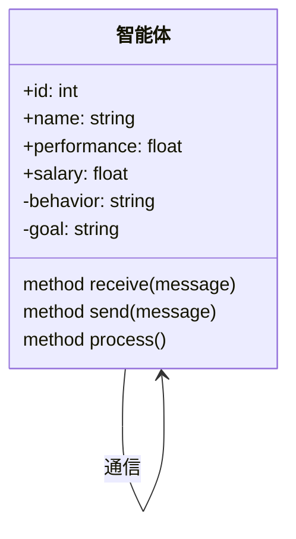
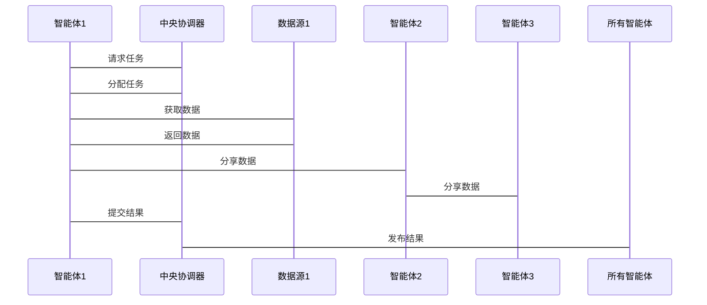

                 


```markdown
# 利用多智能体系统进行全面的管理层薪酬分析

> 关键词：多智能体系统，管理层薪酬分析，分布式计算，协同优化，绩效评估

> 摘要：本文深入探讨了利用多智能体系统（MAS）进行全面的管理层薪酬分析的方法。通过分析多智能体系统的概念、算法原理及其在薪酬分析中的应用，结合实际案例，展示了如何通过MAS提高薪酬分析的效率和准确性。

---

## 第1章: 多智能体系统概述

### 1.1 多智能体系统的基本概念

#### 1.1.1 多智能体系统的定义
多智能体系统（Multi-Agent System, MAS）是由多个智能体组成的分布式系统，这些智能体能够自主决策、协作和通信，以完成特定任务。智能体是具有感知、推理、规划和行动能力的实体。

#### 1.1.2 多智能体系统的特征
- **自主性**：智能体能够在没有外部干预的情况下独立运作。
- **反应性**：能够根据环境变化调整行为。
- **协作性**：智能体之间可以通过通信协同完成任务。
- **分布性**：系统中的智能体分布在不同的节点上，共同完成任务。

#### 1.1.3 多智能体系统的分类
1. **简单反射型智能体**：基于当前感知做出反应。
2. **基于模型的反射型智能体**：利用内部模型进行推理。
3. **目标驱动型智能体**：根据目标驱动行为。
4. **实用驱动型智能体**：根据效用函数优化行为。

### 1.2 管理层薪酬分析的背景与意义

#### 1.2.1 管理层薪酬分析的必要性
随着企业规模的扩大，管理层的薪酬结构变得复杂，传统的薪酬分析方法难以满足需求。MAS能够通过分布式计算和协作优化，提高分析效率和准确性。

#### 1.2.2 现有薪酬分析方法的局限性
1. **数据分散**：薪酬数据可能分布在不同部门和系统中。
2. **计算复杂**：复杂的薪酬计算需要高效的方法。
3. **实时性要求高**：管理层薪酬需要实时调整以应对市场变化。

#### 1.2.3 多智能体系统在薪酬分析中的优势
1. **高效性**：MAS可以同时处理大量数据，提高分析速度。
2. **精准性**：通过智能体的协作，能够更准确地评估绩效和计算薪酬。
3. **可扩展性**：MAS可以轻松扩展以适应企业规模的变化。

---

## 第2章: 多智能体系统与管理层薪酬分析的结合

### 2.1 多智能体系统在薪酬分析中的应用场景

#### 2.1.1 数据收集与处理
智能体负责从不同数据源收集薪酬相关信息，并进行预处理。

#### 2.1.2 绩效评估
通过智能体之间的协作，对管理层的绩效进行综合评估。

#### 2.1.3 薪酬优化
利用智能体的协同优化能力，制定最优的薪酬方案。

### 2.2 多智能体系统在薪酬分析中的优势

#### 2.2.1 高效性
MAS能够同时处理多个数据源，提高分析效率。

#### 2.2.2 精准性
通过智能体的协作，能够更准确地评估绩效和计算薪酬。

#### 2.2.3 可扩展性
MAS可以轻松扩展以适应企业规模的变化。

---

## 第3章: 多智能体系统的核心概念与原理

### 3.1 多智能体系统的核心概念

#### 3.1.1 智能体的定义与特征
智能体是具有感知、推理、规划和行动能力的实体，能够自主决策和协作。

#### 3.1.2 智能体之间的通信与协作
智能体之间通过通信协议进行信息交换，协同完成任务。

### 3.2 多智能体系统的算法原理

#### 3.2.1 分布式计算
MAS中的智能体分布在不同的节点上，通过分布式计算提高处理效率。

#### 3.2.2 协同优化
智能体通过协作优化算法，找到最优的解决方案。

#### 3.2.3 自适应调整
智能体能够根据环境变化自适应调整行为，确保系统的鲁棒性。

---

## 第4章: 多智能体系统在薪酬分析中的数学模型与算法

### 4.1 薪酬分析的数学模型

#### 4.1.1 绩效评估模型
绩效评估模型用于评估管理层的绩效，通常基于KPI指标。

$$ \text{绩效} = \sum_{i=1}^{n} w_i \cdot kpi_i $$

其中，\( w_i \) 是第 \( i \) 个KPI的权重，\( kpi_i \) 是第 \( i \) 个KPI的值。

#### 4.1.2 薪酬预测模型
薪酬预测模型基于历史数据和当前绩效，预测未来的薪酬。

$$ \text{预测薪酬} = \alpha \cdot \text{绩效} + \beta \cdot \text{市场因素} $$

其中，\( \alpha \) 和 \( \beta \) 是模型参数。

#### 4.1.3 薪酬优化模型
薪酬优化模型用于制定最优的薪酬方案。

$$ \text{优化薪酬} = \argmin_{\theta} \left( \theta - \text{绩效} \right) $$

其中，\( \theta \) 是薪酬参数。

### 4.2 多智能体系统的算法实现

#### 4.2.1 分布式计算
MAS中的智能体通过分布式计算提高处理效率。例如，每个智能体负责一部分数据的处理，然后将结果汇总。

#### 4.2.2 协同优化
智能体通过协同优化算法，找到最优的解决方案。例如，使用遗传算法进行优化。

#### 4.2.3 自适应调整
智能体能够根据环境变化自适应调整行为，确保系统的鲁棒性。

---

## 第5章: 系统分析与架构设计方案

### 5.1 问题场景介绍

#### 5.1.1 问题描述
某企业需要对管理层的薪酬进行分析，但由于数据分散和计算复杂，传统的分析方法效率低下。

#### 5.1.2 问题解决
引入多智能体系统，通过分布式计算和协同优化，提高分析效率和准确性。

### 5.2 系统功能设计

#### 5.2.1 领域模型类图


### 5.3 系统架构设计

#### 5.3.1 系统架构图


#### 5.3.2 系统接口设计
- **智能体接口**：定义智能体之间的通信接口。
- **数据源接口**：定义数据源的访问接口。
- **中央协调器接口**：定义协调器的管理接口。

#### 5.3.3 系统交互序列图


---

## 第6章: 项目实战

### 6.1 环境安装

#### 6.1.1 系统需求
- 操作系统：Linux/Windows/MacOS
- 开发工具：Python, IDE
- 依赖库：numpy, pandas, scikit-learn, matplotlib

#### 6.1.2 环境配置
安装必要的库：
```bash
pip install numpy pandas scikit-learn matplotlib
```

### 6.2 系统核心实现源代码

#### 6.2.1 智能体类实现
```python
class Agent:
    def __init__(self, id):
        self.id = id
        self.data = None
        self.result = None

    def receive(self, message):
        self.data = message
        self.process()

    def process(self):
        # 数据处理逻辑
        pass

    def send(self, message):
        # 发送消息逻辑
        pass
```

#### 6.2.2 中央协调器实现
```python
class CentralCoordinator:
    def __init__(self):
        self.agents = []
        self.results = {}

    def distribute_task(self, agent):
        # 分配任务逻辑
        pass

    def collect_results(self):
        # 收集结果逻辑
        pass
```

### 6.3 实际案例分析与解读

#### 6.3.1 案例背景
某企业需要分析高管的薪酬结构，数据来自财务、人力资源和绩效管理部门。

#### 6.3.2 数据处理与分析
使用MAS对数据进行分布式处理和分析，最终得到最优的薪酬方案。

#### 6.3.3 结果展示
生成可视化报告，展示分析结果和建议。

### 6.4 项目小结

#### 6.4.1 成功经验
MAS在薪酬分析中的高效性和准确性。

#### 6.4.2 经验教训
MAS的实现需要复杂的系统设计和调试。

---

## 第7章: 总结与展望

### 7.1 全书总结

#### 7.1.1 核心内容回顾
MAS在管理层薪酬分析中的应用，包括数据处理、绩效评估和薪酬优化。

#### 7.1.2 研究成果
通过MAS提高了薪酬分析的效率和准确性。

### 7.2 当前研究的不足

#### 7.2.1 系统复杂性
MAS的实现需要复杂的系统设计。

#### 7.2.2 数据隐私
数据分散在不同部门，隐私保护是一个挑战。

### 7.3 未来的发展方向

#### 7.3.1 系统优化
进一步优化MAS的算法和架构，提高效率和准确性。

#### 7.3.2 应用扩展
将MAS应用到更多的管理领域，如人力资源管理和战略规划。

### 7.4 最佳实践 tips

#### 7.4.1 技术建议
在MAS中使用高效的通信协议和分布式计算框架。

#### 7.4.2 实施建议
在实施MAS前，进行充分的系统设计和测试。

#### 7.4.3 注意事项
注意数据隐私和系统安全，确保MAS的稳定运行。

---

## 作者

作者：AI天才研究院/AI Genius Institute & 禅与计算机程序设计艺术 /Zen And The Art of Computer Programming
```

