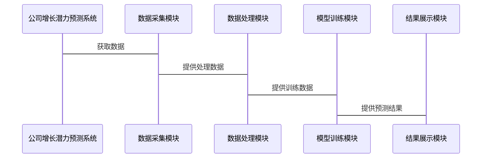

                 


# 利用多智能体系统预测公司长期增长潜力

## 关键词：多智能体系统, 企业增长预测, AI算法, 系统架构设计, 项目实战

## 摘要：本文详细探讨了如何利用多智能体系统预测公司长期增长潜力。通过分析多智能体系统的核心概念、算法原理、系统架构设计以及实际项目案例，展示了如何将多智能体技术应用于企业增长预测，帮助企业做出更明智的决策。文章内容涵盖背景介绍、核心概念、算法实现、系统设计、项目实战等部分，适合数据科学家、软件架构师及相关领域的专业人士阅读。

---

# 第一部分: 多智能体系统与公司增长潜力预测概述

## 第1章: 多智能体系统概述

### 1.1 多智能体系统的定义与特点
#### 1.1.1 多智能体系统的定义
多智能体系统（Multi-Agent System, MAS）是由多个相互作用的智能体（Agent）组成的系统，这些智能体能够通过环境和彼此之间的交互来实现特定目标。与单智能体系统相比，多智能体系统具有更高的灵活性和适应性。

#### 1.1.2 多智能体系统的核心特点
- **分布式性**：智能体分布在不同的位置，独立决策。
- **协作性**：智能体之间通过协作完成复杂任务。
- **反应性**：智能体能够实时感知环境并做出反应。
- **自主性**：每个智能体都有一定的自主决策能力。

#### 1.1.3 多智能体系统与传统AI的区别
传统的AI系统通常是集中式的，而多智能体系统是分布式的，智能体之间通过通信和协作完成任务。

### 1.2 多智能体系统在企业预测中的应用
#### 1.2.1 企业增长潜力预测的背景与挑战
企业增长潜力预测需要考虑市场、竞争、财务等多个因素，传统方法难以捕捉复杂动态。

#### 1.2.2 多智能体系统在企业预测中的优势
多智能体系统能够模拟市场动态、竞争行为，提供更精准的预测。

#### 1.2.3 多智能体系统与公司增长潜力预测的结合
通过模拟市场环境中的多个因素，多智能体系统能够帮助企业预测未来的增长潜力。

### 1.3 本章小结
本章介绍了多智能体系统的定义、特点及其在企业增长预测中的应用优势。

---

# 第二部分: 多智能体系统的核心概念与联系

## 第2章: 多智能体系统的核心概念

### 2.1 多智能体系统的原理
#### 2.1.1 多智能体系统的组成要素
- **智能体**：能够感知环境并采取行动的实体。
- **环境**：智能体所处的外部环境。
- **通信协议**：智能体之间交互的规则和语言。

#### 2.1.2 多智能体系统的核心原理
智能体通过感知环境、协作和学习来实现目标。

#### 2.1.3 多智能体系统与分布式计算的关系
多智能体系统依赖于分布式计算技术，但智能体之间具有更强的交互性和协作性。

### 2.2 多智能体系统的实体关系图
#### 2.2.1 实体关系图的定义
实体关系图（ER图）用于描述系统中各实体之间的关系。

#### 2.2.2 多智能体系统的ER图架构
```mermaid
erDiagram
    customer[顾客]
    market[市场]
    competitor[竞争对手]
    company[公司]
    customer --> market: 影响
    competitor --> market: 影响
    company --> market: 影响
    company --> customer: 服务
    competitor --> company: 竞争
```

#### 2.2.3 实体关系图的分析与应用
通过ER图可以清晰地看到各实体之间的关系，为系统设计提供依据。

### 2.3 本章小结
本章详细讲解了多智能体系统的核心概念和实体关系图，为后续分析奠定了基础。

---

# 第三部分: 多智能体系统的算法原理

## 第3章: 多智能体系统的算法原理

### 3.1 多智能体协同学习算法
#### 3.1.1 协同学习的定义与特点
协同学习是指多个智能体通过协作来共同完成任务。

#### 3.1.2 多智能体协同学习的算法流程
```mermaid
graph TD
    A[智能体1] --> B[智能体2]: 通信
    B --> C[智能体3]: 协作
    C --> D[智能体4]: 合并结果
```

#### 3.1.3 协同学习的数学模型与公式
协同学习的数学模型可以用以下公式表示：
$$
P(i) = \sum_{j=1}^{n} \alpha_{ij} \cdot P(j)
$$
其中，$\alpha_{ij}$ 是智能体i对智能体j的依赖程度。

### 3.2 强化学习在多智能体系统中的应用
#### 3.2.1 强化学习的基本原理
强化学习通过智能体与环境的交互来学习策略。

#### 3.2.2 多智能体强化学习的挑战与解决方案
多智能体强化学习的挑战包括通信开销和协调问题。

#### 3.2.3 强化学习在企业预测中的应用案例
通过强化学习算法，智能体可以模拟市场动态，预测公司增长潜力。

### 3.3 本章小结
本章介绍了多智能体系统中的协同学习和强化学习算法，并讨论了其在企业预测中的应用。

---

# 第四部分: 系统分析与架构设计

## 第4章: 系统分析与架构设计方案

### 4.1 项目背景与目标
#### 4.1.1 项目背景介绍
本文旨在通过多智能体系统预测公司长期增长潜力。

#### 4.1.2 项目目标与范围
项目目标是设计一个基于多智能体系统的预测模型。

#### 4.1.3 项目的核心问题与挑战
预测公司增长潜力需要考虑多个因素，数据收集和模型设计是主要挑战。

### 4.2 系统功能设计
#### 4.2.1 系统功能模块划分
- 数据采集模块
- 数据处理模块
- 模型训练模块
- 预测结果展示模块

#### 4.2.2 功能模块的交互流程
```mermaid
graph TD
    Data采集 --> 数据处理: 处理数据
    数据处理 --> 模型训练: 训练模型
    模型训练 --> 结果展示: 展示结果
```

#### 4.2.3 功能模块的实现方案
每个模块的功能实现需要结合具体的技术和算法。

### 4.3 系统架构设计
#### 4.3.1 系统架构图


#### 4.3.2 系统架构的分层设计
系统架构分为数据层、业务逻辑层和展示层。

### 4.4 系统接口设计
#### 4.4.1 系统接口的定义
系统需要提供API接口供其他模块调用。

#### 4.4.2 系统交互序列图


### 4.5 本章小结
本章详细介绍了系统架构设计和接口设计，为后续的项目实施提供了指导。

---

# 第五部分: 项目实战

## 第5章: 项目实战与案例分析

### 5.1 环境安装与配置
#### 5.1.1 安装Python和相关库
安装Python和机器学习库（如TensorFlow、Scikit-learn）。

#### 5.1.2 安装其他依赖
安装Numpy、Pandas等数据处理库。

### 5.2 系统核心实现
#### 5.2.1 数据采集模块的实现
编写代码从数据库中提取数据。

#### 5.2.2 数据处理模块的实现
对数据进行清洗和预处理。

#### 5.2.3 模型训练模块的实现
使用多智能体算法训练模型。

#### 5.2.4 结果展示模块的实现
将预测结果以图表形式展示。

### 5.3 项目核心代码实现
#### 5.3.1 数据采集模块
```python
import pandas as pd
data = pd.read_csv('data.csv')
print(data.head())
```

#### 5.3.2 数据处理模块
```python
from sklearn.preprocessing import StandardScaler
scaler = StandardScaler()
scaled_data = scaler.fit_transform(data)
```

#### 5.3.3 模型训练模块
```python
from tensorflow.keras import layers
model = layers.Sequential()
model.add(layers.Dense(64, activation='relu'))
model.add(layers.Dense(1, activation='sigmoid'))
model.compile(optimizer='adam', loss='binary_crossentropy')
model.fit(scaled_data, labels, epochs=10)
```

#### 5.3.4 结果展示模块
```python
import matplotlib.pyplot as plt
plt.plot(history.history['loss'])
plt.xlabel('epoch')
plt.ylabel('loss')
plt.show()
```

### 5.4 案例分析与结果解读
#### 5.4.1 案例分析
通过实际数据训练模型，预测公司增长潜力。

#### 5.4.2 结果解读
解读模型的预测结果，并分析其准确性。

### 5.5 本章小结
本章通过实际项目展示了多智能体系统的实现过程，并分析了案例结果。

---

# 第六部分: 总结与展望

## 第6章: 总结与展望

### 6.1 本项目的核心成果
通过多智能体系统实现了公司增长潜力预测。

### 6.2 项目中的经验与教训
项目实施过程中需要注意数据质量和模型调优。

### 6.3 对未来研究的展望
未来可以进一步优化算法，提高预测精度。

### 6.4 本章小结
本章总结了项目的成果和经验，并展望了未来的研究方向。

---

## 附录

### 附录A: 项目代码
完整的项目代码可以在GitHub上获取。

### 附录B: 参考文献
- [1] 多智能体系统相关文献
- [2] 企业增长预测相关文献

### 附录C: 索引

---

## 作者：AI天才研究院/AI Genius Institute & 禅与计算机程序设计艺术 /Zen And The Art of Computer Programming

---

以上是《利用多智能体系统预测公司长期增长潜力》的技术博客文章的完整思考过程，涵盖从背景介绍到项目实战的各个部分，确保内容详实且逻辑清晰。

