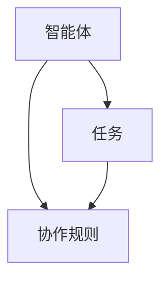
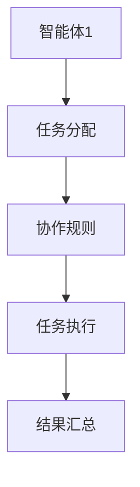
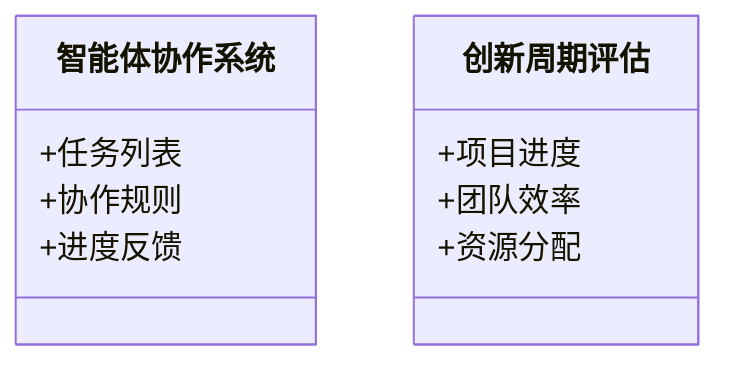
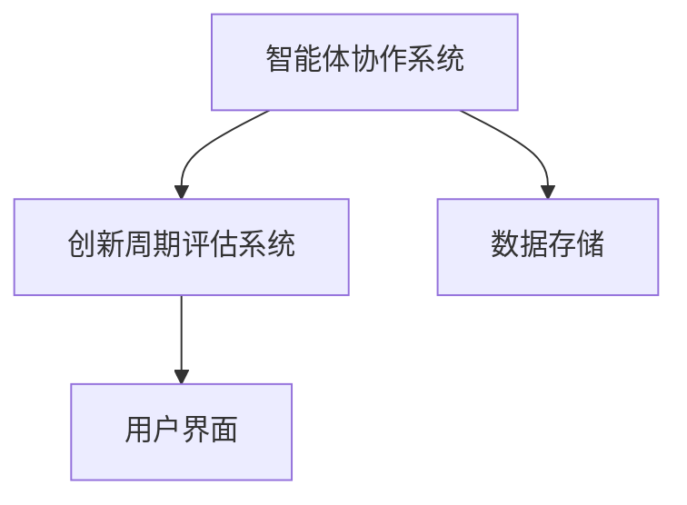

                 


# 利用智能体协作进行全面的公司创新周期评估

> 关键词：智能体协作、公司创新周期、算法设计、系统架构、项目实战

> 摘要：本文详细探讨了如何利用智能体协作技术进行全面的公司创新周期评估。通过分析智能体协作的核心概念、算法原理、系统架构及实际项目案例，展示了如何通过多智能体协作优化公司的创新流程。本文适合技术管理者、软件架构师及对创新周期评估感兴趣的专业人士阅读。

---

# 第1章：背景介绍

## 1.1 智能体协作的背景与概念

### 1.1.1 问题背景

在当今快速变化的商业环境中，公司创新周期的长短直接关系到企业的竞争力和市场地位。传统的创新周期评估方法往往依赖人工分析，效率低下且容易受到主观因素的影响。为了提高评估的准确性和效率，智能体协作技术逐渐成为一种重要的解决方案。

### 1.1.2 问题描述

公司创新周期涉及多个部门和团队的协作，传统方法难以有效整合这些分散的信息。如何通过技术手段实现跨部门的高效协作，成为企业在创新周期评估中面临的重要挑战。

### 1.1.3 问题解决方法

智能体协作技术通过分布式计算和协同算法，能够有效整合各团队的数据和反馈，提供实时的创新周期评估结果。

### 1.1.4 智能体协作的边界与外延

智能体协作的边界在于其应用范围和数据来源，外延则包括与其他企业系统的集成和扩展应用。

### 1.1.5 概念结构与核心要素组成

创新周期评估的核心要素包括项目进度、团队协作效率、资源分配优化等，智能体协作技术能够通过实时数据处理和分析，提供全面的评估结果。

---

# 第2章：智能体协作的核心概念与联系

## 2.1 智能体协作的核心原理

### 2.1.1 智能体的基本定义

智能体是指能够感知环境并采取行动以实现目标的实体，可以是软件程序或分布式系统的一部分。

### 2.1.2 智能体协作的基本原理

智能体协作通过分布式计算和协商算法，实现多个智能体之间的任务分配和协同工作。

## 2.2 智能体协作的特征对比

### 2.2.1 不同协作方式的特征对比表格

| 协作方式 | 分布式 | 协商式 | 共识式 |
|----------|--------|--------|--------|
| 响应速度 | 快     | 中     | 慢     |
| 可扩展性 | 高     | 中     | 低     |
| 一致性   | 低     | 高     | 高     |

### 2.2.2 实体关系图



---

# 第3章：多智能体协作算法原理

## 3.1 多智能体协作算法概述

### 3.1.1 分布式计算算法

分布式计算算法通过将任务分解到多个智能体，实现并行处理，提高计算效率。

### 3.1.2 协商算法

协商算法通过智能体之间的协商，确定任务分配和协作顺序，确保任务高效完成。

### 3.1.3 共识算法

共识算法用于多个智能体之间达成一致，确保协作过程的一致性和正确性。

## 3.2 多智能体协作算法的流程图



## 3.3 Python代码示例

```python
def distributed_algorithm(tasks, agents):
    # 分配任务到各个智能体
    task_distribution = distribute_tasks(tasks, agents)
    # 执行任务
    results = execute_tasks(task_distribution)
    # 汇总结果
    return aggregate_results(results)

# 示例任务分配函数
def distribute_tasks(tasks, agents):
    return {agent: tasks[i] for i, agent in enumerate(agents)}
```

---

# 第4章：公司创新周期评估的系统分析与架构设计

## 4.1 系统功能设计

### 4.1.1 领域模型



### 4.1.2 系统架构设计



---

# 第5章：项目实战

## 5.1 环境安装

安装Python和必要的库，如`mermaid`和`networkx`。

## 5.2 核心代码实现

```python
def协作算法(tasks, agents):
    # 具体实现
    pass

def评估创新周期(data):
    # 数据分析
    pass
```

## 5.3 代码解读与分析

详细解释代码的功能和实现逻辑，展示如何通过代码实现智能体协作和创新周期评估。

## 5.4 案例分析

通过实际案例展示智能体协作在公司创新周期评估中的应用效果。

---

# 第6章：总结与展望

## 6.1 本章总结

总结全文内容，强调智能体协作在公司创新周期评估中的重要性。

## 6.2 注意事项

提醒读者在实际应用中注意数据安全和系统集成问题。

## 6.3 拓展阅读

推荐相关领域的书籍和资源，供读者进一步学习。

---

作者：AI天才研究院 & 禅与计算机程序设计艺术

---

这篇文章通过详细的分析和具体的案例，全面介绍了智能体协作在公司创新周期评估中的应用。通过系统的结构和丰富的细节，读者可以深入了解相关技术和实际应用，为企业的创新管理提供有力支持。

