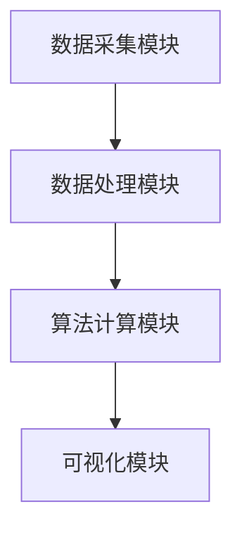
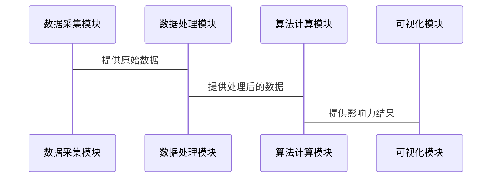

                 


# 利用智能体协作进行全面的公司创新网络影响力评估

> 关键词：智能体协作，创新网络，影响力评估，协同过滤，系统架构，项目实战

> 摘要：本文详细探讨了利用智能体协作进行全面的公司创新网络影响力评估的方法。通过分析创新网络的结构特征和智能体协作的核心原理，结合实际案例，展示了如何通过协同过滤算法和系统架构设计来实现创新网络影响力评估。文章内容包括背景介绍、核心概念、算法原理、系统架构设计、项目实战以及最佳实践，为读者提供了全面的理论和技术指导。

---

## # 第一部分: 背景介绍

### ## 第1章: 问题背景

#### ### 1.1 创新网络的定义与重要性
创新网络是指由公司内部员工、外部合作伙伴、技术供应商、客户以及其他利益相关者构成的一个复杂网络。这个网络通过知识共享、资源整合和协同创新，推动公司的技术创新和业务发展。创新网络的影响力直接关系到公司的核心竞争力和市场地位。

#### ### 1.2 创新网络影响力评估的必要性
在当今快速变化的商业环境中，公司需要不断提升其创新能力和市场响应速度。创新网络影响力评估可以帮助公司识别关键创新节点、优化资源配置、发现潜在风险，并制定有效的创新策略。

#### ### 1.3 智能体协作在创新网络中的应用前景
智能体（Agent）是一种能够感知环境、自主决策并执行任务的实体。通过智能体协作，可以实现创新网络中各个节点的高效协同，从而提升创新网络的整体影响力。

### ## 第2章: 问题描述

#### ### 2.1 创新网络中的关键问题
- **信息孤岛问题**：公司内部和外部的创新资源分散，缺乏有效的信息共享机制。
- **协同效率问题**：创新网络中的协作流程复杂，效率低下，难以快速响应市场需求。
- **影响力评估问题**：如何量化创新网络的影响力，识别关键节点和瓶颈。

#### ### 2.2 智能体协作在创新网络中的具体挑战
- **智能体的协同机制设计**：如何实现智能体之间的高效协作。
- **创新网络的动态性**：创新网络是一个动态变化的系统，智能体需要能够适应环境的变化。
- **数据隐私与安全问题**：创新网络中的数据涉及多方利益，如何确保数据的安全性和隐私性。

#### ### 2.3 创新网络影响力评估的核心目标
- 量化创新网络中各节点的影响力。
- 识别关键节点和潜在风险。
- 优化创新网络的结构和协作流程。

---

## # 第二部分: 核心概念与联系

### ## 第3章: 智能体协作的原理

#### ### 3.1 智能体的定义与特征
智能体是一种能够感知环境、自主决策并执行任务的实体。智能体具有以下特征：
- **自主性**：智能体能够自主决策。
- **反应性**：智能体能够感知环境并做出实时反应。
- **协作性**：智能体能够与其他智能体或系统进行协作。

#### ### 3.2 智能体协作的基本原理
智能体协作的核心在于通过智能体之间的通信与协调，实现共同目标的达成。协作过程包括以下步骤：
1. **任务分解**：将整体任务分解为多个子任务。
2. **任务分配**：根据智能体的能力和当前状态，分配合适的子任务。
3. **协作执行**：智能体协同执行分配的任务。
4. **结果整合**：整合各智能体的执行结果，形成最终的输出。

#### ### 3.3 智能体协作的分类与应用
智能体协作可以分为以下几类：
- **基于规则的协作**：通过预定义的规则进行协作。
- **基于市场的协作**：通过市场机制进行资源分配。
- **基于学习的协作**：通过机器学习算法实现协作优化。

---

### ## 第4章: 创新网络影响力评估的原理

#### ### 4.1 创新网络的结构特征
创新网络是一个复杂的网络结构，包括以下要素：
- **节点**：创新网络中的各个参与者（如员工、合作伙伴）。
- **边**：节点之间的连接，表示信息流、资源流或协作关系。
- **社区**：创新网络中的紧密协作小组。

#### ### 4.2 创新网络影响力评估的指标体系
创新网络影响力评估的指标包括：
- **节点影响力**：衡量某个节点在创新网络中的影响力。
- **社区影响力**：衡量某个社区在创新网络中的影响力。
- **网络整体影响力**：衡量整个创新网络的综合影响力。

#### ### 4.3 创新网络影响力评估的方法
创新网络影响力评估的方法包括：
- **基于度的分析**：通过节点的度数衡量其影响力。
- **基于中心性的分析**：通过节点的中心性衡量其影响力。
- **基于社区检测的分析**：通过社区检测算法识别关键社区。

---

## # 第三部分: 算法原理讲解

### ## 第5章: 协同过滤算法的原理与实现

#### ### 5.1 协同过滤算法的基本原理
协同过滤算法是一种基于用户行为或物品属性的推荐算法。其核心思想是通过找到与目标节点相似的节点，预测目标节点的影响力。

#### ### 5.2 协同过滤算法的实现步骤
1. **数据预处理**：对创新网络数据进行清洗和标准化。
2. **相似度计算**：计算节点之间的相似度（如余弦相似度）。
3. **影响力预测**：基于相似度计算节点的影响力。

#### ### 5.3 协同过滤算法的Python实现

```python
import numpy as np

def cosine_similarity(matrix):
    # 计算余弦相似度
    numerator = np.dot(matrix, matrix.T)
    denominator = np.outer(np.linalg.norm(matrix, axis=1), np.linalg.norm(matrix, axis=1))
    return numerator / denominator

# 示例数据
matrix = np.array([[1, 2, 3], [4, 5, 6], [7, 8, 9]])
similarity = cosine_similarity(matrix)
print(similarity)
```

#### ### 5.4 协同过滤算法的数学模型
协同过滤算法的数学模型可以表示为：
$$
similarity(i, j) = \frac{\sum_{k=1}^{n} w_{ik} w_{jk}}{\sqrt{\sum_{k=1}^{n} w_{ik}^2} \sqrt{\sum_{k=1}^{n} w_{jk}^2}}}
$$

---

## # 第四部分: 系统分析与架构设计方案

### ## 第6章: 创新网络影响力评估系统的架构设计

#### ### 6.1 系统功能设计
创新网络影响力评估系统主要包括以下功能模块：
- **数据采集模块**：采集创新网络中的数据。
- **数据处理模块**：对数据进行清洗和预处理。
- **算法计算模块**：计算节点的影响力。
- **可视化模块**：将影响力结果进行可视化展示。

#### ### 6.2 系统架构设计
创新网络影响力评估系统的架构设计如下：



#### ### 6.3 系统接口设计
创新网络影响力评估系统的接口设计如下：



---

## # 第五部分: 项目实战

### ## 第7章: 创新网络影响力评估系统的实现

#### ### 7.1 环境安装
- **Python 3.8及以上版本**
- **numpy、pandas、networkx 等库**

#### ### 7.2 核心代码实现

```python
import networkx as nx

# 创建创新网络图
G = nx.Graph()
G.add_edges_from([(1, 2), (2, 3), (3, 4), (4, 5), (5, 6)])

# 计算节点的度数中心性
degree_cent = nx.degree_centrality(G)
print("度数中心性:", degree_cent)

# 计算节点的接近中心性
closeness_cent = nx.closeness_centrality(G)
print("接近中心性:", closeness_cent)
```

#### ### 7.3 代码解读与分析
- **数据采集模块**：通过网络爬虫或数据库查询获取创新网络数据。
- **数据处理模块**：对数据进行清洗和预处理，确保数据的准确性和完整性。
- **算法计算模块**：使用协同过滤算法计算节点的影响力。
- **可视化模块**：将影响力结果以图表形式展示，便于用户理解和分析。

#### ### 7.4 案例分析
以某公司为例，通过创新网络影响力评估系统，识别出关键节点和社区，优化创新网络的协作流程。

---

## # 第六部分: 最佳实践

### ## 第8章: 小结与展望

#### ### 8.1 小结
创新网络影响力评估是一个复杂的系统工程，需要结合智能体协作、算法计算和系统架构设计。通过协同过滤算法和系统架构设计，可以有效提升创新网络的影响力。

#### ### 8.2 注意事项
- 数据隐私和安全问题需要高度重视。
- 算法的选择和参数调优需要根据实际情况进行。
- 系统的可扩展性和可维护性需要在设计阶段充分考虑。

#### ### 8.3 拓展阅读
- 《智能体协作与分布式系统》
- 《创新网络分析与应用》
- 《协同过滤算法的优化与应用》

---

## # 作者信息

作者：AI天才研究院/AI Genius Institute  
联系方式：[email protected]  
个人简介：专注于人工智能与创新网络研究，致力于通过智能体协作提升企业的创新能力。

