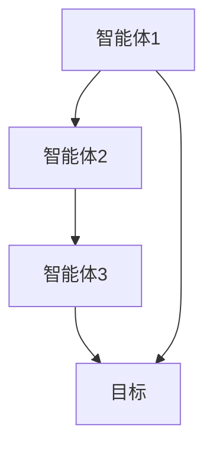
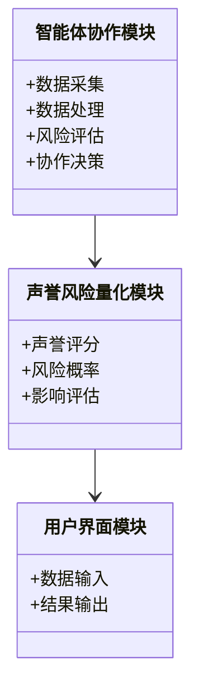
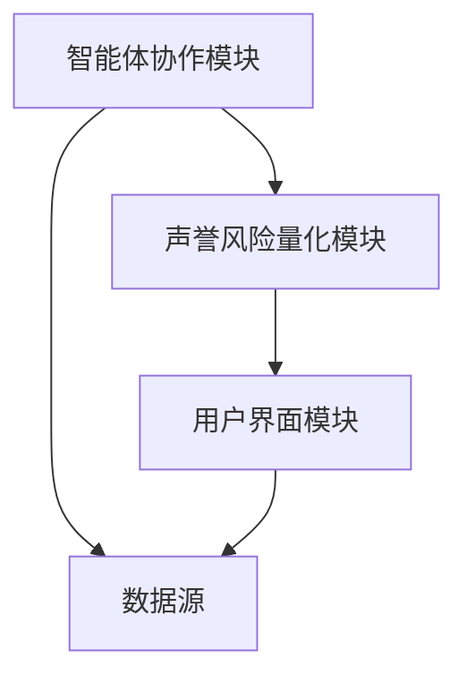

                 


# 利用智能体协作进行全面的公司声誉风险量化

**关键词**：智能体协作、声誉风险量化、风险管理、人工智能、企业声誉管理

**摘要**：随着全球化的深入和信息传播的加速，公司声誉风险管理变得越来越复杂。本文探讨了利用智能体协作技术进行全面的公司声誉风险量化的方法，介绍了智能体协作的核心概念、算法原理、系统架构设计，以及实际项目中的应用案例。通过理论分析和实践结合，本文为读者提供了一套高效管理公司声誉风险的解决方案。

---

## 第一部分：智能体协作与公司声誉风险量化背景

### 第1章：智能体协作与声誉风险量化概述

#### 1.1 智能体协作的基本概念

**1.1.1 智能体的定义与特点**

智能体（Agent）是指能够感知环境、自主决策并采取行动的实体。智能体具有以下特点：
- **自主性**：无需外部干预，自主决策。
- **反应性**：能够根据环境变化调整行为。
- **主动性**：主动采取行动以实现目标。
- **协作性**：能够与其他智能体或系统协同工作。

**1.1.2 智能体协作的定义与机制**

智能体协作是指多个智能体通过通信和协调，共同完成复杂任务的过程。其机制包括：
- **任务分配**：智能体根据自身能力和环境信息分配任务。
- **信息共享**：智能体之间共享信息，确保协作的顺利进行。
- **决策协调**：智能体共同制定决策，确保目标的实现。

**1.1.3 智能体协作与传统协作方式的区别**

传统协作方式依赖于中心化的协调机构，而智能体协作是分布式的，智能体之间通过协议直接通信，具有更高的灵活性和效率。

#### 1.2 公司声誉风险的定义与特点

**1.2.1 公司声誉的定义与构成**

公司声誉是企业在市场中的形象和信誉，由产品质量、企业管理、社会责任等多个因素构成。

**1.2.2 声誉风险的定义与分类**

声誉风险是指任何可能导致公司声誉受损的事件或行为。常见的声誉风险包括：
- **产品风险**：产品质量问题导致的客户投诉。
- **管理风险**：公司内部管理不善引发的负面新闻。
- **法律风险**：法律纠纷对公司声誉的影响。

**1.2.3 声誉风险对企业的影响**

声誉受损可能导致客户流失、股价下跌、品牌价值下降，甚至影响企业的生存。

#### 1.3 智能体协作在声誉风险量化中的作用

**1.3.1 智能体协作的优势**

智能体协作能够实时监控和分析大量的数据，识别潜在风险，并提出应对策略，从而提高风险预测的准确性和响应速度。

**1.3.2 智能体协作在声誉风险管理中的应用**

智能体协作可以应用于声誉风险的监测、评估和应对策略的制定。

**1.3.3 智能体协作与声誉风险量化的目标**

通过智能体协作，实现对公司声誉风险的实时监测和量化评估，为企业提供科学的决策依据。

#### 1.4 本章小结

本章介绍了智能体协作的基本概念和公司声誉风险的定义与特点，阐述了智能体协作在声誉风险量化中的作用。

---

## 第二部分：智能体协作与声誉风险量化的核心概念

### 第2章：智能体协作的核心原理

#### 2.1 智能体协作的核心原理

**2.1.1 分布式智能体协作**

分布式智能体协作是指多个智能体在不同地理位置或系统中协作完成任务。其优势在于能够充分利用各智能体的资源和能力。

**2.1.2 协作协议与通信机制**

智能体协作需要制定协作协议，确保各智能体之间的通信和协作。常用的通信机制包括消息传递和事件触发。

**2.1.3 智能体协作的决策过程**

智能体协作的决策过程包括信息收集、信息处理、决策制定和行动执行。

#### 2.2 智能体协作的数学模型

**2.2.1 协作模型的构建**

协作模型的构建需要考虑智能体的属性、任务分解和协作协议。

**2.2.2 协作模型的数学表达**

协作模型可以用图论和博弈论进行分析。例如，使用图论中的图结构表示智能体之间的协作关系。

**2.2.3 协作模型的优化与改进**

通过不断优化协作协议和算法，提高协作效率和准确性。

#### 2.3 智能体协作的实体关系图

以下是智能体协作的实体关系图：



#### 2.4 本章小结

本章详细介绍了智能体协作的核心原理，包括分布式协作、协作协议和决策过程，并通过实体关系图展示了智能体协作的结构。

---

### 第3章：声誉风险量化的核心原理

#### 3.1 声誉风险的量化指标

**3.1.1 声誉评分**

声誉评分是衡量公司声誉的重要指标，可以通过客户满意度、媒体评价等数据计算得出。

**3.1.2 声誉风险概率**

声誉风险概率是公司声誉受损的可能性，可以通过历史数据和实时数据进行预测。

**3.1.3 声誉风险影响评估**

声誉风险影响评估是衡量风险对公司的影响程度，包括经济损失和品牌价值下降。

#### 3.2 声誉风险量化的数学模型

**3.2.1 基于概率论的声誉风险模型**

声誉风险概率可以通过贝叶斯定理进行计算：

$$P(\text{风险}) = \frac{P(\text{风险}|\text{数据}) \cdot P(\text{数据})}{P(\text{数据})}$$

**3.2.2 基于统计学的声誉风险模型**

声誉风险的影响可以通过回归分析进行评估：

$$y = \beta_0 + \beta_1x_1 + \beta_2x_2 + \epsilon$$

其中，$y$ 是声誉评分，$x_1$ 和 $x_2$ 是影响声誉的两个因素，$\beta$ 是回归系数，$\epsilon$ 是误差项。

#### 3.3 声誉风险量化中的智能体协作

**3.3.1 智能体协作在数据采集中的应用**

智能体协作可以实时采集社交媒体、新闻媒体等数据源的信息，为声誉风险量化提供数据支持。

**3.3.2 智能体协作在数据处理中的应用**

智能体协作可以通过分布式计算和协作机制，高效处理大量数据，提取关键信息。

**3.3.3 智能体协作在风险评估中的应用**

智能体协作可以通过协同推理和决策，提高声誉风险评估的准确性和效率。

#### 3.4 本章小结

本章介绍了声誉风险量化的核心原理，包括量化指标和数学模型，并探讨了智能体协作在数据采集、处理和评估中的应用。

---

## 第三部分：系统分析与架构设计

### 第4章：系统功能设计

#### 4.1 系统功能模块划分

公司声誉风险量化系统主要包括以下几个功能模块：
- 数据采集模块：采集社交媒体、新闻媒体等数据。
- 数据处理模块：清洗、转换和分析数据。
- 风险评估模块：计算声誉风险概率和影响。
- 协作决策模块：制定应对策略。

#### 4.2 系统领域模型设计

以下是系统领域模型：



#### 4.3 系统架构设计

以下是系统架构设计：



#### 4.4 系统接口设计

系统接口包括：
- 数据采集接口：用于采集社交媒体数据。
- 风险评估接口：用于计算声誉风险概率。
- 用户查询接口：用于用户查询声誉风险结果。

#### 4.5 系统交互流程

以下是系统交互流程：

```mermaid
sequenceDiagram
    用户 --> 智能体协作模块: 提交数据采集请求
    智能体协作模块 --> 数据源: 采集数据
    数据源 --> 智能体协作模块: 返回数据
    智能体协作模块 --> 风险评估模块: 提交数据处理请求
    风险评估模块 --> 智能体协作模块: 返回风险评估结果
    智能体协作模块 --> 用户界面模块: 显示结果
    用户 <-- 用户界面模块: 查询结果
```

#### 4.6 本章小结

本章详细描述了公司声誉风险量化系统的功能模块、领域模型、架构设计和接口设计，并通过序列图展示了系统的交互流程。

---

## 第四部分：项目实战

### 第5章：项目实战

#### 5.1 项目环境安装

**5.1.1 安装工具**

- 安装Python和pip。
- 安装Flask框架：`pip install flask`。
- 安装Mermaid插件：支持在Markdown中嵌入图表。

**5.1.2 数据源**

- 社交媒体数据：如Twitter、微博等。
- 新闻媒体数据：如新闻网站、博客等。

#### 5.2 系统核心实现

**5.2.1 数据采集模块**

使用Python的`requests`库和`BeautifulSoup`库采集社交媒体数据：

```python
import requests
from bs4 import BeautifulSoup

def fetch_data(url):
    response = requests.get(url)
    soup = BeautifulSoup(response.text, 'html.parser')
    return soup.find_all('div', class_='tweet')
```

**5.2.2 风险评估模块**

使用自然语言处理技术分析数据，计算声誉风险概率：

```python
from textblob import TextBlob

def calculate_sentiment(text):
    blob = TextBlob(text)
    return blob.sentiment.polarity
```

**5.2.3 协作决策模块**

制定应对策略，如发布声明、调整营销策略等。

#### 5.3 案例分析

**5.3.1 案例背景**

某公司面临负面新闻，需要快速识别风险并制定应对策略。

**5.3.2 数据采集与分析**

通过智能体协作模块采集社交媒体和新闻数据，分析得出负面评论的比例为30%。

**5.3.3 风险评估与应对**

风险评估模块计算出声誉风险概率为中等，影响评分为65分。协作决策模块制定发布声明和调整营销策略的应对方案。

#### 5.4 本章小结

本章通过一个具体案例展示了智能体协作在公司声誉风险量化中的应用，详细介绍了项目的实现过程和案例分析。

---

## 第五部分：最佳实践与小结

### 第6章：最佳实践与小结

#### 6.1 最佳实践

**6.1.1 数据源的选择**

选择多样化的数据源，确保数据的全面性和准确性。

**6.1.2 模型的优化**

定期更新模型，适应市场变化和数据特征的变化。

**6.1.3 团队协作**

建立跨学科团队，确保各环节的无缝对接。

#### 6.2 小结

公司声誉风险管理是一项复杂的系统工程，智能体协作技术为解决这一问题提供了新的思路和方法。通过智能体协作，企业可以实现声誉风险的实时监测和量化评估，为科学决策提供依据。

---

## 作者信息

作者：AI天才研究院/AI Genius Institute & 禅与计算机程序设计艺术 /Zen And The Art of Computer Programming

