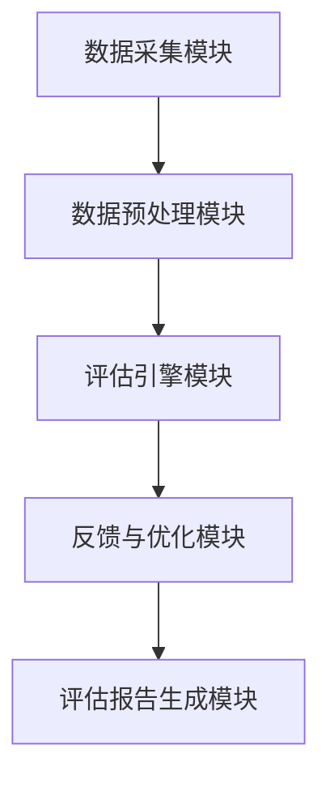
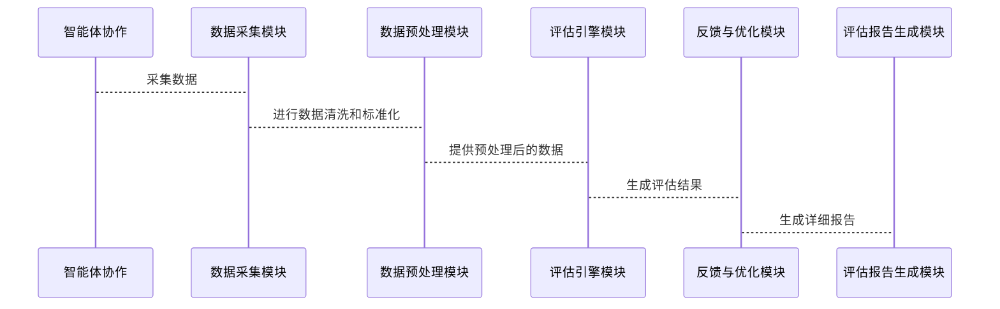

                 


# 利用智能体协作进行全面的公司文化一致性评估

> **关键词**：智能体协作，公司文化一致性，一致性评估，协作机制，算法原理

> **摘要**：  
> 本文探讨了如何利用智能体协作技术进行全面的公司文化一致性评估。通过分析公司文化的内涵、传统评估方法的局限性，提出了一种基于智能体协作的新方法，详细阐述了智能体协作的核心概念、算法原理、系统架构设计及实际应用案例。文章从背景介绍、核心概念、算法原理、系统架构、项目实战到最佳实践，全面解析了智能体协作在公司文化一致性评估中的应用，为企业的文化管理提供了新的思路和解决方案。

---

## 第一部分：公司文化一致性评估的背景与挑战

### 第1章：公司文化一致性评估的重要性

#### 1.1 公司文化的核心概念

##### 1.1.1 什么是公司文化
公司文化是企业在长期经营过程中形成的价值观、行为准则、思维方式和企业精神的总和。它包括企业的使命、愿景、核心价值观、员工行为规范以及企业氛围等多个方面。公司文化是企业的灵魂，决定了企业的凝聚力、员工的工作态度以及企业的外部形象。

##### 1.1.2 公司文化在企业中的作用
- **塑造企业形象**：公司文化是企业在市场中的标签，影响客户和合作伙伴对企业的认知。
- **提升员工凝聚力**：共同的文化认同能够增强员工的归属感和团队协作能力。
- **指导企业决策**：公司文化为企业在战略制定和日常决策中提供了价值导向。
- **推动创新与发展**：积极向上的文化氛围能够激发员工的创造力，推动企业的持续发展。

##### 1.1.3 文化一致性对组织的影响
文化一致性是指企业内部各个层级、部门和员工在文化认同上的统一性。高文化一致性的组织通常具有更强的执行力、更低的内耗和更高的员工满意度。它能够确保企业在面对内外部挑战时保持一致的行动和价值观，从而提高企业的竞争力和抗风险能力。

#### 1.2 传统公司文化评估的局限性

##### 1.2.1 传统评估方法的不足
传统的公司文化评估方法主要包括问卷调查、访谈和观察法。这些方法虽然能够收集到一定的数据，但存在以下问题：
- **数据片面性**：问卷调查往往依赖员工的主观反馈，容易受到个人情绪和偏见的影响。
- **评估周期长**：传统评估方法通常需要大量的人力和时间，难以及时反馈评估结果。
- **缺乏动态性**：公司文化是动态变化的，传统的评估方法难以捕捉到这种变化。

##### 1.2.2 数据收集的挑战
- **数据来源单一**：传统方法主要依赖员工反馈，缺乏多维度的数据来源。
- **数据处理复杂**：收集到的数据需要进行清洗、分析和建模，过程繁琐且容易出错。
- **难以量化**：文化评估往往难以量化，导致结果缺乏客观性和可比性。

##### 1.2.3 评估结果的局限性
- **结果缺乏指导性**：传统的评估结果往往只是描述性分析，难以为企业提供具体的改进方向。
- **难以持续跟踪**：缺乏动态评估机制，难以持续监测文化变化并及时调整。

#### 1.3 智能体协作的优势

##### 1.3.1 智能体协作的基本概念
智能体（Agent）是指能够感知环境、自主决策并采取行动以实现目标的实体。智能体协作是指多个智能体通过协同工作，共同完成复杂任务的过程。在公司文化评估中，智能体协作可以通过分布式数据采集、自动分析和实时反馈，实现高效、准确的文化一致性评估。

##### 1.3.2 智能体协作在文化评估中的应用
- **分布式数据采集**：智能体可以实时采集企业内部和外部的数据，包括员工行为、客户反馈、市场趋势等。
- **自动化分析**：通过智能体协作，可以快速处理大量数据，生成文化评估报告。
- **实时反馈与调整**：智能体可以根据评估结果，实时调整企业的文化管理策略。

##### 1.3.3 智能体协作的优势与潜力
- **高效性**：智能体协作可以快速处理数据，显著缩短评估周期。
- **准确性**：通过多源数据的整合分析，提高评估结果的准确性。
- **动态性**：智能体可以实时监测文化变化，提供持续的评估和反馈。

---

## 第二部分：智能体协作的核心概念与原理

### 第2章：智能体协作的定义与特点

#### 2.1 智能体的基本概念

##### 2.1.1 智能体的定义
智能体是指能够感知环境、自主决策并采取行动以实现目标的实体。它可以是一个软件程序、一个机器人，甚至是一个组织。智能体的核心特征包括自主性、反应性、目标导向性和社会性。

##### 2.1.2 智能体的分类
智能体可以根据其智能水平和应用领域进行分类：
- **反应式智能体**：基于当前感知做出反应，不依赖于内部状态。
- **认知式智能体**：具有复杂推理和规划能力，能够处理复杂任务。
- **协作式智能体**：专门用于协作任务，能够与其他智能体通信和协调。

##### 2.1.3 智能体的核心特征
- **自主性**：智能体能够自主决策，无需外部干预。
- **反应性**：能够根据环境变化做出实时反应。
- **目标导向性**：所有行动都围绕实现特定目标展开。
- **社会性**：能够与其他智能体或人类进行有效通信和协作。

#### 2.2 智能体协作的原理

##### 2.2.1 协作的基本概念
协作是指多个智能体为了共同的目标而协同工作。协作过程包括任务分配、信息共享、决策协商和行动协调。

##### 2.2.2 协作机制的分类
协作机制可以根据不同的标准进行分类：
- **基于角色的协作**：根据智能体的角色分配任务。
- **基于任务的协作**：根据任务需求动态分配智能体。
- **基于通信的协作**：通过通信实现信息共享和协调。

##### 2.2.3 智能体协作的实现方式
- **通信协议**：智能体之间通过特定的协议进行信息交换。
- **任务分配算法**：使用分布式算法动态分配任务。
- **协调机制**：通过协商和调整实现协作目标。

#### 2.3 智能体协作与一致性评估的关系

##### 2.3.1 协作在一致性评估中的作用
智能体协作可以通过分布式数据采集和自动化分析，提高评估的全面性和准确性。

##### 2.3.2 协作机制对评估结果的影响
协作机制的不同会影响评估的效率和质量。例如，基于任务的协作机制可以快速响应评估需求，而基于角色的协作机制则能够保证评估的系统性和全面性。

##### 2.3.3 协作与一致性的相互关系
智能体协作能够促进文化一致性评估的动态性和实时性，而文化一致性则为协作提供了一个稳定和一致的环境。

---

## 第三部分：一致性评估的算法原理

### 第3章：一致性评估的算法概述

#### 3.1 一致性评估的基本原理

##### 3.1.1 数据采集与预处理
智能体协作可以实时采集企业内部和外部的数据，包括员工行为数据、客户反馈数据、市场趋势数据等。这些数据需要经过清洗和标准化处理，以便后续分析。

##### 3.1.2 数据分析与建模
通过机器学习算法对数据进行建模，提取文化一致性相关的特征。常用的算法包括聚类分析、回归分析和神经网络等。

##### 3.1.3 评估结果的计算
根据建模结果，计算文化一致性的指数，通常采用综合评分的方式，将多个评估维度的结果整合成一个总分。

#### 3.2 算法实现的详细步骤

##### 3.2.1 数据采集
智能体通过多种渠道采集数据，例如：
- **员工行为数据**：包括考勤记录、绩效数据、团队协作记录等。
- **客户反馈数据**：包括客户满意度调查、客户投诉记录等。
- **市场趋势数据**：包括行业动态、竞争对手分析等。

##### 3.2.2 数据预处理
- **数据清洗**：去除重复数据、异常值和缺失数据。
- **数据标准化**：将不同来源的数据统一到相同的尺度。
- **数据特征提取**：提取与文化一致性相关的特征，例如员工满意度、团队协作效率等。

##### 3.2.3 算法选择与实现
- **聚类分析**：用于识别不同文化特征的群体。
- **回归分析**：用于分析文化一致性与企业绩效之间的关系。
- **神经网络**：用于复杂模式的识别和预测。

##### 3.2.4 结果计算
- **文化一致性指数**：通过加权计算多个评估维度的结果，得到一个综合评分。
- **评估报告生成**：根据计算结果生成详细的评估报告，包括优势、不足和改进建议。

#### 3.3 算法的优化与改进

##### 3.3.1 算法优化
- **参数调优**：通过实验调整算法参数，提高评估的准确性。
- **模型优化**：采用更复杂的模型，例如深度学习模型，提高预测精度。

##### 3.3.2 算法改进
- **动态调整**：根据实时数据动态调整评估模型。
- **多维度分析**：引入更多的评估维度，例如员工幸福感、客户忠诚度等。

#### 3.4 算法的数学模型

##### 3.4.1 数据预处理的数学模型
假设我们有N个员工，每个员工有M个特征，数据预处理的数学模型可以表示为：
$$
X_{processed} = \frac{X_{original} - \mu}{\sigma}
$$
其中，$\mu$ 是均值，$\sigma$ 是标准差。

##### 3.4.2 聚类分析的数学模型
聚类分析通常使用K-means算法，目标是最小化聚类误差：
$$
\text{误差} = \sum_{i=1}^{k} \sum_{j \in C_i} (x_j - c_i)^2
$$
其中，$k$ 是聚类数，$C_i$ 是第i个聚类，$c_i$ 是聚类中心。

##### 3.4.3 回归分析的数学模型
回归分析用于分析文化一致性与企业绩效的关系：
$$
y = \beta_0 + \beta_1 x_1 + \beta_2 x_2 + \cdots + \beta_n x_n + \epsilon
$$
其中，$y$ 是目标变量，$x_i$ 是自变量，$\beta_i$ 是回归系数，$\epsilon$ 是误差项。

---

## 第四部分：系统分析与架构设计方案

### 第4章：系统架构设计

#### 4.1 问题场景介绍
公司文化一致性评估系统需要实时监测和分析企业内部和外部的数据，评估文化一致性，并提供改进建议。系统需要具备高扩展性、高可靠性和高实时性。

#### 4.2 系统功能设计

##### 4.2.1 数据采集模块
- **功能**：实时采集员工行为数据、客户反馈数据和市场趋势数据。
- **实现**：通过API接口与企业内部系统对接，获取实时数据。

##### 4.2.2 评估引擎模块
- **功能**：对采集的数据进行预处理、建模和评估。
- **实现**：使用机器学习算法，实现文化一致性指数的计算。

##### 4.2.3 反馈与优化模块
- **功能**：根据评估结果生成改进建议，并动态调整评估模型。
- **实现**：通过反馈机制优化算法参数，提高评估准确性。

#### 4.3 系统架构设计

##### 4.3.1 系统架构图


##### 4.3.2 系统交互图


#### 4.4 系统接口设计
- **数据接口**：提供API接口，用于与其他系统对接数据。
- **用户接口**：提供可视化界面，供用户查看评估结果和改进建议。

---

## 第五部分：项目实战

### 第5章：项目实战与案例分析

#### 5.1 环境安装与配置

##### 5.1.1 系统需求
- **硬件需求**：建议使用高性能服务器，配备足够的内存和存储空间。
- **软件需求**：安装Python 3.8及以上版本，安装必要的库，如NumPy、Pandas、Scikit-learn等。

##### 5.1.2 环境配置
```bash
pip install numpy pandas scikit-learn matplotlib
```

#### 5.2 核心代码实现

##### 5.2.1 数据采集模块
```python
import requests

def fetch_data(api_url):
    response = requests.get(api_url)
    return response.json()
```

##### 5.2.2 数据预处理模块
```python
import pandas as pd
from sklearn.preprocessing import StandardScaler

def preprocess_data(data):
    df = pd.DataFrame(data)
    scaler = StandardScaler()
    processed_data = scaler.fit_transform(df)
    return processed_data
```

##### 5.2.3 评估引擎模块
```python
from sklearn.cluster import KMeans

def evaluate_consistency(processed_data):
    model = KMeans(n_clusters=3, random_state=42)
    model.fit(processed_data)
    return model.labels_
```

##### 5.2.4 反馈与优化模块
```python
def optimize_model(labels):
    # 根据标签调整模型参数
    pass
```

#### 5.3 案例分析与结果解读

##### 5.3.1 案例背景
某企业希望通过智能体协作进行文化一致性评估，提升员工满意度和团队协作效率。

##### 5.3.2 实施步骤
1. **数据采集**：通过API接口采集员工行为数据、客户反馈数据和市场趋势数据。
2. **数据预处理**：对采集的数据进行清洗和标准化处理。
3. **评估引擎**：使用聚类分析算法，计算文化一致性指数。
4. **反馈与优化**：根据评估结果，生成改进建议，并动态调整评估模型。

##### 5.3.3 实施结果
- **评估结果**：文化一致性指数为0.85，表明文化一致性较高。
- **改进建议**：进一步提升员工培训和团队协作效率。

---

## 第六部分：最佳实践与总结

### 第6章：最佳实践与总结

#### 6.1 最佳实践

##### 6.1.1 数据质量管理
- 确保数据的准确性和完整性，避免数据偏差。
- 定期更新数据，保持数据的时效性。

##### 6.1.2 算法优化
- 根据具体场景选择合适的算法，避免过度复杂化。
- 定期调优算法参数，提高评估精度。

##### 6.1.3 系统维护
- 定期检查系统运行状态，确保系统的稳定性和安全性。
- 及时修复系统漏洞，防止数据泄露。

#### 6.2 小结

##### 6.2.1 项目总结
通过智能体协作进行公司文化一致性评估，能够显著提高评估的效率和准确性。智能体协作的优势在于其分布式数据采集和自动化分析能力，能够实时监测文化变化并提供动态反馈。

##### 6.2.2 项目意义
本文提出的智能体协作方法为公司文化一致性评估提供了一种新的思路，具有重要的理论意义和实践价值。通过这种方法，企业能够更好地理解和管理自身文化，提升员工满意度和企业绩效。

#### 6.3 注意事项

##### 6.3.1 数据隐私保护
在采集和处理数据时，必须遵守相关法律法规，保护员工和客户的隐私。

##### 6.3.2 系统安全性
确保系统的安全性和稳定性，防止数据被篡改或泄露。

##### 6.3.3 人员培训
企业需要对相关人员进行培训，确保他们能够正确使用和维护系统。

#### 6.4 拓展阅读

##### 6.4.1 智能体协作的前沿研究
- **多智能体系统**：研究多个智能体协同工作的理论和方法。
- **分布式计算**：研究分布式系统的设计与实现。

##### 6.4.2 文化管理的其他方法
- **组织发展**：研究组织结构和文化对企业发展的影响。
- **领导力发展**：研究领导力在文化管理中的作用。

---

## 结语

通过本文的详细阐述，我们可以看到智能体协作在公司文化一致性评估中的巨大潜力。智能体协作不仅能够提高评估的效率和准确性，还能够实时监测文化变化，为企业提供持续的反馈和优化建议。未来，随着人工智能技术的不断发展，智能体协作在公司文化管理中的应用将更加广泛和深入，为企业创造更大的价值。

---

**作者**：AI天才研究院/AI Genius Institute & 禅与计算机程序设计艺术 /Zen And The Art of Computer Programming

