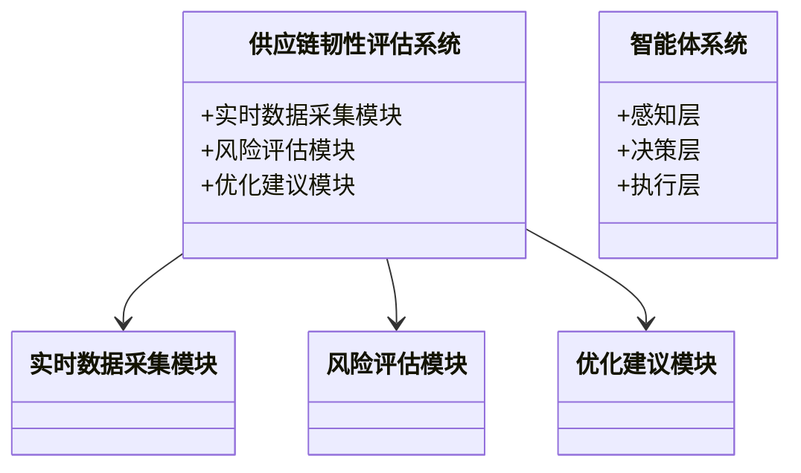
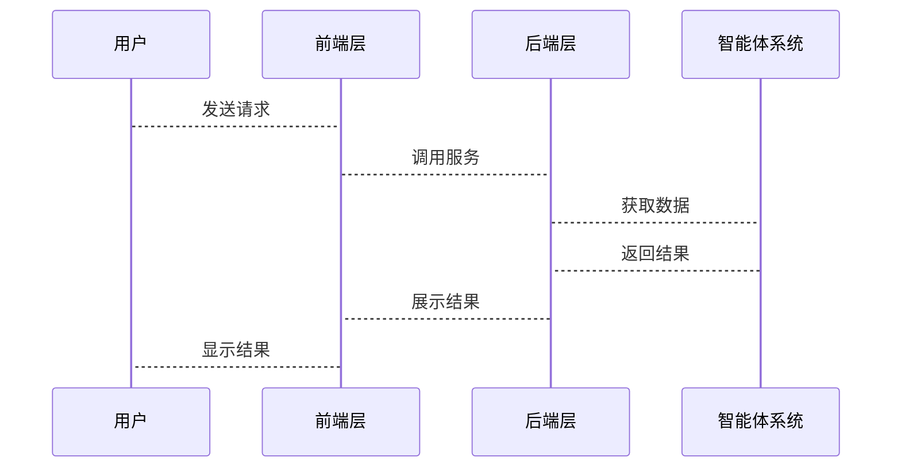

                 


# 利用智能体系统进行全面的供应链韧性评估

## 关键词：供应链韧性，智能体系统，供应链管理，风险评估，多智能体系统（MAS）

## 摘要：  
供应链韧性是企业在复杂多变的环境中保持稳定运营的关键能力。随着全球化和市场竞争的加剧，供应链面临的不确定性因素越来越多，如自然灾害、疫情、地缘政治冲突等。传统的供应链管理方法难以应对这些复杂挑战，因此，利用智能体系统进行全面的供应链韧性评估成为一种新的趋势。智能体系统（Multi-Agent System, MAS）通过分布式计算和自主决策的能力，能够实时感知供应链中的风险，并采取相应的策略来增强供应链的弹性。本文将从供应链韧性的核心概念、智能体系统的原理、系统架构设计、项目实战、优化与挑战等方面展开讨论，深入分析如何利用智能体系统进行全面的供应链韧性评估。

---

# 第1章: 供应链韧性评估的背景与意义

## 1.1 供应链的基本概念与重要性

### 1.1.1 供应链的定义与组成  
供应链是指从原材料采购到产品交付给最终用户的整个过程中的所有环节和资源的集合。它包括供应商、制造商、分销商、零售商以及客户等多个环节，每个环节都通过信息流、物流和资金流紧密连接。供应链的高效运作是企业竞争力的重要来源。

### 1.1.2 供应链在现代企业中的作用  
供应链不仅是企业运营的核心部分，还直接影响企业的成本、效率和客户满意度。通过优化供应链管理，企业可以降低库存成本、缩短交货时间、提高产品质量，从而增强市场竞争力。

### 1.1.3 供应链韧性的重要性  
供应链韧性是指在面对突发事件或不确定性时，供应链维持正常运作的能力。在全球化背景下，供应链的复杂性增加，潜在风险也增多。因此，评估和增强供应链韧性是企业确保业务连续性和可持续发展的重要任务。

---

## 1.2 供应链面临的挑战

### 1.2.1 全球化背景下的供应链风险  
全球化使得供应链跨越多个国家和地区，增加了地理和政治风险。例如，疫情导致的物流中断、原材料短缺等问题，暴露了供应链的脆弱性。

### 1.2.2 突发事件对供应链的冲击  
自然灾害（如地震、洪水）、疫情、战争等突发事件可能对供应链中的关键环节造成破坏，导致生产和交付中断。

### 1.2.3 供应链复杂性带来的挑战  
随着供应链的扩展，其复杂性也增加，不同环节之间的依赖关系更加紧密。这种复杂性使得传统的集中式管理方法难以应对动态变化。

---

## 1.3 智能体系统在供应链管理中的应用前景

### 1.3.1 智能体系统的定义与特点  
智能体系统是由多个智能体组成的分布式系统，每个智能体能够感知环境、自主决策并与其他智能体协作。智能体系统具有分布式计算、自主性、反应性和协作性等特点。

### 1.3.2 智能体系统在供应链管理中的优势  
智能体系统能够实时感知供应链中的风险，快速做出反应，并通过协作机制优化资源分配。例如，智能体可以实时监控物流状态、预测需求变化，并动态调整生产计划。

### 1.3.3 智能体系统与供应链韧性的结合  
通过智能体系统，企业可以实现对供应链的实时监控和风险预测，从而在突发事件发生时快速响应，减少供应链中断的影响，增强供应链的韧性。

---

## 1.4 本章小结  
本章介绍了供应链的基本概念和重要性，分析了供应链面临的挑战，并探讨了智能体系统在供应链管理中的应用前景。智能体系统凭借其分布式计算和自主决策的特点，为供应链韧性评估提供了新的解决方案。

---

# 第2章: 供应链韧性评估的核心概念

## 2.1 供应链韧性的定义与内涵

### 2.1.1 供应链韧性的多维度分析  
供应链韧性可以从多个维度进行分析，包括恢复能力、适应能力、冗余能力等。恢复能力是指在遭受破坏后快速恢复的能力；适应能力是指根据环境变化调整供应链的能力；冗余能力是指通过备用资源降低风险的能力。

### 2.1.2 供应链韧性的评估指标  
供应链韧性评估的指标包括：  
1. **响应时间**：在突发事件发生后，供应链恢复到正常运作所需的时间。  
2. **资源冗余度**：供应链中备用资源的多少。  
3. **风险暴露度**：供应链对潜在风险的敏感程度。  
4. **协同能力**：供应链各环节之间的协作效率。

### 2.1.3 供应链韧性与企业可持续发展的关系  
供应链韧性不仅是企业运营的核心能力，也是实现可持续发展的重要保障。通过增强供应链韧性，企业可以减少资源浪费、降低环境影响，并提高社会经济效益。

---

## 2.2 智能体系统的核心原理

### 2.2.1 多智能体系统（MAS）的基本概念  
多智能体系统是由多个智能体组成的分布式系统，每个智能体都有自己的目标和行为规则。智能体之间通过通信和协作完成复杂的任务。

### 2.2.2 智能体的协作机制  
智能体的协作机制包括：  
1. **任务分配**：根据智能体的能力和目标分配任务。  
2. **信息共享**：智能体之间共享信息，提高整体决策能力。  
3. **冲突解决**：通过协商和仲裁机制解决智能体之间的冲突。

### 2.2.3 智能体系统的自适应能力  
智能体系统具有自适应能力，能够根据环境变化动态调整行为。例如，智能体可以根据实时数据调整生产计划或重新分配资源。

---

## 2.3 供应链韧性评估的框架与模型

### 2.3.1 供应链韧性评估的框架设计  
供应链韧性评估的框架包括：  
1. **数据收集**：收集供应链各环节的实时数据。  
2. **风险识别**：识别潜在风险并评估其影响。  
3. **决策支持**：基于评估结果提供优化建议。  
4. **模拟与优化**：通过模拟优化供应链结构，提高韧性。

### 2.3.2 基于智能体系统的评估模型  
基于智能体系统的评估模型包括：  
1. **智能体行为模型**：描述智能体的决策规则和行为逻辑。  
2. **供应链网络模型**：描述供应链的结构和各环节之间的关系。  
3. **风险评估模型**：评估供应链各环节的风险并制定应对策略。

### 2.3.3 模型的输入输出与实现方式  
模型的输入包括供应链各环节的数据和风险因素，输出包括风险评估结果和优化建议。实现方式包括：  
1. **数据预处理**：清洗和整合数据。  
2. **模型训练**：使用历史数据训练模型。  
3. **模型部署**：将模型应用于实际供应链管理。

---

## 2.4 本章小结  
本章详细阐述了供应链韧性的核心概念和智能体系统的核心原理，提出了基于智能体系统的供应链韧性评估框架和模型。通过这些方法，企业可以更好地应对供应链中的潜在风险，增强供应链的韧性。

---

# 第3章: 智能体系统在供应链韧性评估中的应用

## 3.1 智能体系统的构建与实现

### 3.1.1 智能体系统的架构设计  
智能体系统的架构设计包括：  
1. **感知层**：通过传感器和数据采集系统获取实时数据。  
2. **决策层**：基于数据进行分析和决策。  
3. **执行层**：根据决策结果执行操作。

### 3.1.2 智能体的感知与决策机制  
智能体通过感知环境、分析数据并做出决策。例如，智能体可以实时监控物流状态，预测需求变化，并根据预测结果调整生产计划。

### 3.1.3 智能体的协作与通信  
智能体之间的协作与通信是通过消息传递和共享数据库实现的。例如，智能体可以通过共享数据库实时更新物流状态和库存信息。

---

## 3.2 供应链韧性评估的关键算法

### 3.2.1 基于智能体的评估算法  
基于智能体的评估算法包括：  
1. **任务分配算法**：根据智能体的能力分配任务。  
2. **信息共享算法**：通过消息传递共享数据。  
3. **决策优化算法**：基于数据优化决策。

### 3.2.2 算法的数学模型与公式  
例如，任务分配算法可以使用以下数学模型：  
$$ \text{任务分配} = \argmax_{i} \sum_{j} w_{ij} \cdot x_{ij} $$  
其中，$w_{ij}$ 是任务 $j$ 对智能体 $i$ 的权重，$x_{ij}$ 是智能体 $i$ 是否分配任务 $j$ 的变量。

### 3.2.3 算法的实现步骤与流程  
算法的实现步骤包括：  
1. 初始化智能体系统。  
2. 收集供应链各环节的数据。  
3. 根据数据进行任务分配和决策优化。  
4. 输出评估结果和优化建议。

---

## 3.3 算法实现与案例分析

### 3.3.1 算法实现的代码示例  
以下是基于智能体的供应链韧性评估算法的Python代码示例：

```python
class Agent:
    def __init__(self, id):
        self.id = id
        self.tasks = []
        
    def assign_task(self, task):
        self.tasks.append(task)
        
    def execute_task(self):
        for task in self.tasks:
            # 执行任务
            pass

# 初始化智能体
agents = [Agent(i) for i in range(5)]

# 分配任务
for agent in agents:
    agent.assign_task("monitor物流状态")
```

### 3.3.2 案例分析与结果解读  
通过上述代码示例，智能体可以实时监控物流状态并根据数据优化供应链的运作。例如，如果某条物流线路中断，智能体可以快速调整生产计划，确保供应链的稳定性。

### 3.3.3 案例的启示与优化建议  
案例分析表明，基于智能体的供应链韧性评估算法能够快速响应突发事件，并提供有效的优化建议。未来可以通过引入机器学习算法进一步提高评估的准确性和效率。

---

## 3.4 本章小结  
本章详细介绍了智能体系统的构建与实现，分析了供应链韧性评估的关键算法，并通过案例分析展示了智能体系统在供应链韧性评估中的应用。

---

# 第4章: 供应链韧性评估的系统架构设计

## 4.1 系统需求分析

### 4.1.1 功能需求分析  
功能需求包括：  
1. 实时监控供应链各环节的状态。  
2. 风险识别与评估。  
3. 优化建议与决策支持。

### 4.1.2 性能需求分析  
系统需要具备高实时性、高可靠性和高可扩展性，能够处理大量的实时数据。

### 4.1.3 用户需求分析  
用户包括企业高管、供应链经理和一线操作人员，他们需要不同的功能模块和权限。

---

## 4.2 系统功能设计

### 4.2.1 领域模型设计（Mermaid类图）  
以下是供应链韧性评估系统的领域模型设计：



---

## 4.3 系统架构设计

### 4.3.1 系统架构设计（Mermaid架构图）  
以下是供应链韧性评估系统的架构设计：


---

## 4.4 系统接口设计

### 4.4.1 系统接口设计  
系统接口包括：  
1. 用户界面：供用户输入数据和查看结果。  
2. 数据接口：与第三方数据源（如物流平台）进行数据交互。  
3. API接口：供其他系统调用评估结果。

### 4.4.2 系统交互设计（Mermaid序列图）  
以下是系统交互的序列图：



---

## 4.5 本章小结  
本章详细阐述了供应链韧性评估系统的架构设计和功能模块，展示了系统如何通过智能体系统实现对供应链的实时监控和风险评估。

---

# 第5章: 项目实战

## 5.1 环境搭建

### 5.1.1 系统环境要求  
系统需要运行在Windows或Linux操作系统上，推荐使用Python 3.6以上版本。

### 5.1.2 工具安装与配置  
需要安装Python、NumPy、Pandas、Matplotlib等库，以及智能体系统框架（如Multi-Agent Framework）。

---

## 5.2 系统核心实现

### 5.2.1 核心代码实现  
以下是供应链韧性评估系统的核心代码实现：

```python
import numpy as np
import pandas as pd
import matplotlib.pyplot as plt

class SupplyChainAgent:
    def __init__(self, id):
        self.id = id
        self.supply_chain_data = []
        
    def collect_data(self, data):
        self.supply_chain_data.append(data)
        
    def analyze_data(self):
        df = pd.DataFrame(self.supply_chain_data)
        # 数据分析与可视化
        plt.figure(figsize=(10, 6))
        plt.plot(df['时间'], df['物流状态'], label='物流状态')
        plt.xlabel('时间')
        plt.ylabel('物流状态')
        plt.legend()
        plt.show()

# 初始化智能体
agent = SupplyChainAgent(1)

# 模拟数据采集
for i in range(10):
    agent.collect_data({'时间': i, '物流状态': np.random.randint(0, 100)})

# 数据分析与可视化
agent.analyze_data()
```

### 5.2.2 代码实现与功能解读  
上述代码实现了一个简单的供应链智能体，能够采集物流状态数据并进行可视化分析。通过进一步扩展，可以实现更复杂的供应链韧性评估功能。

---

## 5.3 案例分析

### 5.3.1 案例背景与数据准备  
假设某制造企业面临原材料短缺的风险，需要通过智能体系统评估供应链韧性并制定应对策略。

### 5.3.2 案例分析与结果解读  
通过智能体系统，企业可以实时监控物流状态、预测需求变化，并动态调整生产计划，从而降低供应链中断的风险。

### 5.3.3 案例的优化建议  
建议企业引入更多的智能体，进一步优化供应链结构，增强供应链的冗余能力和适应能力。

---

## 5.4 本章小结  
本章通过实际案例展示了供应链韧性评估系统的实现过程，从环境搭建、代码实现到案例分析，详细解读了智能体系统在供应链管理中的应用。

---

# 第6章: 优化与挑战

## 6.1 系统性能优化

### 6.1.1 算法优化  
通过引入机器学习算法（如随机森林、神经网络）提高风险评估的准确性和效率。

### 6.1.2 系统架构优化  
通过分布式计算和云计算技术提高系统的扩展性和处理能力。

### 6.1.3 数据管理优化  
通过数据压缩、数据归档等方法降低数据存储成本。

---

## 6.2 实际应用中的挑战

### 6.2.1 数据隐私与安全  
供应链数据涉及企业的核心机密，如何保护数据隐私和安全是一个重要挑战。

### 6.2.2 系统集成与兼容性  
智能体系统需要与现有的企业系统（如ERP、CRM）无缝集成，确保数据的准确性和一致性。

### 6.2.3 用户接受度  
智能体系统的引入可能面临用户的抵触和不适应，如何提高用户的接受度是一个重要的问题。

---

## 6.3 应对策略

### 6.3.1 数据隐私与安全的应对策略  
通过加密技术、访问控制等手段保护数据隐私和安全。

### 6.3.2 系统集成与兼容性的应对策略  
通过API接口和数据转换工具实现与现有系统的无缝集成。

### 6.3.3 用户接受度的应对策略  
通过培训、宣传等方式提高用户的接受度和使用能力。

---

## 6.4 本章小结  
本章分析了供应链韧性评估系统在实际应用中的优化方向和面临的挑战，并提出了应对策略。通过不断优化系统性能和解决实际问题，可以进一步提升智能体系统在供应链管理中的应用效果。

---

# 第7章: 结论与展望

## 7.1 全文总结  
本文详细探讨了利用智能体系统进行全面的供应链韧性评估的方法和实现。通过智能体系统，企业可以实时监控供应链状态、评估风险并优化供应链结构，从而增强供应链的韧性。

## 7.2 未来展望  
未来，随着人工智能和大数据技术的不断发展，智能体系统在供应链管理中的应用将更加广泛和深入。例如，通过引入强化学习算法，智能体系统可以进一步提高决策的准确性和效率。此外，随着物联网技术的发展，智能体系统将更加实时化和智能化。

## 7.3 致谢  
感谢所有参与本文写作和研究的人员，感谢读者的支持和关注。

---

# 作者：AI天才研究院/AI Genius Institute & 禅与计算机程序设计艺术 /Zen And The Art of Computer Programming

