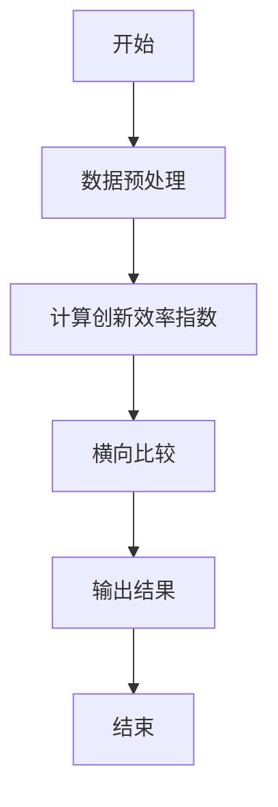
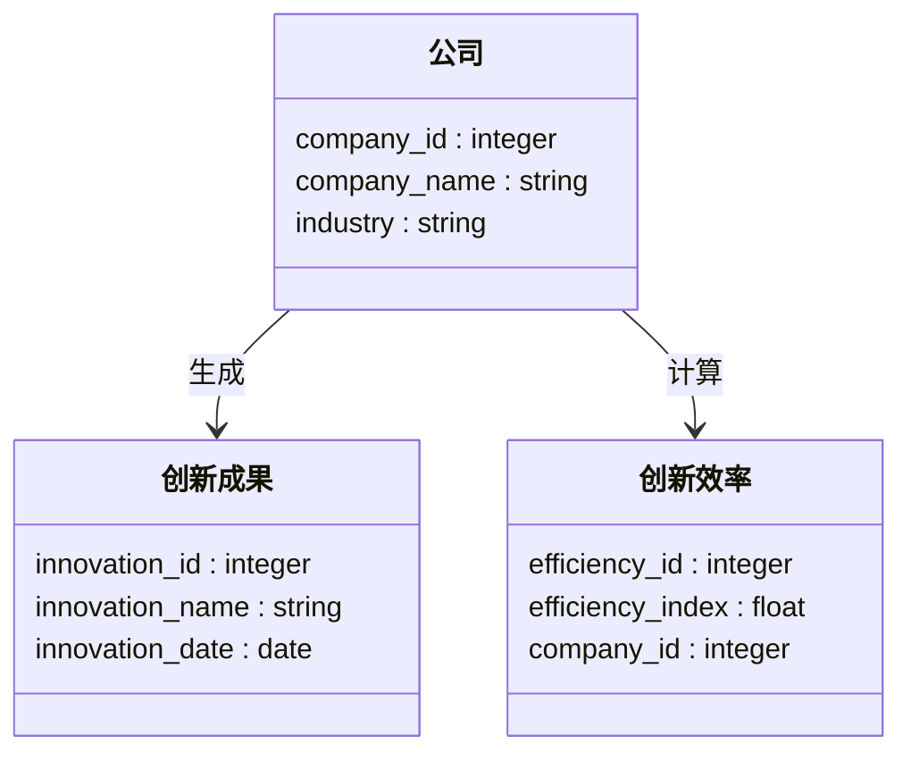
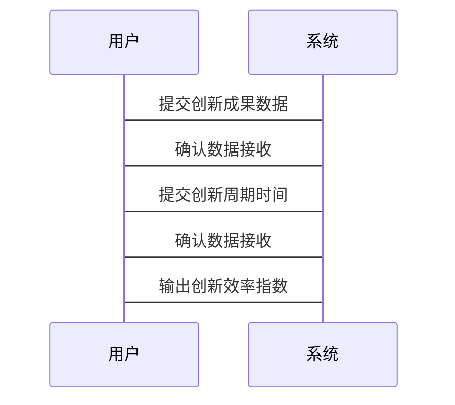

                 


# 利用智能体系统进行全面的公司创新效率横向比较

> 关键词：智能体系统，创新效率，横向比较，企业创新，效率评估

> 摘要：本文详细探讨了如何利用智能体系统进行公司创新效率的横向比较。通过分析创新效率的核心概念、智能体系统的原理及其在横向比较中的应用，结合实际案例和系统设计，提出了一种基于智能体系统的创新效率评估方法。本文适合企业高管、创新管理者以及对智能系统感兴趣的技术人员阅读。

---

# 第一部分: 公司创新效率横向比较的背景与意义

# 第1章: 公司创新效率横向比较的背景与问题描述

## 1.1 创新效率的重要性
### 1.1.1 创新效率的定义
创新效率是指企业在单位时间内将创意转化为实际创新成果的能力。它不仅包括创新的数量，还包括创新的质量和可持续性。

### 1.1.2 创新效率对企业发展的意义
创新是企业保持竞争优势的核心驱动力。创新效率高的企业能够更快地响应市场变化，推出新产品和服务，从而在竞争中占据优势。

### 1.1.3 当前企业创新效率评估的痛点
- 数据分散：企业的创新数据通常分散在不同部门，难以整合。
- 方法单一：传统的创新效率评估方法多基于主观指标，缺乏客观性。
- 横向比较难：不同企业之间的创新效率难以标准化比较。

## 1.2 智能体系统在创新效率评估中的作用
### 1.2.1 智能体系统的定义
智能体系统是一种能够感知环境、自主决策并执行任务的智能系统，通常具备学习、推理和自适应能力。

### 1.2.2 智能体系统的核心特点
- 智能性：能够理解并处理复杂数据。
- 自主性：能够在没有人工干预的情况下运行。
- 适应性：能够根据环境变化调整行为。

### 1.2.3 智能体系统在创新效率评估中的优势
- 数据整合能力强：能够从多个来源收集和分析创新相关数据。
- 计算效率高：通过算法快速计算创新效率指数。
- 可扩展性好：适用于不同规模和行业的企业。

## 1.3 本章小结
### 1.3.1 创新效率评估的核心问题
创新效率评估的核心问题是如何准确、客观地量化企业的创新成果。

### 1.3.2 智能体系统在创新效率评估中的定位
智能体系统是实现创新效率横向比较的技术基础，能够通过数据处理和算法计算，为企业的创新效率评估提供支持。

---

# 第二部分: 智能体系统的核心概念与原理

# 第2章: 智能体系统的核心概念与联系

## 2.1 智能体系统的定义与属性
### 2.1.1 智能体系统的定义
智能体系统是一种能够感知环境、自主决策并执行任务的智能系统，通常具备学习、推理和自适应能力。

### 2.1.2 智能体系统的属性特征对比表
| 属性 | 特征 |
|------|------|
| 智能性 | 能够理解并处理复杂数据 |
| 自主性 | 能够在没有人工干预的情况下运行 |
| 适应性 | 能够根据环境变化调整行为 |

### 2.1.3 智能体系统的ER实体关系图
```mermaid
erDiagram
    customer[公司] {
        company_id : integer
        company_name : string
        industry : string
    }
    innovation[创新成果] {
        innovation_id : integer
        innovation_name : string
        innovation_date : date
    }
    efficiency[创新效率] {
        efficiency_id : integer
        efficiency_index : float
        company_id : integer
    }
    customer -| innovation : company生成的创新成果
    customer -| efficiency : company的创新效率
```

## 2.2 智能体系统与创新效率评估的关系
### 2.2.1 智能体系统在创新效率评估中的应用场景
智能体系统可以用于数据收集、分析和计算创新效率指数。

### 2.2.2 智能体系统与创新效率评估的核心联系
智能体系统通过整合和分析创新相关数据，为创新效率评估提供技术支持。

### 2.2.3 智能体系统在创新效率评估中的优势
- 数据处理能力强：能够从多个来源收集和分析创新相关数据。
- 计算效率高：通过算法快速计算创新效率指数。
- 可扩展性好：适用于不同规模和行业的企业。

## 2.3 本章小结
### 2.3.1 智能体系统的核心概念总结
智能体系统是一种具备智能性、自主性和适应性的智能系统。

### 2.3.2 智能体系统在创新效率评估中的应用价值
智能体系统能够通过数据处理和算法计算，为企业的创新效率评估提供技术支持。

---

# 第三部分: 利用智能体系统进行创新效率横向比较的算法原理

# 第3章: 智能体系统横向比较算法原理

## 3.1 创新效率横向比较的算法流程
### 3.1.1 算法输入
- 企业的创新成果数据
- 企业的创新周期时间

### 3.1.2 算法输出
- 各企业的创新效率指数
- 横向比较结果

### 3.1.3 算法步骤（mermaid流程图）


## 3.2 创新效率指数计算模型
### 3.2.1 创新效率指数的定义
创新效率指数是衡量企业在单位时间内将创意转化为实际创新成果的能力。

### 3.2.2 创新效率指数的数学模型
$$ E_i = \frac{I_i}{T_i} $$
其中，$E_i$ 表示第 $i$ 家公司的创新效率指数，$I_i$ 表示创新成果数量，$T_i$ 表示创新周期时间。

## 3.3 创新效率横向比较的实现
### 3.3.1 数据预处理
- 数据清洗：去除无效数据，处理缺失值。
- 数据转换：将数据转换为统一格式，便于计算。

### 3.3.2 创新效率指数计算
- 根据公式 $E_i = \frac{I_i}{T_i}$ 计算每家公司的创新效率指数。

### 3.3.3 横向比较结果输出
- 将创新效率指数按从高到低排序，输出比较结果。

## 3.4 本章小结
### 3.4.1 算法原理总结
创新效率横向比较的算法通过计算每家公司的创新效率指数，并进行横向比较，得出结果。

### 3.4.2 创新效率横向比较的核心步骤
- 数据预处理
- 创新效率指数计算
- 横向比较结果输出

---

# 第四部分: 创新效率横向比较的系统分析与架构设计

# 第4章: 系统分析与架构设计

## 4.1 问题场景介绍
### 4.1.1 创新效率横向比较的目标
- 量化企业的创新效率
- 找出创新效率高的企业
- 为企业提供改进建议

### 4.1.2 系统需要解决的问题
- 如何整合创新相关数据
- 如何快速计算创新效率指数
- 如何进行横向比较

### 4.1.3 系统预期的用户群体
- 企业高管
- 创新管理者
- 投资者

## 4.2 系统功能设计
### 4.2.1 领域模型（mermaid类图）


## 4.3 系统架构设计
### 4.3.1 系统架构图


## 4.4 系统接口设计
### 4.4.1 输入接口
- 数据输入接口：接收创新成果数据和创新周期时间。
- 用户接口：接收用户的查询请求。

### 4.4.2 输出接口
- 结果输出接口：输出创新效率指数和横向比较结果。

## 4.5 系统交互设计
### 4.5.1 系统交互流程（mermaid序列图）


## 4.6 本章小结
### 4.6.1 系统分析总结
通过系统分析，明确了系统的功能需求和架构设计。

### 4.6.2 系统架构设计的价值
良好的架构设计能够提高系统的可扩展性和维护性。

---

# 第五部分: 项目实战与最佳实践

# 第5章: 项目实战与最佳实践

## 5.1 项目实战
### 5.1.1 环境安装
- 安装Python和相关库（如pandas、numpy）。

### 5.1.2 核心代码实现
```python
import pandas as pd

def calculate_efficiency(innovation_data):
    efficiency = innovation_data['创新成果数量'] / innovation_data['创新周期时间']
    return efficiency

# 示例数据
data = {
    '公司': ['A', 'B', 'C'],
    '创新成果数量': [10, 15, 8],
    '创新周期时间': [2, 3, 4]
}
innovation_data = pd.DataFrame(data)

efficiency = calculate_efficiency(innovation_data)
print(efficiency)
```

### 5.1.3 代码功能解读
- `calculate_efficiency`函数：计算每家公司的创新效率指数。
- 示例数据：包含三家公司创新成果数量和创新周期时间。

### 5.1.4 实际案例分析
以三家公司为例，计算创新效率指数：
$$ E_A = \frac{10}{2} = 5 $$
$$ E_B = \frac{15}{3} = 5 $$
$$ E_C = \frac{8}{4} = 2 $$

## 5.2 最佳实践
### 5.2.1 小结
- 创新效率评估的核心是数据的准确性和算法的合理性。
- 智能体系统在创新效率评估中的应用能够提高评估的效率和准确性。

### 5.2.2 注意事项
- 数据质量：确保数据的准确性和完整性。
- 算法选择：根据实际情况选择合适的算法。
- 结果解读：结合实际情况解读评估结果。

### 5.2.3 拓展阅读
- 《智能系统与企业创新》
- 《创新效率评估方法研究》

## 5.3 本章小结
### 5.3.1 项目实战总结
通过实际案例，展示了如何利用智能体系统进行创新效率横向比较。

### 5.3.2 最佳实践的价值
最佳实践能够帮助读者更好地理解和应用智能体系统进行创新效率评估。

---

# 作者：AI天才研究院/AI Genius Institute & 禅与计算机程序设计艺术 /Zen And The Art of Computer Programming

