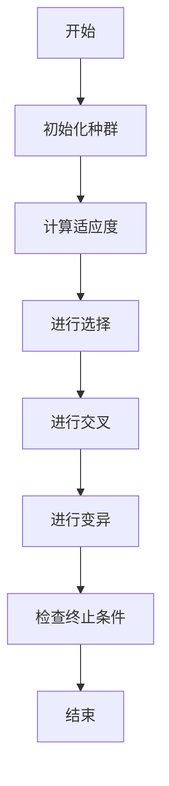
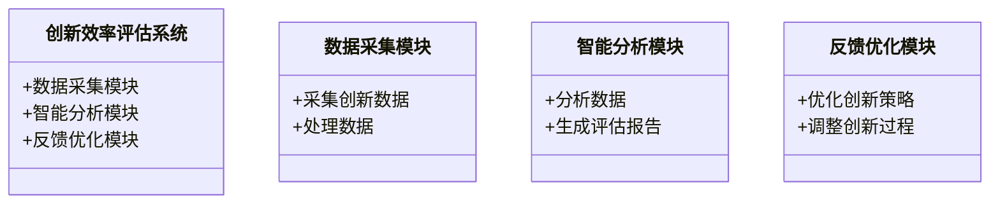
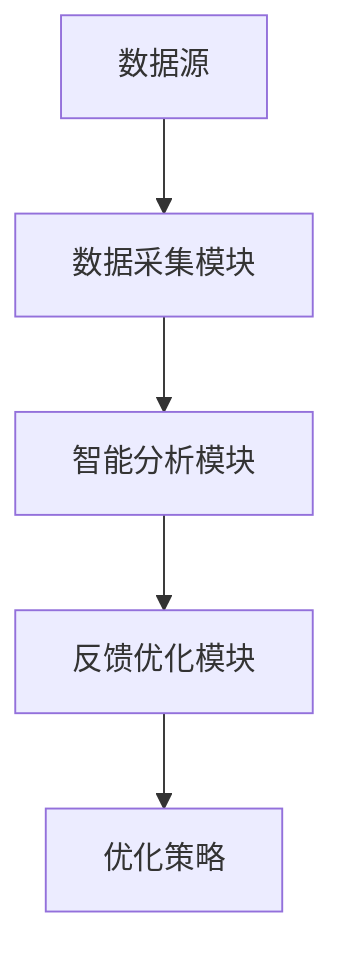

                 


# 利用智能体系统进行全面的公司创新效率评估

> 关键词：智能体系统, 创新效率评估, 多目标优化算法, 知识图谱构建, 系统架构设计, 项目实战

> 摘要：  
> 在当前快速变化的商业环境中，创新效率已成为企业竞争的关键因素。本文提出利用智能体系统进行公司创新效率评估的方法，通过多目标优化算法和知识图谱构建，实现对创新过程的智能化分析与优化。文章详细探讨了智能体系统的设计与实现、创新效率评估的理论基础、算法实现及实际案例，为企业提供了一套全面的创新效率评估解决方案。

---

# 第一部分: 创新效率评估的背景与意义

## 第1章: 创新效率评估的背景与意义

### 1.1 创新效率评估的核心概念

#### 1.1.1 创新效率的定义与内涵
创新效率是指企业在创新过程中，将资源投入转化为创新成果的能力。它不仅关注创新的速度，还关注创新的质量和可持续性。创新效率评估的核心在于量化企业在创新过程中的表现，发现瓶颈并优化流程。

#### 1.1.2 智能体系统在创新评估中的作用
智能体系统是一种具有感知、推理和决策能力的智能系统，能够实时分析企业的创新数据，提供个性化的优化建议。与传统评估方法相比，智能体系统具有更强的实时性和适应性。

#### 1.1.3 企业创新效率评估的必要性
在竞争激烈的市场环境中，企业需要快速响应市场变化，提升创新能力。创新效率评估能够帮助企业识别创新瓶颈，优化资源配置，从而在竞争中占据优势。

---

## 第2章: 创新效率评估的理论基础

### 2.1 创新效率评估的理论框架

#### 2.1.1 创新过程模型
创新过程模型描述了从创意产生到最终产品实现的完整流程。常见的模型包括线性模型、螺旋模型和敏捷模型。创新效率评估需要综合考虑模型的各个阶段。

#### 2.1.2 创新效率的影响因素
创新效率受多种因素影响，包括企业资源、团队能力、技术创新能力等。通过分析这些因素，可以制定针对性的优化策略。

#### 2.1.3 创新效率评估的指标体系
创新效率评估需要建立科学的指标体系，包括创新周期、创新成果数量、创新成本等指标。这些指标能够全面反映企业的创新效率。

---

## 第3章: 智能体系统的设计与实现

### 3.1 智能体系统的体系结构

#### 3.1.1 分层架构设计
智能体系统通常采用分层架构，包括感知层、决策层和执行层。感知层负责数据采集，决策层负责分析和决策，执行层负责优化和调整。

#### 3.1.2 组件化设计
智能体系统可以通过组件化设计，将功能模块化。每个模块负责特定的任务，如数据采集、分析和优化。

#### 3.1.3 模块化实现
模块化实现能够提高系统的可扩展性和可维护性。每个模块独立运行，通过接口进行通信。

---

### 3.2 智能体系统的功能模块

#### 3.2.1 数据采集与处理模块
数据采集模块负责从企业内部和外部获取创新相关的数据，如项目进度、研发投入、市场反馈等。数据处理模块对数据进行清洗和转换，确保数据的准确性和一致性。

#### 3.2.2 智能分析与评估模块
智能分析模块基于多目标优化算法，对创新过程进行分析和评估。评估模块生成评估报告，提出优化建议。

#### 3.2.3 反馈与优化模块
反馈模块将评估结果反馈给企业，优化模块根据反馈结果调整创新策略，优化创新过程。

---

### 3.3 智能体系统的实现技术

#### 3.3.1 人工智能算法的选择与应用
人工智能算法是智能体系统的核心。选择合适的算法，如遗传算法、粒子群优化算法和NSGA-II算法，能够提高系统的分析效率和准确性。

#### 3.3.2 大数据分析与处理技术
大数据分析技术能够处理海量数据，提取有用信息。通过数据挖掘和机器学习技术，可以发现数据中的规律和趋势。

#### 3.3.3 系统集成与部署
系统集成需要将各个模块整合成一个整体，确保模块之间的协同工作。系统部署需要考虑硬件和软件环境，确保系统的稳定运行。

---

# 第二部分: 创新效率评估的算法与模型

## 第4章: 创新效率评估的多目标优化算法

### 4.1 多目标优化算法概述

#### 4.1.1 多目标优化的基本概念
多目标优化是指在多个目标之间寻找最优解的过程。在创新效率评估中，可能需要同时优化创新速度、创新成本和创新质量等多个目标。

#### 4.1.2 常见的多目标优化算法
常见的多目标优化算法包括遗传算法、粒子群优化算法和NSGA-II算法。这些算法各有优缺点，适用于不同的场景。

#### 4.1.3 NSGA-II算法的原理与实现
NSGA-II是一种基于群体的多目标优化算法，通过遗传操作和适应度排序，找到帕累托最优解。

### 4.2 NSGA-II算法的实现

#### 4.2.1 算法流程图（使用 Mermaid）


#### 4.2.2 Python 实现代码
```python
import numpy as np

def objective_function(x):
    # 定义目标函数
    return x[0] + x[1]

def constraint_func(x):
    # 定义约束条件
    return x[0] * x[1] >= 4

def nsnga_ii():
    # 初始化种群
    population = np.random.rand(10, 2)
    # 进行适应度计算
    for i in range(10):
        fitness = objective_function(population[i])
        # 进行约束检查
        if constraint_func(population[i]):
            print("满足约束条件")
        else:
            print("不满足约束条件")
    # 进行选择、交叉和变异操作
    # 具体实现略...

if __name__ == "__main__":
    nsnga_ii()
```

---

## 第5章: 知识图谱构建与创新效率评估

### 5.1 知识图谱构建的原理

#### 5.1.1 知识图谱的定义与作用
知识图谱是一种用于表示知识的数据结构，能够将分散的知识点连接起来，形成一个网络。在创新效率评估中，知识图谱可以用于发现知识关联和知识缺口。

#### 5.1.2 知识图谱构建的算法
常见的知识图谱构建算法包括基于规则的抽取算法和基于机器学习的抽取算法。这些算法能够从文本中提取实体和关系。

#### 5.1.3 知识图谱在创新效率评估中的应用
知识图谱可以用于分析企业的知识储备，发现创新机会，优化创新过程。

---

## 第6章: 智能体系统的架构设计

### 6.1 系统架构设计

#### 6.1.1 领域模型设计（使用 Mermaid 类图）


#### 6.1.2 系统架构图（使用 Mermaid）


---

## 第7章: 项目实战与案例分析

### 7.1 项目实战

#### 7.1.1 环境安装与配置
安装必要的软件和库，如Python、NumPy、Scipy等。

#### 7.1.2 系统核心实现源代码
```python
import numpy as np

def objective_function(x):
    return (x[0] - 3)**2 + (x[1] - 4)**2

def constraint_func(x):
    return x[0] * x[1] >= 12

def optimize():
    # 初始化种群
    population = np.random.rand(20, 2)
    for _ in range(50):
        # 计算适应度
        fitness = np.array([objective_function(x) for x in population])
        # 进行选择
        selected = fitness.argsort()[:10]
        # 进行交叉
        crossed = np.zeros((20, 2))
        for i in range(10):
            for j in range(10, 20):
                crossed[j] = np.where(np.random.rand(2) < 0.5, population[selected[i]], population[selected[i]])
        # 进行变异
        mutated = crossed + np.random.rand(20, 2) * 0.1
        # 更新种群
        population = mutated
    # 评估结果
    best = population[np.argmin([objective_function(x) for x in population])]
    print("最优解为:", best)
    print("最优解适应度为:", objective_function(best))

optimize()
```

#### 7.1.3 代码实现与解读
上述代码实现了一个简单的优化算法，用于寻找目标函数的最小值。通过不断迭代和优化，系统能够找到最优解。

---

## 第8章: 总结与展望

### 8.1 总结
本文详细介绍了利用智能体系统进行全面的公司创新效率评估的方法。通过多目标优化算法和知识图谱构建，能够帮助企业优化创新过程，提升创新效率。

### 8.2 未来展望
未来，随着人工智能和大数据技术的不断发展，智能体系统在创新效率评估中的应用将更加广泛。通过不断优化算法和系统架构，智能体系统将能够更好地支持企业的创新活动。

---

# 作者：AI天才研究院/AI Genius Institute & 禅与计算机程序设计艺术 /Zen And The Art of Computer Programming

---

本文结合了人工智能、大数据分析和系统架构设计等技术，深入探讨了利用智能体系统进行公司创新效率评估的方法。通过理论分析和实际案例，展示了智能体系统在创新效率评估中的巨大潜力。希望本文能够为企业提供有价值的参考，助力企业在竞争中占据优势。

