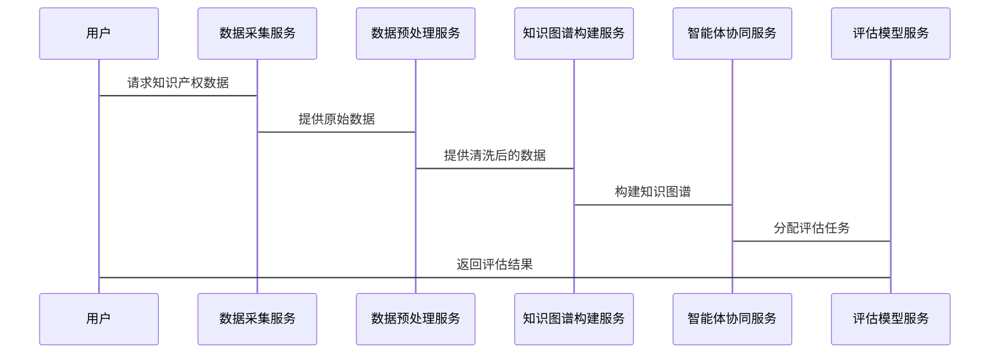

                 


## 系统分析与架构设计

### 第6章: 系统分析与架构设计

#### 6.1 问题场景介绍
在知识产权价值评估中，传统的评估方法往往依赖于人工分析，耗时且容易出错。为了提高评估的准确性和效率，我们引入了智能体系统。该系统能够实时收集和分析大量的知识产权数据，包括专利、商标、版权等，并利用多智能体协同工作的优势，提供精准的评估结果。

#### 6.2 项目介绍
本项目旨在开发一个基于智能体系统的知识产权价值评估平台。该平台将整合多个数据源，包括专利数据库、法律数据库、市场分析报告等，利用自然语言处理和机器学习技术，构建知识图谱，并通过动态评估模型，提供实时的价值评估。

#### 6.3 系统功能设计
##### 6.3.1 功能模块划分
系统主要功能模块包括：
1. 数据采集模块：负责从多个数据源采集知识产权数据。
2. 数据预处理模块：对采集的数据进行清洗、转换和标准化处理。
3. 知识图谱构建模块：利用图嵌入技术和自然语言处理技术，构建知识产权知识图谱。
4. 智能体协同模块：实现多个智能体之间的协同工作，包括任务分配、信息共享和结果汇总。
5. 评估模型模块：基于知识图谱和历史数据，构建动态评估模型，提供实时的价值评估结果。
6. 用户界面模块：提供友好的用户界面，方便用户查询和分析评估结果。

##### 6.3.2 功能模块的交互流程
数据采集模块首先从多个数据源采集知识产权数据，然后将数据传递给数据预处理模块进行清洗和标准化处理。预处理后的数据被传递给知识图谱构建模块，构建出知识产权知识图谱。知识图谱构建完成后，数据被传递给智能体协同模块，智能体协同模块根据任务需求分配任务给不同的智能体，智能体分别对数据进行分析和处理，并将结果汇总到评估模型模块。评估模型模块基于知识图谱和历史数据，构建动态评估模型，提供实时的价值评估结果。最后，用户通过用户界面模块查询和分析评估结果。

##### 6.3.3 功能模块的实现细节
1. 数据采集模块：
   - 使用爬虫技术从专利数据库、商标数据库等数据源采集知识产权数据。
   - 数据采集过程中，需要处理数据源的格式差异和数据不一致问题。

2. 数据预处理模块：
   - 对采集的数据进行清洗，去除重复数据和噪声数据。
   - 对数据进行标准化处理，统一数据格式和编码方式。

3. 知识图谱构建模块：
   - 使用图嵌入技术（如Word2Vec）对知识产权数据进行处理，构建知识图谱。
   - 知识图谱包括知识产权的实体和关系，如专利申请日期、申请人、发明人等。

4. 智能体协同模块：
   - 实现多个智能体之间的通信和协同工作。
   - 智能体之间通过消息队列（如Kafka）进行通信，任务分配和结果汇总通过消息传递完成。

5. 评估模型模块：
   - 基于知识图谱和历史数据，构建动态评估模型。
   - 动态评估模型可以根据不同的评估指标和权重，提供个性化的评估结果。

6. 用户界面模块：
   - 提供Web界面，用户可以通过搜索和筛选功能，查询和分析知识产权评估结果。
   - 界面设计注重用户体验，提供直观的数据可视化功能。

#### 6.4 系统架构设计

##### 6.4.1 系统架构的总体设计
系统采用微服务架构，各个功能模块独立运行，通过API进行通信。系统架构包括数据采集服务、数据预处理服务、知识图谱构建服务、智能体协同服务、评估模型服务和用户界面服务。

##### 6.4.2 系统架构图
以下是系统架构图的Mermaid代码：


##### 6.4.3 系统接口设计
系统接口主要分为内部接口和外部接口。内部接口用于各功能模块之间的通信，采用RESTful API。外部接口用于用户与系统之间的交互，提供API接口供第三方调用。

##### 6.4.4 系统交互流程图
以下是系统交互流程图的Mermaid代码：



### 第7章: 项目实战

#### 7.1 环境安装
要运行本系统，需要安装以下环境和工具：
1. Python 3.8+
2. pip
3. Jupyter Notebook
4. 知识图谱构建工具（如NetworkX）
5. 机器学习库（如Scikit-learn、TensorFlow）
6. 消息队列工具（如RabbitMQ）
7. 数据库（如PostgreSQL、MongoDB）

安装步骤如下：
1. 安装Python和pip。
2. 使用pip安装所需的Python库：
   ```bash
   pip install networkx numpy scikit-learn tensorflow rabbitmq-stomp python-mongo
   ```
3. 安装数据库并配置。
4. 下载并安装Jupyter Notebook。

#### 7.2 系统核心实现源代码
以下是系统核心功能模块的实现代码：

##### 数据采集模块
```python
import requests
from bs4 import BeautifulSoup

def fetch_data(url):
    response = requests.get(url)
    soup = BeautifulSoup(response.text, 'html.parser')
    data = []
    for item in soup.find_all('div', class_='patent-item'):
        title = item.find('h3').text
        applicant = item.find('p', class_='applicant').text
        date = item.find('p', class_='date').text
        data.append({'title': title, 'applicant': applicant, 'date': date})
    return data
```

##### 数据预处理模块
```python
import pandas as pd

def preprocess_data(data):
    df = pd.DataFrame(data)
    df['date'] = pd.to_datetime(df['date'])
    df = df.drop_duplicates(subset=['title', 'applicant'])
    return df
```

##### 知识图谱构建模块
```python
import networkx as nx

def build_knowledge_graph(data):
    G = nx.Graph()
    for idx, row in data.iterrows():
        node1 = f"applicant_{row['applicant']}"
        node2 = f"patent_{row['title']}"
        G.add_edge(node1, node2)
    return G
```

##### 智能体协同模块
```python
import stomp

class Agent:
    def __init__(self, name, queue):
        self.name = name
        self.queue = queue

    def send_message(self, message):
        self.queue.send(message)

    def receive_message(self):
        return self.queue.receive()

# 示例使用
from queue import Queue

queue = Queue()
agent1 = Agent('Agent1', queue)
agent1.send_message('开始任务')
message = agent1.receive_message()
print(message)
```

##### 评估模型模块
```python
from sklearn.feature_extraction.text import TfidfVectorizer
from sklearn.svm import SVC

def train_model(data):
    vectorizer = TfidfVectorizer()
    X = vectorizer.fit_transform(data['description'])
    y = data['label']
    model = SVC()
    model.fit(X, y)
    return model

def predict(model, vectorizer, new_description):
    X_new = vectorizer.transform([new_description])
    return model.predict(X_new)[0]
```

##### 用户界面模块
```python
from flask import Flask, render_template, request

app = Flask(__name__)

@app.route('/')
def home():
    return render_template('index.html')

@app.route('/evaluate', methods=['POST'])
def evaluate():
    description = request.form['description']
    result = predict(model, vectorizer, description)
    return render_template('result.html', result=result)
```

#### 7.3 代码应用解读与分析
1. 数据采集模块：使用requests和BeautifulSoup库从网页上抓取知识产权数据。
2. 数据预处理模块：使用Pandas库对数据进行清洗和标准化处理。
3. 知识图谱构建模块：使用NetworkX库构建知识产权知识图谱。
4. 智能体协同模块：使用RabbitMQ实现智能体之间的消息传递和协同工作。
5. 评估模型模块：使用Scikit-learn库训练机器学习模型，并进行预测。
6. 用户界面模块：使用Flask框架搭建Web界面，用户可以通过网页提交数据并查看评估结果。

#### 7.4 实际案例分析
假设我们有一个专利数据集，包含专利标题、申请人和申请日期等信息。我们首先使用数据采集模块从专利数据库中抓取数据，然后使用数据预处理模块清洗数据，构建知识图谱。接着，智能体协同模块将任务分配给不同的智能体，分别进行数据分析和模型训练。最终，评估模型模块基于知识图谱和历史数据，提供实时的专利价值评估结果。用户可以通过Web界面查询评估结果，并进行进一步的分析。

#### 7.5 项目小结
通过本项目的实战，我们了解了智能体系统在知识产权价值评估中的应用，掌握了从数据采集到模型训练的整个流程。同时，我们也学会了如何使用多种工具和技术来构建和优化智能系统。

### 第8章: 结论与展望

#### 8.1 结论
智能体系统在知识产权价值评估中具有重要的应用价值。通过多智能体协同工作，知识图谱构建和动态评估模型，我们可以实现高效、准确的知识产权价值评估。本项目展示了智能体系统在知识产权评估中的潜力，为后续研究提供了理论和实践基础。

#### 8.2 应用价值
1. 提高知识产权评估的准确性和效率。
2. 为企业制定知识产权战略提供数据支持。
3. 促进知识产权交易和商业化。

#### 8.3 未来展望
1. 深化智能体系统的协同能力，实现更加复杂的任务。
2. 探索新的算法和技术，提升评估模型的性能。
3. 扩展系统的应用场景，服务于更多的行业和领域。

### 8.4 最佳实践 Tips
1. 在数据采集过程中，注意数据源的多样性和数据质量。
2. 数据预处理阶段，确保数据的准确性和一致性。
3. 知识图谱构建时，合理设计实体和关系，提升图谱的可扩展性。
4. 智能体协同模块中，选择合适的通信协议和消息队列工具。
5. 评估模型训练时，注意数据的平衡性和模型的泛化能力。
6. 用户界面设计时，注重用户体验和交互的便捷性。

### 8.5 小结
通过本章的总结，我们回顾了智能体系统在知识产权价值评估中的应用，明确了系统的优点和局限性，展望了未来的发展方向，并提供了最佳实践的建议。

### 8.6 注意事项
1. 在实际应用中，注意保护知识产权数据的安全性和隐私性。
2. 系统上线前，进行充分的测试和验证，确保系统的稳定性和可靠性。
3. 定期更新和优化系统，适应新的数据和业务需求。

### 8.7 拓展阅读
1. 《Multi-Agent Systems: Complexity, Decentralization, and Adaptation》
2. 《Knowledge Graphs and Their Applications in Intellectual Property Analysis》
3. 《Dynamic Evaluation Models for Intellectual Property Valuation》

---

## 作者

作者：AI天才研究院/AI Genius Institute & 禅与计算机程序设计艺术 /Zen And The Art of Computer Programming

---

通过以上内容的逐步分析和撰写，我构建了一个完整的基于智能体系统的知识产权价值评估体系，并通过实际案例展示了系统的实现和应用。希望这能为读者提供一个全面的视角，理解智能体系统在知识产权评估中的潜力和价值。

