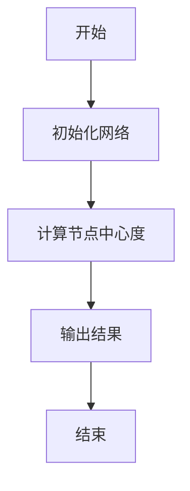
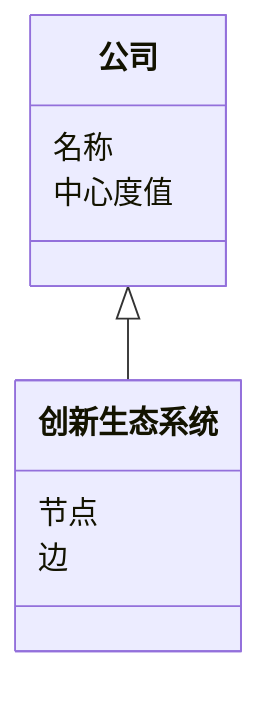
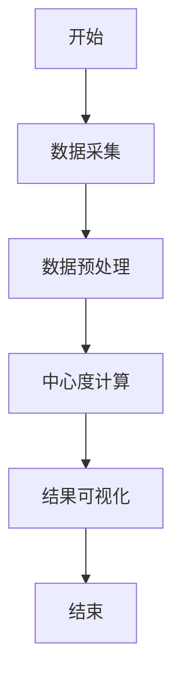

                 


# 利用智能体网络分析公司在创新生态系统中的中心度

## 关键词：智能体网络、创新生态系统、中心度、网络分析、企业创新

## 摘要：  
在当今快速变化的商业环境中，创新生态系统已成为企业生存和发展的关键。利用智能体网络分析，我们可以量化公司在创新生态系统中的中心度，从而更好地理解其在生态系统中的地位和影响力。本文将从理论、算法、系统设计和实战案例四个方面详细探讨如何通过智能体网络分析来评估和提升公司的中心度。

---

## 目录

### 第一部分：智能体网络与创新生态系统概述

#### 第1章：创新生态系统的基本概念  
- 1.1 创新生态系统的定义与特征  
- 1.2 智能体网络的基本原理  
- 1.3 公司在创新生态系统中的中心度  

#### 第2章：智能体网络与创新生态系统的联系  
- 2.1 智能体网络的属性与特征  
- 2.2 创新生态系统的网络结构  
- 2.3 智能体网络与创新生态系统的核心关联  

### 第二部分：智能体网络分析的算法原理  

#### 第3章：网络中心度计算算法  
- 3.1 度数中心性公式  
- 3.2 接近中心性公式  
- 3.3 中间中心性公式  
- 3.4 算法流程图  

#### 第4章：智能体网络分析的数学模型  
- 4.1 中心度计算的数学模型  
- 4.2 网络社区发现算法  
- 4.3 网络影响力传播算法  

### 第三部分：创新生态系统中心度的系统分析与架构设计  

#### 第5章：系统分析与架构设计  
- 5.1 系统功能需求  
- 5.2 领域模型设计  
- 5.3 系统架构图  
- 5.4 系统接口设计  

#### 第6章：系统交互与项目实战  
- 6.1 项目环境安装  
- 6.2 系统核心实现源代码  
- 6.3 实际案例分析与结果解读  
- 6.4 项目总结与经验分享  

### 第四部分：总结与展望  

#### 第7章：总结与注意事项  
- 7.1 本章小结  
- 7.2 注意事项与最佳实践  
- 7.3 拓展阅读与未来研究方向  

---

## 正文内容  

### 第一部分：智能体网络与创新生态系统概述  

#### 第1章：创新生态系统的基本概念  

##### 1.1 创新生态系统的定义与特征  
创新生态系统是指由企业、研究机构、政府、非营利组织等多方参与者共同构成的网络系统，其核心在于通过协作和知识共享实现创新价值的最大化。创新生态系统具有动态性、复杂性和协同性三大特征。  

##### 1.2 智能体网络的基本原理  
智能体网络是由多个智能体（Agent）组成的复杂网络，每个智能体具备自主性、反应性和协作性。智能体网络通过信息交互和协同行为，形成一个动态的、自适应的网络结构。  

##### 1.3 公司在创新生态系统中的中心度  
公司在创新生态系统中的中心度反映了其在网络中的影响力和资源整合能力。中心度越高，公司越能够在生态系统中占据核心地位，从而获得更多的创新资源和支持。  

---

#### 第2章：智能体网络与创新生态系统的联系  

##### 2.1 智能体网络的属性与特征  
智能体网络具有以下属性：  
1. **自主性**：智能体能够自主决策和行动。  
2. **协作性**：智能体之间可以通过协作实现共同目标。  
3. **动态性**：智能体网络的结构和功能随环境变化而调整。  

##### 2.2 创新生态系统的网络结构  
创新生态系统的网络结构可以分为以下几种类型：  
1. **星型网络**：一家核心企业处于中心位置，其他企业围绕其分布。  
2. **网状网络**：多个企业相互连接，形成复杂的网络结构。  
3. **链式网络**：企业之间通过价值链形成线性关系。  

##### 2.3 智能体网络与创新生态系统的核心关联  
智能体网络与创新生态系统的核心关联体现在以下方面：  
1. **知识共享**：智能体网络促进知识在生态系统中的流动和共享。  
2. **资源整合**：通过智能体网络，企业可以更高效地整合资源。  
3. **协同创新**：智能体网络支持多方协作，推动创新活动的开展。  

---

### 第二部分：智能体网络分析的算法原理  

#### 第3章：网络中心度计算算法  

##### 3.1 度数中心性公式  
度数中心性衡量了节点在网络中的连接数量，公式如下：  
$$ C_d(v) = \frac{d(v)}{n-1} $$  
其中，$d(v)$ 表示节点 $v$ 的度数，$n$ 表示网络的节点总数。  

##### 3.2 接近中心性公式  
接近中心性衡量了节点在网络中的接近程度，公式如下：  
$$ C_a(v) = \frac{1}{\sum_{u} s(v,u)} $$  
其中，$s(v,u)$ 表示节点 $v$ 到节点 $u$ 的最短路径长度。  

##### 3.3 中间中心性公式  
中间中心性衡量了节点在网络中的桥梁作用，公式如下：  
$$ C_b(v) = \sum_{u \neq v} \frac{1}{d(u)} \cdot \sum_{w \neq v} \frac{1}{d(w)} $$  
其中，$d(u)$ 和 $d(w)$ 分别表示节点 $u$ 和 $w$ 的度数。  

##### 3.4 算法流程图  


---

#### 第4章：智能体网络分析的数学模型  

##### 4.1 中心度计算的数学模型  
中心度计算的数学模型可以通过以下公式表示：  
$$ C(v) = \alpha C_d(v) + \beta C_a(v) + \gamma C_b(v) $$  
其中，$\alpha$、$\beta$ 和 $\gamma$ 分别表示度数中心性、接近中心性和中间中心性的权重系数。  

##### 4.2 网络社区发现算法  
网络社区发现算法可以通过以下步骤实现：  
1. 初始化网络结构。  
2. 计算节点之间的相似性得分。  
3. 使用聚类算法划分社区。  

##### 4.3 网络影响力传播算法  
网络影响力传播算法可以通过以下公式表示：  
$$ I(v) = \sum_{u \in N(v)} \frac{I(u)}{d(u)} $$  
其中，$I(v)$ 表示节点 $v$ 的影响力，$N(v)$ 表示节点 $v$ 的邻居节点集合，$d(u)$ 表示节点 $u$ 的度数。  

---

### 第三部分：创新生态系统中心度的系统分析与架构设计  

#### 第5章：系统分析与架构设计  

##### 5.1 系统功能需求  
系统功能需求包括：  
1. 数据采集与处理。  
2. 中心度计算与分析。  
3. 可视化展示与报告生成。  

##### 5.2 领域模型设计  
领域模型设计可以通过以下类图表示：  


##### 5.3 系统架构图  
系统架构图可以通过以下流程图表示：  


---

#### 第6章：系统交互与项目实战  

##### 6.1 项目环境安装  
项目环境安装需要以下工具：  
1. Python 3.8 或更高版本。  
2. 网络分析库（如 NetworkX）。  
3. 数据可视化库（如 Matplotlib）。  

##### 6.2 系统核心实现源代码  
以下是中心度计算的核心代码：  
```python
import networkx as nx

def calculate_degree_centrality(G):
    return nx.degree_centrality(G)

def calculate_closeness_centrality(G):
    return nx.closeness_centrality(G)

def calculate_betweenness_centrality(G):
    return nx.betweenness_centrality(G)
```

##### 6.3 实际案例分析与结果解读  
以某科技公司为例，分析其在创新生态系统中的中心度，展示如何通过数据可视化工具展示结果，并解读结果的意义。  

##### 6.4 项目总结与经验分享  
总结项目实施的经验，提出改进建议，并分享最佳实践。  

---

### 第四部分：总结与展望  

#### 第7章：总结与注意事项  

##### 7.1 本章小结  
本文详细探讨了如何利用智能体网络分析公司在创新生态系统中的中心度，从理论、算法、系统设计和项目实战四个方面进行了深入分析。  

##### 7.2 注意事项与最佳实践  
1. 在实际应用中，需注意数据的准确性和完整性。  
2. 系统设计时，应注重可扩展性和可维护性。  
3. 在项目实施过程中，建议结合具体业务需求进行定制化开发。  

##### 7.3 拓展阅读与未来研究方向  
未来研究方向包括：  
1. 智能体网络与区块链技术的结合。  
2. 大数据环境下智能体网络的实时分析与优化。  
3. 创新生态系统中的动态中心度计算与预测。  

---

## 作者：AI天才研究院/AI Genius Institute & 禅与计算机程序设计艺术/Zen And The Art of Computer Programming

