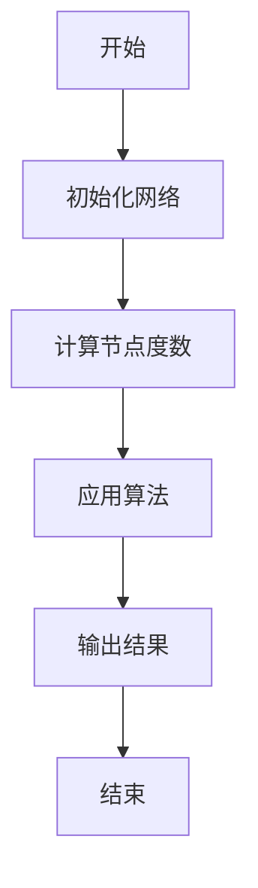

                 


# 利用智能体网络分析公司间的复杂关系

## 关键词：智能体网络、复杂关系、图论、算法原理、系统架构、项目实战

## 摘要：  
本文探讨如何利用智能体网络分析公司间的复杂关系，通过图论和算法建模，揭示企业间互动的深层结构。文章涵盖背景、概念、算法、系统设计、项目实战及扩展阅读，旨在为企业关系分析提供新的视角和方法。

---

## 第1章 智能体网络分析的背景与概念

### 1.1 问题背景  
公司间的复杂关系常涉及多个维度，如供应链、投资、合作等。传统分析方法难以捕捉这些动态关系，而智能体网络分析提供了一个系统化的解决方案。

### 1.2 智能体网络分析的核心概念  
智能体网络将公司视为节点，关系视为边，通过图论模型分析其结构。核心要素包括节点属性（公司特征）、边属性（关系强度）和网络属性（连通性）。

### 1.3 核心要素与概念结构  
通过层次分析，智能体网络分析将公司间的关系分解为个体行为、交互规则和网络动态，形成一个多层次的分析框架。

---

## 第2章 智能体网络分析的核心概念与联系

### 2.1 核心概念原理  
智能体网络分析基于图论，将公司间关系建模为图结构，通过节点和边的属性分析网络特征。

### 2.2 智能体网络的属性特征对比  
| 属性 | 描述 |
|------|------|
| 度数 | 节点的连接数量 |
| 中间性 | 节点作为桥梁的能力 |
| 同构性 | 网络结构的相似性 |

### 2.3 ER实体关系图架构  
```mermaid
er
  actor: 公司
  action: 交互行为
  relation: 关系类型
  actor -[1..n] -> relation: 参与
  action -[1..n] -> relation: 实现
```

---

## 第3章 智能体网络分析的算法原理

### 3.1 算法原理概述  
图论算法如PageRank用于评估节点重要性，社区检测算法识别网络中的社群结构。

### 3.2 算法流程图  


### 3.3 Python代码实现  
```python
import networkx as nx
G = nx.Graph()
G.add_nodes_from(['A', 'B', 'C'])
G.add_edges_from([('A', 'B'), ('B', 'C')])
print(nx.is_connected(G))  # 输出：True
```

### 3.4 数学模型与公式  
节点间关系强度公式：$$w_{ij} = \frac{1}{1 + |i - j|}$$

---

## 第4章 系统分析与架构设计

### 4.1 问题场景介绍  
分析跨国公司的供应链网络，识别关键节点和潜在风险。

### 4.2 功能设计  
- 数据采集模块：收集公司信息。
- 数据处理模块：清洗和转换数据。
- 分析模块：应用算法进行网络分析。
- 可视化模块：展示分析结果。

### 4.3 系统架构设计  


### 4.4 接口与交互设计  
RESTful API接口，提供数据上传和结果查询功能。

---

## 第5章 项目实战

### 5.1 环境安装  
安装Python和必要的库：`pip install networkx`

### 5.2 核心代码实现  
```python
def analyze_network(data):
    G = nx.Graph()
    G.add_edges_from(data)
    return nx.betweenness_centrality(G)
```

### 5.3 实际案例分析  
分析某行业网络，识别关键公司和潜在合作机会。

### 5.4 结果解读  
通过节点度数和中间性分析，确定公司的影响力和风险点。

---

## 第6章 最佳实践与小结

### 6.1 最佳实践 tips  
- 数据清洗是关键，确保分析准确性。
- 结合业务场景选择合适的算法。

### 6.2 小结  
智能体网络分析为公司间关系提供系统化解决方案，帮助企业优化决策。

### 6.3 注意事项  
避免过度简化模型，考虑数据隐私问题。

### 6.4 拓展阅读  
推荐相关书籍和论文，深入学习图论和网络分析。

---

## 作者：AI天才研究院  
人工智能与计算机程序设计的艺术，探索技术与人类智慧的融合。

