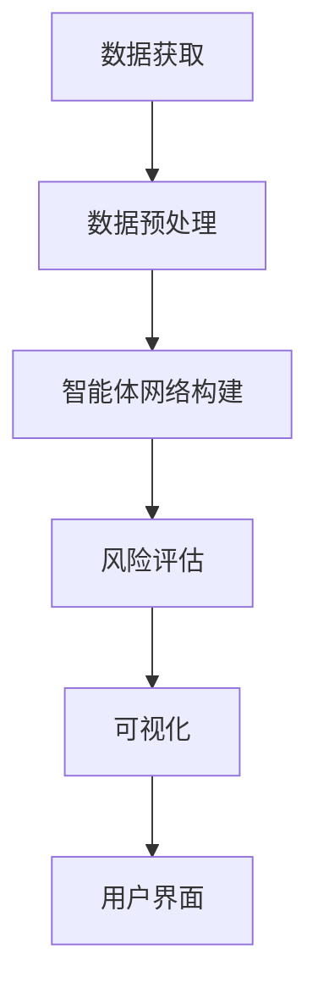

                 


# 利用智能体网络分析公司间的隐藏关联风险

> 关键词：智能体网络，隐藏关联风险，社会网络分析，关联规则挖掘，风险管理

> 摘要：本文介绍了一种利用智能体网络分析公司间隐藏关联风险的方法。通过构建智能体网络模型，结合社会网络分析和关联规则挖掘算法，识别和评估企业间的潜在风险。文章详细讲解了算法原理、系统架构设计和实际案例分析，为读者提供了一种创新的风险管理工具。

---

## 第一部分：背景介绍

### 第1章：智能体网络与隐藏关联风险概述

#### 1.1 智能体网络的基本概念

智能体网络是一种通过智能体（Agent）建模的网络结构，用于描述多个智能体之间的交互和关系。与传统的网络分析相比，智能体网络不仅关注节点之间的连接，还强调节点的行为、意图和目标。

- **隐藏关联风险**：企业间的隐藏关联风险指的是通过间接的、非直接的关联（如供应链、投资、合作等）带来的潜在风险，这些风险往往不易被察觉，但可能对企业声誉、财务状况或法律合规性产生重大影响。

#### 1.2 问题背景与描述

随着全球化的发展，企业之间的关联日益复杂。隐藏关联风险可能通过供应链、投资关系或法律诉讼等多种途径影响企业的稳定性。传统的风险管理方法往往难以捕捉这些隐藏的关联。

- **问题解决思路**：通过智能体网络分析，识别企业间的隐性关联，评估潜在风险，并制定应对策略。

#### 1.3 智能体网络与传统网络分析的对比

以下是智能体网络与传统网络分析的对比表格：

| **特征**          | **智能体网络**                     | **传统网络分析**                   |
|-------------------|------------------------------------|------------------------------------|
| **节点类型**       | 智能体（公司、个人、系统等）       | 节点（通常为公司或个体）            |
| **边类型**         | 行为、意图、交互结果               | 简单的连接关系（如交易、合作）      |
| **分析目标**       | 智能体的行为模式、意图             | 节点的连接强度、中心性             |
| **数据需求**       | 高粒度、多维度数据                | 基于连接关系的数据                 |

#### 1.4 概念结构与核心要素

以下是公司、关联关系、风险指标等实体的ER实体关系图：

```mermaid
erd
actor Company {
  id: string
  name: string
  industry: string
}
actor RiskFactor {
  id: string
  name: string
  description: string
}
actor Relation {
  id: string
  type: string
  strength: integer
}
```

---

## 第二部分：智能体网络分析基础

### 第2章：智能体网络模型与构建方法

#### 2.1 智能体网络模型

智能体网络模型通过构建智能体之间的行为关系，帮助识别隐藏关联风险。模型构建步骤如下：

1. **数据收集**：收集企业的供应链、投资、合作方等信息。
2. **网络构建**：将企业视为节点，关联关系视为边。
3. **属性分析**：分析每个节点的属性（如行业、规模）和边的属性（如关联强度）。

#### 2.2 数据获取与预处理

数据获取渠道包括企业年报、公开数据库和行业报告。预处理步骤包括数据清洗、标准化和特征提取。

---

## 第三部分：算法原理与实现

### 第3章：隐藏关联风险的识别与评估

#### 3.1 社会网络分析

社会网络分析用于识别关键节点和高风险区域。介数中心性（Betweenness Centrality）是常用的指标：

$$ \text{介数中心性} = \sum_{i < j} \frac{\sigma(i,j)}{\sigma(i,j)} $$

其中，$\sigma(i,j)$ 是从 $i$ 到 $j$ 的最短路径数量，$\sigma(i,j)$ 是包含节点 $k$ 的最短路径数量。

#### 3.2 关联规则挖掘

关联规则挖掘用于发现隐藏关联。Apriori算法适用于频繁项集挖掘：

1. **生成候选项集**：基于支持度筛选频繁项集。
2. **关联规则生成**：从频繁项集中生成关联规则。

代码示例：

```python
from mlxtend.frequent_itemsets import apriori

# 假设data是事务数据
frequent_items = apriori(data, min_support=0.2, use_colnames=True)
print(frequent_items)
```

---

## 第四部分：系统架构与设计

### 第4章：系统架构设计

#### 4.1 整体架构

以下是系统整体架构图：



#### 4.2 功能设计

功能模块包括数据管理、关联分析、风险评估和可视化展示。

---

## 第五部分：项目实战

### 第5章：项目实战

#### 5.1 环境配置

安装必要的库：

```bash
pip install networkx matplotlib mlxtend
```

#### 5.2 数据处理与分析

以下是数据处理代码：

```python
import pandas as pd
data = pd.read_csv('company_relations.csv')
```

---

## 第六部分：总结与展望

### 第6章：总结与展望

#### 6.1 总结

通过智能体网络分析，企业可以有效识别隐藏关联风险，提升风险管理能力。

#### 6.2 展望

未来，智能体网络分析将结合多模态数据和动态网络分析，进一步提升风险识别能力。

---

## 作者

作者：AI天才研究院/AI Genius Institute & 禅与计算机程序设计艺术 /Zen And The Art of Computer Programming

