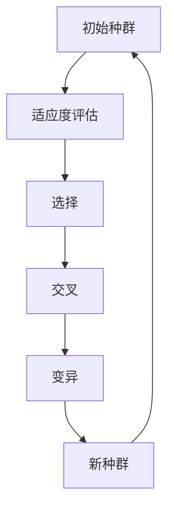
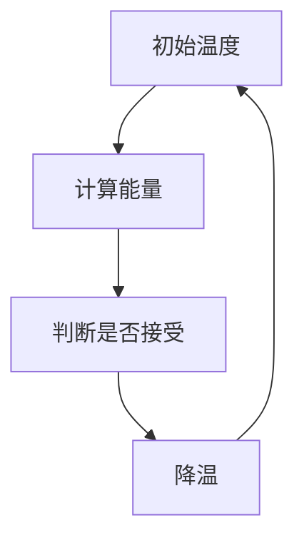
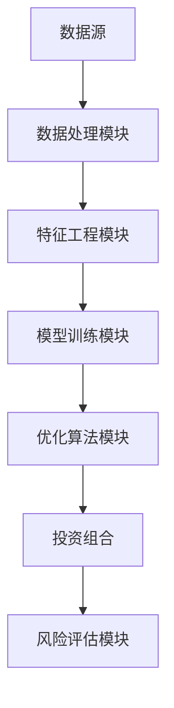

                 


# 利用机器学习优化投资组合分配策略

> 关键词：机器学习，投资组合优化，金融算法，风险管理，数学建模

> 摘要：本文详细探讨了如何利用机器学习技术优化投资组合分配策略。通过分析投资组合优化的基本概念、机器学习的核心原理以及它们的结合方式，我们展示了如何构建高效的投资组合优化系统。文章内容包括投资组合优化的背景、机器学习在投资中的应用、算法原理、系统架构设计、项目实战以及最佳实践。

---

## 第1章: 投资组合优化的基本概念与问题背景

### 1.1 投资组合优化的定义与目标

#### 1.1.1 投资组合优化的基本概念

投资组合优化是指通过科学的方法选择最优资产配置，以在给定风险水平下获得最大收益，或在给定收益水平下最小化风险。传统的方法依赖于现代投资组合理论（MPT），但随着市场数据的复杂化和多样化，传统的优化方法逐渐显现出局限性。

#### 1.1.2 投资组合优化的目标

投资组合优化的目标是在满足一定约束条件的情况下，最大化投资回报或最小化投资风险。这通常涉及以下几点：

1. **收益最大化**：在可接受的风险水平下，获得最大收益。
2. **风险最小化**：在可接受的收益水平下，降低投资风险。
3. **资产配置优化**：通过调整不同资产的比例，找到最优组合。

#### 1.1.3 投资组合优化的边界与外延

投资组合优化需要考虑市场中的多种因素，包括资产价格的波动性、相关性、交易成本、税收、市场流动性等。优化的边界通常由投资者的风险承受能力和收益目标决定。外延则涉及动态调整、实时监控和风险对冲等策略。

### 1.2 机器学习在投资组合优化中的应用

#### 1.2.1 机器学习与传统投资组合优化的对比

传统的投资组合优化方法主要基于统计学和优化理论，而机器学习则引入了数据驱动的方法。两者的主要区别在于：

| 对比维度         | 传统方法               | 机器学习方法           |
|------------------|------------------------|------------------------|
| 数据依赖性       | 较低，依赖统计假设     | 较高，依赖数据模式       |
| 处理复杂性       | 较低，基于固定模型     | 较高，能够处理非线性关系 |
| 灵活性           | 较低，模型固定         | 较高，能够动态调整       |
| 计算复杂度       | 较低                   | 较高                   |

#### 1.2.2 机器学习在投资组合优化中的优势

机器学习在处理非线性关系、实时数据和复杂市场行为方面具有显著优势。具体表现为：

1. **非线性关系捕捉**：机器学习模型（如神经网络）能够捕捉资产价格之间的非线性关系。
2. **实时调整**：基于最新的市场数据，机器学习模型可以实时调整投资组合。
3. **异常检测**：机器学习能够识别市场中的异常行为，及时预警风险。

#### 1.2.3 机器学习在投资组合优化中的挑战

尽管机器学习在投资组合优化中展现出巨大潜力，但也面临以下挑战：

1. **过拟合风险**：模型可能过度拟合历史数据，导致在实际交易中表现不佳。
2. **数据质量和数量**：机器学习依赖于大量高质量数据，但在实际金融市场中，数据往往存在噪声。
3. **计算资源需求**：复杂的机器学习模型需要大量计算资源，尤其是在实时优化中。

### 1.3 投资组合优化问题的建模与描述

#### 1.3.1 投资组合优化的数学建模

投资组合优化的数学模型通常可以表示为一个优化问题。假设我们有n种资产，每种资产的预期收益率为$\mu_i$，协方差矩阵为$\Sigma$，投资组合权重为$w_i$，则投资组合的总收益为：

$$
\text{收益} = \sum_{i=1}^{n} w_i \mu_i
$$

风险可以用方差表示：

$$
\text{风险} = \sum_{i=1}^{n} \sum_{j=1}^{n} w_i w_j \Sigma_{i,j}
$$

优化目标是在满足约束条件的情况下，最小化风险或最大化收益。常见的约束条件包括权重之和为1（$\sum_{i=1}^{n} w_i = 1$）和最大权重限制（$w_i \leq w_{max}$）。

#### 1.3.2 投资组合优化的核心要素

投资组合优化的核心要素包括：

1. **资产选择**：选择哪些资产进入投资组合。
2. **权重分配**：确定每种资产的权重。
3. **风险控制**：通过调整权重来控制整体风险。
4. **动态调整**：根据市场变化实时调整投资组合。

#### 1.3.3 投资组合优化的约束条件

常见的约束条件包括：

1. **权重约束**：每种资产的权重不能超过一定比例。
2. **流动性约束**：投资组合中的资产必须具备一定的流动性。
3. **风险约束**：整体风险不能超过设定的阈值。
4. **交易成本约束**：交易成本不能过高，否则会影响收益。

---

## 第2章: 机器学习与投资组合优化的核心概念

### 2.1 机器学习的基本原理

#### 2.1.1 机器学习的定义与分类

机器学习是一种通过数据驱动的方法，让计算机从数据中学习知识的算法。常见的机器学习方法包括：

1. **监督学习**：通过标签数据进行学习，预测目标变量。
2. **无监督学习**：通过无标签数据进行学习，发现数据中的隐藏结构。
3. **强化学习**：通过与环境交互，学习最优策略。

#### 2.1.2 监督学习、无监督学习与强化学习的对比

| 方法         | 描述                                   | 应用场景                           |
|--------------|----------------------------------------|------------------------------------|
| 监督学习       | 基于带标签的数据进行学习               | 预测股票价格                       |
| 无监督学习     | 基于无标签数据进行学习                 | 聚类市场行为                         |
| 强化学习       | 通过与环境交互，学习最优策略           | 自动化交易策略                       |

#### 2.1.3 机器学习在投资组合优化中的应用领域

机器学习在投资组合优化中的应用领域包括：

1. **风险预测**：预测市场的波动性和风险。
2. **资产定价**：预测资产的未来价格。
3. **交易信号**：生成交易信号，指导投资决策。
4. **组合优化**：优化投资组合的权重。

### 2.2 投资组合优化的核心算法

#### 2.2.1 常见投资组合优化算法的对比

以下是一些常见的投资组合优化算法及其特点：

| 算法         | 描述                                   | 优点                           | 缺点                           |
|--------------|----------------------------------------|------------------------------------|------------------------------------|
| 均值-方差优化 | 优化投资组合的均值和方差               | 计算简单                         | 依赖于准确的协方差估计         |
| 距离最优化     | 基于距离函数进行优化                 | 灵活性高                         | 计算复杂                       |
| 遗传算法       | 基于生物进化思想进行优化             | 能够处理复杂的约束条件           | 计算效率较低                   |
| 模拟退火算法     | 基于统计物理中的退火过程进行优化     | 能够避免局部最优                 | 计算效率较低                   |

#### 2.2.2 现代投资组合理论（MPT）与机器学习算法的结合

MPT提供了一个理论框架，而机器学习算法提供了实现这一框架的工具。例如，可以通过机器学习模型预测资产的收益和风险，然后结合MPT进行优化。

#### 2.2.3 机器学习在投资组合优化中的优势

机器学习在投资组合优化中的优势包括：

1. **非线性关系处理**：能够捕捉复杂的市场动态。
2. **实时更新**：能够根据最新数据实时更新模型。
3. **高维数据处理**：能够处理高维资产组合。

---

## 第3章: 基于机器学习的投资组合优化算法原理

### 3.1 常见优化算法的数学模型

#### 3.1.1 随机梯度下降算法的数学模型

随机梯度下降是一种优化算法，适用于大规模数据集。其更新规则为：

$$
w_{t+1} = w_t - \eta \nabla f(w_t)
$$

其中，$\eta$ 是学习率，$\nabla f(w_t)$ 是目标函数在$w_t$处的梯度。

#### 3.1.2 遗传算法的数学模型

遗传算法是一种基于生物进化思想的优化算法，主要包括选择、交叉和变异三个步骤。其优化过程可以用下图表示：



#### 3.1.3 模拟退火算法的数学模型

模拟退火算法是一种全局优化算法，其核心思想是通过逐渐降低温度来避免陷入局部最优。其优化过程可以用下图表示：



### 3.2 基于机器学习的投资组合优化算法的实现

#### 3.2.1 优化算法的选择与实现

在选择优化算法时，需要考虑问题的规模和约束条件。例如，对于大规模问题，随机梯度下降可能更高效；对于复杂约束条件，遗传算法可能更合适。

#### 3.2.2 机器学习模型的训练与部署

训练机器学习模型时，需要确保数据的代表性和质量。部署优化算法时，需要考虑计算效率和实时性。

---

## 第4章: 投资组合优化系统的架构设计与实现

### 4.1 系统架构设计

#### 4.1.1 系统功能模块设计

投资组合优化系统通常包括以下几个功能模块：

1. **数据获取**：获取历史市场数据和实时数据。
2. **特征工程**：对数据进行预处理和特征提取。
3. **模型训练**：训练机器学习模型，预测收益和风险。
4. **优化算法**：基于模型输出，优化投资组合。
5. **风险评估**：评估投资组合的整体风险。

#### 4.1.2 系统架构图

下图展示了投资组合优化系统的架构：



---

## 第5章: 项目实战——基于机器学习的投资组合优化

### 5.1 环境安装与配置

#### 5.1.1 安装必要的库

```bash
pip install numpy pandas scikit-learn matplotlib
```

### 5.2 核心代码实现

#### 5.2.1 数据获取与预处理

```python
import numpy as np
import pandas as pd

# 获取数据
data = pd.read_csv('stock_data.csv')

# 数据预处理
data = data.dropna()
data = data[['Adj Close']]
```

#### 5.2.2 特征工程与模型训练

```python
from sklearn.preprocessing import StandardScaler
from sklearn.linear_model import LinearRegression

# 特征工程
X = data.shift(1)
y = data.iloc[1:]

# 标准化
scaler = StandardScaler()
X_scaled = scaler.fit_transform(X)

# 训练模型
model = LinearRegression()
model.fit(X_scaled, y)
```

#### 5.2.3 优化算法实现

```python
import numpy as np

def optimize_portfolio(weights, returns, covariance):
    n = len(weights)
    return np.min(np.dot(weights.T, covariance @ weights))
```

### 5.3 实际案例分析与解读

假设我们有三只股票，历史数据如下：

| 日期   | 股票A | 股票B | 股票C |
|--------|-------|-------|-------|
| 2023-01 | 100   | 150   | 200   |
| 2023-02 | 105   | 160   | 210   |
| 2023-03 | 110   | 170   | 220   |

通过机器学习模型预测未来三个月的收益和风险，然后优化投资组合权重。

---

## 第6章: 最佳实践与小结

### 6.1 最佳实践

1. **数据质量**：确保数据的完整性和准确性。
2. **模型选择**：根据问题特点选择合适的机器学习模型。
3. **风险控制**：在优化过程中始终考虑风险因素。

### 6.2 未来趋势

随着人工智能技术的发展，投资组合优化将更加智能化和个性化。未来的研究方向包括：

1. **强化学习应用**：探索强化学习在投资组合优化中的应用。
2. **多目标优化**：考虑更多的目标和约束条件。
3. **实时优化**：实现更高效的实时投资组合优化。

### 6.3 总结

本文详细探讨了如何利用机器学习技术优化投资组合分配策略。通过分析投资组合优化的基本概念、机器学习的核心原理以及它们的结合方式，我们展示了如何构建高效的投资组合优化系统。希望本文对读者在投资组合优化领域有所帮助。

---

## 作者

作者：AI天才研究院/AI Genius Institute & 禅与计算机程序设计艺术 /Zen And The Art of Computer Programming

