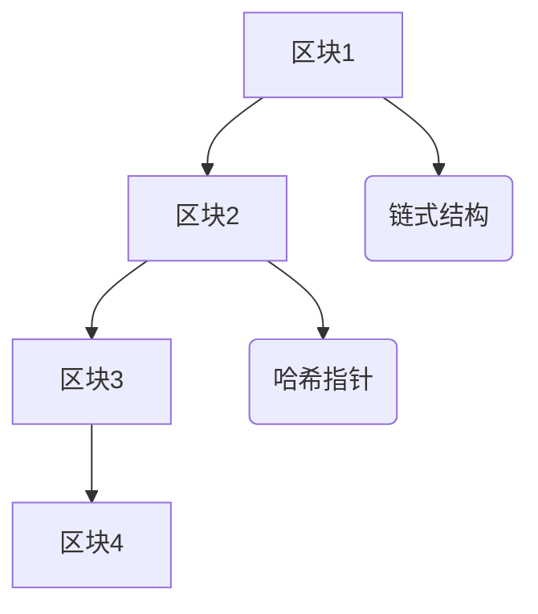
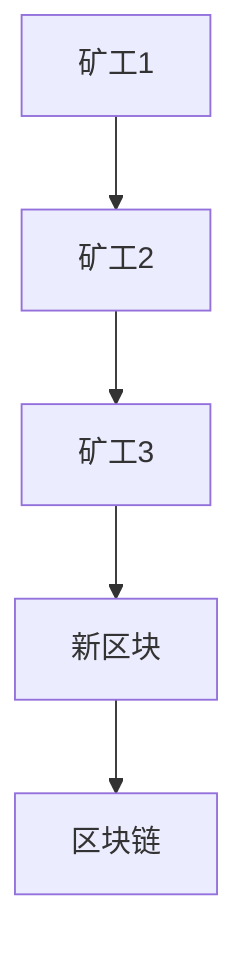
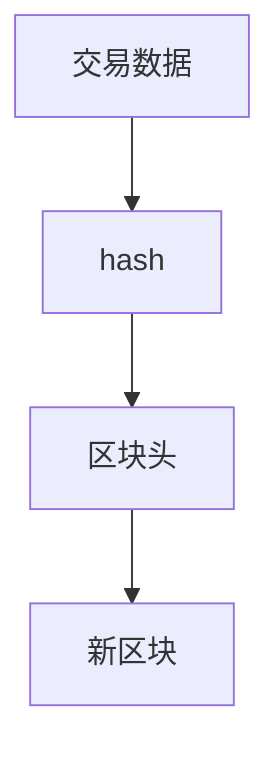
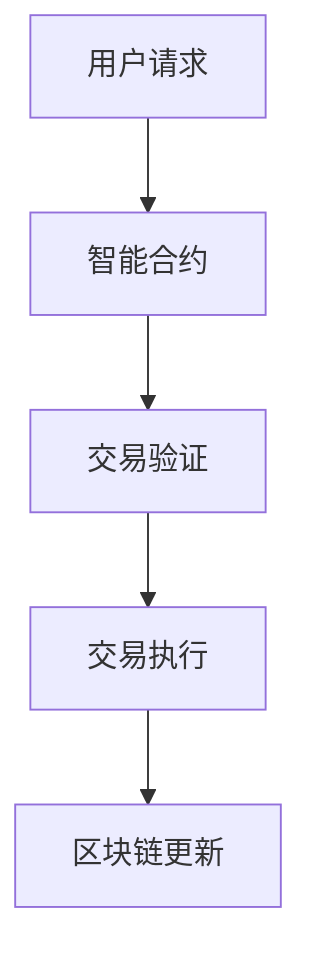

                 

# 区块链在资产Tokenization中的应用

> 关键词：区块链，资产Tokenization，智能合约，分布式账本，共识机制

> 摘要：区块链技术正在改变资产管理和交易的方式。通过资产Tokenization，我们将现实世界中的资产转化为数字形式，利用区块链的特性实现资产的高效、透明和安全的管理。本文详细探讨了资产Tokenization的核心概念、技术实现、系统设计以及实际应用，帮助读者全面理解区块链在这一领域的潜力和应用。

---

# 第一部分: 区块链与资产Tokenization基础

## 第1章: 区块链与资产Tokenization概述

### 1.1 区块链的基本概念

#### 1.1.1 区块链的定义与特点

区块链是一种分布式账本技术，通过去中心化的方式记录和验证交易。其主要特点包括：

- **去中心化**：数据不依赖于单一中心节点，而是分布在网络的各个节点上。
- **不可篡改**：通过加密算法确保数据的安全性和不可修改性。
- **透明性**：所有交易记录公开可查，确保透明性和可追溯性。

**图1.1 区块链的基本结构**

#### 1.1.2 区块链的核心技术

- **分布式账本**：区块链通过分布式的账本记录交易，确保数据的安全性和一致性。
- **共识机制**：通过共识算法（如PoW、PoS）达成网络的一致性。
- **智能合约**：自动执行的脚本，用于自动处理交易和合约履行。

#### 1.1.3 区块链的分类与应用场景

- **公有链**：完全去中心化的区块链，如比特币、以太坊。
- **联盟链**：适用于特定机构或组织的区块链，如供应链金融。
- **私有链**：仅限于特定用户的区块链，如企业内部使用。

### 1.2 资产Tokenization的定义与特点

#### 1.2.1 资产Tokenization的定义

资产Tokenization是将现实世界中的资产（如房地产、股权、艺术品）转化为数字形式的代币（Token）。这些Token可以在区块链上进行流转和交易。

#### 1.2.2 资产Tokenization的优势与挑战

- **优势**：
  - 提高资产流动性。
  - 降低交易成本。
  - 增强透明性和安全性。
- **挑战**：
  - 法律合规问题。
  - 技术实现复杂性。
  - 用户接受度问题。

#### 1.2.3 资产Tokenization的应用场景

- **金融资产**：如股票、债券的数字化。
- **房地产**：将房地产分割成数字Token进行交易。
- **艺术品**：通过区块链确保艺术品的唯一性和所有权。

---

## 第2章: 资产Tokenization的核心概念与技术

### 2.1 资产Tokenization的分类

#### 2.1.1 同质化Token

同质化Token（如ERC-20）代表可分割的资产，如加密货币。它们具有相同的属性和价值，便于交易和分割。

#### 2.1.2 非同质化Token

非同质化Token（NFT）代表独一无二的资产，如数字艺术品、房地产。它们不可分割，且具有唯一性。

#### 2.1.3 其他类型Token

- **半同质化Token**：部分可分割，部分不可分割。
- **功能性Token**：用于特定功能，如投票权、访问权限。

### 2.2 区块链在Tokenization中的作用

#### 2.2.1 区块链的去中心化特性

区块链的去中心化特性确保了资产Token的所有权记录在分布式账本上，避免了单点故障和篡改。

#### 2.2.2 区块链的安全性与透明性

通过加密算法和共识机制，区块链确保了资产Token的安全性和交易的透明性。

#### 2.2.3 区块链的智能合约功能

智能合约自动执行交易和条件，确保资产Token的发行和流转符合预定规则。

---

## 第3章: 区块链技术基础

### 3.1 区块链的基本原理

#### 3.1.1 分布式账本

分布式账本将数据分散在网络中的多个节点上，通过共识机制确保所有节点的数据一致性。

#### 3.1.2 共识机制

共识机制确保所有节点达成一致，常见的共识机制包括：

- **工作量证明（PoW）**：如比特币的挖矿机制。
- **权益证明（PoS）**：根据持有代币的数量分配记账权。
- **拜占庭容错（BFT）**：适用于高性能场景。

**图3.1 工作量证明（PoW）流程**

#### 3.1.3 智能合约

智能合约是区块链上的自动执行脚本，用于实现资产Token的发行和流转。

---

### 3.2 共识机制的实现

#### 3.2.1 工作量证明（PoW）

PoW通过计算哈希函数来验证矿工的工作量，确保网络安全。

**图3.2 工作量证明（PoW）哈希计算**

#### 3.2.2 权益证明（PoS）

PoS根据持有的代币数量分配记账权，减少能源消耗。

#### 3.2.3 拜占庭容错（BFT）

BFT适用于高性能场景，通过投票机制达成共识。

---

### 3.3 智能合约的原理

#### 3.3.1 智能合约的定义

智能合约是区块链上的自动执行脚本，用于处理资产Token的发行和流转。

#### 3.3.2 智能合约的执行流程

1. 用户发起交易请求。
2. 智能合约自动验证交易合法性。
3. 合约执行交易，更新区块链状态。

**图3.3 智能合约执行流程**

#### 3.3.3 智能合约的安全性

通过区块链的不可篡改性，智能合约确保了交易的安全性和可靠性。

---

# 第四章: 资产Tok

（由于篇幅限制，后续章节内容将按照相同逻辑继续扩展，涵盖实现原理、系统设计与架构、项目实战、最佳实践等部分。）

---

作者：AI天才研究院/AI Genius Institute & 禅与计算机程序设计艺术 /Zen And The Art of Computer Programming

