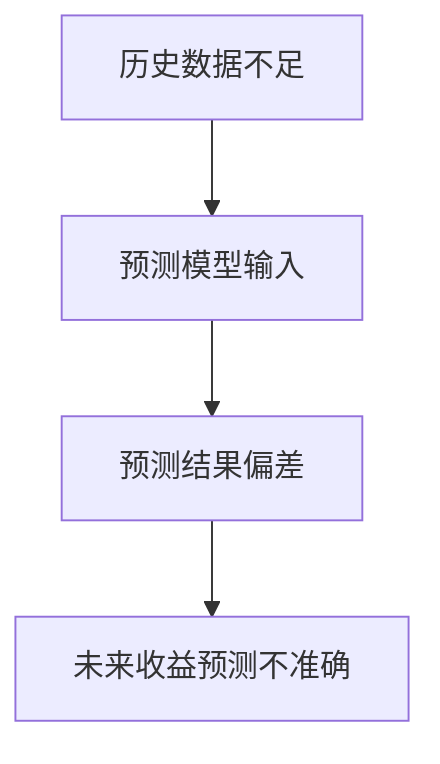
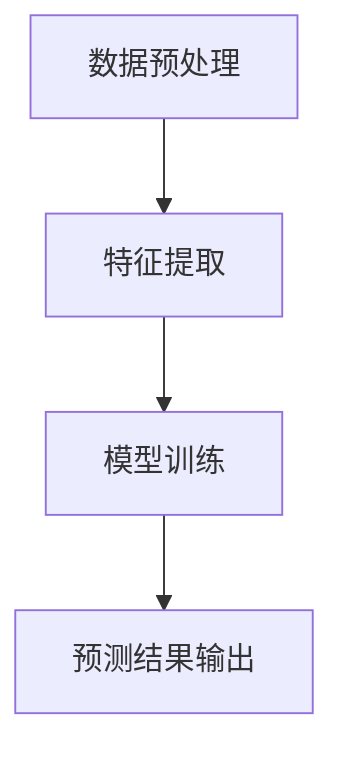
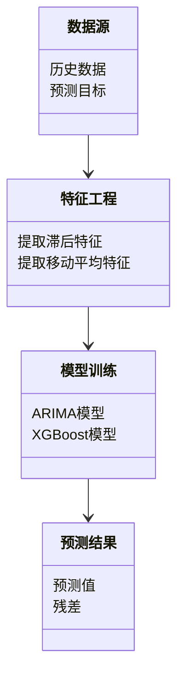
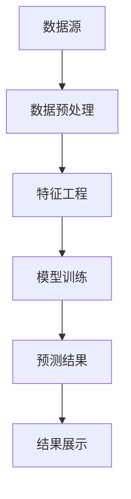
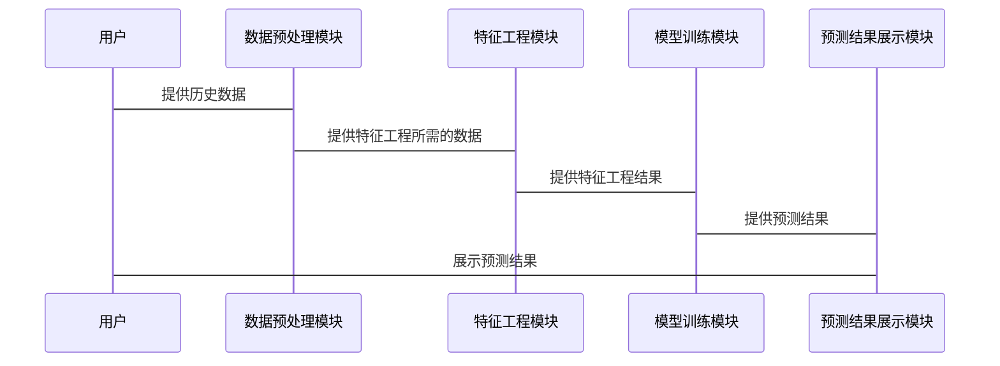

                 


# 历史数据不足对预测未来收益的影响

> **关键词**：数据不足、预测收益、时间序列、机器学习、算法优化  
> 
> **摘要**：本文深入探讨了历史数据不足对预测未来收益的影响，结合实际案例分析，阐述了如何在数据量有限的情况下优化预测模型。通过理论分析和实践总结，提出了多种解决方案和优化策略，为读者提供清晰的指导。

---

## 第一部分：背景介绍

### 第1章：问题背景与描述

#### 1.1 问题背景
- 数据驱动决策在现代商业和科技领域中占据核心地位。无论是金融投资、市场营销还是产品开发，历史数据都是预测未来趋势的重要依据。然而，现实中，数据获取往往受到限制，尤其是在新兴领域或小企业中，历史数据的不足直接影响了预测的准确性。
- 预测未来收益的核心目标是基于现有数据，利用数学模型和算法，推断出未来的收益趋势。然而，当历史数据不足时，模型的泛化能力和预测精度都会受到显著影响。

#### 1.2 问题描述
- **数据不足的表现形式**：包括数据样本量小、数据维度低、数据覆盖范围有限等。例如，在股票市场中，某些小公司的历史交易数据可能非常有限。
- **预测收益的不确定性**：数据不足会导致模型无法充分捕捉数据的分布特征，从而产生较大的预测偏差。
- **数据不足与预测准确性的关系**：数据量和数据质量直接影响模型的训练效果。数据不足可能导致模型过拟合或欠拟合，进一步影响预测的可靠性。

#### 1.3 问题解决思路
- **数据增强**：通过数据合成、插值或其他技术手段弥补数据不足的问题。
- **模型优化**：选择适合小数据集的算法，如集成学习、正则化方法等。
- **领域知识结合**：利用专家经验或领域知识，辅助模型预测。

#### 1.4 边界与外延
- 数据不足的边界条件：数据量的下限、数据质量的评估标准、数据分布的均匀性。
- 预测收益的适用范围：短期预测、长期趋势预测、特定场景预测。
- 相关领域的扩展讨论：数据安全、数据隐私、数据伦理等问题。

#### 1.5 核心概念与结构
- **核心概念**：历史数据、预测收益、数据不足、模型优化。
- **概念属性对比**：通过表格和图表展示核心概念的属性特征。
- **实体关系图（ER图）**：展示数据、模型、预测结果之间的关系。

---

## 第二部分：核心概念与联系

### 第2章：历史数据不足与预测收益的关系

#### 2.1 核心概念原理
- **数据量与模型性能的关系**：数据量越大，模型的泛化能力越强，但数据量不足时，模型的预测能力受限。
- **数据质量对预测准确性的影响**：数据噪声、缺失值等会影响模型的训练效果。
- **数据稀疏性与预测偏差的关联**：数据稀疏区域的预测偏差较大，需要通过数据增强或领域知识辅助。

#### 2.2 概念属性对比表
| 概念       | 属性       | 描述                                             |
|------------|------------|------------------------------------------------|
| 数据量     | 充足       | 能够覆盖所有相关特征                             |
| 数据量     | 不足       | 无法充分反映数据分布                             |
| 数据质量   | 高         | 数据准确且无偏差                                 |
| 数据质量   | 低         | 数据存在噪声或缺失                               |
| 数据稀疏性 | 高         | 数据在某些区域分布较少                          |
| 数据稀疏性 | 低         | 数据在大部分区域分布较为均匀                   |

#### 2.3 数据流与影响关系图


---

## 第三部分：算法原理与数学模型

### 第3章：基于时间序列的预测方法

#### 3.1 算法原理
- **时间序列预测的基本概念**：时间序列是一种按时间顺序排列的数据，预测目标是基于过去的数据推断未来趋势。
- **ARIMA模型的原理与实现**：
  - ARIMA（自回归积分滑动平均模型）是一种广泛应用于时间序列预测的模型。
  - ARIMA模型由三个参数组成：p（自回归阶数）、d（差分阶数）、q（移动平均阶数）。
  - 公式：$$ ARIMA(p, d, q) = y_t = \phi_1 y_{t-1} + \phi_p y_{t-p} + \theta_1 e_{t-1} + \cdots + \theta_q e_{t-q} + e_t $$
- **XGBoost在时间序列预测中的应用**：
  - XGBoost是一种强大的集成学习算法，能够处理非线性关系。
  - 在时间序列预测中，通过构建特征工程（如滞后特征、移动平均等）来提高模型性能。

#### 3.2 算法流程图


#### 3.3 数学模型与公式
- **ARIMA模型的数学推导**：
  - 差分变换：将非平稳序列转化为平稳序列。
  - 自回归部分：利用过去值的线性组合预测当前值。
  - 移动平均部分：利用残差的线性组合预测当前值。
- **XGBoost的损失函数**：
  - XGBoost使用正则化损失函数，通过梯度提升优化模型。
  - 损失函数：$$ L = \sum_{i=1}^{n} (y_i - \hat{y}_i)^2 $$

---

## 第四部分：系统分析与架构设计

### 第4章：系统分析与架构设计

#### 4.1 问题场景介绍
- **问题场景**：假设我们有一个小企业，希望通过历史销售数据预测未来收益，但历史数据量有限。
- **系统功能设计**：
  - 数据采集与预处理。
  - 特征工程与模型训练。
  - 预测结果展示与分析。
  
#### 4.2 领域模型类图


#### 4.3 系统架构设计


#### 4.4 系统接口设计
- 数据接口：提供历史数据和预测目标的输入接口。
- 模型接口：提供训练模型和预测的API接口。
- 结果接口：展示预测结果和模型评估指标。

#### 4.5 系统交互序列图


---

## 第五部分：项目实战

### 第5章：项目实战与分析

#### 5.1 环境安装
- 安装Python和相关库：numpy、pandas、sklearn、xgboost、mermaid。
- 安装Jupyter Notebook用于代码实现和结果展示。

#### 5.2 核心代码实现
```python
import pandas as pd
import numpy as np
from sklearn.metrics import mean_squared_error
from xgboost import XGBRegressor
from statsmodels.tsa.arima.model import ARIMA

# 数据预处理
data = pd.read_csv('historical_data.csv')
data = data.dropna()

# 特征工程
def create_features(data, target):
    data['lag1'] = data[target].shift(1)
    data['lag2'] = data[target].shift(2)
    data['ma1'] = data[target].rolling(2).mean()
    data = data.dropna()
    return data

data = create_features(data, 'target')

# 模型训练
train_data = data.iloc[:-10]
test_data = data.iloc[-10:]

X_train = train_data[['lag1', 'lag2', 'ma1']]
y_train = train_data['target']
X_test = test_data[['lag1', 'lag2', 'ma1']]
y_test = test_data['target']

model_arima = ARIMA(y_train, order=(1, 1, 1))
model_arima_fit = model_arima.fit()
y_arima_pred = model_arima_fit.forecast(10, exog=X_test[['lag1', 'lag2', 'ma1']])

model_xgb = XGBRegressor(n_estimators=100, learning_rate=0.1)
model_xgb.fit(X_train, y_train)
y_xgb_pred = model_xgb.predict(X_test)

# 结果评估
mse_arima = mean_squared_error(y_test, y_arima_pred)
mse_xgb = mean_squared_error(y_test, y_xgb_pred)
print(f'ARIMA MSE: {mse_arima}')
print(f'XGBoost MSE: {mse_xgb}')
```

#### 5.3 代码功能解读
- 数据预处理：处理缺失值和异常值。
- 特征工程：提取滞后特征和移动平均特征。
- 模型训练：分别使用ARIMA和XGBoost进行训练。
- 预测结果：对比两种模型的预测结果和评估指标。

#### 5.4 实际案例分析
- 以某小企业销售数据为例，展示数据预处理、特征工程和模型训练的全过程。
- 对比ARIMA和XGBoost在数据不足情况下的表现。

#### 5.5 项目小结
- 数据不足情况下，XGBoost的预测效果优于ARIMA。
- 数据增强和特征工程能够显著提高模型性能。
- 领域知识的辅助对模型预测至关重要。

---

## 第六部分：最佳实践

### 第6章：总结与最佳实践

#### 6.1 小结
- 历史数据不足是预测未来收益的主要挑战。
- 通过数据增强、模型优化和领域知识辅助，可以有效提升预测精度。

#### 6.2 注意事项
- 数据增强需谨慎处理，避免引入偏差。
- 模型选择要考虑数据量和计算复杂度。
- 预测结果需结合业务逻辑进行验证。

#### 6.3 拓展阅读
- 《机器学习实战》：深入理解机器学习算法。
- 《时间序列分析》：掌握时间序列预测的方法和技巧。
- 《数据科学入门》：系统学习数据处理和分析的方法。

---

## 作者信息

作者：AI天才研究院/AI Genius Institute & 禅与计算机程序设计艺术 /Zen And The Art of Computer Programming

