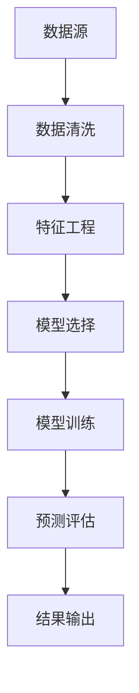
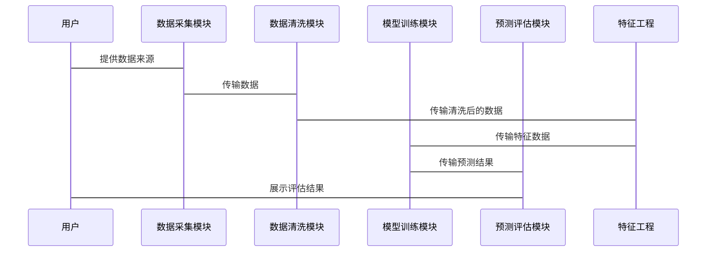

                 


# 发达市场vs新兴市场:预测准确性比较

## 关键词：发达市场, 新兴市场, 预测准确性, 经济预测, 金融市场

## 摘要：发达市场和新兴市场的预测准确性在经济和金融市场中具有重要意义。本文通过对比分析两者的市场结构、经济指标和波动性，探讨预测准确性的关键影响因素，包括数据质量、模型选择和市场特性。文章结合理论分析和实际案例，详细阐述预测方法和模型，提供系统化的解决方案和实战经验，为读者在预测准确性比较方面提供深入的见解和实用的指导。

---

## 第1章 发达市场与新兴市场的背景介绍

### 1.1 发达市场的定义与特点

#### 1.1.1 发达市场的定义
发达市场是指经济高度发达、基础设施完善、金融体系成熟且法律环境健全的国家或地区。这些市场通常具有较高的GDP增长率、较低的失业率和稳定的通胀率。

#### 1.1.2 发达市场的经济特点
- 高度发达的制造业和服务业
- 复杂的金融体系，包括多层次的银行系统和成熟的资本市场
- 法律法规完善，市场透明度高

#### 1.1.3 发达市场的金融体系特征
- 多元化的金融机构，包括银行、保险公司、证券公司等
- 成熟的资本市场，包括股票市场、债券市场和衍生品市场
- 高度的市场流动性，交易活跃

### 1.2 新兴市场的定义与特点

#### 1.2.1 新兴市场的定义
新兴市场是指处于快速发展阶段的国家或地区，通常具有较高的经济增长潜力，但基础设施、金融体系和法律环境相对不完善。

#### 1.2.2 新兴市场的经济特点
- 经济快速增长，但波动性较大
- 初步建立的制造业和服务业基础
- 基础设施和法律环境尚不完善

#### 1.2.3 新兴市场的金融体系特征
- 金融市场发展迅速，但不够成熟
- 资本市场有限，主要依赖银行融资
- 市场流动性较低，波动性较高

### 1.3 发达市场与新兴市场的差异

#### 1.3.1 经济发展阶段的差异
- 发达市场处于稳定增长阶段，新兴市场处于快速发展阶段
- 经济结构差异：发达市场以服务业为主，新兴市场以制造业为主

#### 1.3.2 市场规模的差异
- 发达市场市场规模大，市场容量稳定
- 新兴市场市场规模较小，增长潜力大

#### 1.3.3 风险因素的差异
- 发达市场风险相对较低，市场波动较小
- 新兴市场风险较高，市场波动较大

### 1.4 预测准确性的重要性

#### 1.4.1 预测准确性在经济分析中的作用
- 帮助政策制定者制定有效的经济政策
- 为企业提供市场进入和投资决策的依据
- 为投资者提供风险评估和收益预测的工具

#### 1.4.2 预测准确性对投资决策的影响
- 高准确性预测可以帮助投资者做出更明智的投资决策
- 错误的预测可能导致重大投资损失

#### 1.4.3 预测准确性在政策制定中的意义
- 政府可以根据预测结果调整货币政策和财政政策
- 预测准确性直接影响政策效果和经济稳定

---

## 第2章 发达市场与新兴市场的对比分析

### 2.1 市场结构对比

#### 2.1.1 发达市场的市场结构特点
- 多元化的企业结构，包括跨国公司和中小企业
- 市场竞争充分，企业进入和退出壁垒较低
- 市场透明度高，信息获取容易

#### 2.1.2 新兴市场的市场结构特点
- 企业集中度较高，大型企业占据主导地位
- 市场进入壁垒较高，中小企业发展受限
- 市场透明度低，信息获取困难

#### 2.1.3 市场结构对比分析
- 发达市场市场结构多样化，竞争充分
- 新兴市场市场结构集中，竞争不充分
- 市场透明度和信息获取的差异影响预测准确性

### 2.2 经济指标对比

#### 2.2.1 GDP增长对比
- 发达市场GDP增长稳定，波动较小
- 新兴市场GDP增长波动较大，但增速通常高于发达市场

#### 2.2.2 失业率对比
- 发达市场失业率较低且稳定
- 新兴市场失业率较高，波动较大

#### 2.2.3 通胀率对比
- 发达市场通胀率低且稳定
- 新兴市场通胀率较高，波动较大

### 2.3 市场波动性对比

#### 2.3.1 发达市场的波动性特征
- 市场波动性较低，价格稳定
- 投资者风险偏好较低，注重稳定收益

#### 2.3.2 新兴市场的波动性特征
- 市场波动性较高，价格波动剧烈
- 投资者风险偏好较高，注重高收益

#### 2.3.3 波动性对比分析
- 波动性差异影响预测准确性，新兴市场预测难度更大
- 投资者在选择市场时需考虑波动性对预测准确性的影响

---

## 第3章 预测准确性的影响因素

### 3.1 数据质量的影响

#### 3.1.1 数据的完整性
- 数据不完整可能导致预测模型误差增大
- 数据完整性对预测准确性有直接影响

#### 3.1.2 数据的准确性
- 数据错误会影响预测结果的准确性
- 数据清洗和预处理是提高预测准确性的关键步骤

#### 3.1.3 数据的及时性
- 数据延迟会影响预测的及时性
- 及时更新数据有助于提高预测准确性

### 3.2 模型选择的影响

#### 3.2.1 时间序列分析
- 时间序列分析适合于预测具有趋势和季节性的数据
- 常用模型包括ARIMA和GARCH

#### 3.2.2 机器学习模型
- 机器学习模型适合于复杂非线性关系的预测
- 常用模型包括随机森林和神经网络

#### 3.2.3 统计模型
- 统计模型适合于小样本数据的预测
- 常用模型包括线性回归和logistic回归

### 3.3 市场特性的影响

#### 3.3.1 市场成熟度
- 发达市场成熟度高，预测准确性较高
- 新兴市场成熟度低，预测准确性较低

#### 3.3.2 市场波动性
- 波动性高的市场预测准确性较低
- 波动性低的市场预测准确性较高

#### 3.3.3 市场参与者行为
- 市场参与者行为复杂，影响预测准确性
- 市场行为分析是提高预测准确性的重要手段

---

## 第4章 预测准确性比较的数学模型

### 4.1 时间序列分析模型

#### 4.1.1 ARIMA模型
- ARIMA模型用于预测具有趋势和季节性的数据
- 模型公式：$$ ARIMA(p, d, q) $$
- 参数解释：
  - p：自回归阶数
  - d：差分阶数
  - q：移动平均阶数

#### 4.1.2 GARCH模型
- GARCH模型用于预测波动性
- 模型公式：$$ GARCH(p, q) $$
- 参数解释：
  - p：自回归阶数
  - q：移动平均阶数

### 4.2 机器学习模型

#### 4.2.1 随机森林
- 随机森林是一种基于树的集成学习方法
- 适用于分类和回归问题
- 模型公式：$$ y = \sum_{i=1}^{n} \text{Tree}_i(x) $$

#### 4.2.2 神经网络
- 神经网络是一种深度学习模型
- 适用于复杂非线性关系的预测
- 模型公式：$$ y = \sigma(w x + b) $$，其中σ为激活函数

### 4.3 模型比较与选择

#### 4.3.1 模型性能对比
- ARIMA模型适合于线性趋势和季节性数据
- GARCH模型适合于波动性预测
- 机器学习模型适合于复杂非线性关系

#### 4.3.2 模型选择策略
- 根据数据特征选择模型
- 通过交叉验证评估模型性能
- 综合考虑模型的准确性和计算复杂度

---

## 第5章 预测准确性比较的系统架构设计

### 5.1 系统功能设计

#### 5.1.1 数据采集模块
- 数据来源：公开经济数据、金融市场数据
- 数据清洗：处理缺失值、异常值
- 数据转换：数据标准化、特征工程

#### 5.1.2 模型训练模块
- 模型选择：根据数据特征选择合适模型
- 参数调优：通过网格搜索优化模型参数
- 模型训练：使用训练数据训练模型

#### 5.1.3 预测评估模块
- 预测结果：生成预测值和置信区间
- 模型评估：计算均方误差、R平方值
- 结果可视化：绘制预测曲线和实际曲线对比

### 5.2 系统架构设计

#### 5.2.1 系统架构图


#### 5.2.2 系统交互流程


---

## 第6章 项目实战：预测准确性比较的实现

### 6.1 环境安装

#### 6.1.1 安装Python
```bash
python --version
pip install --upgrade pip
```

#### 6.1.2 安装必要的库
```bash
pip install numpy pandas scikit-learn matplotlib
```

### 6.2 核心实现

#### 6.2.1 数据加载与清洗
```python
import pandas as pd
data = pd.read_csv('market_data.csv')
data.dropna(inplace=True)
data = data.drop_duplicates()
```

#### 6.2.2 特征工程
```python
from sklearn.preprocessing import StandardScaler
scaler = StandardScaler()
X = scaler.fit_transform(data.drop('target', axis=1))
y = data['target']
```

#### 6.2.3 模型训练
```python
from sklearn.ensemble import RandomForestRegressor
model = RandomForestRegressor(n_estimators=100, random_state=42)
model.fit(X, y)
```

#### 6.2.4 预测与评估
```python
from sklearn.metrics import mean_squared_error
y_pred = model.predict(X)
mse = mean_squared_error(y, y_pred)
print(f'Mean Squared Error: {mse}')
```

### 6.3 案例分析

#### 6.3.1 数据来源与处理
- 数据来源：新兴市场与发达市场的GDP数据
- 数据处理：清洗和特征工程

#### 6.3.2 模型选择与训练
- 模型选择：随机森林回归模型
- 训练数据：历史GDP数据

#### 6.3.3 结果分析
- 预测结果：新兴市场与发达市场的GDP预测
- 结果对比：预测准确性分析

---

## 第7章 总结与展望

### 7.1 预测准确性比较的核心要点
- 数据质量对预测准确性的影响
- 模型选择对预测准确性的影响
- 市场特性对预测准确性的影响

### 7.2 预测准确性比较的未来展望
- 结合大数据和人工智能技术，提高预测准确性
- 开发更复杂的模型，适应不同市场特性
- 进一步研究市场互动对预测准确性的影响

### 7.3 小结
- 发达市场与新兴市场的预测准确性比较是一个复杂的系统工程
- 需要结合市场特性、数据质量和模型选择等多方面因素
- 通过不断优化模型和数据处理方法，可以提高预测准确性

---

## 作者：AI天才研究院/AI Genius Institute & 禅与计算机程序设计艺术 /Zen And The Art of Computer Programming

