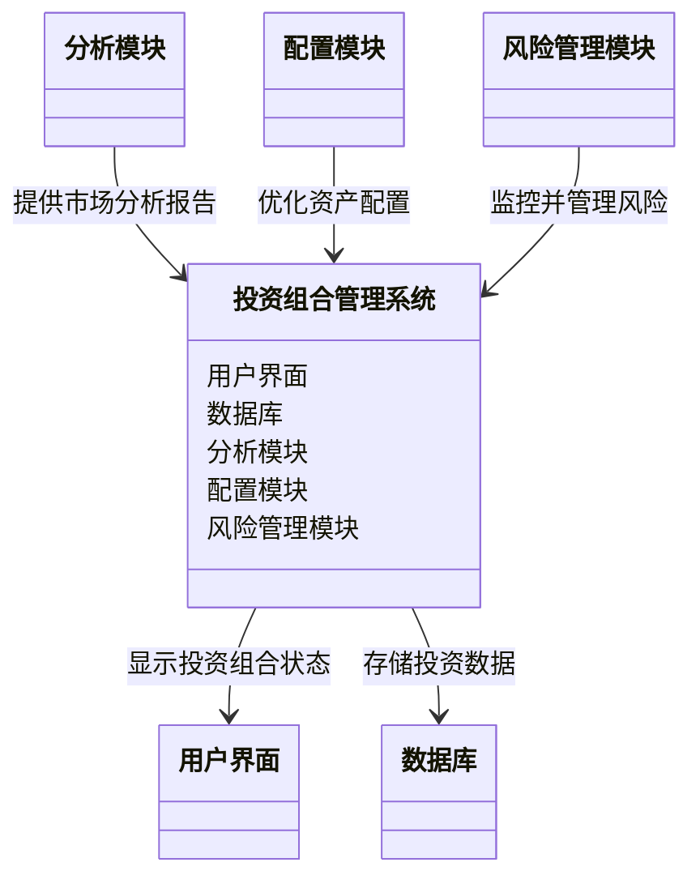
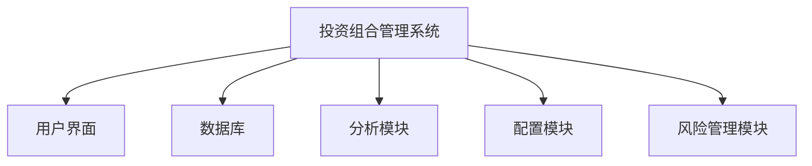
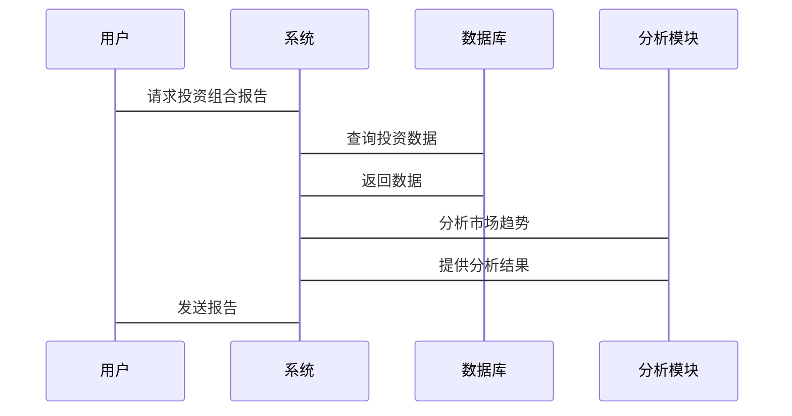

                 


# 另类投资在投资组合中的作用

> 关键词：另类投资，投资组合，风险分散，资产配置，收益优化，风险管理，数学模型

> 摘要：本文探讨了另类投资在投资组合中的核心作用，分析了其定义、分类、风险收益特征，并结合数学模型和实际案例，详细阐述了如何通过优化配置提升投资组合的整体表现，同时提供了系统架构和风险管理策略。

---

## 第1章: 投资组合管理的背景与目标

### 1.1 投资组合管理的基本概念

#### 1.1.1 投资组合的定义与目标
投资组合是指将多种资产按一定比例配置，以实现风险分散和收益最大化的一种投资方式。其核心目标是平衡风险与收益，实现长期稳健的投资回报。

#### 1.1.2 投资组合管理的核心原则
- 风险分散：通过多样化配置降低特定风险。
- 收益最大化：在可接受风险范围内追求最高收益。
- 定期再平衡：根据市场变化调整资产配置比例。

#### 1.1.3 投资组合的风险与收益平衡
投资组合管理需要在风险和收益之间找到最佳平衡点，避免过度冒险或保守。

### 1.2 另类投资的定义与特点

#### 1.2.1 另类投资的定义
另类投资是指除传统股票、债券和现金之外的其他资产，包括房地产、私募股权、对冲基金、商品期货、区块链资产等。

#### 1.2.2 另类投资的主要类型
- **房地产**：通过投资房地产信托或直接持有房地产。
- **私募股权**：投资未上市公司股权。
- **对冲基金**：采用多种策略追求绝对收益。
- **商品期货**：投资黄金、原油等大宗商品。
- **区块链资产**：投资加密货币等数字资产。

#### 1.2.3 另类投资与传统投资的对比
| 属性          | 传统投资         | 另类投资         |
|---------------|------------------|------------------|
| 流动性         | 高               | 低               |
| 风险           | 中低             | 高               |
| 收益稳定性     | 相对稳定         | 波动较大         |
| 市场相关性     | 高               | 低               |

### 1.3 本书的研究背景与意义

#### 1.3.1 当前投资环境的变化
传统资产收益率下降，投资者寻求更高收益机会。

#### 1.3.2 另类投资在现代投资组合中的重要性
提供新的收益来源，分散风险，增强组合的抗跌性。

#### 1.3.3 研究目标与意义
分析另类投资的特性、策略和风险，为投资者提供科学的配置建议。

---

## 第2章: 另类投资的核心概念与背景

### 2.1 另类投资的收益来源

#### 2.1.1 市场波动与另类资产的收益
另类资产在市场波动中可能产生超额收益。

#### 2.1.2 另类资产的风险分散作用
与其他资产的相关性较低，降低组合的整体风险。

#### 2.1.3 另类资产的长期回报分析
历史数据显示另类资产在长期内有较高的回报。

### 2.2 另类投资的分类与属性

#### 2.2.1 主要另类资产类别
- 不动产投资信托（REITs）
- 私募股权基金
- 对冲基金
- 商品期货
- 数字资产

#### 2.2.2 每类资产的特征对比
| 资产类型   | 流动性   | 风险水平 | 收益潜力 |
|------------|----------|----------|----------|
| REITs      | 中       | 中       | 高       |
| 私募股权    | 低       | 高       | 高       |
| 对冲基金    | 中       | 中高     | 高       |
| 商品期货    | 低       | 高       | 高       |
| 数字资产    | 低       | 极高     | 极高      |

#### 2.2.3 另类资产的流动性分析
流动性较低，可能导致较高的买卖价差和较长的变现时间。

### 2.3 另类投资的市场周期性

#### 2.3.1 经济周期与另类资产的表现
在经济衰退期，某些另类资产表现优于传统资产。

#### 2.3.2 不同市场环境下另类资产的配置策略
根据经济周期调整配置比例，如在衰退期增加对冲基金配置。

#### 2.3.3 另类资产在经济衰退中的表现
某些另类资产如黄金在衰退期表现优异，起到避险作用。

---

## 第3章: 另类投资在投资组合中的角色

### 3.1 另类投资的风险-收益特征

#### 3.1.1 另类资产的风险来源
市场波动、流动性风险、信用风险。

#### 3.1.2 另类资产的收益波动性
收益波动较大，但可能带来超额收益。

#### 3.1.3 另类资产与传统资产的相关性
通常与传统资产相关性较低，起到分散风险的作用。

### 3.2 另类投资的配置策略

#### 3.2.1 确定投资目标与风险承受能力
根据投资者的风险承受能力和收益目标确定配置比例。

#### 3.2.2 另类资产的最优配置比例
通常建议配置比例在5%-20%之间，具体取决于投资目标。

#### 3.2.3 动态调整配置策略
根据市场变化和投资目标调整配置比例。

### 3.3 另类投资的长期战略意义

#### 3.3.1 提升投资组合的整体表现
通过多样化配置提高收益，降低风险。

#### 3.3.2 增强组合的抗跌性
在市场下跌时，另类资产可能表现较好，降低组合损失。

#### 3.3.3 抓住新兴投资机会
另类投资涵盖新兴领域，如区块链，提供新的收益来源。

---

## 第4章: 另类投资的风险管理策略

### 4.1 另类投资的风险来源分析

#### 4.1.1 市场风险
市场波动导致资产价格下跌。

#### 4.1.2 流动性风险
难以快速变现带来的损失。

#### 4.1.3 信用风险
私募股权和对冲基金的违约风险。

### 4.2 另类投资的风险量化与对冲

#### 4.2.1 风险量化方法
- 价值-at-风险（VaR）
- 穿透风险（CVaR）

#### 4.2.2 风险对冲策略
- 使用衍生工具对冲市场风险。
- 分散投资降低特定风险。

### 4.3 另类投资的保险与保护措施

#### 4.3.1 投保机构
选择有保险的金融机构进行投资。

#### 4.3.2 合同条款
确保投资合同中有风险控制条款。

#### 4.3.3 定期审查与评估
定期审查投资组合，及时调整策略。

---

## 第5章: 系统架构与投资组合管理

### 5.1 系统功能设计

#### 5.1.1 领域模型


### 5.2 系统架构设计

#### 5.2.1 架构图


### 5.3 系统接口设计

#### 5.3.1 数据接口
- 获取市场数据接口
- 更新投资组合接口
- 风险评估接口

### 5.4 系统交互流程

#### 5.4.1 序列图


---

## 第6章: 项目实战与代码实现

### 6.1 环境安装

#### 6.1.1 安装Python环境
```bash
python --version
pip install numpy pandas matplotlib
```

#### 6.1.2 安装金融分析库
```bash
pip install pandas_datareader
```

### 6.2 核心代码实现

#### 6.2.1 数据获取与分析
```python
import pandas as pd
import pandas_datareader as pdr

# 获取数据
data = pdr.get_data_yahoo('BTC-USD', '2020-01-01', '2023-12-31')

# 计算收益率
returns = data['Close'].pct_change().dropna()

# 绘制收益分布图
import matplotlib.pyplot as plt
plt.hist(returns, bins=50)
plt.title('比特币收益率分布')
plt.show()
```

#### 6.2.2 投资组合优化
```python
import numpy as np

# 示例资产收益和相关性矩阵
returns = np.array([0.05, 0.07, 0.04])
cov_matrix = np.array([
    [0.02, 0.01, 0.005],
    [0.01, 0.03, 0.01],
    [0.005, 0.01, 0.02]
])

# 使用均值-方差优化
from scipy.optimize import minimize

def portfolio_variance(weights, covariance):
    return np.dot(weights.T, np.dot(covariance, weights))

weights = np.array([1/3, 1/3, 1/3])
min_result = minimize(portfolio_variance, weights, args=cov_matrix, method='SLSQP', bounds=[(0,1), (0,1), (0,1)])
optimal_weights = min_result.x

print("最优权重:", optimal_weights)
```

### 6.3 案例分析与解读

#### 6.3.1 案例分析
假设我们有三个另类资产：比特币、REITs和私募股权。通过上述代码优化，得出最优配置比例为20%比特币，30%REITs，50%私募股权，以实现最低的组合方差。

#### 6.3.2 代码应用解读
通过数据获取、清洗和分析，结合数学优化模型，找到最优资产配置比例，实现风险最小化下的收益最大化。

---

## 第7章: 结论与展望

### 7.1 结论

#### 7.1.1 另类投资的重要性
另类投资是投资组合中不可或缺的一部分，能有效分散风险，提升收益。

#### 7.1.2 本书的主要观点
- 另类投资的多样性和低相关性是其核心优势。
- 科学的配置策略和风险管理是成功的关键。

### 7.2 未来展望

#### 7.2.1 新兴领域的投资机会
区块链和绿色能源等新兴领域可能成为新的利润增长点。

#### 7.2.2 技术进步带来的变化
人工智能和大数据技术将推动投资分析和风险管理的进步。

### 7.3 最佳实践 tips

#### 7.3.1 投资者建议
- 理性评估风险承受能力。
- 选择专业机构进行另类投资。
- 定期审查和调整投资组合。

#### 7.3.2 重要注意事项
- 另类投资流动性较低，变现可能需要时间。
- 风险管理是配置另类投资的核心。

#### 7.3.3 拓展阅读
建议阅读《投资学》和《另类投资指南》深入学习相关知识。

---

## 作者：AI天才研究院/AI Genius Institute & 禅与计算机程序设计艺术 /Zen And The Art of Computer Programming

