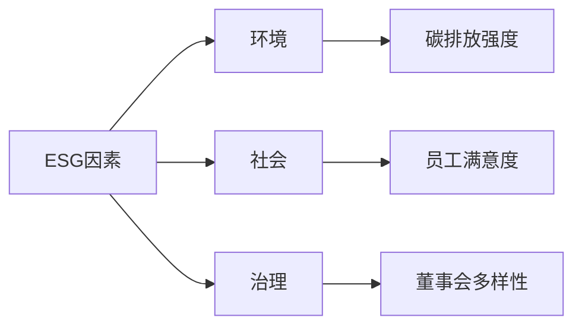
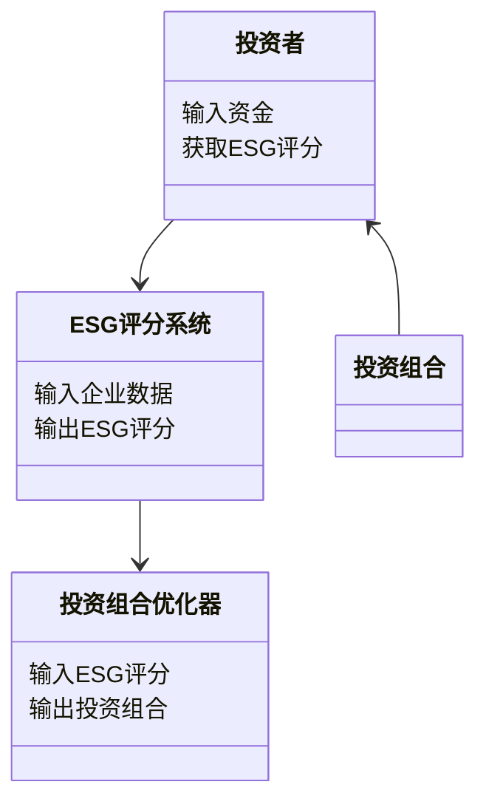

                 


# 可持续投资：ESG因素在当前市场中的重要性

> 关键词：可持续投资, ESG, 环境, 社会, 治理, 投资策略, 数学模型

> 摘要：本篇文章深入探讨了可持续投资中的ESG（环境、社会、治理）因素的重要性。通过分析ESG的核心概念、评分模型、系统架构以及实际案例，详细阐述了ESG在投资决策中的作用，帮助投资者理解并应用ESG因素，以实现长期价值和可持续发展。

---

## 第1章: 可持续投资与ESG的背景介绍

### 1.1 可持续投资的定义与内涵

#### 1.1.1 可持续投资的定义
可持续投资是一种关注环境、社会和治理因素的投资策略，旨在在追求财务回报的同时，促进社会和环境的可持续发展。

#### 1.1.2 可持续投资的核心要素
- **环境（E）**：关注企业在资源使用、碳排放、污染等方面的表现。
- **社会（S）**：关注企业在员工权益、社会责任、社区影响等方面的表现。
- **治理（G）**：关注企业在公司治理、透明度、高管薪酬等方面的表现。

#### 1.1.3 可持续投资与传统投资的区别
- **目标**：可持续投资注重长期价值和社会责任，传统投资注重短期财务回报。
- **风险评估**：可持续投资考虑非财务风险（如环境风险），传统投资主要考虑财务风险。
- **收益**：可持续投资可能在中长期带来超额收益，传统投资注重短期收益。

### 1.2 ESG的定义与内涵

#### 1.2.1 环境（E）的定义与特征
环境因素关注企业在资源使用、能源消耗、碳排放等方面的表现。良好的环境表现可以降低企业的运营成本，减少环境风险。

#### 1.2.2 社会（S）的定义与特征
社会因素关注企业在员工权益、社会责任、社区参与等方面的表现。良好的社会表现可以提升企业的声誉，增强员工忠诚度。

#### 1.2.3 治理（G）的定义与特征
治理因素关注企业在公司治理、透明度、高管薪酬等方面的表现。良好的治理结构可以提高企业的管理效率，降低风险。

### 1.3 ESG在投资中的重要性

#### 1.3.1 ESG对投资决策的影响
- **风险控制**：ESG因素可以帮助投资者识别潜在风险，如环境风险、声誉风险。
- **收益提升**：研究表明，ESG表现良好的企业通常具有更高的长期收益。
- **合规性**：越来越多的监管机构要求披露ESG信息，投资者需要关注这些因素以符合法规。

#### 1.3.2 ESG与企业长期价值的关系
ESG因素直接影响企业的长期价值。例如，环境表现良好的企业可能在能源价格上涨时更具竞争力，社会责任强的企业可能在品牌建设上更具优势。

#### 1.3.3 ESG在当前市场中的应用现状
- **全球趋势**：越来越多的投资者将ESG因素纳入投资决策。
- **数据与工具**：ESG评级机构（如MSCI、晨星）提供ESG评分，帮助投资者评估企业表现。
- **政策支持**：各国政府出台相关政策，鼓励ESG投资。

---

## 第2章: ESG核心概念与联系

### 2.1 ESG核心概念的原理

#### 2.1.1 环境因素的数学模型
环境因素可以通过碳排放强度（CO2 emissions per unit of output）来衡量。例如，假设某企业A的碳排放强度为0.5，企业B为0.8，那么企业A的环境表现优于企业B。

#### 2.1.2 社会因素的数学模型
社会因素可以通过员工满意度评分来衡量。例如，员工满意度高（90分）的企业可能在招聘和保留人才方面更具优势。

#### 2.1.3 治理因素的数学模型
治理因素可以通过董事会多样性指数来衡量。例如，董事会中有女性董事的企业可能在决策上更具多样性。

### 2.2 ESG核心概念的对比分析

#### 2.2.1 ESG核心概念对比表格

| 因素 | 定义 | 特征 | 示例指标 |
|------|------|------|----------|
| E    | 环境 | 资源使用、碳排放 | 碳排放强度 |
| S    | 社会 | 员工权益、社会责任 | 员工满意度 |
| G    | 治理 | 公司治理、透明度 | 董事会多样性 |

#### 2.2.2 ESG实体关系的Mermaid流程图



---

## 第3章: ESG评分模型与算法原理

### 3.1 ESG评分模型的构建

#### 3.1.1 ESG评分模型的输入与输出
- **输入**：企业的环境、社会、治理数据。
- **输出**：企业的ESG综合评分（例如，从A到F）。

#### 3.1.2 ESG评分模型

```mermaid
graph LR
    start[开始] --> input[输入数据]
    input --> process[数据预处理]
    process --> model[构建模型]
    model --> output[输出评分]
    output --> end[结束]
```

#### 3.1.3 ESG评分模型的数学公式

假设某企业的环境得分为E，社会得分为S，治理得分为G，总评分为：
$$
\text{总评分} = \frac{E + S + G}{3}
$$

---

## 第4章: 可持续投资策略与系统架构

### 4.1 可持续投资策略

#### 4.1.1 基于ESG的选股策略
- **步骤**：
  1. 收集企业的ESG数据。
  2. 根据评分筛选优质企业。
  3. 构建投资组合。

#### 4.1.2 ESG投资组合优化

$$
\text{目标：最大化收益，最小化风险}
$$

### 4.2 系统架构设计

#### 4.2.1 系统功能设计



---

## 第5章: 项目实战与案例分析

### 5.1 项目实战

#### 5.1.1 环境影响分析

```python
import pandas as pd

def calculate_carbon_emissions(data):
    return data['carbon_emissions'].mean()

data = pd.DataFrame({
    'carbon_emissions': [0.5, 0.6, 0.4, 0.7],
    'employees_happiness': [85, 90, 88, 80]
})

print("平均碳排放强度:", calculate_carbon_emissions(data))
```

#### 5.1.2 社会责任分析

```python
import numpy as np

def calculate_employee_satisfaction(data):
    return np.mean(data['employees_happiness'])

data = pd.DataFrame({
    'employees_happiness': [85, 90, 88, 80]
})

print("员工满意度均值:", calculate_employee_satisfaction(data))
```

### 5.2 案例分析

#### 5.2.1 环境案例

假设某企业A的碳排放强度为0.5，企业B为0.8，企业A的环境表现优于企业B。

#### 5.2.2 社会案例

假设某企业的员工满意度得分为85分，高于行业平均水平80分，说明该企业在社会责任方面表现良好。

#### 5.2.3 治理案例

假设某企业的董事会中有30%的女性董事，高于行业平均水平20%，说明该企业在治理方面表现良好。

---

## 第6章: 未来展望与挑战

### 6.1 ESG的未来发展趋势

#### 6.1.1 数据与技术的结合
随着大数据和人工智能技术的发展，ESG评分将更加精准和自动化。

#### 6.1.2 全球化与本地化
ESG投资将从发达国家市场扩展到新兴市场，同时需要考虑地区的文化差异。

### 6.2 ESG投资的挑战

#### 6.2.1 数据质量
不同评级机构的ESG数据可能存在差异，影响投资决策。

#### 6.2.2 方法论
ESG评分模型的可解释性和透明度需要进一步提升。

#### 6.2.3 政策与监管
各国政策的差异可能导致ESG投资的复杂性增加。

---

## 结语

可持续投资中的ESG因素不仅关乎企业的长期价值，也关乎整个社会的可持续发展。通过理解和应用ESG因素，投资者可以在追求财务回报的同时，为社会和环境的可持续发展做出贡献。

---

## 作者

作者：AI天才研究院/AI Genius Institute & 禅与计算机程序设计艺术 /Zen And The Art of Computer Programming

---

# 感谢您的阅读！如果文章对您有帮助，请点赞、收藏、转发，您的支持是我创作的最大动力！

