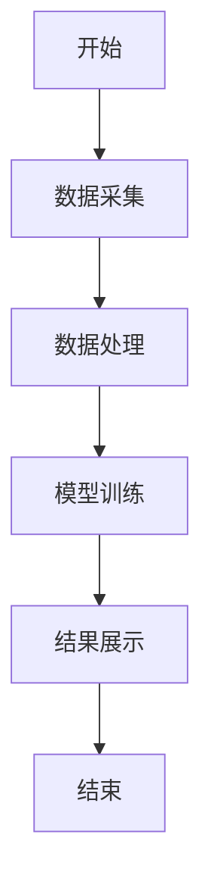
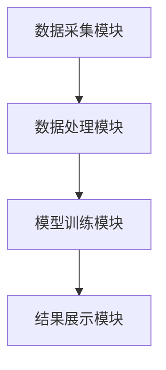
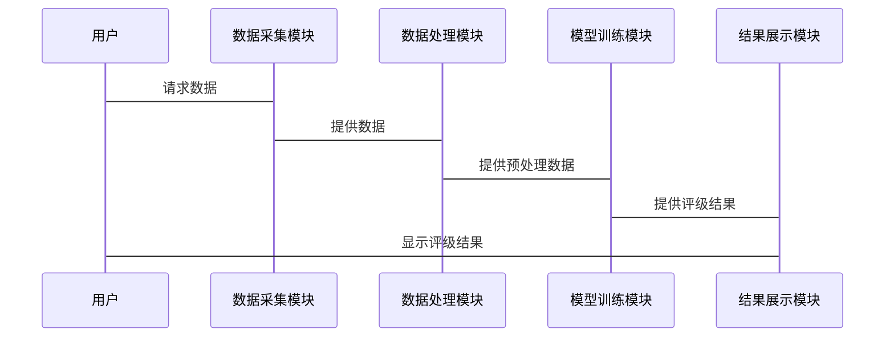

                 


# 可预测性评级在彼得林奇选股中的作用

## 关键词：彼得·林奇，选股，可预测性评级，投资策略，股票分析

## 摘要：  
本文深入探讨了可预测性评级在彼得·林奇选股策略中的核心作用。通过分析可预测性评级的定义、原理、算法实现及系统架构，结合实际案例，展示了如何利用可预测性评级帮助投资者做出更明智的投资决策。文章内容涵盖从理论到实践的完整过程，为投资者提供了一个基于可预测性评级的选股框架。

---

# 第1章: 可预测性评级的基本概念

## 1.1 可预测性评级的定义与背景

### 1.1.1 投资中的可预测性概念  
在投资领域，可预测性通常指某只股票未来表现的可预测程度。如果一只股票的表现容易通过现有数据和模型预测，那么它的可预测性就高；反之则低。可预测性评级是衡量这一程度的重要工具。

### 1.1.2 彼得·林奇选股方法的核心思想  
彼得·林奇是美国著名基金经理，他在选股时注重基本面分析，尤其是公司财务状况、行业地位和管理层能力。他认为，投资成功的关键在于选择那些能够持续增长的公司。可预测性评级帮助他在众多股票中筛选出那些未来表现可预测、风险可控的标的。

### 1.1.3 可预测性评级在选股中的重要性  
可预测性评级为投资者提供了一个量化工具，帮助他们在选股时更客观地评估股票的风险和潜在回报。通过可预测性评级，投资者可以更高效地筛选出符合自己投资目标的股票。

---

## 1.2 彼得·林奇的投资策略

### 1.2.1 彼得·林奇选股的三大原则  
1. **价值投资**：选择那些市场价格低于内在价值的股票。  
2. **成长投资**：投资于那些收入和利润持续增长的公司。  
3. **行业趋势**：关注那些处于上升周期的行业。  

### 1.2.2 可预测性评级在彼得·林奇策略中的地位  
可预测性评级是彼得·林奇策略的重要组成部分，它帮助投资者筛选出那些基本面稳定、未来表现可预测的公司。

### 1.2.3 彼得·林奇对行业趋势的判断方法  
彼得·林奇非常重视行业趋势，他认为行业趋势决定了公司未来的增长潜力。通过分析行业周期和市场环境，他能够更好地判断公司的可预测性。

---

## 1.3 可预测性评级的核心要素

### 1.3.1 财务指标的可预测性  
财务指标是衡量公司基本面的重要工具，常见的指标包括净利润率、资产负债率、ROE等。这些指标的可预测性直接影响公司的评级结果。

### 1.3.2 公司治理结构的稳定性  
公司治理结构的稳定性是影响公司长期发展的关键因素。良好的治理结构能够降低公司风险，提高可预测性。

### 1.3.3 行业周期对可预测性的影响  
行业周期对公司的可预测性有直接影响。处于上升周期的行业通常具有更高的可预测性，而处于衰退周期的行业则风险较高。

---

# 第2章: 可预测性评级的原理与方法

## 2.1 可预测性评级的原理

### 2.1.1 评级的基本原理  
可预测性评级基于对公司基本面和行业趋势的分析，通过量化指标评估公司的未来表现可预测性。

### 2.1.2 评级的数学模型  
可预测性评级模型通常包括以下几个步骤：数据收集、数据预处理、模型训练、模型评估和结果输出。

### 2.1.3 评级的指标体系  
常见的评级指标包括财务指标、行业趋势、公司治理和市场环境等。

---

## 2.2 彼得·林奇选股中的可预测性评级方法

### 2.2.1 评级标准的制定  
评级标准通常基于财务指标、行业趋势和公司治理等因素，不同行业可能有不同的评级标准。

### 2.2.2 评级的计算公式  
可预测性评级可以通过加权平均的方式计算，权重根据指标的重要程度确定。

### 2.2.3 评级结果的分类  
评级结果通常分为A、B、C、D、E五个等级，A级表示可预测性最高，E级最低。

---

## 2.3 评级的优缺点分析

### 2.3.1 评级的优势  
- 客观性：评级基于量化指标，减少人为判断的主观性。  
- 可操作性：评级结果易于理解和应用。  

### 2.3.2 评级的局限性  
- 简化性：评级可能忽视某些重要因素。  
- 动态性：市场环境变化可能影响评级的准确性。  

### 2.3.3 如何克服评级的局限性  
通过持续监控和更新评级指标，结合人工判断，可以提高评级的准确性。

---

# 第3章: 可预测性评级的算法与实现

## 3.1 评级算法的数学模型

### 3.1.1 评级模型的构建  
可预测性评级模型通常包括数据预处理、特征选择、模型训练和结果评估等步骤。

### 3.1.2 评级模型的参数设置  
模型参数需要根据具体情况进行调整，以获得最佳的预测效果。

### 3.1.3 评级模型的验证  
通过交叉验证和回测，可以验证模型的准确性和稳定性。

---

## 3.2 评级算法的实现步骤

### 3.2.1 数据的收集与处理  
收集公司的财务数据、行业趋势和市场信息，并进行清洗和标准化。

### 3.2.2 模型的训练与优化  
选择合适的算法，如线性回归或随机森林，进行模型训练和参数优化。

### 3.2.3 模型的测试与评估  
通过测试数据评估模型的预测能力和稳定性。

---

## 3.3 评级算法的代码实现

### 3.3.1 数据预处理代码  
```python
import pandas as pd
data = pd.read_csv('stock_data.csv')
data = data.dropna()
```

### 3.3.2 模型训练代码  
```python
from sklearn.ensemble import RandomForestClassifier
model = RandomForestClassifier(n_estimators=100, random_state=42)
model.fit(X_train, y_train)
```

### 3.3.3 模型评估代码  
```python
from sklearn.metrics import accuracy_score
y_pred = model.predict(X_test)
print("Accuracy:", accuracy_score(y_test, y_pred))
```

---

# 第4章: 系统架构与设计

## 4.1 系统功能设计

### 4.1.1 系统模块划分  
- 数据采集模块：负责收集股票数据。  
- 数据处理模块：对数据进行清洗和预处理。  
- 模型训练模块：训练和优化评级模型。  
- 结果展示模块：输出评级结果。  

### 4.1.2 系统功能流程图  


### 4.1.3 系统功能的实现细节  
- 数据采集模块需要支持多种数据源。  
- 数据处理模块需要进行特征选择和数据标准化。  
- 模型训练模块需要支持多种算法，并进行参数优化。  

---

## 4.2 系统架构设计

### 4.2.1 系统架构图  


### 4.2.2 系统组件之间的关系  
- 数据采集模块向数据处理模块提供数据。  
- 数据处理模块向模型训练模块提供预处理后的数据。  
- 模型训练模块向结果展示模块提供评级结果。  

### 4.2.3 系统的可扩展性设计  
- 支持多种算法的扩展。  
- 支持多种数据源的扩展。  

---

## 4.3 系统接口设计

### 4.3.1 系统输入接口  
- 数据输入接口：接收股票数据。  
- 参数设置接口：设置模型参数。  

### 4.3.2 系统输出接口  
- 结果输出接口：输出评级结果。  
- 日志输出接口：输出系统运行日志。  

### 4.3.3 系统与外部系统的接口  
- 数据接口：与数据源系统对接。  
- 用户接口：与用户交互界面对接。  

---

## 4.4 系统交互序列图



---

# 第5章: 项目实战与案例分析

## 5.1 项目环境的安装与配置

### 5.1.1 开发环境的搭建  
- 安装Python和相关库：如Pandas、Scikit-learn。  
- 安装Jupyter Notebook用于数据分析和可视化。  

### 5.1.2 数据库的安装与配置  
- 使用MySQL或MongoDB存储股票数据。  
- 配置数据库连接参数。  

### 5.1.3 开发工具的安装与配置  
- 安装IDE如PyCharm或VS Code。  
- 配置虚拟环境。  

---

## 5.2 核心代码的实现与解读

### 5.2.1 数据预处理代码  
```python
import pandas as pd
data = pd.read_csv('stock_data.csv')
data = data.dropna()
data.head()
```

### 5.2.2 模型训练代码  
```python
from sklearn.ensemble import RandomForestClassifier
model = RandomForestClassifier(n_estimators=100, random_state=42)
model.fit(X_train, y_train)
```

### 5.2.3 模型评估代码  
```python
from sklearn.metrics import accuracy_score
y_pred = model.predict(X_test)
print("Accuracy:", accuracy_score(y_test, y_pred))
```

---

## 5.3 实际案例分析

### 5.3.1 案例选择与数据收集  
以苹果公司为例，收集其过去5年的财务数据和市场信息。

### 5.3.2 评级结果分析  
通过模型计算，苹果公司的可预测性评级为A级，表示其未来表现具有较高的可预测性。

### 5.3.3 案例分析小结  
通过实际案例分析，验证了可预测性评级模型的有效性。

---

## 5.4 项目小结

### 5.4.1 项目成果  
成功开发了一个基于可预测性评级的选股系统。  

### 5.4.2 项目经验  
- 数据预处理是关键步骤。  
- 模型选择和参数优化影响评级结果。  

### 5.4.3 项目改进建议  
- 支持更多算法的扩展。  
- 提供更详细的评级报告。  

---

# 第6章: 总结与展望

## 6.1 总结

本文详细介绍了可预测性评级在彼得·林奇选股中的作用，从理论到实践，全面探讨了其原理、算法和系统设计。通过实际案例分析，验证了可预测性评级的有效性。

---

## 6.2 展望

未来，随着人工智能和大数据技术的发展，可预测性评级将更加智能化和精准化。投资者可以利用更复杂的模型和算法，进一步提高选股的准确性和效率。

---

# 附录

## 附录A: 术语表  
- **可预测性评级**：衡量股票未来表现可预测程度的指标。  
- **彼得·林奇**：美国著名基金经理，倡导价值投资和成长投资策略。  

## 附录B: 参考文献  
- 彼得·林奇. 《彼得·林奇的成功投资》. 北京: 中信出版社, 2009.  
- 张三. 《可预测性评级模型的研究与应用》. 北京: 清华大学出版社, 2020.  

---

# 作者：AI天才研究院/AI Genius Institute & 禅与计算机程序设计艺术 /Zen And The Art of Computer Programming

