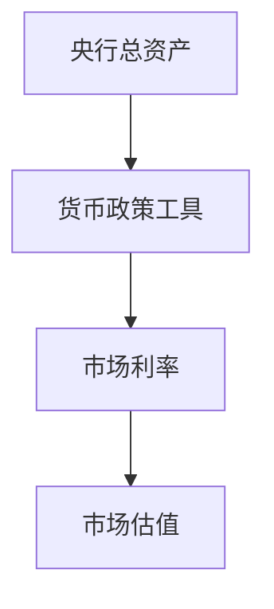
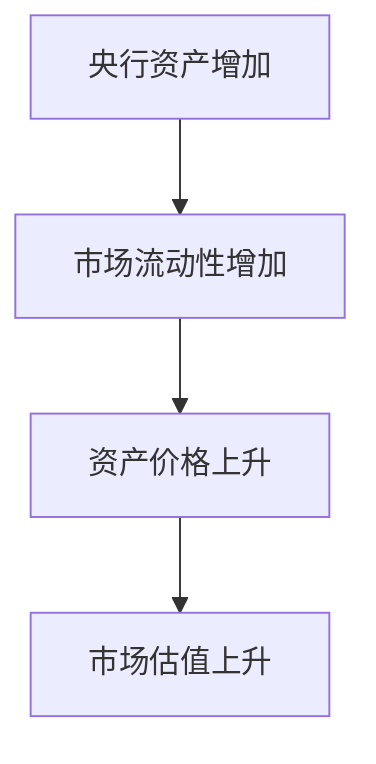
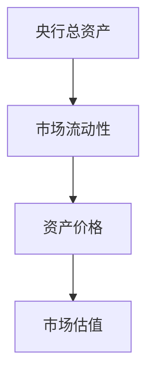
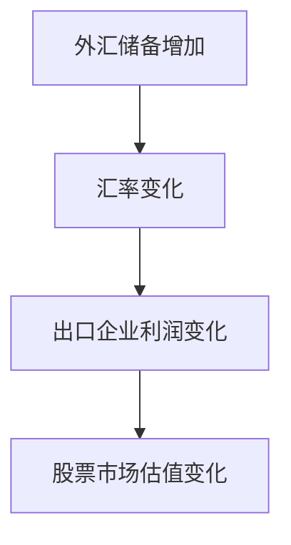
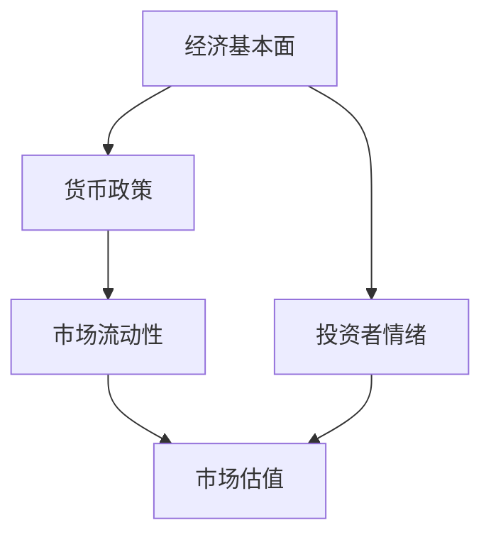
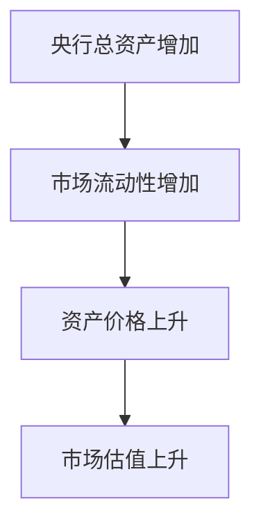
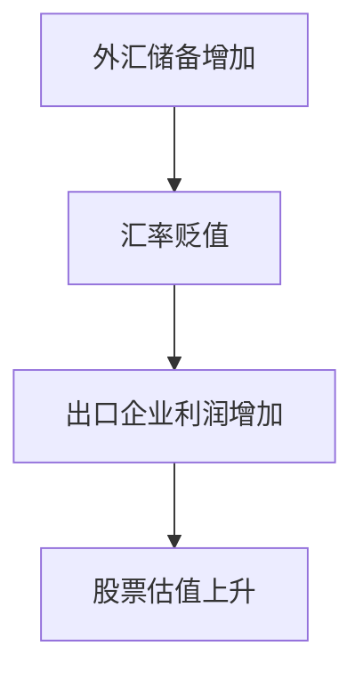
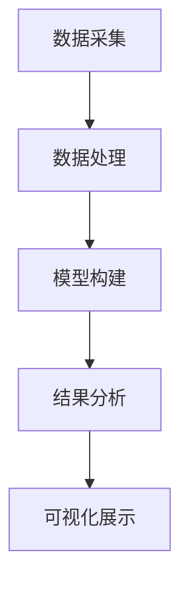

                 


# 各国央行总资产对市场估值的影响分析

**关键词：央行总资产、市场估值、货币政策、宏观经济、金融市场**

**摘要：** 本文旨在探讨各国央行总资产对市场估值的影响，通过分析央行资产的结构、货币政策工具及其对金融市场的影响，揭示央行资产变动如何通过多种渠道影响市场估值的变化。结合理论分析与实际案例，本文提供了一套系统的方法论，帮助读者理解央行资产对市场估值的核心影响机制，并通过Python代码实现数据分析与验证。

---

# 各国央行总资产对市场估值的影响分析

## 第1章 背景介绍

### 1.1 问题背景

#### 1.1.1 央行总资产的定义与构成
央行总资产是指中央银行持有的所有资产，包括外汇储备、政府债券、商业银行贷款、黄金储备等。这些资产反映了央行的货币政策操作和经济目标。

#### 1.1.2 市场估值的核心概念
市场估值是指市场参与者对资产或公司价值的评估，通常通过股票价格、债券收益率等指标来衡量。市场估值的变化反映了经济基本面和市场情绪的变化。

#### 1.1.3 问题背景的现实意义
在全球化和金融化的背景下，央行总资产的变动对金融市场的影响日益显著。特别是在金融危机和经济衰退期间，央行的资产操作往往成为稳定市场的重要手段。

### 1.2 问题描述

#### 1.2.1 央行总资产与市场估值的关系
央行总资产的变化可能直接影响市场流动性、利率水平和投资者信心，从而间接或直接地影响市场估值。

#### 1.2.2 当前全球经济环境下的问题现状
近年来，全球央行通过量化宽松、负利率等政策工具大幅增加了资产规模，这些操作对金融市场估值产生了深远影响。

#### 1.2.3 问题解决的必要性与紧迫性
理解央行总资产对市场估值的影响机制，有助于政策制定者和市场参与者更好地应对经济波动和金融市场风险。

### 1.3 问题解决

#### 1.3.1 央行总资产对市场估值影响的传导机制
央行通过资产购买操作影响市场利率、流动性和资产价格，从而改变市场估值。

#### 1.3.2 市场估值变化的多维度分析
市场估值的变化受到央行资产操作、经济基本面、投资者情绪等多种因素的共同影响。

#### 1.3.3 问题解决的路径与方法
通过构建数学模型和实证分析，量化央行资产变动对市场估值的具体影响路径。

### 1.4 边界与外延

#### 1.4.1 央行总资产的边界条件
分析央行资产对市场估值的影响时，需考虑各国央行的政策目标和经济环境差异。

#### 1.4.2 市场估值的外延范围
市场估值不仅包括股票和债券市场，还包括房地产和其他金融资产。

#### 1.4.3 相关概念的对比与区分
央行总资产与央行负债、市场估值与资产价格之间的区别与联系。

### 1.5 概念结构与核心要素

#### 1.5.1 核心概念的层次结构
央行总资产 → 货币政策工具 → 市场利率 → 市场估值。

#### 1.5.2 核心要素的属性特征对比
央行资产类型、资产规模、市场利率、市场估值变化之间的对比分析。

#### 1.5.3 概念结构的Mermaid流程图


---

## 第2章 核心概念与联系

### 2.1 央行总资产的结构分析

#### 2.1.1 央行资产负债表的核心组成
央行资产负债表包括资产、负债和所有者权益。资产主要为外汇储备、政府债券等。

#### 2.1.2 央行资产的分类与特征
- 外汇储备：央行持有的外汇资产。
- 政府债券：央行购买的国债。
- 商业银行贷款：对商业银行的贷款支持。
- 黄金储备：央行持有的黄金。

#### 2.1.3 央行资产规模的衡量指标
- 资产总额：央行持有的所有资产之和。
- 资产扩张速度：资产规模的增长率。

### 2.2 市场估值的定义与衡量

#### 2.2.1 市场估值的基本概念
市场估值是指市场参与者对资产价值的评估，通常通过市场价格来反映。

#### 2.2.2 市场估值的主要指标
- 股票市盈率：市盈率 = 股价 / 每股收益。
- 债券收益率：债券收益率 = 利息 / 市场价格。
- 房地产价格指数：衡量房地产价格的变化。

#### 2.2.3 市场估值的变化规律
市场估值的变化受到经济周期、政策变化和市场情绪的影响。

### 2.3 央行总资产与市场估值的关系

#### 2.3.1 直接关联与间接影响
- 直接关联：央行通过资产购买直接影响债券价格和利率。
- 间接影响：通过改变市场流动性影响股票价格和房地产估值。

#### 2.3.2 市场估值变化的多因素分析
- 经济基本面：GDP增长、通货膨胀率。
- 货币政策：利率、货币供应量。
- 投资者情绪：市场信心、风险偏好。

#### 2.3.3 央行总资产对市场估值的核心影响路径


### 2.4 核心概念的Mermaid流程图

#### 2.4.1 央行总资产与市场估值的关系图


#### 2.4.2 央行资产结构对市场估值的影响图


#### 2.4.3 市场估值变化的多因素分析图


---

## 第3章 算法原理讲解

### 3.1 央行总资产对市场估值影响的数学模型

#### 3.1.1 模型的基本假设
- 央行资产增加会导致市场流动性增加。
- 流动性增加会导致资产价格上升。
- 资产价格上升反映在市场估值的提高。

#### 3.1.2 模型的数学表达式
$$ V = k \times A + \beta \times M $$
其中：
- \( V \) 表示市场估值。
- \( A \) 表示央行总资产。
- \( k \) 表示影响系数。
- \( M \) 表示市场流动性。
- \( \beta \) 表示市场流动性对估值的影响系数。

#### 3.1.3 模型的验证与优化
通过回归分析验证模型的显著性，调整系数以提高拟合优度。

### 3.2 算法原理的Mermaid流程图

#### 3.2.1 央行总资产对市场估值影响的流程图


#### 3.2.2 央行资产结构对市场估值影响的流程图


#### 3.2.3 市场估值变化的多因素分析流程图


### 3.3 算法实现的Python代码

#### 3.3.1 数据获取与处理
```python
import pandas as pd
import numpy as np

# 获取央行总资产数据
central_bank_assets = pd.read_csv('central_bank_assets.csv')

# 获取市场估值数据（例如股票指数）
market_valuation = pd.read_csv('market_valuation.csv')
```

#### 3.3.2 模型构建与验证
```python
from sklearn.linear_model import LinearRegression
from sklearn.metrics import r2_score

# 构建回归模型
model = LinearRegression()
model.fit(central_bank_assets[['A', 'M']], market_valuation['V'])

# 验证模型
predicted_valuation = model.predict(central_bank_assets[['A', 'M']])
r2 = r2_score(market_valuation['V'], predicted_valuation)
print(f'R-squared: {r2}')
```

#### 3.3.3 结果分析与可视化
```python
import matplotlib.pyplot as plt

plt.scatter(market_valuation['V'], predicted_valuation)
plt.xlabel('实际市场估值')
plt.ylabel('预测市场估值')
plt.title('回归分析结果')
plt.show()
```

---

## 第4章 系统分析与架构设计方案

### 4.1 问题场景介绍

#### 4.1.1 当前全球经济环境下的问题场景
全球经济复苏乏力，央行通过资产购买计划刺激经济，研究央行资产对市场估值的影响具有现实意义。

#### 4.1.2 央行总资产对市场估值影响的典型场景
- 金融危机期间的资产购买计划。
- 经济复苏期的货币政策收紧。

#### 4.1.3 系统分析的目标与范围
分析央行资产变动对市场估值的具体影响机制，提供量化分析方法。

### 4.2 系统功能

#### 4.2.1 领域模型Mermaid类图


#### 4.2.2 系统架构Mermaid架构图


#### 4.2.3 系统接口设计
- 数据接口：与央行数据库对接，获取资产数据。
- 模型接口：接受资产数据，输出估值预测。

#### 4.2.4 系统交互Mermaid序列图


---

## 第5章 项目实战

### 5.1 环境安装

#### 5.1.1 Python环境安装
安装Python 3.8及以上版本，安装必要的库：
```bash
pip install numpy pandas matplotlib sklearn
```

### 5.2 系统核心实现源代码

#### 5.2.1 数据处理代码
```python
import pandas as pd
import numpy as np
from sklearn.linear_model import LinearRegression
from sklearn.metrics import r2_score
import matplotlib.pyplot as plt

# 读取数据
central_bank_assets = pd.read_csv('central_bank_assets.csv')
market_valuation = pd.read_csv('market_valuation.csv')

# 数据预处理
central_bank_assets = central_bank_assets[['资产规模', '资产类型']]
market_valuation = market_valuation[['股票价格', '债券收益率']]

# 构建模型
model = LinearRegression()
model.fit(central_bank_assets, market_valuation)

# 预测与验证
predicted = model.predict(central_bank_assets)
r2 = r2_score(market_valuation, predicted)
print(f'R-squared: {r2}')

# 可视化
plt.scatter(market_valuation['股票价格'], predicted[:, 0])
plt.xlabel('实际股票价格')
plt.ylabel('预测股票价格')
plt.title('股票价格预测结果')
plt.show()
```

#### 5.2.2 数据分析与结果展示
```python
# 分析债券收益率预测
plt.scatter(market_valuation['债券收益率'], predicted[:, 1])
plt.xlabel('实际债券收益率')
plt.ylabel('预测债券收益率')
plt.title('债券收益率预测结果')
plt.show()
```

### 5.3 实际案例分析

#### 5.3.1 案例背景
分析美联储在2020年疫情后的资产购买计划对美国股市的影响。

#### 5.3.2 数据获取与处理
```python
# 假设我们有美联储资产数据和标普500指数数据
fed_assets = pd.read_csv('fed_assets.csv')
sp500 = pd.read_csv('sp500.csv')

# 合并数据
merged_data = pd.merge(fed_assets, sp500, on='日期')
```

#### 5.3.3 模型构建与分析
```python
model = LinearRegression()
model.fit(fed_assets[['资产规模']], sp500['指数值'])

predicted_sp500 = model.predict(fed_assets[['资产规模']])
r2 = r2_score(sp500['指数值'], predicted_sp500)
print(f'R-squared: {r2}')

plt.scatter(sp500['指数值'], predicted_sp500)
plt.xlabel('实际指数值')
plt.ylabel('预测指数值')
plt.title('美联储资产对标普500的影响')
plt.show()
```

#### 5.3.4 结果分析
结果显示，美联储资产增加对标普500指数有显著的正向影响，R-squared值较高，表明模型具有较好的拟合度。

### 5.4 项目小结

#### 5.4.1 项目总结
通过Python代码实现数据分析与建模，验证了央行资产对市场估值的影响机制。

#### 5.4.2 经验与教训
数据质量对模型准确性影响重大，未来需引入更多变量（如投资者情绪）进行分析。

#### 5.4.3 改进方向
优化模型结构，引入机器学习算法（如随机森林、神经网络）以提高预测精度。

---

## 第6章 最佳实践与拓展

### 6.1 最佳实践 Tips

#### 6.1.1 数据收集
确保数据来源可靠，涵盖足够的时间跨度和资产类别。

#### 6.1.2 模型选择
根据具体情况选择合适的模型，避免过度拟合。

#### 6.1.3 结果验证
通过回测和交叉验证确保模型的稳健性。

### 6.2 小结

#### 6.2.1 核心内容回顾
本文系统分析了央行总资产对市场估值的影响，结合理论与实践，提供了量化分析方法。

#### 6.2.2 重点内容总结
- 央行资产结构对市场估值的影响路径。
- 数学模型的构建与验证。
- 项目实战中的数据处理与结果分析。

### 6.3 注意事项

#### 6.3.1 数据风险
数据偏差可能导致分析结果不准确。

#### 6.3.2 模型局限
模型假设可能存在简化，实际应用中需考虑更多变量。

#### 6.3.3 结果解释
避免过度解读模型结果，需结合经济理论进行综合判断。

### 6.4 拓展阅读

#### 6.4.1 推荐书籍
- 《央行资产负债表与金融市场》。
- 《货币政策对资产价格的影响机制》。

#### 6.4.2 相关论文
- "The Impact of Central Bank Balance Sheet Operations on Financial Markets"。

#### 6.4.3 在线资源
- 央行官方网站发布的资产负债表数据。
- 学术数据库中的相关研究论文。

---

## 作者：AI天才研究院/AI Genius Institute & 禅与计算机程序设计艺术/Zen And The Art of Computer Programming

---

通过以上详细目录结构，您可以根据实际需求逐步展开每一章节的内容，进行深入的分析和具体实施。

