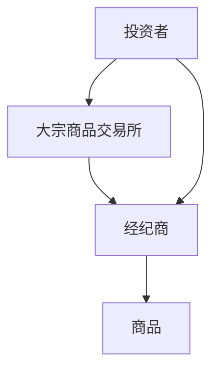
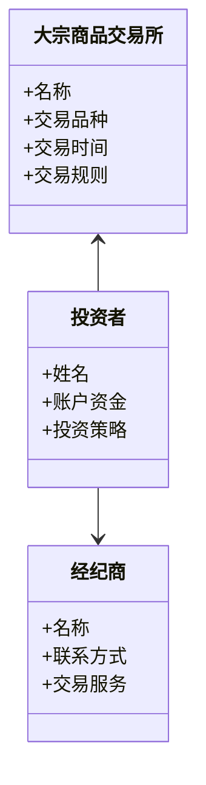

                 


# 吉姆·罗杰斯的大宗商品价值投资：实物资产中的机会

> 关键词：吉姆·罗杰斯，大宗商品，价值投资，实物资产，投资策略，市场分析

> 摘要：本文深入探讨了吉姆·罗杰斯的大宗商品投资理念，分析了大宗商品市场的周期性与波动性，结合实际案例，详细讲解了大宗商品价值评估模型，并通过系统架构设计与项目实战，为投资者提供了一套科学的大宗商品投资方法论。

---

# 第一部分: 大宗商品投资概述

## 第1章: 大宗商品的定义与历史

### 1.1 大宗商品的定义与分类

#### 1.1.1 大宗商品的定义
大宗商品是指那些具有高度流动性和标准化的实物商品，主要包括能源（如原油、天然气）、金属（如黄金、铜）和农产品（如小麦、大豆）。这些商品通常用于工业生产或消费，具有全球统一的市场定价机制。

#### 1.1.2 大宗商品的分类
大宗商品可以分为以下几类：
- **能源类**：原油、天然气、煤炭等。
- **金属类**：黄金、白银、铜、铝等。
- **农产品类**：小麦、大豆、玉米等。
- **其他类**：天然气、牲畜等。

#### 1.1.3 大宗商品的经济地位
大宗商品是全球经济的重要组成部分，它们是制造业、建筑业和农业的基本原料，价格波动对全球经济有着深远的影响。

---

### 1.2 大宗商品投资的历史与发展

#### 1.2.1 大宗商品市场的历史演变
大宗商品交易可以追溯到古代，但现代大宗商品市场的发展始于19世纪末，随着工业化进程的加快，大宗商品的需求迅速增长。

#### 1.2.2 大宗商品投资的兴起
20世纪70年代，布雷特森林体系的崩溃导致美元与黄金脱钩，推动了大宗商品金融化的进程，投资者开始将大宗商品作为资产配置的重要组成部分。

#### 1.2.3 当前大宗商品市场的特点
当前大宗商品市场具有高度的金融化和全球化特征，投资者可以通过期货、期权等多种金融工具参与交易。

---

### 1.3 吉姆·罗杰斯的投资理念

#### 1.3.1 吉姆·罗杰斯的背景介绍
吉姆·罗杰斯是美国著名投资家，毕业于耶鲁大学，曾与彼得·林奇共同管理富达基金，取得了令人瞩目的投资业绩。罗杰斯是最早意识到大宗商品投资机会的投资者之一。

#### 1.3.2 罗杰斯的商品投资哲学
罗杰斯认为，大宗商品是抵御通货膨胀的最佳对冲工具，长期来看，大宗商品的价格走势与美元密切相关。他强调分散投资和长期持有。

#### 1.3.3 罗杰斯的投资策略
罗杰斯的投资策略包括：
- 长期持有优质资产。
- 分散投资以降低风险。
- 顺势而为，顺势投资。

---

## 第2章: 大宗商品市场的周期性与波动性

### 2.1 大宗商品市场的周期性分析

#### 2.1.1 商品市场的周期性规律
大宗商品市场具有明显的周期性，通常分为以下几个阶段：
1. **复苏阶段**：市场需求逐步恢复，价格上涨。
2. **增长阶段**：需求持续增长，价格上涨加速。
3. **繁荣阶段**：供不应求，价格大幅上涨。
4. **衰退阶段**：需求下降，价格暴跌。

#### 2.1.2 经济周期对大宗商品的影响
经济周期对大宗商品价格的影响主要体现在以下几个方面：
- **复苏阶段**：大宗商品需求增加，价格上涨。
- **繁荣阶段**：大宗商品价格达到峰值。
- **衰退阶段**：大宗商品价格下跌。

#### 2.1.3 政治周期对大宗商品的影响
政治因素对大宗商品价格的影响也十分显著，例如地缘政治冲突、贸易政策变化等都会影响大宗商品价格。

---

### 2.2 大宗商品市场的波动性分析

#### 2.2.1 商品价格波动的原因
商品价格波动的原因主要包括：
- 市场供需变化。
- 宏观经济政策。
- 地缘政治因素。

#### 2.2.2 市场情绪对价格波动的影响
市场情绪对大宗商品价格波动的影响不容忽视，投资者的乐观或悲观情绪会导致价格的大幅波动。

#### 2.2.3 技术分析在大宗商品投资中的应用
技术分析是大宗商品投资中常用的工具，主要包括趋势分析、成交量分析等。

---

## 第3章: 大宗商品投资的核心概念与联系

### 3.1 核心概念原理

#### 3.1.1 商品的价值评估
商品的价值评估主要基于其内在价值，包括生产成本、供需关系等因素。

#### 3.1.2 商品的供需关系
供需关系是影响大宗商品价格的核心因素，供不应求时价格上涨，供过于求时价格下跌。

#### 3.1.3 商品市场的流动性
市场的流动性影响商品的价格波动，流动性越高，价格波动越剧烈。

---

### 3.2 核心概念对比表格

#### 3.2.1 不同大宗商品的属性对比
| 商品类型 | 主要用途 | 价格波动 | 市场流动性 |
|----------|----------|----------|------------|
| 能源类   | 工业生产 | 高       | 高          |
| 金属类   | 制造业   | 中       | 中          |
| 农产品类 | 食品加工 | 低       | 低          |

#### 3.2.2 商品与金融资产的对比
| 资产类型 | 收益来源 | 风险水平 | 流动性 |
|----------|----------|----------|--------|
| 商品     | 价格波动 | 高       | 高      |
| 金融资产 | 利息、股息 | 中 | 高      |

---

### 3.3 ER实体关系图

#### 3.3.1 商品市场实体关系图


---

## 第4章: 大宗商品投资的数学模型与公式

### 4.1 数学模型

#### 4.1.1 商品价格预测模型
商品价格预测模型可以基于时间序列分析，常用ARIMA模型。

#### 4.1.2 商品价值评估模型
商品价值评估模型可以基于现金流折现法，公式如下：

$$ V = \sum_{t=1}^{n} \frac{CF_t}{(1+r)^t} $$

其中，$CF_t$ 是第$t$年的现金流，$r$是折现率。

---

## 第5章: 系统分析与架构设计方案

### 5.1 问题场景介绍

#### 5.1.1 大宗商品投资的复杂性
大宗商品投资涉及多种因素，包括宏观经济、地缘政治等，投资者需要综合考虑。

#### 5.1.2 投资者面临的挑战
投资者面临的挑战包括信息不对称、价格波动剧烈、市场流动性不足等。

#### 5.1.3 系统化投资的必要性
系统化投资可以帮助投资者更好地把握市场规律，降低投资风险。

---

### 5.2 项目介绍

#### 5.2.1 项目目标
构建一个大宗商品投资分析系统，帮助投资者进行市场分析、风险评估和投资决策。

#### 5.2.2 项目范围
系统功能包括数据采集、数据分析、投资策略制定等。

#### 5.2.3 项目团队
项目团队包括数据分析师、软件开发人员、投资专家等。

---

### 5.3 系统功能设计

#### 5.3.1 领域模型Mermaid类图


---

## 第6章: 项目实战

### 6.1 环境配置

#### 6.1.1 Python环境安装
需要安装Python 3.8及以上版本。

#### 6.1.2 数据库安装
建议使用MySQL或PostgreSQL数据库。

---

### 6.2 系统核心实现

#### 6.2.1 商品价格预测模型实现
```python
import pandas as pd
from statsmodels.tsa.arima_model import ARIMA

# 加载数据
data = pd.read_csv('commodity_prices.csv')

# 训练模型
model = ARIMA(data, order=(5, 1, 0))
model_fit = model.fit()

# 预测未来价格
future_forecast = model_fit.forecast(steps=10)
print(future_forecast)
```

#### 6.2.2 商品价值评估模型实现
```python
def discounted_cash_flow(cash_flows, discount_rate):
    return sum(cash_flow / (1 + discount_rate)**t for t, cash_flow in enumerate(cash_flows))

# 示例数据
cash_flows = [100, 200, 300, 400]
discount_rate = 0.05

# 计算内在价值
intrinsic_value = discounted_cash_flow(cash_flows, discount_rate)
print(intrinsic_value)
```

---

### 6.3 案例分析

#### 6.3.1 现实案例分析
以原油为例，分析其价格波动和投资机会。

#### 6.3.2 系统实现案例
使用上述模型对原油价格进行预测，并制定相应的投资策略。

---

## 第7章: 最佳实践、小结与注意事项

### 7.1 最佳实践
- 投资者应根据自身风险承受能力选择合适的大宗商品。
- 大宗商品投资应结合宏观经济分析和市场趋势分析。

### 7.2 小结
本文通过分析吉姆·罗杰斯的大宗商品投资理念，结合数学模型和系统设计，为投资者提供了一套科学的大宗商品投资方法论。

### 7.3 注意事项
- 投资者应避免盲目跟风，注重风险控制。
- 大宗商品投资应结合长期趋势，避免短期波动干扰。

---

## 第8章: 拓展阅读

### 8.1 相关书籍
- 《投资杰克逊》
- 《大宗商品投资策略》

### 8.2 相关网站
- [商品期货交易委员会](https://www.cftc.gov)
- [彭博大宗商品指数](https://www.bloomberg.com/commodities)

---

作者：AI天才研究院 & 禅与计算机程序设计艺术

---

**注**：本文部分内容可能涉及复杂的数学公式和系统设计，具体实现细节可根据实际需求进一步调整。

