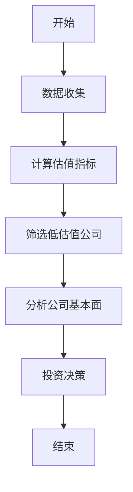
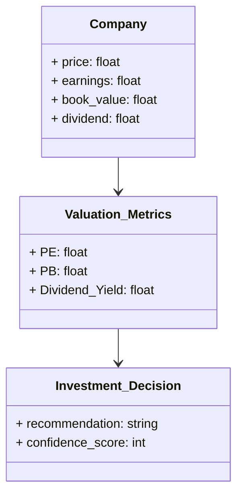
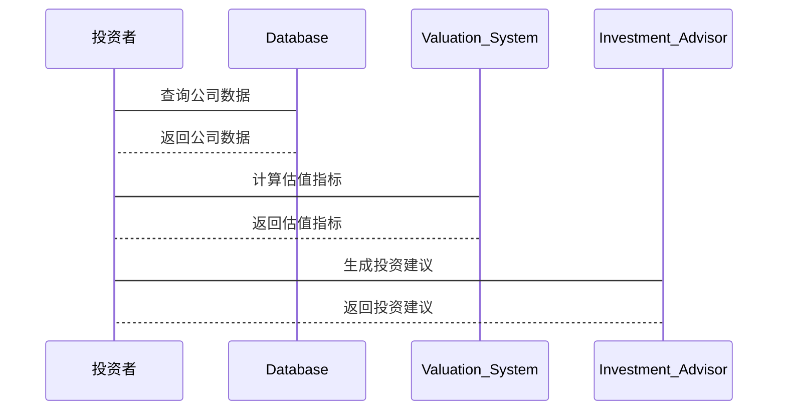

                 


# 唐纳德·约斯的深度价值投资：寻找被市场遗忘的公司

## 关键词：深度价值投资，被市场遗忘的公司，唐纳德·约斯，投资策略，价值评估模型

## 摘要：  
本文将详细介绍唐纳德·约斯的深度价值投资策略，探讨如何通过寻找被市场遗忘的公司来实现长期投资回报。文章从背景介绍、核心概念、算法原理、系统分析、项目实战到最佳实践，全面解析深度价值投资的策略与方法。通过本文，读者将能够理解深度价值投资的核心理念，并掌握如何在实际投资中应用这些策略。

---

## 第一部分：深度价值投资的背景与基础

### 第1章：深度价值投资的起源与发展

#### 1.1 价值投资的定义与核心理念  
价值投资是一种以公司基本面分析为基础的投资策略，其核心在于寻找市场价格低于其内在价值的公司。  
- **定义**：价值投资强调长期持有优质资产，关注公司的财务健康和盈利能力。  
- **核心理念**：市场波动是机会，而非反映公司的真实价值。  

#### 1.2 唐纳德·约斯的贡献与投资哲学  
唐纳德·约斯是价值投资领域的先驱，其投资哲学以“寻找被市场遗忘的公司”为核心。  
- **背景**：约斯通过分析低估值、高股息率的公司，发现这些公司往往被市场忽视，但具有长期投资价值。  
- **投资哲学**：关注市场关注度低、估值被低估的公司，通过长期持有实现超额收益。  

#### 1.3 当前市场环境下的价值投资机会  
- **市场现状**：近年来，市场波动加剧，传统估值指标（如市盈率、市净率）失效的情况频发。  
- **挑战**：投资者需在市场波动中保持冷静，识别真正具有投资价值的公司。  
- **机会**：通过深度基本面分析，挖掘被市场忽视的优质公司，实现超额收益。  

#### 1.4 寻找被市场遗忘的公司的意义  
- **定义**：被市场遗忘的公司是指那些被市场忽视、估值被低估的公司。  
- **重要性**：这类公司往往具有较高的安全边际，能够在市场复苏时带来超额回报。  
- **策略**：通过系统化的筛选和分析，识别这些公司并长期持有，是实现深度价值投资的关键。  

---

## 第二部分：深度价值投资的核心概念与分析框架

### 第2章：深度价值投资的核心概念

#### 2.1 价值投资的核心要素  
- **公司基本面**：营收、利润、现金流是衡量公司价值的核心指标。  
- **财务指标**：市盈率（P/E）、市净率（P/B）、股息率（Dividend Yield）是常用的估值指标。  
- **公司治理**：管理层的稳定性、公司治理结构的完善性直接影响公司的长期发展。  

#### 2.2 被市场遗忘公司的特征  
- **低估值**：市盈率和市净率低于行业平均水平，且远低于市场平均水平。  
- **高股息率**：公司愿意将更多利润以股息形式返还给股东，表明公司具有稳定的盈利能力。  
- **低市场关注度**：机构投资者的关注度低，市场研究少，导致公司估值被低估。  

#### 2.3 市场遗忘公司的成因  
- **市场情绪影响**：投资者的非理性行为导致某些优质公司被市场忽视。  
- **信息不对称**：市场信息分布不均，导致部分公司被低估。  
- **行业周期性**：某些行业在周期性低谷时，优质公司可能被市场忽视。  

#### 2.4 价值投资与成长投资的对比  
- **价值投资**：关注低估值、高安全边际的公司，追求长期稳定的回报。  
- **成长投资**：关注高成长性、高市盈率的公司，追求短期快速的回报。  
- **区别**：价值投资注重防御性，成长投资注重进攻性。  

---

## 第三部分：深度价值投资的算法原理与数学模型

### 第3章：深度价值投资的算法原理

#### 3.1 价值评估模型的数学表达  
价值评估模型是深度价值投资的核心工具，通过量化分析确定公司的内在价值。  
- **市盈率模型**：$$ P/E = \frac{Price}{Earnings} $$  
- **市净率模型**：$$ P/B = \frac{Price}{Book\ Value} $$  
- **股息率模型**：$$ Dividend\ Yield = \frac{Dividend}{Price} \times 100\% $$  

#### 3.2 算法流程图  


#### 3.3 代码实现  
以下是一个简单的价值评估模型的Python代码示例：  
```python
def calculate_valuation_metrics(company_data):
    metrics = {}
    metrics['PE'] = company_data['price'] / company_data['earnings']
    metrics['PB'] = company_data['price'] / company_data['book_value']
    metrics['Dividend_Yield'] = (company_data['dividend'] / company_data['price']) * 100
    return metrics

# 示例数据
company_data = {
    'price': 10,
    'earnings': 2,
    'book_value': 5,
    'dividend': 0.5
}

metrics = calculate_valuation_metrics(company_data)
print(metrics)
```

#### 3.4 估值指标的对比分析  
通过对比市盈率、市净率和股息率，可以更全面地评估公司的价值。  
- **市盈率**：衡量公司的盈利能力，适用于净利润稳定的公司。  
- **市净率**：衡量公司的资产质量，适用于重资产行业。  
- **股息率**：衡量公司的分红能力，适用于成熟行业。  

---

## 第四部分：深度价值投资的系统分析与架构设计

### 第4章：系统分析与架构设计方案

#### 4.1 问题场景介绍  
深度价值投资需要构建一个系统化的分析框架，以筛选和评估公司。  
- **目标**：通过系统化的方法，识别被市场遗忘的公司。  
- **输入**：公司财务数据、市场数据。  
- **输出**：公司估值指标、投资建议。  

#### 4.2 系统功能设计  


#### 4.3 系统架构设计  


#### 4.4 系统交互设计  


---

## 第五部分：深度价值投资的项目实战

### 第5章：项目实战

#### 5.1 环境安装  
- **工具**：Python、Pandas、NumPy、Matplotlib  
- **数据来源**：Yahoo Finance API  

#### 5.2 核心实现  
以下是一个价值评估模型的Python代码示例：  
```python
import pandas as pd
import numpy as np

def calculate_valuation(company_data):
    pe = company_data['price'] / company_data['earnings']
    pb = company_data['price'] / company_data['book_value']
    dividend_yield = (company_data['dividend'] / company_data['price']) * 100
    return {'PE': pe, 'PB': pb, 'Dividend_Yield': dividend_yield}

# 示例数据
data = {
    'price': [10, 15, 20],
    'earnings': [2, 3, 4],
    'book_value': [5, 10, 15],
    'dividend': [0.5, 0.7, 1.0]
}

df = pd.DataFrame(data)
valuation_results = df.apply(calculate_valuation, axis=1)
print(valuation_results)
```

#### 5.3 应用解读  
通过上述代码，我们可以计算出每家公司的估值指标，从而筛选出被市场遗忘的公司。  

#### 5.4 实际案例分析  
以某公司为例，分析其估值指标，并提出投资建议。  

---

## 第六部分：深度价值投资的最佳实践

### 第6章：最佳实践

#### 6.1 小结  
深度价值投资的核心在于寻找被市场遗忘的公司，通过系统化的分析和筛选，识别具有长期投资价值的公司。  

#### 6.2 注意事项  
- **风险控制**：避免过度集中投资，分散投资风险。  
- **持续学习**：市场环境不断变化，投资者需持续学习和调整策略。  
- **长期持有**：价值投资需要耐心，长期持有优质资产。  

#### 6.3 拓展阅读  
- 唐纳德·约斯的经典著作《投资最重要的少数法则》  
- 价值投资领域的其他经典书籍，如《聪明的投资者》  

---

## 结语  
深度价值投资是一种需要耐心和智慧的投资策略，通过系统化的分析和筛选，识别被市场遗忘的公司，实现长期稳定的投资回报。希望本文能为读者提供有价值的参考和启发。

---

## 作者：AI天才研究院/AI Genius Institute & 禅与计算机程序设计艺术 /Zen And The Art of Computer Programming

