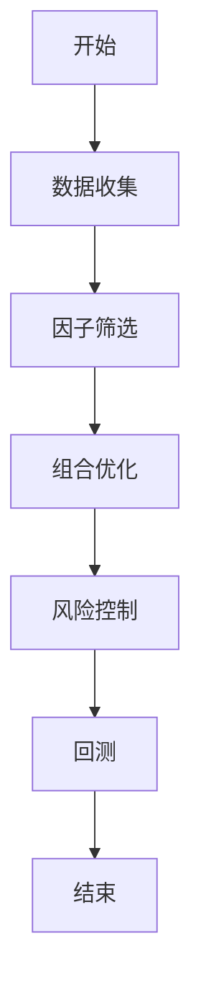
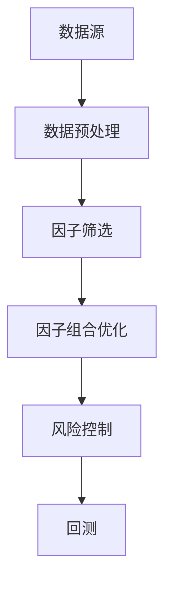
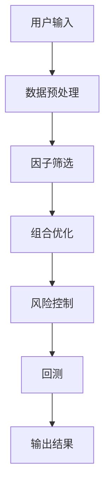

                 


# 因子投资：系统性捕捉超额收益的方法

> **关键词**：因子投资，超额收益，风险控制，多因子模型，系统性投资策略  
>
> **摘要**：本文系统性地介绍因子投资的核心概念、构建方法、算法原理及系统性捕捉超额收益的方法。通过理论与实践结合，详细阐述因子投资的背景、因子模型的构建、因子投资的系统性方法、因子投资的算法原理、系统分析与架构设计，以及项目实战等内容。旨在为读者提供一个全面、深入且易于理解的因子投资知识框架，帮助投资者系统性地捕捉超额收益。

---

# 第一部分: 因子投资的背景与基础

## 第1章: 因子投资的背景与概念

### 1.1 因子投资的定义与背景

#### 1.1.1 传统投资与因子投资的对比
传统投资通常基于个股选择、基本面分析或技术分析，而因子投资则是通过系统性地捕捉资产价格中的规律性因素（因子），构建投资组合以实现超额收益。因子投资将复杂的资产价格波动简化为几个可解释的因子，从而为投资者提供一种更系统化、可量化的投资方法。

#### 1.1.2 因子投资的核心概念
因子投资的核心在于识别能够解释资产收益差异的因子，并通过这些因子构建投资组合。常见的因子包括市值、价值、动量、质量、股息率等。因子投资的目标是通过这些因子的组合，系统性地捕捉市场中的超额收益。

#### 1.1.3 因子投资的发展历程
因子投资的理论基础可以追溯到CAPM和APT模型，但真正的发展得益于Fama-French三因子模型以及后续的多因子模型。近年来，随着大数据和机器学习技术的发展，因子投资方法也在不断演进。

### 1.2 因子投资的理论基础

#### 1.2.1 CAPM与APT模型
CAPM（资本资产定价模型）是因子投资的理论基础之一，它假设资产的预期收益与市场风险相关。APT（套利定价理论）则进一步提出资产收益可以通过多个因子解释。

#### 1.2.2 Fama-French三因子模型
Fama-French模型引入了市值和价值两个因子，扩展了CAPM的单因子模型，能够更好地解释资产收益的差异性。

#### 1.2.3 因子投资的理论框架
因子投资的理论框架包括因子的识别、因子模型的构建、因子组合的优化以及因子投资组合的风险控制。

### 1.3 因子投资的应用场景

#### 1.3.1 股票市场中的因子投资
在股票市场中，因子投资广泛应用于资产配置、风险管理以及投资组合优化。

#### 1.3.2 债券市场中的因子投资
债券市场的因子投资主要关注信用风险、利率风险等因子，帮助投资者更好地捕捉债券市场的超额收益。

#### 1.3.3 其他资产类别中的应用
因子投资不仅适用于股票和债券，还可以扩展到房地产、商品等其他资产类别。

### 1.4 因子投资的优缺点

#### 1.4.1 因子投资的优势
- 系统性：通过因子模型系统性地捕捉市场中的超额收益。
- 可解释性：因子投资模型通常具有较高的可解释性，便于投资者理解和优化。
- 适用性广：适用于多种资产类别和市场环境。

#### 1.4.2 因子投资的局限性
- 市场变化：因子的有效性可能随市场环境的变化而变化。
- 过度拟合：在因子筛选过程中可能存在过度拟合的问题。
- 风险控制：因子投资组合的风险控制需要谨慎处理，以避免尾部风险。

#### 1.4.3 因子投资的未来发展
随着人工智能和大数据技术的发展，因子投资将更加智能化和个性化，同时也会更加注重风险管理和因子的动态调整。

### 1.5 本章小结
本章介绍了因子投资的定义、背景、理论基础、应用场景及其优缺点，为后续章节的深入分析奠定了基础。

---

## 第2章: 因子模型的构建与选择

### 2.1 因子的定义与分类

#### 2.1.1 常见因子类型
- 市值因子（Size）
- 价值因子（Value）
- 动量因子（Momentum）
- 质量因子（Quality）
- 股息率因子（Dividend Yield）

#### 2.1.2 因子的分类标准
- 统计学标准：基于统计显著性筛选因子。
- 经济学标准：基于资产定价理论选择因子。
- 计算机科学标准：基于数据挖掘和机器学习算法筛选因子。

#### 2.1.3 因子的属性特征对比表格
下表展示了常见因子的属性对比：

| 因子类型 | 定义 | 计算方法 | 主要影响 |
|----------|------|----------|----------|
| 市值因子 | 衡量公司规模 | 市值（Market Cap） | 公司规模对收益的影响 |
| 价值因子 | 衡量股票的便宜程度 | 市盈率（P/E）、市净率（P/B） | 价值洼地的收益 |
| 动量因子 | 衡量股票价格的动量效应 | 过去一段时间的收益率 | 动量效应的收益 |
| 质量因子 | 衡量公司的财务健康状况 | 利润率、杠杆率 | 公司质量对收益的影响 |
| 股息率因子 | 衡量股票的股息收益率 | 股息率（Dividend Yield） | 股息收益率对收益的影响 |

---

### 2.2 因子选择的策略

#### 2.2.1 基于统计的方法
- 回归分析：通过回归分析筛选显著的因子。
- 主成分分析（PCA）：通过主成分分析提取因子。

#### 2.2.2 基于经济理论的方法
- 基于CAPM和APT模型的因子筛选。
- 基于资产定价理论的因子选择。

#### 2.2.3 基于机器学习的方法
- 线性回归：用于因子筛选。
- 支持向量机（SVM）：用于因子分类。
- 随机森林：用于因子重要性分析。

---

### 2.3 因子模型的构建步骤

#### 2.3.1 数据收集与预处理
- 数据来源：股票价格、财务数据、市场数据等。
- 数据清洗：处理缺失值、异常值等。
- 数据标准化：对数据进行标准化处理。

#### 2.3.2 因子筛选与提取
- 因子筛选：通过统计方法或机器学习方法筛选出显著的因子。
- 因子提取：通过主成分分析等方法提取因子。

#### 2.3.3 模型验证与优化
- 回测：通过回测验证因子模型的性能。
- 参数优化：优化因子模型的参数。

---

### 2.4 因子模型的评估指标

#### 2.4.1 因子的有效性
- 因子的解释能力：因子对收益的解释能力。
- 因子的显著性：因子的统计显著性。

#### 2.4.2 因子的稳定性
- 因子的稳定性：因子在不同时间段的稳定性。

#### 2.4.3 因子的可解释性
- 因子的可解释性：因子是否易于理解和解释。

---

### 2.5 本章小结
本章详细介绍了因子的定义与分类、因子选择的策略、因子模型的构建步骤以及因子模型的评估指标，为后续章节的因子投资策略奠定了基础。

---

## 第3章: 因子投资的系统性方法

### 3.1 因子组合的构建

#### 3.1.1 单一因子投资
- 单一因子投资的优缺点：简单易懂，但风险较高。
- 单一因子投资的案例分析：以市值因子为例，构建单一因子投资组合。

#### 3.1.2 多因子组合构建
- 多因子组合的构建方法：通过因子筛选和组合优化构建多因子组合。
- 多因子组合的案例分析：以Fama-French三因子模型为例，构建多因子组合。

#### 3.1.3 因子权重的确定
- 等权重法：将所有因子赋予相同的权重。
- 优化权重法：通过优化算法确定因子权重。

---

### 3.2 因子投资的风险控制

#### 3.2.1 风险模型的构建
- 风险因子的识别：识别影响投资组合风险的因子。
- 风险模型的构建：通过因子模型构建风险模型。

#### 3.2.2 风险调整后的因子组合
- 风险调整后的因子组合构建：通过风险调整后的因子组合优化投资组合。

#### 3.2.3 风险因子的动态调整
- 风险因子的动态调整方法：根据市场环境动态调整风险因子。

---

### 3.3 因子投资的系统性框架

#### 3.3.1 系统性框架的设计理念
- 系统性框架的核心理念：通过系统性地构建因子组合和风险模型，捕捉市场中的超额收益。

#### 3.3.2 系统性框架的实现步骤
- 数据收集与预处理：收集和处理相关数据。
- 因子筛选与提取：筛选和提取显著的因子。
- 因子组合优化：优化因子组合。
- 风险控制：构建风险模型并进行风险调整。

#### 3.3.3 系统性框架的应用案例
- 系统性框架的应用案例：以股票市场为例，构建系统性因子投资组合。

---

### 3.4 系统性框架的实现

#### 3.4.1 系统性框架的代码实现
- 系统性框架的代码实现：使用Python编写因子投资系统的代码。
- 代码示例：
  ```python
  import pandas as pd
  import numpy as np

  # 数据预处理
  df = pd.read_csv('data.csv')
  df = df.dropna()

  # 因子筛选
  factors = df[['market_cap', 'value', 'momentum', 'quality', 'dividend_yield']]
  target = df['return']

  # 因子组合优化
  from sklearn.linear_model import LinearRegression
  model = LinearRegression()
  model.fit(factors, target)
  ```

#### 3.4.2 系统性框架的优化与调整
- 系统性框架的优化：优化因子组合和风险模型。
- 系统性框架的调整：根据市场变化动态调整因子组合和风险模型。

#### 3.4.3 系统性框架的测试与验证
- 系统性框架的回测：通过回测验证系统性框架的性能。
- 系统性框架的优化：根据回测结果优化系统性框架。

---

### 3.5 本章小结
本章详细介绍了因子组合的构建、因子投资的风险控制以及因子投资的系统性框架，为后续章节的因子投资策略提供了系统性方法。

---

## 第4章: 因子投资的算法原理

### 4.1 因子筛选算法

#### 4.1.1 基于统计的因子筛选
- 回归分析：通过回归分析筛选显著的因子。
- 主成分分析（PCA）：通过主成分分析提取因子。

#### 4.1.2 基于机器学习的因子筛选
- 线性回归：用于因子筛选。
- 随机森林：用于因子重要性分析。

---

### 4.2 因子组合优化算法

#### 4.2.1 基于均值-方差优化的组合构建
- 均值-方差优化的原理：通过均值-方差优化构建最优投资组合。
- 代码示例：
  ```python
  import numpy as np
  from scipy.optimize import minimize

  # 定义目标函数
  def objective(weights, returns):
      return -np.sum(weights * returns)

  # 定义约束条件
  constraints = [{'type': 'eq', 'fun': lambda w: np.sum(w) - 1}]

  # 优化
  weights = minimize(objective, np.zeros(n_assets), constraints)
  ```

#### 4.2.2 基于黑塞矩阵优化的组合构建
- 黑塞矩阵优化的原理：通过黑塞矩阵优化构建投资组合。
- 代码示例：
  ```python
  import numpy as np

  # 定义目标函数
  def objective(weights, returns, covariance):
      return (weights.T @ covariance @ weights - 0.5 * np.sum(weights**2))

  # 优化
  weights = np.linalg.solve(covariance, returns)
  ```

#### 4.2.3 基于遗传算法的组合优化
- 遗传算法的原理：通过遗传算法优化因子组合。
- 代码示例：
  ```python
  import numpy as np
  import random

  # 初始化种群
  population = np.random.rand(n_pop, n_assets)

  # 计算适应度
  def fitness(individual):
      return np.sum(individual * returns)

  # 进行选择、交叉和变异操作
  # ...
  ```

---

### 4.3 因子投资的数学模型

#### 4.3.1 因子模型的数学表达
- 因子模型的数学表达式：
  $$ R_i = \alpha + \beta_1 F_1 + \beta_2 F_2 + \ldots + \beta_k F_k + \epsilon $$
  其中，\( R_i \) 是资产 \( i \) 的收益，\( F_j \) 是因子 \( j \)，\( \beta_j \) 是因子的权重，\( \epsilon \) 是误差项。

#### 4.3.2 因子组合优化的数学公式
- 均值-方差优化的数学公式：
  $$ \min_w \left( w^T \Sigma w \right) $$
  约束条件：
  $$ w^T \mu = 1 $$
  $$ w \geq 0 $$

#### 4.3.3 因子风险模型的数学公式
- 风险模型的数学表达式：
  $$ \Sigma = \sum_{j=1}^k \lambda_j F_j F_j^T $$
  其中，\( \lambda_j \) 是因子 \( j \) 的风险载荷。

---

### 4.4 算法实现与案例分析

#### 4.4.1 算法实现的代码示例
- 代码示例：
  ```python
  import numpy as np
  from sklearn.linear_model import LinearRegression

  # 数据预处理
  df = pd.read_csv('data.csv')
  df = df.dropna()

  # 因子筛选
  factors = df[['market_cap', 'value', 'momentum', 'quality', 'dividend_yield']]
  target = df['return']

  # 因子组合优化
  model = LinearRegression()
  model.fit(factors, target)
  ```

#### 4.4.2 算法实现的案例分析
- 案例分析：以股票市场为例，构建因子投资组合。

---

### 4.5 本章小结
本章详细介绍了因子筛选算法、因子组合优化算法以及因子投资的数学模型，为后续章节的系统性框架设计奠定了基础。

---

## 第5章: 系统分析与架构设计

### 5.1 系统功能设计

#### 5.1.1 系统功能模块
- 数据收集模块：收集市场数据、财务数据等。
- 因子筛选模块：筛选和提取因子。
- 组合优化模块：优化因子组合。
- 风险控制模块：构建风险模型并进行风险调整。
- 回测模块：回测因子投资组合的性能。

#### 5.1.2 系统功能流程图
以下是系统功能流程图：



---

### 5.2 系统架构设计

#### 5.2.1 系统架构图
以下是系统架构图：



---

### 5.3 接口设计与交互

#### 5.3.1 系统接口设计
- 数据接口：与数据源对接，获取市场数据和财务数据。
- 因子筛选接口：与因子筛选模块对接，获取筛选后的因子。
- 组合优化接口：与组合优化模块对接，获取优化后的因子组合。

#### 5.3.2 系统交互流程图
以下是系统交互流程图：



---

## 第6章: 项目实战

### 6.1 环境安装与配置

#### 6.1.1 安装Python环境
- 使用Anaconda安装Python环境。
- 安装必要的库：pandas、numpy、scipy、sklearn等。

#### 6.1.2 数据源配置
- 数据源：可以选择Yahoo Finance、Google Finance等。

---

### 6.2 核心代码实现

#### 6.2.1 因子筛选代码
```python
import pandas as pd
import numpy as np
from sklearn.linear_model import LinearRegression

# 数据预处理
df = pd.read_csv('data.csv')
df = df.dropna()

# 因子筛选
factors = df[['market_cap', 'value', 'momentum', 'quality', 'dividend_yield']]
target = df['return']

# 因子组合优化
model = LinearRegression()
model.fit(factors, target)
```

#### 6.2.2 因子组合优化代码
```python
import numpy as np
from scipy.optimize import minimize

# 定义目标函数
def objective(weights, returns):
    return -np.sum(weights * returns)

# 定义约束条件
constraints = [{'type': 'eq', 'fun': lambda w: np.sum(w) - 1}]

# 优化
weights = minimize(objective, np.zeros(n_assets), constraints)
```

---

### 6.3 案例分析与结果解读

#### 6.3.1 案例分析
以股票市场为例，构建因子投资组合，回测其性能。

#### 6.3.2 回测结果解读
- 回测收益：因子投资组合的平均收益、夏普比率等。
- 风险控制：因子投资组合的风险调整后的收益。

---

### 6.4 项目小结
本章通过项目实战，详细介绍了因子投资系统的环境配置、核心代码实现以及案例分析，帮助读者更好地理解和应用因子投资方法。

---

## 第7章: 最佳实践与小结

### 7.1 最佳实践 tips

#### 7.1.1 因子选择的注意事项
- 确保因子的可解释性和稳定性。
- 避免过度拟合。

#### 7.1.2 系统性框架的优化
- 定期更新因子模型。
- 动态调整因子组合。

#### 7.1.3 风险控制的关键点
- 定期监控风险因子。
- 根据市场环境动态调整风险模型。

---

### 7.2 小结

#### 7.2.1 因子投资的核心要点
- 因子投资的核心在于识别能够解释资产收益差异的因子，并通过这些因子构建投资组合。
- 系统性框架是捕捉超额收益的关键。

#### 7.2.2 未来发展方向
- 结合人工智能技术，进一步优化因子筛选和组合优化。
- 扩展因子投资在不同资产类别中的应用。

---

## 作者信息

**作者：** AI天才研究院/AI Genius Institute & 禅与计算机程序设计艺术 /Zen And The Art of Computer Programming

---

# 结语

通过本文的系统性介绍，读者可以全面了解因子投资的核心概念、构建方法、算法原理及系统性捕捉超额收益的方法。无论是理论还是实践，因子投资都为投资者提供了一种系统化、可量化的投资方法，帮助投资者在复杂多变的市场中捕捉超额收益。

