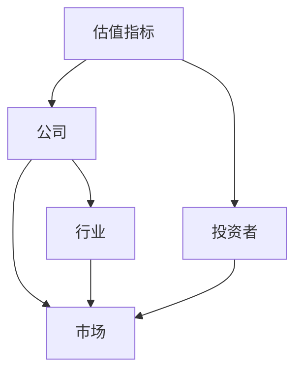

                 


# 国际市场估值指标的局限性探讨

## 关键词：
国际市场估值指标、局限性、市盈率、市净率、股息率、技术分析、基本面分析

## 摘要：
本文探讨了国际市场估值指标的局限性，分析了常见估值指标如市盈率、市净率和股息率的计算方法和应用场景，揭示了它们在实际投资中的不足之处。通过数学模型和系统架构的设计，展示了如何在项目中应用这些指标，并通过实际案例分析说明其局限性。最后，提出了最佳实践建议，帮助投资者更好地理解和应用这些指标。

---

## 第一章：估值指标概述

### 1.1 估值指标的基本概念

#### 1.1.1 估值指标的定义与作用
估值指标是衡量公司或资产价值的重要工具，帮助投资者判断其是否被市场低估或高估。常见的估值指标包括市盈率（P/E）、市净率（P/B）和股息率（Dividend Yield）等。

#### 1.1.2 国际市场估值的独特性
国际市场涉及不同国家和文化背景，经济政策和市场环境差异显著，导致估值指标的应用具有地域性限制。

#### 1.1.3 估值指标的核心要素
- 公司基本面数据：收入、利润、资产等。
- 市场价格：股票的市价或资产的交易价格。
- 财务指标：市盈率、市净率等。

---

## 第二章：估值指标的核心概念与联系

### 2.1 估值指标的核心原理

#### 2.1.1 估值指标的数学模型
- 市盈率（P/E）：$$P/E = \frac{P}{E}$$
- 市净率（P/B）：$$P/B = \frac{P}{B}$$

#### 2.1.2 估值指标的计算方法
以市盈率为例，计算公式为：$$P/E = \frac{股票价格}{每股收益}$$

#### 2.1.3 估值指标的适用场景
- 市盈率适用于盈利稳定的公司，市净率适用于资产密集型行业。

### 2.2 估值指标的属性特征对比

以下表格对比了市盈率、市净率和股息率的属性特征：

| 指标名称 | 主要用途 | 优点 | 缺点 |
|----------|----------|------|------|
| 市盈率    | 判断盈利能力 | 简单易懂 | 不适于亏损公司 |
| 市净率    | 评估资产价值 | 考虑资产情况 | 不适于轻资产公司 |
| 股息率    | 评估分红能力 | 稳定收益 | 受公司政策影响大 |

### 2.3 估值指标的ER实体关系图



---

## 第三章：估值指标的算法原理

### 3.1 常见估值指标的计算方法

#### 3.1.1 市盈率（P/E）的计算公式
$$P/E = \frac{P}{E}$$
其中，P为股票价格，E为每股收益。

#### 3.1.2 市净率（P/B）的计算公式
$$P/B = \frac{P}{B}$$
其中，P为股票价格，B为每股净资产。

#### 3.1.3 股息率的计算公式
$$\text{股息率} = \frac{\text{每股股息}}{\text{股票价格}} \times 100\%$$

---

## 第四章：估值指标的系统分析与架构设计

### 4.1 项目实战

#### 4.1.1 项目介绍
以分析某公司的估值指标为例，展示如何通过代码计算市盈率、市净率等指标。

#### 4.1.2 代码实现
```python
# 示例代码：计算市盈率和市净率
import pandas as pd

# 假设df为包含股票数据的DataFrame，包含'Price'、'Earnings'和'Book_value'列
df['P/E'] = df['Price'] / df['Earnings']
df['P/B'] = df['Price'] / df['Book_value']

# 输出结果
print(df[['P/E', 'P/B']])
```

#### 4.1.3 案例分析
通过具体公司数据，展示市盈率和市净率的计算过程，并分析其局限性。

---

## 第五章：最佳实践与总结

### 5.1 小结
估值指标在国际市场中具有重要作用，但其局限性不可忽视，需结合多种方法进行综合判断。

### 5.2 注意事项
- 不同市场环境下的指标适用性不同。
- 单一指标分析存在局限，需结合多种指标。

### 5.3 拓展阅读
推荐相关书籍和文献，进一步深入研究估值指标的局限性。

---

## 作者：AI天才研究院 & 禅与计算机程序设计艺术

---

以上是文章的详细大纲和部分正文内容。接下来，我会按照这个大纲，逐步撰写完整的文章，确保每个部分都符合要求，并提供详细的解释和实例。

