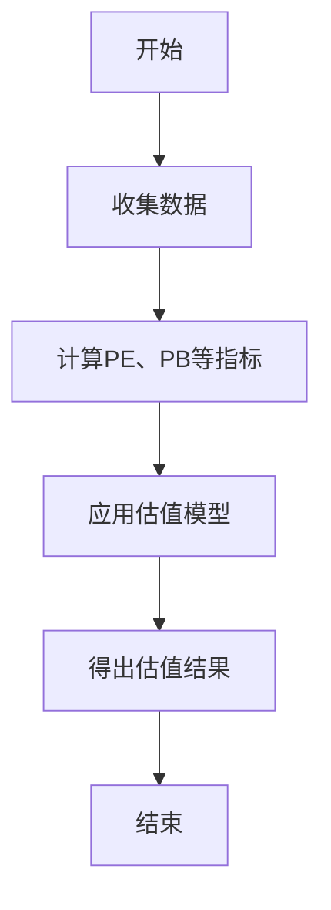
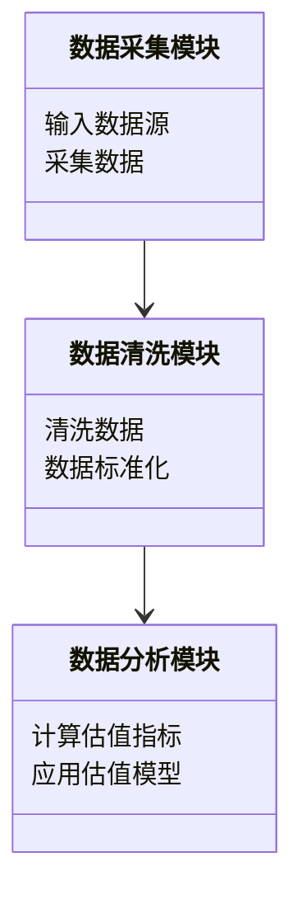
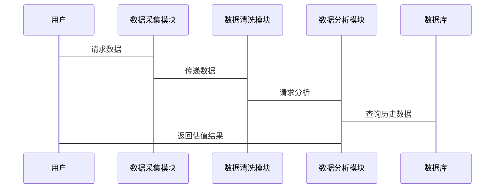

                 

<think>
好的，我需要根据用户的要求，帮助生成一篇关于《埃及股市估值:中东北非地区的投资机会》的技术博客文章。用户已经提供了一个详细的目录大纲，现在我需要根据这个大纲逐步完成每一部分的内容。

首先，我需要理解用户的具体要求：

1. 文章标题是《埃及股市估值:中东北非地区的投资机会》。
2. 关键词包括：埃及股市、股市估值、投资机会、中东北非、股票分析、市场趋势。
3. 摘要需要概括文章的核心内容，强调埃及股市的潜力和分析方法。
4. 目录大纲已经提供，共分为七章，内容详细，涵盖背景、核心概念、算法、系统分析、项目实战、最佳实践和小结。

接下来，我需要按照目录大纲逐步完成每一部分的内容，确保逻辑清晰，内容详实，并且符合用户对技术博客的专业要求。

### 第一部分: 埃及股市估值背景与投资机会概述

#### 第1章: 埃及股市估值的背景与现状

##### 1.1 埃及股市的基本情况

在这一部分，我需要详细介绍埃及股市的起源、发展现状、市场规模以及与中东北非地区其他股市的联动效应。

- **1.1.1 埃及股市的起源与发展**  
  埃及股市的历史可以追溯到20世纪初期，经历了多次改革和调整，逐步发展成为中东北非地区的重要市场之一。

- **1.1.2 埃及股市的市场规模与结构**  
  埃及股市的上市公司数量、市值规模、交易量等数据，与其他新兴市场如沙特、阿联酋等的对比。

- **1.1.3 中东北非地区股市的联动效应**  
  埃及股市在该地区的地位，与其他国家股市的相互影响，区域经济一体化的趋势。

##### 1.2 埃及股市的投资价值

这部分需要分析埃及股市的投资价值，包括埃及的经济基本面、行业分布以及政策风险。

- **1.2.1 埃及经济的基本面分析**  
  埃及的GDP增长、通货膨胀率、失业率等经济指标，对股市的影响。

- **1.2.2 埃及股市的行业分布**  
  主要行业如能源、金融、工业等在埃及股市中的占比，各行业的投资潜力。

- **1.2.3 埃及股市的政策支持与风险**  
  政府对股市的政策支持、监管框架，以及可能面临的政策风险。

##### 1.3 埃及股市与其他新兴市场的对比

将埃及股市与沙特、阿联酋等市场进行对比，分析各自的特点和投资机会。

- **1.3.1 埃及股市与沙特股市的对比**  
  市场规模、行业结构、政策环境等方面对比，找出埃及股市的独特优势。

- **1.3.2 埃及股市与阿联酋股市的对比**  
  同上，重点分析阿联酋股市的成熟度和国际化程度对埃及股市的启示。

- **1.3.3 中东北非地区股市的整体趋势**  
  区域市场的整体表现，未来的发展趋势，投资者应该如何布局。

#### 第2章: 埃及股市估值的核心概念与方法

##### 2.1 股市估值的基本原理

这部分需要介绍股市估值的基本概念和方法，帮助读者理解估值的必要性和基本原理。

- **2.1.1 股票估值的定义与目的**  
  什么是股票估值，为什么要进行股票估值，其在投资决策中的作用。

- **2.1.2 常用的股票估值指标**  
  PE、PB、ROE等指标的定义和计算方法，它们在估值中的应用。

- **2.1.3 股票估值的误区与注意事项**  
  常见的估值误区，如只看表面数据、忽略行业特点等，提醒投资者注意。

##### 2.2 埃及股市估值的关键指标

详细讲解适用于埃及股市的估值指标，以及如何根据这些指标评估股票的价值。

- **2.2.1 市盈率（PE）的计算与应用**  
  PE的计算公式，如何通过PE判断股票的估值高低，不同行业PE的差异。

- **2.2.2 市净率（PB）的计算与应用**  
  PB的计算公式，适用于哪些行业，与PE相比的优势。

- **2.2.3 股息率的计算与应用**  
  股息率的计算，如何通过股息率评估股票的收益能力，高股息率股票的风险。

##### 2.3 埃及股市估值的特殊性

分析埃及股市估值的独特性，如波动性、政策影响、行业风险等。

- **2.3.1 埃及股市的波动性分析**  
  埃及股市的历史波动情况，与其他新兴市场的对比，波动性对投资者的影响。

- **2.3.2 埃及股市的政策影响**  
  政府政策对股市的影响，如货币政策、财政政策的变化，对估值的影响。

- **2.3.3 埃及股市的行业风险**  
  不同行业的风险差异，如能源行业受国际油价影响较大，金融行业受监管政策影响等。

#### 第3章: 埃及股市估值的数学模型与算法

##### 3.1 常用的股票估值模型

介绍几种常用的股票估值模型，并结合埃及股市的特点进行分析。

- **3.1.1 市盈率模型**  
  如何利用市盈率模型对埃及股市中的股票进行估值，考虑的因素。

- **3.1.2 市净率模型**  
  市净率模型的适用场景，如何应用于埃及股市。

- **3.1.3 现金流折现模型（DCF）**  
  DCF模型的基本原理，如何应用于埃及股市中的高成长性股票。

##### 3.2 埃及股市估值的数学公式

这部分需要详细讲解相关的数学公式，并用LaTeX格式表示。

- **3.2.1 市盈率公式**
  $$ PE = \frac{\text{市价}}{\text{每股收益}} $$
  
- **3.2.2 市净率公式**
  $$ PB = \frac{\text{市价}}{\text{每股净资产}} $$

- **3.2.3 现金流折现模型公式**
  $$ V = \sum_{t=1}^{n} \frac{CF_t}{(1 + r)^t} + \frac{TV}{(1 + r)^n} $$
  其中，\( CF_t \) 是第t年的自由现金流，\( r \) 是折现率，\( TV \) 是终值。

##### 3.3 埃及股市估值的算法流程

使用Mermaid流程图展示估值算法的步骤。



### 第二部分: 系统分析与架构设计

#### 第4章: 系统分析与架构设计方案

##### 4.1 问题场景介绍

描述一个实际的项目场景，例如分析埃及股市的波动性，设计一个自动估值系统。

##### 4.2 系统功能设计

使用Mermaid类图展示系统的领域模型，包括数据采集、清洗、分析等模块。



##### 4.3 系统架构设计

使用Mermaid架构图展示系统的整体架构，包括前端、后端、数据库等部分。

```mermaid
container 客户端 {
    前端界面
    用户交互
}
container 服务端 {
    数据采集服务
    数据清洗服务
    数据分析服务
}
container 数据库 {
    估值数据
    历史数据
}
客户端 --> 数据采集服务
服务端 --> 数据库
```

##### 4.4 系统接口设计

描述系统各模块之间的接口，如数据采集模块与数据清洗模块之间的接口。

##### 4.5 系统交互设计

使用Mermaid序列图展示系统中不同角色之间的交互过程。



### 第三部分: 项目实战

#### 第5章: 项目实战与应用

##### 5.1 项目环境安装

指导读者如何安装必要的Python库，如pandas、numpy、matplotlib。

```bash
pip install pandas numpy matplotlib
```

##### 5.2 核心代码实现

提供一个简单的股票估值代码示例，如计算PE和PB。

```python
import pandas as pd

# 假设df是包含股票数据的DataFrame
df['PE'] = df['市价'] / df['每股收益']
df['PB'] = df['市价'] / df['每股净资产']
```

##### 5.3 代码应用解读

解释上述代码的功能，如何应用于实际的埃及股市分析。

##### 5.4 实际案例分析

选取具体的埃及股票，进行实际的估值分析，展示如何利用上述模型得出估值结果。

##### 5.5 项目小结

总结项目的成果，指出成功的关键点和可能的改进方向。

### 第四部分: 最佳实践与小结

#### 第6章: 最佳实践与投资策略

##### 6.1 小结

总结全文，重申埃及股市的投资价值和估值方法的重要性。

##### 6.2 投资策略建议

根据前面的分析，提出具体的投资策略，如行业配置、风险控制等。

##### 6.3 注意事项

提醒读者在进行股市投资时需要注意的事项，如市场风险、政策变化等。

##### 6.4 拓展阅读

推荐一些与埃及股市和股市估值相关的书籍和资源，供读者进一步学习。

### 第7章: 作者信息与致谢

- **作者：** AI天才研究院/AI Genius Institute & 禅与计算机程序设计艺术/Zen And The Art of Computer Programming

---

以上是根据用户提供的目录大纲进行的逐步解释和内容填充。接下来，我将根据这个思路，撰写完整的文章内容。

