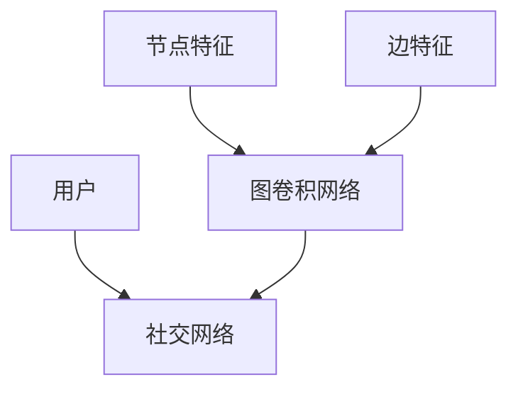
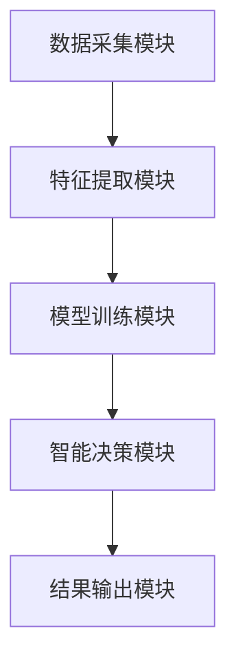
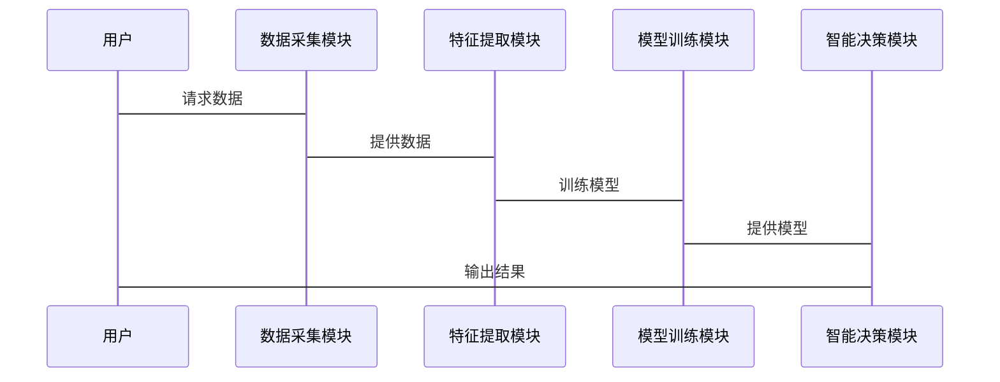

                 


# 基于图卷积网络的AI Agent社交网络分析

> 关键词：图卷积网络、AI Agent、社交网络分析、算法原理、系统架构设计、项目实战

> 摘要：本文详细探讨了基于图卷积网络（Graph Convolutional Networks, GCN）的AI Agent在社交网络分析中的应用。通过分析社交网络的结构特征，结合AI Agent的智能决策能力，提出了一种高效的社交网络分析方法。文章从理论基础到算法实现，再到系统设计和项目实战，全面解析了基于GCN的AI Agent在社交网络分析中的技术细节和实际应用。

---

## 第一章：图卷积网络与AI Agent概述

### 1.1 问题背景与描述
社交网络分析是理解人类行为、情感倾向以及信息传播的重要工具。传统的社交网络分析方法依赖于统计分析和规则挖掘，但在面对复杂、动态的社交网络时，这些方法往往显得力不从心。近年来，图卷积网络（GCN）作为一种新兴的图数据处理技术，逐渐在社交网络分析中展现出独特的优势。

AI Agent（人工智能代理）是一种能够感知环境、自主决策并执行任务的智能体。将AI Agent与GCN结合，可以实现对社交网络的实时分析和动态决策。

### 1.2 核心概念与问题解决
#### 1.2.1 图卷积网络的基本原理
图卷积网络是一种处理图结构数据的深度学习模型。与传统的卷积神经网络（CNN）不同，GCN能够直接处理图的节点和边的关系，捕捉图的拓扑结构特征。

#### 1.2.2 AI Agent的定义与功能
AI Agent是一种智能体，能够通过感知环境、学习和推理，自主完成特定任务。在社交网络分析中，AI Agent可以用于情感分析、用户行为预测、信息传播路径预测等。

#### 1.2.3 问题解决的思路与方法
通过将GCN应用于社交网络分析，结合AI Agent的智能决策能力，可以实现对社交网络中用户行为、情感倾向和信息传播的实时分析和预测。

### 1.3 概念结构与核心要素
#### 1.3.1 图卷积网络的核心要素
- **节点特征**：每个节点的属性特征，如用户的年龄、性别、兴趣等。
- **边特征**：节点之间的关系特征，如好友关系、关注关系等。
- **图结构**：节点和边的拓扑结构，如社交网络中的用户关系图。

#### 1.3.2 AI Agent的构成与功能
- **感知模块**：通过图卷积网络感知社交网络的结构特征和节点特征。
- **决策模块**：基于感知结果，进行智能决策，如推荐好友、预测情感倾向等。
- **执行模块**：根据决策结果执行具体任务，如发送消息、推荐内容等。

#### 1.3.3 两者的结合与协同
通过将GCN与AI Agent结合，可以充分发挥GCN在图数据处理方面的优势，同时利用AI Agent的智能决策能力，实现对社交网络的高效分析和动态管理。

## 第二章：图卷积网络的原理与实现

### 2.1 图卷积网络的基本原理
图卷积网络的核心思想是通过图的拓扑结构来传播节点特征，从而实现对图数据的深度学习。其数学模型如下：

$$ y^{(l+1)} = \sum_{i=1}^{N} A_{ij} x_i^{(l)} W^{(l)} $$

其中，$y^{(l+1)}$ 是第$l+1$层的节点特征，$x_i^{(l)}$ 是第$l$层的节点特征，$W^{(l)}$ 是第$l$层的权重矩阵，$A_{ij}$ 是邻接矩阵的元素。

### 2.2 图卷积网络的属性特征对比
以下是几种常见的图卷积方法的对比：

| 方法         | 优点                           | 缺点                           |
|--------------|--------------------------------|--------------------------------|
| GCN          | 处理大规模图数据能力强           | �易受过平滑化影响                 |
| GAT          | 通过注意力机制捕捉重要边       | 计算复杂度较高                   |
| GraphSAGE    | 支持归纳式学习                   | 需要手动设计聚合函数             |

### 2.3 图卷积网络的ER实体关系图


## 第三章：AI Agent的算法原理

### 3.1 AI Agent的基本算法
AI Agent的核心算法包括：
- **强化学习**：通过奖励机制进行决策优化。
- **多智能体协作**：通过协作机制实现多智能体之间的信息共享和协同决策。

### 3.2 图卷积网络的数学模型
以下是图卷积网络的数学模型：

$$ y^{(l+1)} = \sum_{i=1}^{N} A_{ij} x_i^{(l)} W^{(l)} $$

其中，$y^{(l+1)}$ 是第$l+1$层的节点特征，$x_i^{(l)}$ 是第$l$层的节点特征，$W^{(l)}$ 是第$l$层的权重矩阵，$A_{ij}$ 是邻接矩阵的元素。

### 3.3 AI Agent的算法实现
以下是AI Agent的算法实现流程：

1. **环境初始化**：定义社交网络环境，包括用户、节点、边等。
2. **状态感知**：通过图卷积网络感知社交网络的状态特征。
3. **决策制定**：基于感知结果，进行智能决策。
4. **动作执行**：根据决策结果执行具体动作。

## 第四章：系统分析与架构设计

### 4.1 项目背景与目标
项目背景：随着社交网络的快速发展，如何高效分析和管理社交网络成为一个重要挑战。AI Agent结合图卷积网络可以提供一种高效的解决方案。

项目目标：通过设计和实现基于图卷积网络的AI Agent，实现对社交网络的实时分析和动态管理。

### 4.2 系统功能设计
系统功能模块包括：
- **数据采集模块**：采集社交网络数据，包括用户信息、好友关系、关注关系等。
- **特征提取模块**：通过图卷积网络提取节点特征和边特征。
- **模型训练模块**：训练图卷积网络模型。
- **智能决策模块**：基于模型输出结果进行智能决策。
- **结果输出模块**：输出分析结果，如用户影响力排名、情感倾向预测等。

### 4.3 系统架构设计


### 4.4 系统接口设计
系统接口包括：
- 数据接口：用于数据采集和数据输出。
- 模型接口：用于模型训练和模型推理。
- 用户接口：用于用户交互和结果展示。

### 4.5 系统交互设计


## 第五章：项目实战

### 5.1 环境安装
安装Python和相关库：
```bash
pip install numpy
pip install networkx
pip install tensorflow
```

### 5.2 系统核心实现源代码
以下是图卷积网络的实现代码：

```python
import numpy as np
import tensorflow as tf
from tensorflow.keras import layers

class GraphConvolution(layers.Layer):
    def __init__(self, input_dim, output_dim):
        super(GraphConvolution, self).__init__()
        self.W = tf.keras.layers.Dense(output_dim, input_dim)
        self.b = tf.Variable(tf.zeros([output_dim]))

    def call(self, inputs):
        X = inputs[0]
        A = inputs[1]
        AX = tf.matmul(A, X)
        output = self.W(AX) + self.b
        return output

# 使用示例
X = tf.constant([[1, 0], [0, 1]], dtype=tf.float32)
A = tf.constant([[0, 1], [1, 0]], dtype=tf.float32)
gc = GraphConvolution(2, 2)
output = gc([X, A])
print(output.numpy())
```

### 5.3 代码应用解读与分析
- **GraphConvolution类**：定义了一个图卷积层，包括权重矩阵和偏置项。
- **call方法**：实现了图卷积操作，首先计算$AX$，然后通过权重矩阵和偏置项得到输出。

### 5.4 实际案例分析
案例分析：识别社交网络中的影响力节点。

假设我们有一个社交网络，节点表示用户，边表示好友关系。通过图卷积网络，我们可以计算每个节点的重要性得分，进而识别出影响力节点。

### 5.5 项目小结
通过实际案例分析，我们可以看到基于图卷积网络的AI Agent在社交网络分析中的强大能力。模型能够有效捕捉图结构特征，实现对社交网络的高效分析和动态管理。

## 第六章：总结与展望

### 6.1 最佳实践 tips
- 在实际应用中，建议结合具体业务需求，灵活调整模型参数和算法流程。
- 注意数据质量和模型的泛化能力，避免过拟合。

### 6.2 小结
本文详细探讨了基于图卷积网络的AI Agent在社交网络分析中的应用。从理论基础到算法实现，再到系统设计和项目实战，全面解析了基于GCN的AI Agent的技术细节和实际应用。

### 6.3 注意事项
- 在实际应用中，需要注意模型的可解释性和实时性。
- 需要结合具体业务需求，灵活调整模型结构和参数。

### 6.4 拓展阅读
建议进一步阅读以下内容：
- 图卷积网络的变体和优化方法。
- 多智能体协作的最新研究成果。
- 社交网络分析的其他相关技术。

---

作者：AI天才研究院/AI Genius Institute & 禅与计算机程序设计艺术/Zen And The Art of Computer Programming

