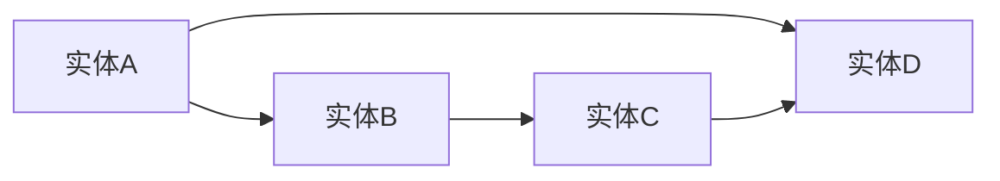
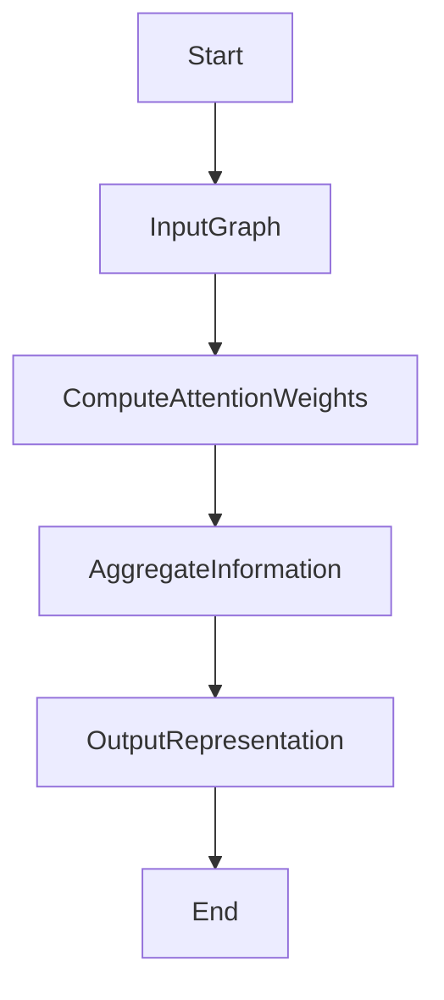
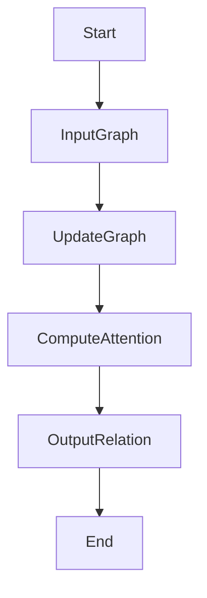
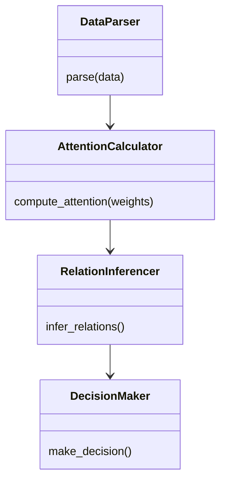
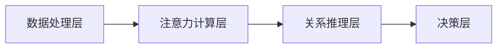
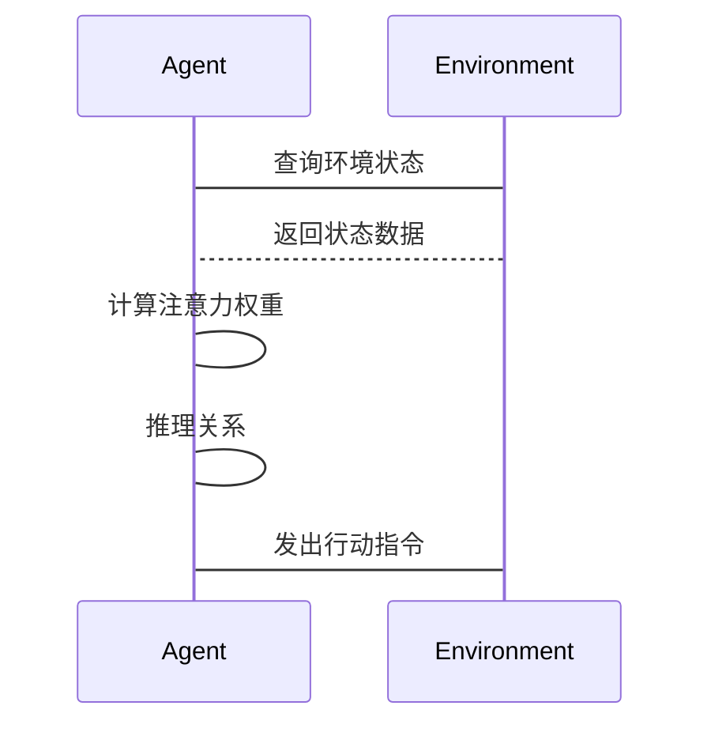

                 


# 基于图注意力网络的AI Agent动态关系推理

> 关键词：图注意力网络、AI Agent、动态关系推理、深度学习、强化学习、系统架构、项目实战

> 摘要：本文探讨了基于图注意力网络的AI Agent动态关系推理技术，详细分析了其核心概念、算法原理、系统架构及项目实现，旨在为AI Agent在复杂动态环境中的关系推理提供新的思路和方法。

---

# 第一部分: 基于图注意力网络的AI Agent动态关系推理背景介绍

## 第1章: 问题背景与问题描述

### 1.1 问题背景

随着AI技术的快速发展，AI Agent在多个领域展现出巨大潜力。AI Agent需要在动态环境中感知、推理并做出决策。动态关系推理是其核心能力之一，涉及实体间复杂关系的识别和更新。传统方法在处理动态关系时效率低下，难以应对实时变化的环境。

图注意力网络通过捕捉图结构数据中的全局关系，提升了关系推理的准确性和效率。其在自然语言处理、推荐系统等领域已取得显著成果，但在AI Agent中的应用仍处于探索阶段。

### 1.2 问题描述

动态关系推理涉及识别和更新实体间的关系，尤其在动态变化的环境中更具挑战。AI Agent需要实时处理多源异构数据，快速响应变化，这要求关系推理具备高效性、动态性和适应性。然而，现有技术在处理复杂动态关系时存在准确性和效率的瓶颈。

### 1.3 问题解决

基于图注意力网络的动态关系推理通过以下方式解决上述问题：
- **实时更新**：利用图结构数据的动态更新能力，捕捉关系变化。
- **注意力机制**：聚焦关键节点，提升推理效率和准确性。
- **端到端学习**：通过深度学习模型端到端优化关系推理过程。

### 1.4 边界与外延

- **适用范围**：适用于复杂动态环境中的关系推理任务。
- **边界条件**：不考虑静态关系推理和非动态环境下的关系推理。
- **相关技术对比**：与传统图神经网络、注意力机制等技术进行对比，突出图注意力网络的优势。

### 1.5 概念结构

图注意力网络由图结构、注意力机制和深度学习框架组成。动态关系推理涉及实时数据流处理、关系更新和模型优化。AI Agent通过动态关系推理提升其感知和决策能力，实现在复杂环境中的智能交互。

---

# 第二部分: 核心概念与联系

## 第4章: 图注意力网络与AI Agent的关系

### 4.1 图注意力网络的原理与特点

- **基本原理**：通过计算节点间的注意力权重，聚合多源信息，生成节点表示。
- **特点**：全局感知、动态调整、自适应能力强。

### 4.2 图注意力网络与AI Agent的关系

| **概念**       | **图注意力网络**                           | **AI Agent**                                |
|----------------|------------------------------------------|--------------------------------------------|
| **功能**       | 关系推理、信息聚合                         | 感知、决策、行动                            |
| **输入**       | 图结构数据                                | 多源异构数据                                |
| **输出**       | 关系表示、节点表示                         | 行动策略、决策结果                          |
| **应用场景**   | 社交网络、推荐系统                        | 智能客服、自动驾驶                            |

### 4.3 ER实体关系图



---

# 第三部分: 算法原理讲解

## 第5章: 图注意力网络算法原理

### 5.1 算法流程



### 5.2 Python代码实现

```python
import torch
import torch.nn as nn
import torch.nn.functional as F

class GraphAttention(nn.Module):
    def __init__(self, in_features, out_features):
        super().__init__()
        self.key = nn.Linear(in_features, out_features)
        self.query = nn.Linear(in_features, out_features)
        self.value = nn.Linear(in_features, out_features)
    
    def forward(self, x, adj):
        key = self.key(x)
        query = self.query(x)
        value = self.value(x)
        
        # 计算注意力权重
        attention_weights = F.softmax((query @ key.T), dim=-1)
        # 筛选有效边
        mask = adj.to_dense()
        attention_weights = attention_weights * mask
        attention_weights = attention_weights / (attention_weights.sum(dim=-1, keepdim=True) + 1e-9)
        
        # 聚合信息
        output = (attention_weights @ value).mean(dim=-1)
        return output
```

### 5.3 数学模型

注意力机制的核心公式：
$$
\alpha_{ij} = \text{softmax}(q_j^T k_i)
$$

其中，$\alpha_{ij}$表示节点i对节点j的注意力权重，$q_j$和$k_i$分别为查询和键向量。

---

## 第6章: 动态关系推理算法原理

### 6.1 动态关系推理流程



### 6.2 优化策略

1. **在线更新**：实时更新图结构数据。
2. **自适应调整**：动态调整注意力权重。
3. **模型微调**：根据新数据微调模型参数。

---

# 第四部分: 系统分析与架构设计

## 第7章: 问题场景与系统功能设计

### 7.1 问题场景

AI Agent在动态环境中需要处理多源异构数据，实时推理实体间的关系，动态调整决策策略。

### 7.2 系统功能设计

- **数据处理模块**：解析和转换输入数据。
- **注意力计算模块**：计算节点间注意力权重。
- **关系推理模块**：生成关系表示。
- **决策模块**：基于推理结果制定行动策略。

### 7.3 领域模型类图



---

## 第8章: 系统架构设计

### 8.1 系统架构图



### 8.2 接口设计

- **输入接口**：接收多源异构数据流。
- **输出接口**：输出关系表示和决策结果。

### 8.3 交互设计



---

# 第五部分: 项目实战

## 第9章: 环境安装与代码实现

### 9.1 环境安装

安装必要的库：
```bash
pip install torch
pip install mermaid
```

### 9.2 核心代码实现

```python
import torch
import torch.nn as nn
import torch.nn.functional as F

class DynamicRelationInferencer(nn.Module):
    def __init__(self, input_dim, hidden_dim):
        super().__init__()
        self.attn = GraphAttention(input_dim, hidden_dim)
    
    def forward(self, x, adj):
        output = self.attn(x, adj)
        return output

# 初始化模型
model = DynamicRelationInferencer(input_dim=128, hidden_dim=64)
# 定义损失函数和优化器
criterion = nn.MSELoss()
optimizer = torch.optim.Adam(model.parameters(), lr=0.001)
```

### 9.3 案例分析

案例：社交网络中的动态关系推理。
- **输入**：社交网络中的用户行为数据流。
- **处理**：实时更新用户关系图。
- **推理**：推理用户间的关系变化。
- **输出**：动态调整推荐策略。

### 9.4 项目总结

通过基于图注意力网络的动态关系推理，AI Agent能够高效处理动态环境中的关系推理任务，显著提升其感知和决策能力。

---

# 第六部分: 最佳实践

## 第10章: 小结与注意事项

### 10.1 小结

本文详细探讨了基于图注意力网络的AI Agent动态关系推理技术，分析了其核心概念、算法原理和系统架构，提供了项目实战和最佳实践。

### 10.2 注意事项

- 数据质量：确保输入数据的准确性和及时性。
- 模型优化：根据实际场景调整模型参数。
- 安全性：注意数据隐私和模型安全。

## 第11章: 拓展阅读

### 11.1 推荐阅读

- 图注意力网络的最新研究进展。
- 动态图神经网络的相关文献。

### 11.2 学习资源

- 相关课程和在线资源。
- 开源项目和代码库。

---

# 作者

作者：AI天才研究院/AI Genius Institute  
联系方式：[联系邮箱](mailto:contact@aising genie.com)  
GitHub：[项目仓库](https://github.com/aising genie/Graph-Attention-Agent)

---

以上是《基于图注意力网络的AI Agent动态关系推理》的技术博客文章的完整大纲和内容，希望对您有所帮助！

