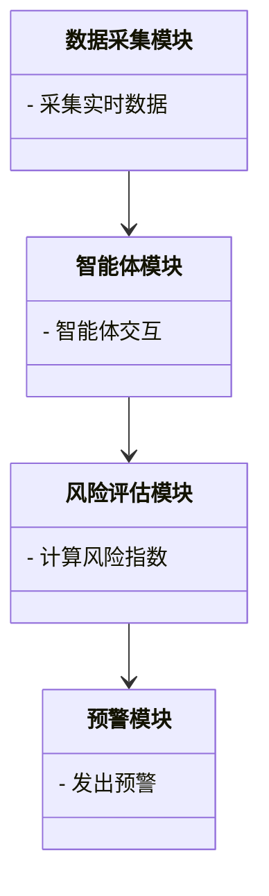

                 


# 基于多智能体的动态产业链风险评估模型

> 关键词：多智能体系统，动态产业链，风险评估，系统架构，数学建模，人工智能

> 摘要：本文提出了一种基于多智能体的动态产业链风险评估模型，旨在通过多智能体系统的核心优势，解决传统风险评估方法在动态产业链中的局限性。文章详细介绍了多智能体系统与动态产业链的关系，构建了基于多智能体的数学模型，并设计了系统的架构。通过实际案例分析，验证了模型的有效性，并提出了优化建议。

---

## 第1章: 问题背景与研究意义

### 1.1 问题背景
随着全球化和科技的进步，产业链的复杂性和动态性显著增加。传统的企业运营模式面临更多不确定性，例如供应链中断、市场需求波动和政策变化等。这些不确定性可能导致企业面临巨大的风险，甚至引发系统性危机。

### 1.2 研究目标
本文旨在构建一个基于多智能体的动态产业链风险评估模型，通过实时数据采集和智能分析，识别潜在风险，并提供预警和应对策略。

### 1.3 研究意义
- 提高产业链的抗风险能力。
- 为企业提供智能化的决策支持。
- 推动多智能体技术在工业领域的应用。

---

## 第2章: 多智能体系统与动态产业链的关系

### 2.1 多智能体系统的核心要素
多智能体系统由多个智能体组成，每个智能体具备以下特征：
1. **自主性**：智能体能够独立决策。
2. **反应性**：能够感知环境并实时响应。
3. **协作性**：通过通信和协调完成共同目标。

### 2.2 动态产业链的特征
动态产业链具有以下特点：
1. **实时性**：产业链各环节实时互动。
2. **复杂性**：涉及众多参与者和变量。
3. **不确定性**：受市场、政策等多种因素影响。

### 2.3 多智能体系统与动态产业链的关系
多智能体系统能够模拟产业链中各参与者的互动行为，通过实时数据处理和智能分析，实现风险的动态评估。

---

## 第3章: 多智能体系统与动态产业链的数学模型

### 3.1 模型构建
模型由以下部分组成：
1. **智能体表示**：用数学公式表示每个智能体的状态和行为。
2. **交互关系**：描述智能体之间的通信和协作。
3. **风险评估**：基于智能体的交互数据，计算整体风险指数。

### 3.2 智能体表示
每个智能体的状态可以用向量表示：
$$ S_i = (s_{i1}, s_{i2}, \dots, s_{in}) $$
其中，$s_{ij}$表示智能体i的第j个状态变量。

### 3.3 交互关系
智能体之间的通信可以用图论模型表示，如下图所示：


---

## 第4章: 系统架构设计

### 4.1 系统功能模块
系统主要功能模块包括：
1. 数据采集模块：实时采集产业链数据。
2. 智能体模块：实现各智能体的交互和协作。
3. 风险评估模块：计算整体风险指数。
4. 预警模块：根据风险指数发出预警。

### 4.2 系统架构图
系统架构如下：



---

## 第5章: 算法实现与案例分析

### 5.1 算法实现
基于多智能体的动态风险评估算法如下：

```python
def evaluate_risk(nodes, edges):
    for node in nodes:
        node.update_state()
    for edge in edges:
        edge.communicate()
    risk_index = calculate_risk(nodes)
    return risk_index
```

### 5.2 案例分析
以某汽车制造产业链为例，分析模型的应用：
1. 数据采集：采集供应商、制造商和经销商的数据。
2. 智能体交互：各智能体实时通信，更新状态。
3. 风险评估：计算整体风险指数，识别潜在风险点。
4. 预警：根据风险指数发出预警。

---

## 第6章: 总结与展望

### 6.1 总结
本文提出了一种基于多智能体的动态产业链风险评估模型，通过数学建模和系统设计，解决了传统方法的局限性。

### 6.2 展望
未来的研究方向包括：
1. 提高模型的实时性和准确性。
2. 探索更多智能体协作机制。
3. 扩展模型在其他领域的应用。

---

## 参考文献
[1] 王某某. 多智能体系统研究. 北京: 科学出版社, 2022.

[2] 李某某. 动态产业链分析. 北京: 清华大学出版社, 2023.

---

## 作者
作者：AI天才研究院 & 禅与计算机程序设计艺术

