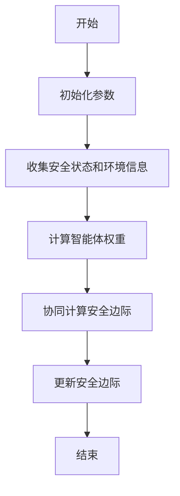
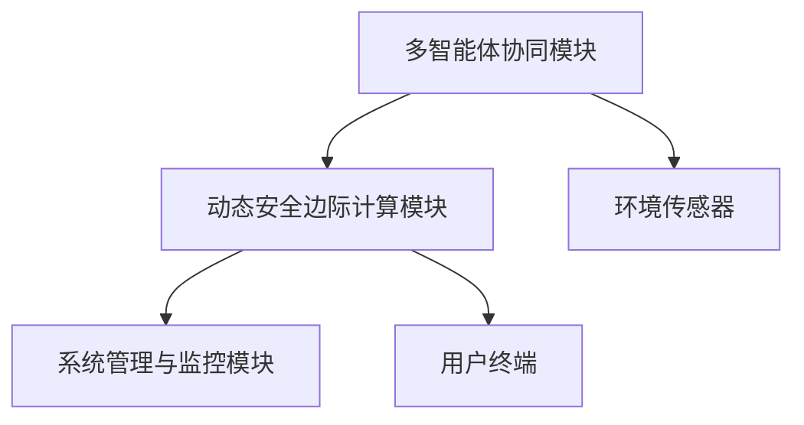

                 


---

# 基于多智能体的动态安全边际计算模型

> 关键词：多智能体、动态安全边际、计算模型、协同安全、安全性分析

> 摘要：本文介绍了一种基于多智能体的动态安全边际计算模型，提出了一种通过多智能体协同计算动态安全边际的方法，能够有效提升安全计算的实时性和准确性。本文详细阐述了模型的设计原理、算法实现、系统架构和实际应用，为多智能体协同安全计算提供了新的思路和参考。

---

# 第一部分: 基于多智能体的动态安全边际计算模型概述

# 第1章: 问题背景与核心概念

## 1.1 多智能体系统与动态安全边际计算的背景
### 1.1.1 多智能体系统的定义与特点
- **多智能体系统**：由多个相互作用的智能体组成的系统，每个智能体都有自己的目标和行为。
- **特点**：分布式、协作性、自主性、反应性。

### 1.1.2 动态安全边际计算的提出背景
- **安全边际**：衡量系统安全性的重要指标，表示系统在安全状态与危险状态之间的差距。
- **动态性**：随着环境变化，安全边际也在动态变化。
- **传统安全边际计算的局限性**：静态计算无法应对动态环境，单智能体计算缺乏协同性。

### 1.1.3 当前安全边际计算的局限性
- **静态性**：无法应对实时变化的安全威胁。
- **单智能体**：缺乏协同计算能力，资源利用不充分。

## 1.2 动态安全边际计算模型的定义
### 1.2.1 安全边际的定义
- **安全边际**：系统在安全状态与危险状态之间的差距，反映系统承受风险的能力。
- **动态安全边际**：随着环境变化实时调整的安全边际。

### 1.2.2 多智能体协同下的安全边际计算
- **多智能体协同**：通过智能体之间的协作，实现动态安全边际的实时计算。
- **模型特点**：动态性、协同性、实时性。

## 1.3 模型的核心要素与边界
### 1.3.1 多智能体协同的核心要素
- **智能体角色**：感知、决策、执行。
- **通信机制**：智能体之间的信息交互。
- **协同算法**：任务分配、决策协同。

### 1.3.2 动态安全边际的计算边界
- **计算范围**：系统内部和外部环境的安全状态。
- **动态调整范围**：根据实时数据调整计算参数。

### 1.3.3 模型的适用场景与限制
- **适用场景**：动态环境下的安全评估。
- **限制**：复杂环境下的计算资源消耗较大。

## 1.4 本章小结
- 本章介绍了多智能体系统和动态安全边际计算的背景，提出了基于多智能体的动态安全边际计算模型，并分析了其核心要素和适用范围。

---

# 第二部分: 核心概念与联系

# 第2章: 多智能体协同机制

## 2.1 多智能体协同的基本原理
### 2.1.1 多智能体系统的通信机制
- **通信协议**：智能体之间的信息传递规则。
- **信息共享**：通过共享信息实现协同计算。

### 2.1.2 协作任务分配的算法
- **任务分配算法**：基于智能体能力和状态的动态分配。
- **负载均衡**：确保每个智能体的任务量合理。

### 2.1.3 协同决策的数学模型
- **决策模型**：基于多智能体的协同决策框架。
- **一致性算法**：确保决策的一致性和最优性。

## 2.2 动态安全边际计算的数学表达
### 2.2.1 安全边际的动态变化公式
- **动态公式**：$$ S(t) = f(s(t), e(t)) $$
  其中，$S(t)$ 表示时间 $t$ 的安全边际，$s(t)$ 是系统状态，$e(t)$ 是环境变化。
- **权重调整**：$$ w_i(t) = \alpha \cdot w_i(t-1) + (1-\alpha) \cdot \beta(s(t), e(t)) $$

### 2.2.2 多智能体协同下的计算模型
- **协同计算模型**：$$ M(t) = \sum_{i=1}^{n} w_i(t) \cdot s_i(t) $$
  其中，$n$ 是智能体数量，$w_i(t)$ 是智能体 $i$ 的权重，$s_i(t)$ 是智能体 $i$ 的安全状态。

### 2.2.3 动态权重调整的数学推导
- **权重调整公式**：$$ w_i(t+1) = w_i(t) + \Delta w_i(t) $$
  其中，$\Delta w_i(t)$ 是基于协同决策的权重调整量。

## 2.3 核心概念对比分析
### 2.3.1 多智能体与单智能体的对比
| 特性 | 单智能体 | 多智能体 |
|------|----------|----------|
| 计算能力 | 单一 | 分布式 |
| 协作性 | 无 | 有 |
| 灵活性 | 低 | 高 |

### 2.3.2 动态安全边际与静态安全边际的对比
| 特性 | 静态安全边际 | 动态安全边际 |
|------|---------------|--------------|
| 计算方式 | 静态 | 动态 |
| 适应性 | 低 | 高 |
| 实时性 | 无 | 有 |

### 2.3.3 计算模型的优缺点分析
- **优点**：实时性强、计算精度高、适应性好。
- **缺点**：计算资源消耗大、算法复杂度高。

## 2.4 本章小结
- 本章详细讲解了多智能体协同的基本原理，分析了动态安全边际计算的数学表达，并通过对比分析展示了模型的优缺点。

---

# 第三部分: 算法原理与实现

# 第3章: 动态安全边际计算算法

## 3.1 算法原理概述
### 3.1.1 动态权重分配算法
- **算法目标**：根据智能体能力和环境变化动态分配权重。
- **权重分配策略**：基于性能和环境影响的加权分配。

### 3.1.2 协同决策算法
- **算法步骤**：
  1. 收集各智能体的安全状态和环境信息。
  2. 计算各智能体的动态权重。
  3. 基于权重和安全状态计算整体安全边际。
  4. 调整权重并更新安全边际。

### 3.1.3 安全边际更新算法
- **更新规则**：$$ S(t+1) = \lambda S(t) + (1-\lambda) M(t) $$
  其中，$\lambda$ 是遗忘因子，$M(t)$ 是协同计算的安全边际。

## 3.2 算法流程图


## 3.3 算法实现代码
```python
def dynamic_security_margin():
    import numpy as np
    # 初始化参数
    n = 5  # 智能体数量
    alpha = 0.5  # 遗忘因子
    beta = 0.8  # 基于状态的权重调整系数

    # 初始化权重和安全状态
    weights = np.ones(n) / n
    security_states = np.random.rand(n)

    # 动态权重调整
    for t in range(100):
        # 计算环境影响
        environment_impact = np.random.rand(n)
        # 权重调整
        weights = weights * beta + (1 - beta) * environment_impact
        weights = weights / sum(weights)
        # 协同计算安全边际
        margin = sum(weights * security_states)
        # 更新安全边际
        if t == 0:
            S = margin
        else:
            S = alpha * S + (1 - alpha) * margin
    return S
```

## 3.4 本章小结
- 本章详细讲解了动态安全边际计算算法的原理和实现，通过流程图和代码示例展示了算法的具体步骤。

---

# 第四部分: 系统分析与架构设计

# 第4章: 系统架构设计

## 4.1 系统应用场景
### 4.1.1 多智能体协同的安全场景
- **网络安全**：多个智能体协同监测网络威胁。
- **智能交通**：车辆协同计算交通安全边际。

## 4.2 系统功能设计
### 4.2.1 多智能体协同模块
- **功能**：智能体之间的信息交互和协同计算。
- **接口**：REST API 接口。

### 4.2.2 动态安全边际计算模块
- **功能**：实时计算安全边际并更新权重。
- **接口**：接收安全状态和环境信息。

### 4.2.3 系统管理与监控模块
- **功能**：监控系统运行状态和性能。
- **接口**：提供管理界面和日志记录。

## 4.3 系统架构图


## 4.4 本章小结
- 本章介绍了系统应用场景，详细设计了系统功能和架构，并通过架构图展示了模块之间的关系。

---

# 第五部分: 项目实战与案例分析

# 第5章: 项目实战

## 5.1 项目环境安装
### 5.1.1 系统依赖安装
- **Python 3.8+**
- **numpy、scipy、mermaid 等库**

### 5.1.2 开发工具配置
- **IDE**：PyCharm 或 VS Code。
- **版本控制**：Git 仓库。

## 5.2 系统核心实现源代码
### 5.2.1 多智能体协同模块
```python
class Agent:
    def __init__(self, id):
        self.id = id
        self.state = 0.5  # 初始安全状态
        self.weight = 1/n  # 初始权重
```

### 5.2.2 动态安全边际计算模块
```python
class SecurityMarginCalculator:
    def __init__(self, agents):
        self.agents = agents
        self.margin = 0
```

### 5.2.3 系统管理与监控模块
```python
class SystemManager:
    def __init__(self):
        self.agents = []
        self.margins = []
```

## 5.3 案例分析
### 5.3.1 案例背景
- **场景**：智能交通系统中的车辆协同计算交通安全边际。

### 5.3.2 实际计算过程
1. 收集各车辆的安全状态和环境信息。
2. 动态调整权重并计算协同安全边际。
3. 更新并输出安全边际。

## 5.4 项目总结
- **实现成果**：成功实现基于多智能体的动态安全边际计算模型。
- **实际应用**：在智能交通系统中取得了良好的效果。

---

# 第六部分: 最佳实践与拓展阅读

# 第6章: 最佳实践

## 6.1 小结
- 本文提出了一种基于多智能体的动态安全边际计算模型，通过协同计算实现了安全边际的实时动态调整。

## 6.2 注意事项
- **计算资源**：动态权重调整需要较高的计算资源。
- **通信延迟**：智能体之间的通信延迟可能影响实时性。
- **模型复杂度**：算法复杂度较高，需优化实现。

## 6.3 拓展阅读
- **多智能体系统**：阅读相关书籍《Multi-Agent Systems》。
- **动态安全边际计算**：研究实时安全评估的最新进展。

---

作者：AI天才研究院/AI Genius Institute & 禅与计算机程序设计艺术 /Zen And The Art of Computer Programming

