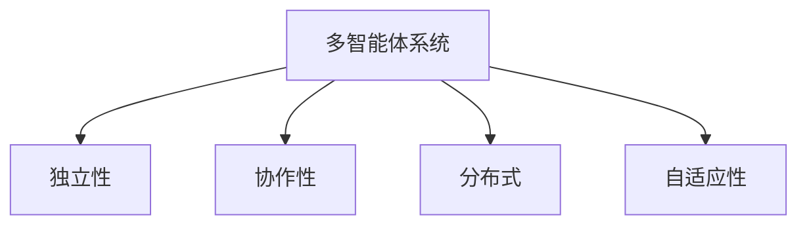
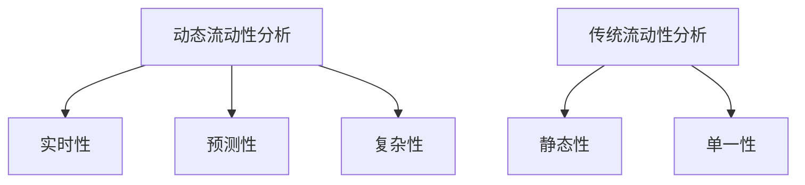
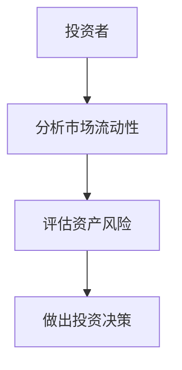
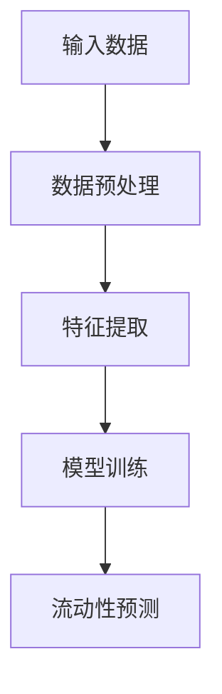
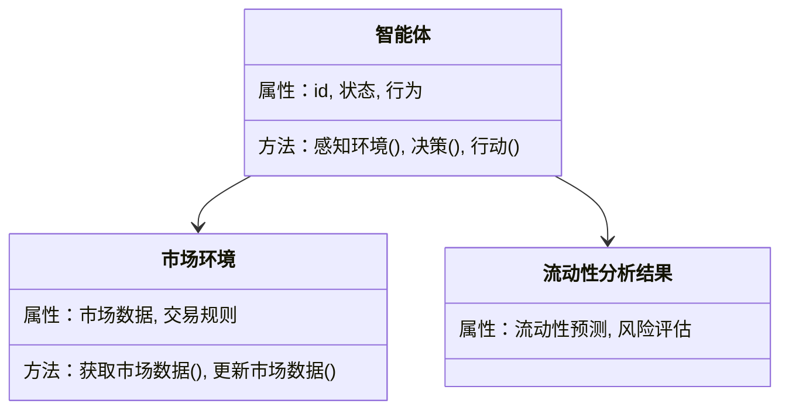
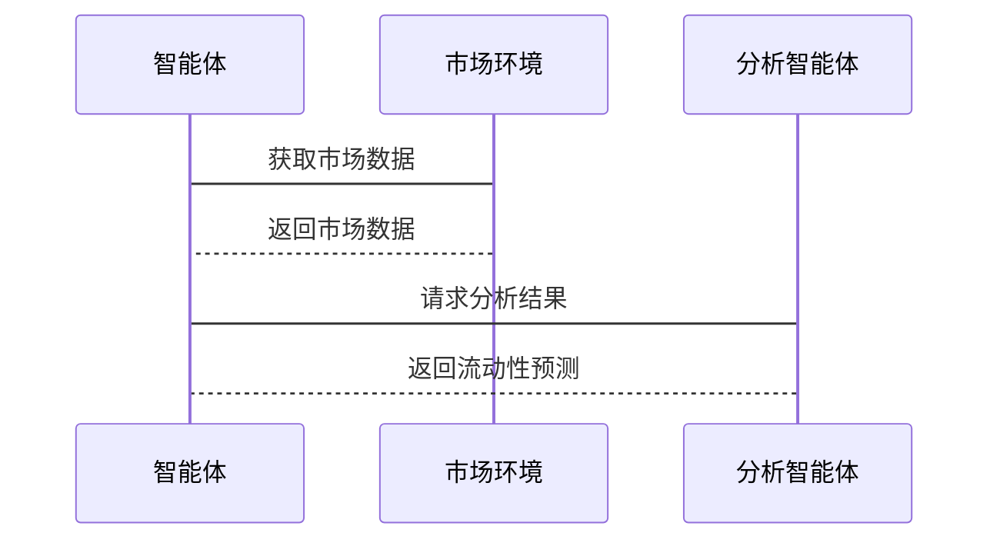

                 


# 基于多智能体的动态市场流动性分析在价值投资中的应用

---

## 关键词：
- 多智能体系统
- 动态市场流动性
- 价值投资
- 算法实现
- 系统架构设计

---

## 摘要：
本文探讨了基于多智能体系统的动态市场流动性分析在价值投资中的应用。通过分析多智能体系统的构建原理、动态市场流动性分析的数学模型，以及在价值投资中的具体应用场景，本文展示了如何利用多智能体系统来优化投资决策。文章详细介绍了系统的实现步骤、架构设计和实际案例，并提供了相关的代码实现和数学模型，为读者提供了一个全面的视角来理解这一复杂但实用的金融分析工具。

---

# 第1章: 多智能体系统概述

## 1.1 多智能体系统的定义与特点

### 1.1.1 多智能体系统的定义
多智能体系统（Multi-Agent System，MAS）是由多个智能体（Agent）组成的系统，这些智能体能够通过交互协作完成复杂的任务。每个智能体都是一个独立的实体，具有感知环境、自主决策和行动的能力。

**对比表格：多智能体系统与传统单智能体系统的对比**

| 对比维度         | 多智能体系统（MAS）             | 单智能体系统（SAS）             |
|------------------|-------------------------------|-------------------------------|
| 系统结构         | 分布式、协作性                 | 集中式、单一性                 |
| 智能体数量       | 多个                          | 单个                          |
| 任务分配         | 智能体之间协作完成任务         | 单一智能体完成所有任务         |
| 灵活性           | 高，适应复杂环境               | 较低，适应性有限               |

### 1.1.2 多智能体系统的属性特征对比

使用 Mermaid 绘制属性特征对比图：



## 1.2 动态市场流动性分析的背景

### 1.2.1 市场流动性的定义与重要性
市场流动性指的是资产在短时间内以合理价格买卖的能力。高流动性意味着资产可以快速变现，低流动性则反之。

### 1.2.2 动态市场流动性分析的必要性
在金融市场中，流动性会因时间、市场状况和资产类型而变化。动态分析能够捕捉这些变化，帮助投资者做出更明智的决策。

### 1.2.3 动态市场流动性分析与其他市场分析方法的对比

使用 Mermaid 绘制对比图：



---

# 第2章: 价值投资中的流动性分析

## 2.1 价值投资的基本概念

### 2.1.1 价值投资的定义
价值投资是一种投资策略，通过分析企业的基本面，寻找被市场低估的资产进行投资。

### 2.1.2 价值投资的核心原则
- 购买低于内在价值的资产
- 长期投资，避免频繁交易
- 着重于企业的财务状况和盈利能力

## 2.2 流动性在价值投资中的作用

### 2.2.1 流动性对资产定价的影响
流动性高的资产价格波动较小，而流动性低的资产价格波动较大。在价值投资中，流动性分析帮助投资者识别潜在的风险和机会。

### 2.2.2 流动性风险在投资决策中的重要性
流动性风险是指资产无法在合理价格下迅速变现的风险。在价值投资中，流动性分析是评估资产风险的重要因素。

### 2.2.3 流动性分析在价值投资中的应用案例

使用 Mermaid 绘制案例分析图：



---

# 第3章: 多智能体系统的构建与实现

## 3.1 多智能体系统的构建原理

### 3.1.1 多智能体系统的组成要素
- **智能体**：具有感知、决策和行动能力的独立实体。
- **环境**：智能体所处的外部环境，包括市场数据和交互规则。
- **通信机制**：智能体之间的信息交换方式。
- **协作机制**：智能体之间的协作规则和任务分配。

### 3.1.2 多智能体系统的设计原则
- **模块化**：将系统划分为多个模块，便于管理和维护。
- **可扩展性**：系统能够适应未来的需求变化。
- **容错性**：系统能够容忍部分智能体的故障。

## 3.2 多智能体系统的实现案例

### 3.2.1 案例背景介绍
本案例以股票市场为例，构建一个多智能体系统来分析市场的流动性。

### 3.2.2 系统架构设计

使用 Mermaid 绘制系统架构图：

```mermaid
graph TD
    A[投资者智能体] --> B[市场数据]
    C[交易智能体] --> B
    D[分析智能体] --> B
    E[流动性分析结果] <-- A, C, D
```

---

# 第4章: 动态市场流动性分析的多智能体模型

## 4.1 动态市场流动性分析的模型构建

### 4.1.1 模型的输入变量
- 市场数据：包括股票价格、交易量、订单簿等。
- 市场参与者的行为数据：包括投资者的买卖行为和市场情绪。

### 4.1.2 模型的处理流程

使用 Mermaid 绘制处理流程图：



### 4.1.3 模型的输出结果
- 流动性预测结果：包括未来一段时间内的流动性预测值。
- 市场风险评估：基于流动性预测，评估市场的风险水平。

## 4.2 多智能体模型的实现细节

### 4.2.1 智能体的行为规则
- **感知环境**：智能体通过市场数据感知环境。
- **决策制定**：基于感知到的信息，智能体制定行动策略。
- **行动执行**：智能体根据决策执行交易或其他操作。

### 4.2.2 智能体之间的交互机制
- **信息共享**：智能体之间共享市场数据和分析结果。
- **协作决策**：多个智能体协作完成复杂的流动性分析任务。

### 4.2.3 模型的验证与优化
- **验证方法**：通过历史数据验证模型的准确性。
- **优化方法**：基于验证结果优化模型参数和算法。

---

# 第5章: 系统分析与架构设计方案

## 5.1 问题场景介绍
本文构建的多智能体系统用于分析股票市场的流动性，帮助投资者做出更明智的投资决策。

## 5.2 系统功能设计

### 5.2.1 领域模型设计

使用 Mermaid 绘制领域模型类图：



## 5.3 系统架构设计

### 5.3.1 系统架构图

使用 Mermaid 绘制系统架构图：

```mermaid
graph TD
    A[投资者智能体] --> B[市场数据]
    C[交易智能体] --> B
    D[分析智能体] --> B
    E[流动性分析结果] <-- A, C, D
```

## 5.4 系统接口设计

### 5.4.1 系统交互序列图

使用 Mermaid 绘制系统交互序列图：



---

# 第6章: 项目实战

## 6.1 环境安装
首先，需要安装 Python 和相关库，如 NumPy、Pandas、Scikit-learn 等。

## 6.2 系统核心实现

### 6.2.1 流动性分析算法实现

```python
def calculate_l

