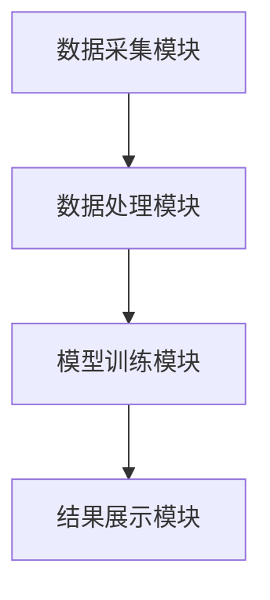

                 


# 基于多智能体的动态行业分析模型在价值投资中的应用

## 关键词：
多智能体系统、动态行业分析模型、价值投资、算法原理、系统架构设计、项目实战

## 摘要：
本文探讨了多智能体模型在动态行业分析中的应用，特别是在价值投资领域。通过介绍多智能体系统的基本概念、动态行业分析模型的原理，结合具体的算法实现和系统架构设计，展示了如何利用多智能体模型进行动态行业分析，以支持价值投资决策。文章还通过项目实战部分，详细讲解了如何构建一个多智能体动态行业分析模型，并通过案例分析验证了其在价值投资中的应用效果。

---

# 第一部分：背景介绍

## 第1章：多智能体系统与动态行业分析模型的背景

### 1.1 多智能体系统的基本概念
#### 1.1.1 多智能体系统的定义
多智能体系统（Multi-Agent System, MAS）是由多个相互作用的智能体（Agent）组成的系统。智能体是指能够感知环境、自主决策并采取行动的实体。多智能体系统的特点包括分布性、协作性、反应性和适应性。

#### 1.1.2 多智能体系统的特性
- 分布性：系统中的智能体是分布式的，每个智能体负责一部分任务。
- 协作性：智能体之间需要协作完成共同目标。
- 反应性：智能体能够根据环境的变化调整自身行为。
- 适应性：系统能够在动态环境中自适应调整。

#### 1.1.3 多智能体系统在金融领域的应用
在金融领域，多智能体系统可以用于股票交易、风险评估、市场预测等场景。通过多个智能体的协作，可以实现更高效和准确的金融分析。

### 1.2 动态行业分析模型的背景
#### 1.2.1 行业分析的传统方法
传统的行业分析方法主要依赖于财务报表分析、市场趋势分析等静态方法。这些方法难以应对市场的动态变化。

#### 1.2.2 动态行业分析的定义
动态行业分析是一种基于实时数据和市场变化，动态调整分析模型的方法。它能够捕捉市场的短期波动和长期趋势。

#### 1.2.3 动态行业分析的必要性
随着市场的快速变化，传统的静态分析方法已无法满足需求。动态行业分析能够实时更新分析结果，帮助投资者做出更及时的决策。

### 1.3 价值投资中的动态行业分析
#### 1.3.1 价值投资的基本原理
价值投资是一种投资策略，强调以低于内在价值的价格购买优质资产。其核心是通过分析企业的基本面，寻找被市场低估的投资机会。

#### 1.3.2 动态行业分析在价值投资中的作用
动态行业分析能够帮助投资者识别行业的周期性变化，评估企业的竞争地位，并预测行业的未来发展趋势。

#### 1.3.3 多智能体模型在价值投资中的优势
多智能体模型能够从多个角度分析行业动态，提供全面的分析结果。通过多个智能体的协作，可以提高分析的准确性和效率。

---

# 第二部分：核心概念与联系

## 第2章：多智能体模型与动态行业分析模型的核心概念

### 2.1 多智能体模型的原理
#### 2.1.1 多智能体模型的组成
多智能体模型由多个智能体组成，每个智能体负责特定的任务。智能体之间通过通信和协作完成共同目标。

#### 2.1.2 多智能体模型的交互机制
智能体之间的交互包括信息交换、任务分配和协作决策。通过有效的交互机制，可以实现系统的高效运作。

#### 2.1.3 多智能体模型的通信协议
通信协议是智能体之间进行信息交换的规则。常见的通信协议包括基于消息的通信和基于状态的通信。

### 2.2 动态行业分析模型的原理
#### 2.2.1 动态行业分析模型的输入
动态行业分析模型的输入包括市场数据、行业数据和公司基本面数据等。

#### 2.2.2 动态行业分析模型的处理流程
模型通过数据预处理、特征提取、模型训练和预测生成分析结果。

#### 2.2.3 动态行业分析模型的输出
模型输出包括行业的趋势分析、企业的竞争力评估和投资建议等。

### 2.3 多智能体模型与动态行业分析模型的关系
#### 2.3.1 多智能体模型在动态行业分析中的角色
多智能体模型可以用于数据采集、特征提取和预测生成等任务。

#### 2.3.2 动态行业分析模型对多智能体模型的依赖
动态行业分析模型依赖于多智能体模型的协作和交互能力，以实现高效的分析。

#### 2.3.3 两者结合的优势
结合多智能体模型和动态行业分析模型，可以实现对行业动态的全面、实时分析，为价值投资提供有力支持。

---

# 第三部分：算法原理讲解

## 第3章：多智能体模型的算法原理

### 3.1 多智能体模型的算法

#### 3.1.1 多智能体模型的算法步骤
1. 数据采集：从多个数据源采集市场数据和行业数据。
2. 数据预处理：对数据进行清洗和标准化处理。
3. 特征提取：提取影响行业动态的关键特征。
4. 模型训练：使用机器学习算法训练多智能体模型。
5. 模型预测：基于模型生成行业分析结果。

#### 3.1.2 多智能体模型的算法实现
使用Python实现一个多智能体模型，用于股票市场的动态行业分析。

```python
import numpy as np
import pandas as pd

class Agent:
    def __init__(self, id):
        self.id = id
        self.position = 0

    def update(self, data):
        # 数据处理逻辑
        pass

class MultiAgentSystem:
    def __init__(self, agents):
        self.agents = agents

    def run(self, data):
        for agent in self.agents:
            agent.update(data)
```

---

## 第4章：动态行业分析模型的算法原理

### 4.1 动态行业分析模型的算法步骤

#### 4.1.1 数据预处理
- 数据清洗：去除缺失值和异常值。
- 数据标准化：将数据标准化到统一范围。

#### 4.1.2 特征提取
- 提取行业相关指标：如行业增长率、市场份额等。
- 提取公司基本面数据：如收入、利润等。

#### 4.1.3 模型训练
- 使用机器学习算法：如随机森林、支持向量机等。
- 训练模型并进行交叉验证。

#### 4.1.4 模型预测
- 基于训练好的模型，预测行业趋势和企业价值。

---

# 第四部分：系统分析与架构设计方案

## 第5章：动态行业分析模型的系统架构设计

### 5.1 系统功能设计

#### 5.1.1 功能模块划分
- 数据采集模块：负责采集市场数据和行业数据。
- 数据处理模块：对数据进行预处理和特征提取。
- 模型训练模块：训练动态行业分析模型。
- 结果展示模块：展示分析结果和投资建议。

#### 5.1.2 功能模块的交互流程
1. 数据采集模块采集数据并传递给数据处理模块。
2. 数据处理模块对数据进行处理后传递给模型训练模块。
3. 模型训练模块生成分析结果并传递给结果展示模块。
4. 结果展示模块展示分析结果并提供投资建议。

### 5.2 系统架构设计

#### 5.2.1 系统架构图


#### 5.2.2 系统接口设计
- 数据采集模块提供数据接口，供其他模块调用。
- 数据处理模块提供数据预处理接口。
- 模型训练模块提供模型训练接口。
- 结果展示模块提供结果展示接口。

---

## 第6章：项目实战

### 6.1 项目背景

#### 6.1.1 项目目标
构建一个多智能体动态行业分析模型，用于股票市场的行业分析和投资决策。

#### 6.1.2 项目需求
- 实时采集股票市场数据。
- 动态分析行业趋势。
- 提供投资建议。

### 6.2 项目实现

#### 6.2.1 环境搭建
- 安装Python和相关库：如numpy、pandas、scikit-learn。
- 安装股票数据采集工具：如Yahoo Finance API。

#### 6.2.2 核心代码实现
```python
import pandas as pd
from sklearn.ensemble import RandomForestRegressor

class DynamicIndustryAnalyzer:
    def __init__(self):
        self.model = RandomForestRegressor()

    def train(self, X, y):
        self.model.fit(X, y)

    def predict(self, X):
        return self.model.predict(X)
```

#### 6.2.3 代码解读
- `DynamicIndustryAnalyzer`类封装了动态行业分析模型。
- `train`方法用于训练模型。
- `predict`方法用于生成预测结果。

### 6.3 项目测试与分析

#### 6.3.1 测试数据准备
- 收集历史股票数据。
- 提取行业相关特征。

#### 6.3.2 模型训练与预测
- 使用历史数据训练模型。
- 生成行业趋势预测结果。

#### 6.3.3 结果分析
- 比较预测结果与实际结果，评估模型的准确性。

### 6.4 项目总结

#### 6.4.1 成果展示
- 展示模型的预测结果和投资建议。
- 讨论模型的优势和不足。

#### 6.4.2 经验总结
- 数据质量对模型性能的影响。
- 模型调优的经验和技巧。

---

## 第五部分：小结

## 第7章：小结

### 7.1 全文回顾
本文介绍了多智能体模型在动态行业分析中的应用，详细讲解了算法原理和系统架构设计，并通过项目实战展示了模型的应用效果。

### 7.2 展望未来
随着人工智能技术的发展，多智能体模型在动态行业分析中的应用前景广阔。未来可以进一步优化模型算法，提升分析的准确性和效率。

---

## 作者：AI天才研究院 & 禅与计算机程序设计艺术

---

以上是《基于多智能体的动态行业分析模型在价值投资中的应用》的完整目录大纲，内容涵盖背景介绍、核心概念、算法原理、系统架构设计和项目实战等多个方面，结构清晰，逻辑连贯，旨在为读者提供全面的理论和技术指导。

