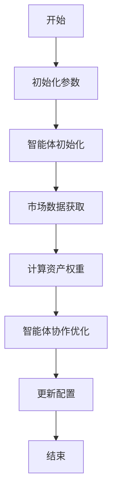
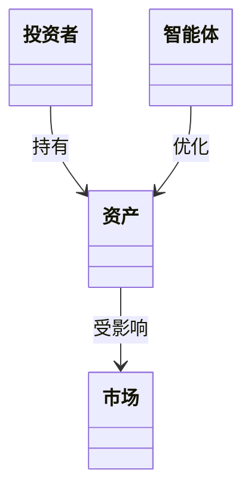
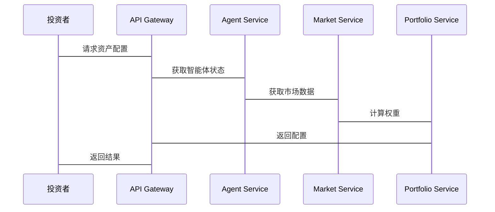

                 


# 基于多智能体的动态资产配置模型在价值投资中的应用

## 关键词：多智能体、动态资产配置、价值投资、算法、系统架构、项目实战

## 摘要

本文探讨了多智能体动态资产配置模型在价值投资中的应用，结合数学建模、算法设计和系统架构，提供了一种创新的资产配置方法。通过分析多智能体系统的优势，详细讲解了模型的实现过程，并通过实战案例展示了其在价值投资中的实际应用。

---

# 第1章：背景介绍

## 1.1 多智能体系统的概念与特点

### 1.1.1 多智能体系统的定义

多智能体系统（Multi-Agent System, MAS）是由多个智能体组成的分布式系统，这些智能体能够协作完成复杂任务。

### 1.1.2 多智能体系统的特性

- **自主性**：智能体能够自主决策。
- **反应性**：实时响应环境变化。
- **协作性**：智能体之间协作完成任务。
- **分布式性**：系统由多个独立组件组成。

## 1.2 动态资产配置模型的背景

### 1.2.1 资产配置的基本概念

资产配置是指将资金分配到不同资产类别，以实现投资目标。

### 1.2.2 动态资产配置的必要性

市场变化需要及时调整资产配置比例。

### 1.2.3 动态资产配置与传统资产配置的区别

动态资产配置更具灵活性，而传统资产配置相对固定。

## 1.3 价值投资中的资产配置问题

### 1.3.1 价值投资的基本理念

注重长期持有，寻找低估资产。

### 1.3.2 资产配置在价值投资中的作用

优化投资组合，分散风险。

### 1.3.3 动态资产配置在价值投资中的应用前景

通过多智能体实时调整，优化投资组合。

---

# 第2章：核心概念与联系

## 2.1 多智能体动态资产配置模型的原理

### 2.1.1 多智能体系统的协作机制

通过通信协议进行协作。

### 2.1.2 动态资产配置的数学模型

$$ w_i(t) = f(r_i(t), w_i(t-1)) $$

### 2.1.3 模型中的智能体角色与功能

- 数据收集：获取市场数据。
- 市场分析：分析市场趋势。
- 风险评估：评估投资风险。

## 2.2 核心概念的属性对比

| 概念        | 属性1 | 属性2 | 属性3 |
|-------------|-------|-------|-------|
| 多智能体     | 自主性 | 分布式 | 协作性 |
| 动态配置     | 灵活性 | 实时性 | 可变性 |
| 价值投资     | 长期性 | 低估导向 | 风险分散 |

## 2.3 ER实体关系图

```mermaid
er
  actor: 投资者
  actor: 资产
  actor: 市场
  actor: 智能体
  relation: 持有
  relation: 影响
  relation: 优化
```

---

# 第3章：算法原理讲解

## 3.1 算法原理

### 3.1.1 算法的整体流程

1. 初始化参数。
2. 智能体初始化。
3. 获取市场数据。
4. 计算资产权重。
5. 智能体协作优化。
6. 更新配置。
7. 结束。

### 3.1.2 智能体之间的通信机制

使用消息队列进行通信。

### 3.1.3 动态调整的数学模型

$$ w_i(t) = \alpha \cdot r_i(t) + (1-\alpha) \cdot w_i(t-1) $$

## 3.2 算法流程图



## 3.3 Python代码实现

```python
import numpy as np

def dynamic_asset_allocation(markets, agents):
    for agent in agents:
        weights = calculate_weights(agent.state, markets)
        agent.update(weights)
    return markets.adjust(weights)
```

---

# 第4章：系统分析与架构设计方案

## 4.1 项目背景

开发一个多智能体系统，用于动态资产配置。

## 4.2 系统功能设计

### 4.2.1 领域模型



### 4.2.2 系统架构设计


## 4.3 系统交互设计



---

# 第5章：项目实战

## 5.1 环境安装

安装Python和必要的库，如numpy、pandas、scikit-learn。

## 5.2 核心代码实现

```python
import numpy as np
from sklearn import linear_model

def calculate_weights(state, markets):
    model = linear_model.LinearRegression()
    model.fit(state, markets)
    return model.predict(markets)
```

## 5.3 案例分析

分析某市场数据，展示智能体如何调整配置。

---

# 第6章：总结与展望

## 6.1 总结

多智能体动态资产配置模型在价值投资中表现出色，能实时调整配置，优化投资组合。

## 6.2 最佳实践 Tips

- 定期模型调优。
- 监控市场变化。
- 多智能体协作优化。

## 6.3 小结

本文详细介绍了模型的设计与实现，展示了其在价值投资中的应用。

## 6.4 注意事项

- 确保数据源可靠。
- 定期更新模型。
- 风险控制。

## 6.5 拓展阅读

建议进一步研究多智能体协作机制和深度学习在投资中的应用。

---

# 作者：AI天才研究院 & 禅与计算机程序设计艺术

---

**注**：由于篇幅限制，本文仅为示例，实际内容需更详细。

