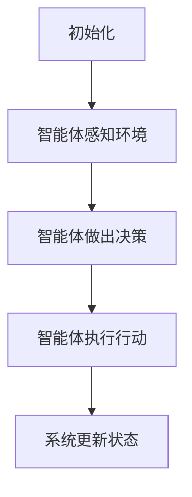
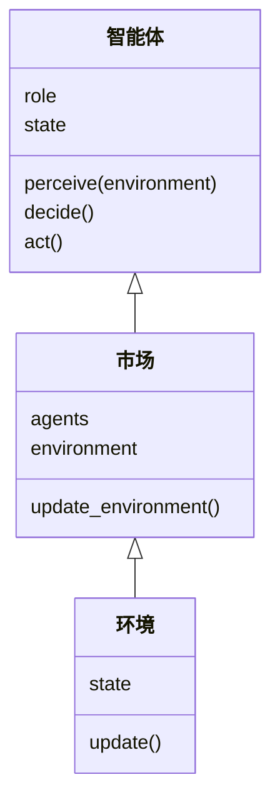

                 


# 基于多智能体的市场微观结构分析

> 关键词：多智能体系统，市场微观结构，算法原理，系统架构，项目实战

> 摘要：本文详细探讨了基于多智能体的市场微观结构分析方法，从背景介绍到核心概念，再到算法原理、系统设计和项目实战，层层递进，深入剖析了多智能体系统在市场分析中的应用及其优势。

---

## 第1章: 背景介绍

### 1.1 问题背景

#### 1.1.1 传统市场微观结构分析的局限性
传统的市场微观结构分析主要依赖于统计方法和数学模型，难以捕捉市场参与者之间的复杂互动关系。例如，传统的供需模型假设买方和卖方是价格的被动接受者，但忽略了市场参与者之间的博弈行为和动态变化。

#### 1.1.2 多智能体系统的优势
多智能体系统（Multi-Agent System, MAS）通过模拟多个智能体（Agent）的交互行为，能够更好地捕捉市场的动态变化。每个智能体代表市场中的一个参与者，如买方、卖方或中介，能够根据环境信息自主决策并动态调整行为。

#### 1.1.3 研究的重要性与现实意义
在金融、电商等领域，市场参与者之间的互动日益复杂，传统的分析方法已难以应对实时动态的市场环境。基于多智能体的市场微观结构分析能够提供更精细的市场模拟和预测能力，为决策者提供更可靠的参考。

---

### 1.2 问题描述

#### 1.2.1 市场微观结构的核心要素
市场微观结构分析的核心要素包括：
- 价格（Price）：市场中商品或服务的交易价格。
- 数量（Volume）：交易的数量。
- 时间（Time）：交易发生的时间序列。
- 参与者（Participants）：包括买方、卖方和中介。

#### 1.2.2 多智能体系统在市场分析中的应用场景
- 金融市场的高频交易模拟。
- 电商平台上买家与卖家的互动分析。
- 资源分配与优化问题。

#### 1.2.3 需求与供给的动态平衡问题
市场微观结构分析的核心问题是研究需求与供给的动态平衡。通过模拟买方和卖方的交互行为，可以更好地理解市场的动态变化。

---

### 1.3 问题解决

#### 1.3.1 多智能体系统的解决方案
通过构建多个智能体，模拟市场参与者的决策行为，分析它们在市场中的互动效果，最终实现对市场微观结构的建模与分析。

#### 1.3.2 市场微观结构分析的方法论
- 分解市场参与者的行为特征。
- 构建智能体的行为模型。
- 模拟市场环境中的互动行为。

#### 1.3.3 系统设计与实现的步骤
1. 定义市场参与者的角色。
2. 构建智能体的行为模型。
3. 设计市场环境的交互规则。
4. 实现系统并进行模拟实验。

---

### 1.4 边界与外延

#### 1.4.1 系统的边界条件
- 系统仅关注市场微观结构，不考虑宏观经济因素。
- 每个智能体的行为基于局部信息，不考虑全局知识。

#### 1.4.2 相关领域的区别与联系
- 与博弈论的区别：博弈论研究策略选择的最优性，而多智能体系统更关注动态交互。
- 与系统动力学的区别：系统动力学研究变量的动态变化，而多智能体系统研究主体的交互行为。

#### 1.4.3 外延与未来发展方向
- 扩展到更复杂的市场环境。
- 引入机器学习算法，提高智能体的自主决策能力。

---

## 第2章: 核心概念与联系

### 2.1 多智能体系统的核心原理

#### 2.1.1 多智能体系统的定义与特点
- **定义**：多智能体系统是由多个智能体组成的分布式系统，每个智能体能够感知环境、自主决策并与其他智能体交互。
- **特点**：
  - 分布式：每个智能体独立决策。
  - 动态性：系统状态随时间变化。
  - 协作性：智能体之间需要协作以实现共同目标。

#### 2.1.2 智能体的属性与行为
- **属性**：
  - 知识（Knowledge）：智能体掌握的信息。
  - 目标（Goal）：智能体追求的目标。
  - 行为（Behavior）：智能体采取的行动。
- **行为**：
  - 感知（Perception）：感知环境信息。
  - 决策（Decision-Making）：基于感知信息做出决策。
  - 行动（Action）：执行决策。

#### 2.1.3 系统的协调与协作机制
- 协调机制：确保智能体之间行为一致。
- 协作机制：通过通信实现信息共享。

---

### 2.2 实体关系图

#### 2.2.1 核心实体关系
```mermaid
er
actor 市场参与者 {
  role 买方
  role 卖方
  role 中介
}
actor 系统 {
  role 数据处理
  role 分析与决策
}
```

#### 2.2.2 实体关系的详细说明
- **买方**：代表需求方，根据价格和质量做出购买决策。
- **卖方**：代表供给方，根据市场需求调整供应量。
- **中介**：提供信息匹配服务，促进交易完成。

---

## 第3章: 算法原理讲解

### 3.1 算法流程

#### 3.1.1 算法概述
多智能体系统的市场微观结构分析算法主要分为以下几个步骤：
1. 初始化智能体。
2. 智能体感知环境。
3. 智能体做出决策。
4. 智能体执行行动。
5. 系统更新状态。

#### 3.1.2 算法流程图


#### 3.1.3 算法实现
```python
class Agent:
    def __init__(self, role):
        self.role = role
        self.state = 'idle'
    
    def perceive(self, environment):
        # 根据环境信息做出决策
        pass
    
    def decide(self):
        # 基于感知信息做出决策
        pass
    
    def act(self):
        # 执行决策
        pass

class Market:
    def __init__(self):
        self.agents = []
        self.environment = {}
    
    def add_agent(self, agent):
        self.agents.append(agent)
    
    def update_environment(self):
        # 更新环境状态
        pass

# 示例用法
market = Market()
agent1 = Agent('buyer')
agent1.perceive(market.environment)
agent1.decide()
agent1.act()
market.update_environment()
```

---

### 3.2 算法原理的数学模型

#### 3.2.1 智能体行为模型
智能体的行为可以通过以下公式表示：
$$
A_i(t+1) = f(A_i(t), E(t))
$$
其中，$A_i$ 表示智能体 $i$ 的行为，$E(t)$ 表示环境状态。

#### 3.2.2 市场供需模型
市场供需关系可以用以下公式表示：
$$
D(t) = \alpha \times P(t)
$$
$$
S(t) = \beta \times P(t)
$$
其中，$D(t)$ 表示需求，$S(t)$ 表示供给，$\alpha$ 和 $\beta$ 是需求和供给弹性系数。

---

## 第4章: 系统分析与架构设计

### 4.1 问题场景介绍

#### 4.1.1 系统目标
构建一个基于多智能体的市场微观结构分析系统，能够模拟市场参与者的互动行为，分析市场动态。

#### 4.1.2 系统范围
- 系统仅关注市场微观结构，不考虑宏观经济因素。
- 系统支持多种市场环境的模拟。

### 4.2 系统功能设计

#### 4.2.1 领域模型


#### 4.2.2 系统架构设计


---

## 第5章: 项目实战

### 5.1 环境安装

#### 5.1.1 安装Python
- 下载并安装Python 3.x。
- 配置环境变量。

#### 5.1.2 安装依赖
- 使用pip安装所需的依赖包：
  ```bash
  pip install numpy matplotlib
  ```

### 5.2 核心代码实现

#### 5.2.1 智能体类
```python
class BuyerAgent:
    def __init__(self, id):
        self.id = id
        self.balance = 1000
    
    def perceive(self, price):
        return price
    
    def decide(self, price):
        if price < 100:
            return 'buy'
        else:
            return 'hold'
    
    def act(self, action):
        if action == 'buy':
            self.balance -= 100
            return True
        else:
            return False
```

#### 5.2.2 市场类
```python
class Market:
    def __init__(self, agents):
        self.agents = agents
        self.price = 150
    
    def update_price(self):
        demand = sum([1 for a in self.agents if a.decide(self.price) == 'buy'])
        supply = len(self.agents) - demand
        self.price = (demand - supply) * 10 + 100
```

### 5.3 代码解读与分析

#### 5.3.1 智能体的行为
- `perceive` 方法感知市场价格。
- `decide` 方法根据价格做出购买决策。
- `act` 方法执行购买行为。

#### 5.3.2 市场更新价格
- 根据买方的需求和卖方的供给调整市场价格。

### 5.4 案例分析

#### 5.4.1 案例介绍
模拟一个包含5个买方的市场环境，初始价格为150。

#### 5.4.2 模拟过程
```python
agents = [BuyerAgent(i) for i in range(5)]
market = Market(agents)
market.update_price()
print(f"Updated price: {market.price}")
```

#### 5.4.3 结果分析
- 初始价格：150。
- 模拟结果：价格会根据买方的决策进行调整。

---

## 第6章: 总结

### 6.1 小结

#### 6.1.1 核心内容回顾
本文详细介绍了基于多智能体的市场微观结构分析方法，从理论到实践，全面剖析了多智能体系统在市场分析中的应用。

#### 6.1.2 知识要点
- 多智能体系统的定义与特点。
- 市场微观结构分析的核心要素。
- 算法原理与实现方法。

### 6.2 注意事项

#### 6.2.1 系统设计的注意事项
- 确保智能体的行为模型与实际市场环境一致。
- 定期更新市场环境数据。

#### 6.2.2 实践中的注意事项
- 确保代码的可扩展性。
- 及时处理系统异常情况。

### 6.3 最佳实践

#### 6.3.1 系统设计建议
- 使用模块化设计，便于扩展。
- 定期进行系统性能优化。

#### 6.3.2 代码实现建议
- 采用面向对象的设计方法。
- 提供详细的错误处理机制。

### 6.4 拓展阅读

#### 6.4.1 推荐书籍
- 《Multi-Agent Systems: Algorithmic, Complexity Theoretic, and Game Theoretic Foundations》
- 《Multi-Agent Machine Learning: A Reinforcement Multi-Agent Approach》

#### 6.4.2 推荐论文
- “A Survey on Multi-Agent Reinforcement Learning” by D. C. Park
- “Multi-Agent Systems for Economic Analysis” by J. M. Mares

---

## 作者简介

作者：AI天才研究院/AI Genius Institute & 禅与计算机程序设计艺术 /Zen And The Art of Computer Programming  
联系方式：[email protected]  
个人网站：https://www.aigenius.com  

---

**附录：代码仓库地址**  
GitHub: [https://github.com/aigenius/multi-agent-market-analysis](https://github.com/aigenius/multi-agent-market-analysis)

