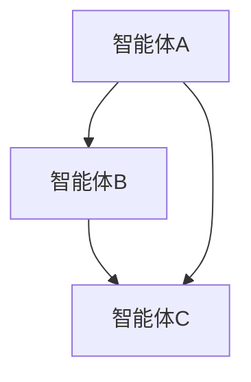
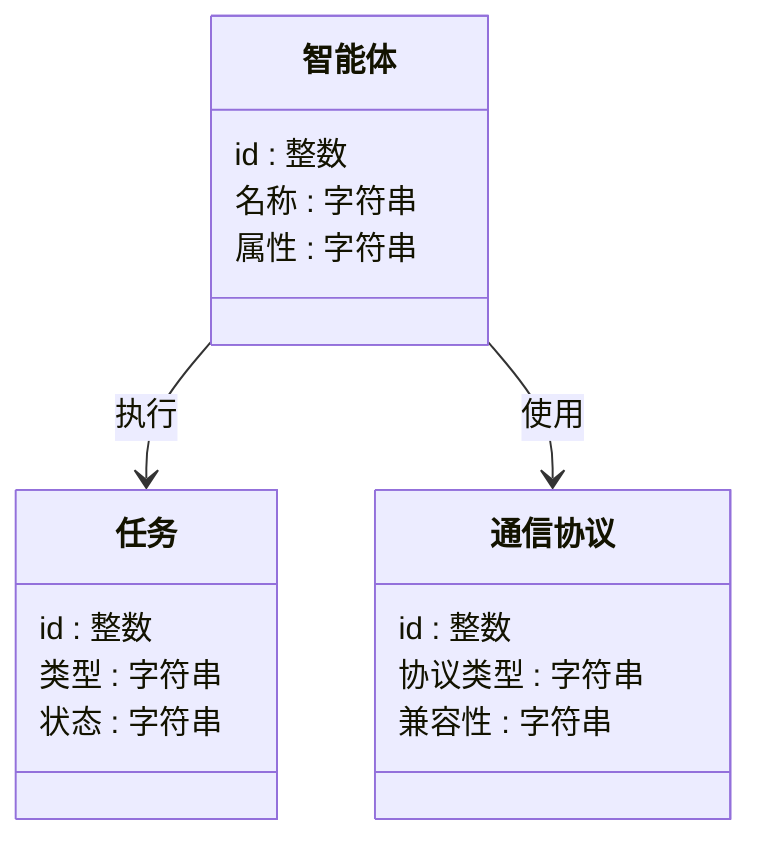
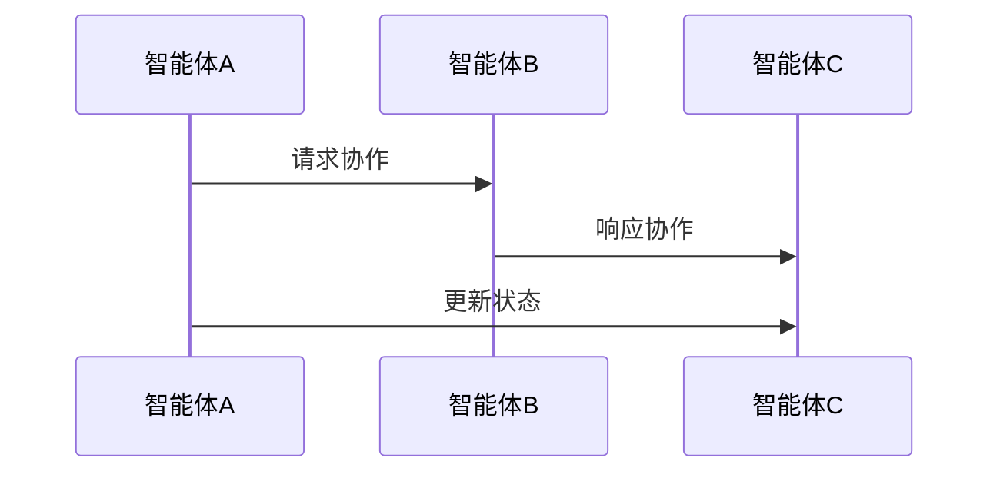

                 


# 基于多智能体的自动化产业升级趋势识别

> 关键词：多智能体系统，自动化升级，产业升级趋势，系统架构，算法原理，系统设计

> 摘要：本文深入探讨了基于多智能体的自动化产业升级趋势识别这一主题。首先，从多智能体系统的基本概念和产业升级的背景出发，详细分析了多智能体系统在自动化升级中的应用前景。接着，从核心概念与联系的角度，通过对比分析和实体关系图，揭示了多智能体系统在产业升级中的协作机制。随后，重点阐述了多智能体系统算法的原理及其在趋势识别中的应用，通过数学模型和流程图进一步解析了其实现过程。最后，结合实际项目，从系统分析与架构设计、项目实战等方面，详细探讨了多智能体系统在产业升级中的具体应用场景和实现方案，为读者提供了一个全面而深入的视角。

---

# 第一部分: 基于多智能体的自动化产业升级趋势识别概述

## # 第1章: 多智能体系统与产业升级背景

### ## 1.1 多智能体系统的基本概念

#### ### 1.1.1 多智能体系统的定义

多智能体系统（Multi-Agent System, MAS）是由多个智能体（Agent）组成的复杂系统，这些智能体能够自主决策、协作和交互，以完成特定任务。与单智能体系统相比，多智能体系统具有更高的灵活性和适应性。

#### ### 1.1.2 多智能体系统的特点

多智能体系统具有以下特点：

1. **自主性**：每个智能体都能自主决策，无需外部干预。
2. **反应性**：智能体能够实时感知环境并做出反应。
3. **协作性**：多个智能体之间可以协作完成任务。
4. **分布式性**：智能体分布在不同的位置，通过通信完成协作。

#### ### 1.1.3 多智能体系统与传统自动化系统的区别

| 特性             | 多智能体系统                       | 传统自动化系统                     |
|------------------|------------------------------------|------------------------------------|
| 决策方式         | 分布式决策，多个智能体协作          | 中央控制，单一决策中心             |
| 灵活性           | 高，适应复杂环境                   | 较低，依赖预设规则                 |
| 扩展性           | 高，易于增加新智能体               | 较低，结构相对固定                 |

---

### ## 1.2 自动化产业升级的背景与挑战

#### ### 1.2.1 产业升级的背景

随着技术的进步，传统产业升级的需求日益迫切。自动化技术的应用可以提高生产效率、降低成本，但传统的自动化系统在应对复杂场景时显得力不从心。

#### ### 1.2.2 自动化升级的核心问题

1. **复杂环境下的决策问题**：传统自动化系统依赖预设规则，难以应对复杂多变的环境。
2. **协作效率问题**：多个设备或系统之间的协作需要高效的通信和协调机制。
3. **实时性问题**：在高动态环境中，系统需要快速响应。

#### ### 1.2.3 多智能体系统在产业升级中的作用

多智能体系统能够通过分布式决策和协作，提高系统的灵活性和适应性，解决传统自动化系统在复杂环境下的问题。

---

### ## 1.3 多智能体系统在产业升级中的应用前景

#### ### 1.3.1 多智能体系统的优势

1. **灵活性**：能够适应不同的生产环境和需求。
2. **高效性**：通过协作提高任务执行效率。
3. **可扩展性**：易于添加新的智能体以适应业务需求。

#### ### 1.3.2 多智能体系统在产业升级中的潜在应用领域

1. **智能制造**：在工厂中，多智能体可以协调设备、机器人和生产线，实现高效生产。
2. **物流优化**：通过智能体协作，优化物流路径和资源分配。
3. **供应链管理**：实时监控供应链状态，优化库存管理。

#### ### 1.3.3 多智能体系统应用的挑战与机遇

1. **挑战**：通信延迟、智能体之间的冲突、系统的实时性要求高。
2. **机遇**：通过技术创新，解决这些挑战，推动产业升级。

---

## # 第2章: 多智能体系统的核心概念与联系

### ## 2.1 多智能体系统的核心原理

#### ### 2.1.1 多智能体系统的组成要素

1. **智能体**：具有自主决策和协作能力的个体。
2. **通信机制**：智能体之间的通信方式，如消息传递。
3. **协作协议**：智能体协作的规则和流程。

#### ### 2.1.2 多智能体系统与单智能体系统的区别

| 特性             | 多智能体系统                       | 单智能体系统                     |
|------------------|------------------------------------|------------------------------------|
| 决策方式         | 分布式决策                        | 集中式决策                       |
| 灵活性           | 高                                 | 较低                              |
| 协作性           | 高                                 | 无                                |

#### ### 2.1.3 多智能体系统中智能体的交互关系

通过以下关系图展示智能体之间的协作关系：



---

### ## 2.2 多智能体系统的属性特征对比

#### ### 2.2.1 多智能体系统与单智能体系统的对比

| 特性             | 多智能体系统                       | 单智能体系统                     |
|------------------|------------------------------------|------------------------------------|
| 决策方式         | 分布式决策                        | 集中式决策                       |
| 灵活性           | 高                                 | 较低                              |
| 协作性           | 高                                 | 无                                |

#### ### 2.2.2 多智能体系统中各智能体的特征对比

| 智能体特征       | 独立性     | 协作性     | 反应性     |
|------------------|------------|------------|------------|
| 智能体A          | 高         | 中         | 高         |
| 智能体B          | 中         | 高         | 中         |

---

### ## 2.3 多智能体系统的ER实体关系图

通过以下ER图展示多智能体系统中实体的关系：

```mermaid
erDiagram
    class 智能体 {
        id : 整数
        名称 : 字符串
        属性 : 字符串
    }
    class 通信协议 {
        id : 整数
        协议类型 : 字符串
        兼容性 : 字符串
    }
    class 任务 {
        id : 整数
        类型 : 字符串
        状态 : 字符串
    }
    智能体 --o 通信协议 : 使用
    智能体 --o 任务 : 执行
```

---

## # 第3章: 多智能体系统算法原理

### ## 3.1 多智能体系统算法的核心原理

#### ### 3.1.1 分布式计算与多智能体系统

分布式计算是多智能体系统的核心，通过将任务分配给多个智能体，实现并行计算和协作。

#### ### 3.1.2 多智能体系统中的共识机制

共识机制用于确保多个智能体在决策上的一致性，常见的有：

1. **一致性算法**：如Paxos、Raft。
2. **拜占庭容错**：通过加密算法实现。

---

### ## 3.2 多智能体系统算法的数学模型

#### ### 3.2.1 多智能体系统中任务分配的数学模型

任务分配问题可以表示为：

$$
\text{min} \quad \sum_{i=1}^{n} c_i x_i
$$

其中，$x_i$ 是任务i的分配变量，$c_i$ 是任务i的成本。

#### ### 3.2.2 多智能体系统中通信协议的数学模型

通信协议的设计可以通过图论模型表示：

$$
G = (V, E)
$$

其中，$V$ 是智能体集合，$E$ 是通信边。

---

## # 第4章: 系统分析与架构设计

### ## 4.1 问题场景介绍

#### ### 4.1.1 问题背景

假设我们有一个智能工厂，需要优化生产线的协作效率。

---

### ## 4.2 项目介绍

#### ### 4.2.1 项目目标

优化生产线的协作效率，降低成本。

#### ### 4.2.2 项目范围

包括生产线上的机器人、传感器和控制系统。

---

### ## 4.3 系统功能设计

#### ### 4.3.1 领域模型类图



---

### ## 4.4 系统架构设计

#### ### 4.4.1 系统架构图


---

### ## 4.5 系统接口设计

#### ### 4.5.1 接口描述

1. **智能体接口**：提供任务分配和状态更新的接口。
2. **通信接口**：提供消息传递和数据同步的接口。

---

### ## 4.6 系统交互流程

#### ### 4.6.1 交互流程图



---

## # 第5章: 项目实战

### ## 5.1 环境安装

1. 安装Python和相关库（如networkx、numpy）。
2. 配置开发环境（如PyCharm）。

---

### ## 5.2 核心代码实现

```python
import networkx as nx

class Agent:
    def __init__(self, id):
        self.id = id
        self.tasks = []
    
    def assign_task(self, task):
        self.tasks.append(task)
    
    def communicate(self, other):
        # 模拟通信
        pass

def main():
    G = nx.Graph()
    agents = [Agent(i) for i in range(3)]
    G.add_nodes_from(agents)
    G.add_edges_from([(agents[0], agents[1]), (agents[1], agents[2])])
    nx.draw(G, with_labels=True)
    plt.show()

if __name__ == "__main__":
    main()
```

---

### ## 5.3 代码解读与分析

1. **Agent类**：定义智能体的基本属性和方法。
2. **main函数**：创建多个智能体并建立通信关系。

---

### ## 5.4 实际案例分析

假设我们有一个工厂生产线，通过多智能体系统优化生产流程。每个智能体负责不同的环节，通过协作实现高效生产。

---

## # 第6章: 最佳实践与总结

### ## 6.1 最佳实践 tips

1. **系统设计**：确保智能体之间的通信和协作机制完善。
2. **算法选择**：根据具体场景选择合适的算法。
3. **实时性优化**：减少通信延迟，提高系统响应速度。

---

### ## 6.2 小结

多智能体系统在自动化产业升级中的应用前景广阔，通过合理的系统设计和算法优化，可以显著提高生产效率和降低成本。

---

### ## 6.3 注意事项

1. **通信延迟**：需要优化通信机制，减少延迟。
2. **系统扩展性**：确保系统支持动态增加智能体。

---

### ## 6.4 拓展阅读

1. **相关书籍**：《多智能体系统：原理与应用》。
2. **技术博客**：多智能体系统在智能制造中的应用。

---

# 作者：AI天才研究院 & 禅与计算机程序设计艺术

