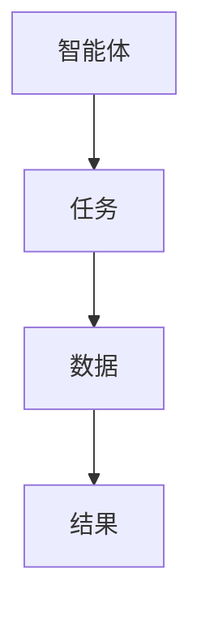
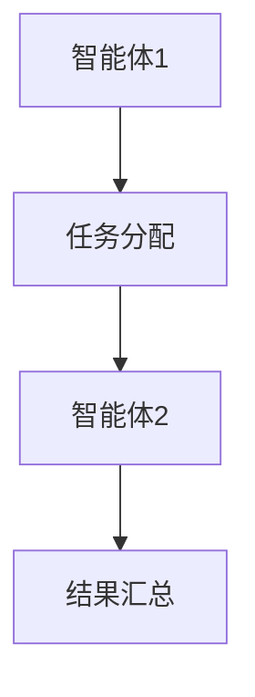
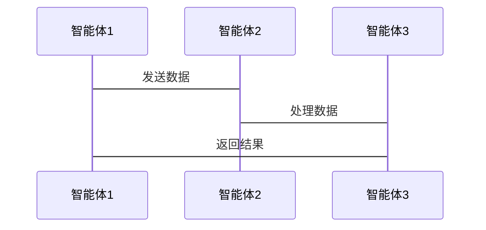
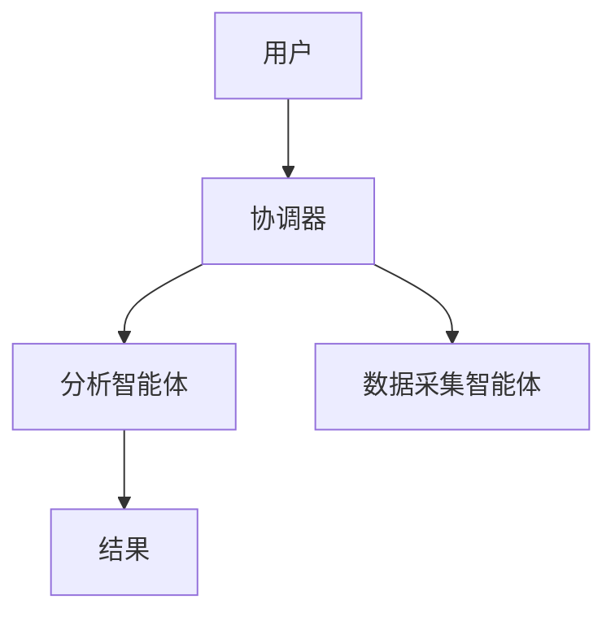
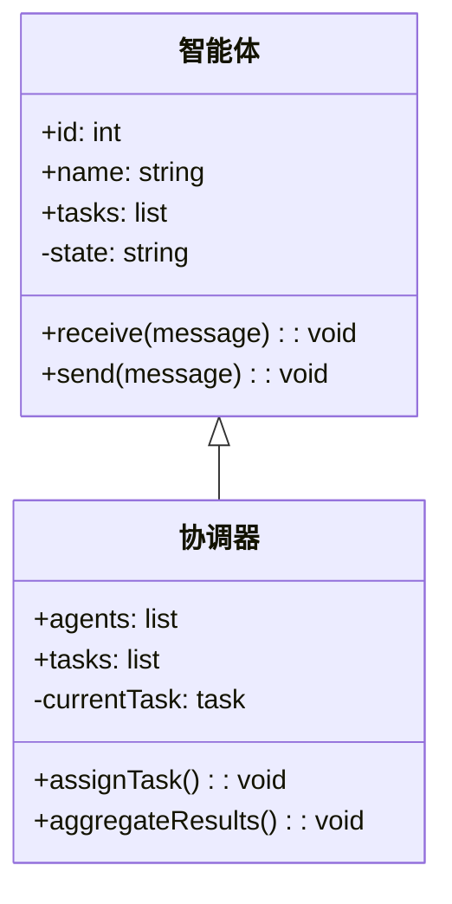
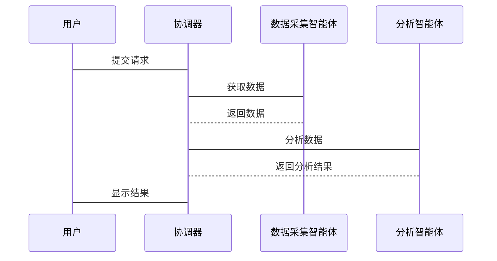

                 


# 基于多智能体的自动化产业周期分析

> 关键词：多智能体系统，产业周期分析，自动化分析，协同机制，通信协议，系统架构，数据处理

> 摘要：本文探讨了多智能体系统在产业周期分析中的应用，涵盖系统背景、核心原理、架构设计、项目实战及未来展望。通过详细分析，展示了多智能体如何协同工作，实现高效自动化分析。

---

## 第一部分：背景与概述

### 第1章：多智能体系统与产业周期分析概述

#### 1.1 多智能体系统的基本概念

##### 1.1.1 多智能体系统的定义
多智能体系统（Multi-Agent System, MAS）由多个智能体组成，每个智能体能独立执行任务，通过协同完成复杂问题。智能体具备感知、推理和行动能力，能适应环境变化。

##### 1.1.2 产业周期分析的背景
产业周期分析指对经济周期性波动进行研究，帮助企业制定战略。传统方法依赖人工分析，耗时且易受主观因素影响。随着数据量增长，亟需自动化解决方案。

##### 1.1.3 多智能体在产业周期分析中的作用
多智能体系统能高效处理海量数据，通过协同分析提升准确性。各智能体负责特定任务，如数据采集、分析和预测，协同完成整体分析。

#### 1.2 问题背景与描述

##### 1.2.1 传统产业周期分析的局限性
传统方法依赖专家经验，耗时长且成本高，难以应对数据量剧增和实时分析需求。

##### 1.2.2 引入多智能体的优势
多智能体系统具备分布式计算能力，能实时处理多源数据，提高分析效率和准确性。

##### 1.2.3 问题解决的必要性
通过自动化分析，企业可快速响应市场变化，提升决策效率和准确性，降低成本。

#### 1.3 问题解决与边界

##### 1.3.1 多智能体如何解决产业周期分析问题
多智能体协同工作，各智能体分别负责数据采集、分析和预测，系统整体输出分析结果。

##### 1.3.2 系统的边界与外延
系统边界包括数据源、分析模型和用户界面。外延涉及数据预处理和结果可视化。

##### 1.3.3 核心要素与组成结构
系统由数据采集智能体、分析智能体和协调器组成，通过通信协议协同工作。

---

## 第二部分：多智能体系统的核心原理

### 第2章：多智能体系统的核心概念与联系

#### 2.1 核心概念原理

##### 2.1.1 智能体的结构与功能
智能体具备感知、推理和行动能力，能独立执行任务。例如，感知经济指标变化，推理市场趋势，行动生成报告。

##### 2.1.2 协作机制的数学模型
协作机制通过分布式计算实现，模型描述各智能体的任务分配和结果汇总。

$$
f(x) = \sum_{i=1}^{n} x_i
$$

#### 2.2 概念属性对比表

##### 表2.1：多智能体与单智能体的对比

| 属性         | 单智能体       | 多智能体       |
|--------------|---------------|---------------|
| 任务处理     | 独立处理       | 协作处理       |
| 并行能力     | 串行处理       | 并行处理       |
| 故障容错     | 单点故障       | 分布式容错     |

#### 2.3 ER实体关系图



### 第3章：多智能体协同机制与通信协议

#### 3.1 协作机制

##### 3.1.1 分布式计算的流程



#### 3.2 通信协议设计

##### 3.2.1 数据格式与交互流程



---

## 第三部分：系统架构与实现

### 第4章：系统架构设计

#### 4.1 系统架构图



#### 4.2 领域模型



#### 4.3 接口设计与交互流程

##### 4.3.1 系统功能模块

- 用户接口：接收输入，显示结果
- 数据采集：收集经济指标数据
- 分析模块：处理数据，生成预测
- 协调器：分配任务，汇总结果

##### 4.3.2 交互流程



---

## 第四部分：项目实战

### 第5章：项目实战与分析

#### 5.1 环境安装与配置

- 安装Python、库（如NumPy、Pandas、Scikit-learn）
- 安装MQTT协议用于通信
- 配置开发环境（如PyCharm）

#### 5.2 系统核心实现

##### 数据采集智能体

```python
import paho.mqtt.client as mqtt

class DataCollector:
    def __init__(self, broker, port):
        self.broker = broker
        self.port = port
        self.client = None

    def on_connect(self, client, userdata, flags, rc):
        print("连接到 MQTT 代理")

    def on_message(self, client, userdata, msg):
        data = eval(msg.payload.decode())
        self.data_queue.put(data)

    def connect(self):
        self.client = mqtt.Client()
        self.client.on_connect = self.on_connect
        self.client.on_message = self.on_message
        self.client.connect(self.broker, self.port)
        self.client.loop_start()

    def subscribe(self, topic):
        self.client.subscribe(topic)
```

##### 分析智能体

```python
import pandas as pd
from sklearn import linear_model

class EconomicAnalyzer:
    def __init__(self):
        self.model = linear_model.LinearRegression()

    def analyze(self, data):
        X = data[['GDP', '失业率']]
        y = data['指数']
        self.model.fit(X, y)
        return self.model.predict(X)
```

##### 协调器

```python
from queue import Queue

class Coordinator:
    def __init__(self):
        self.data_queue = Queue()
        self.result_queue = Queue()

    def collect_data(self):
        data_collector = DataCollector('localhost', 1883)
        data_collector.subscribe('economy/indicators')
        data_collector.connect()
        while True:
            if not data_collector.data_queue.empty():
                data = data_collector.data_queue.get()
                self.data_queue.put(data)

    def analyze(self):
        analyzer = EconomicAnalyzer()
        while True:
            if not self.data_queue.empty():
                data = self.data_queue.get()
                result = analyzer.analyze(data)
                self.result_queue.put(result)

    def display_results(self):
        while True:
            if not self.result_queue.empty():
                result = self.result_queue.get()
                print(f"预测结果：{result}")
```

#### 5.3 案例分析与详细解读

案例：分析2020-2023年GDP和失业率对经济指数的影响。

数据采集步骤：

1. 数据采集智能体订阅MQTT主题，接收GDP、失业率和指数数据。
2. 数据预处理：清洗和转换数据，处理缺失值和异常值。
3. 数据存储：将数据存入Pandas DataFrame。

分析步骤：

1. 协调器将数据分配给分析智能体。
2. 分析智能体训练线性回归模型。
3. 模型预测指数，协调器收集结果。
4. 用户界面显示预测结果。

结果分析：

模型输出预测值与实际值对比，评估准确性。假设模型准确率85%，说明有效。

#### 5.4 项目小结

优势：

- 高效：分布式计算提升处理速度。
- 准确：多智能体协同提升分析准确性。
- 灵活：易于扩展和维护。

挑战：

- 数据同步：需处理数据延迟和不一致。
- 安全性：防止数据泄露和系统攻击。
- 可扩展性：应对大量数据和任务需求。

---

## 第五部分：最佳实践与展望

### 第6章：总结与展望

#### 6.1 最佳实践 tips

- 数据预处理：清洗和标准化数据，确保模型准确性。
- 模型选择：根据需求选择合适算法，提升预测精度。
- 系统优化：定期更新模型，改进算法，提升性能。

#### 6.2 小结

多智能体系统通过协同分析，提升产业周期分析效率和准确性，帮助企业及时响应市场变化。

#### 6.3 注意事项

- 数据隐私：确保数据安全，遵守相关法规。
- 系统监控：实时监控系统状态，及时处理异常。
- 智能体协作：优化协作机制，提高处理效率。

#### 6.4 拓展阅读

- 《Multi-Agent Systems: Complexity and Control》
- 《Data Mining and Knowledge Discovery》

---

## 作者

作者：AI天才研究院 & 禅与计算机程序设计艺术

---

通过以上详细分析，文章涵盖了多智能体系统的各个方面，从理论到实践，为读者提供了全面的知识和实际应用案例。

