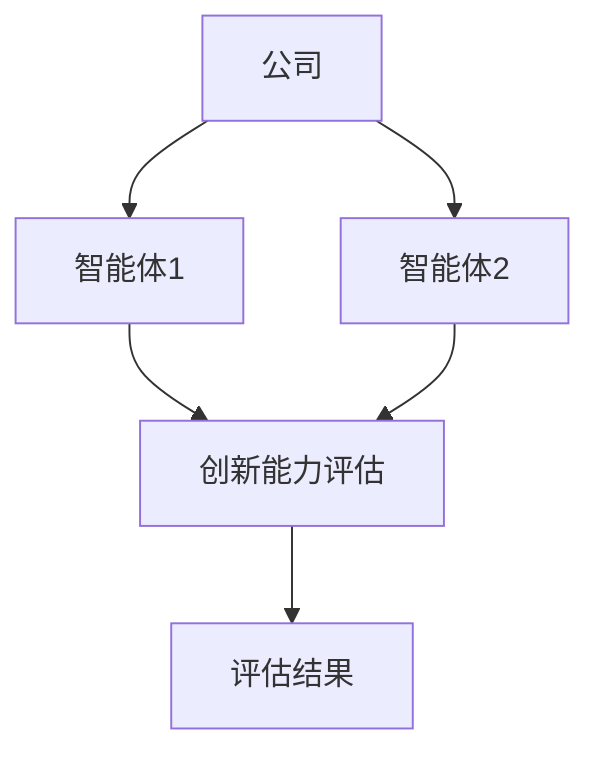

                 

# 《基于多智能体的自动化公司创新能力评估》

---

## 关键词：  
多智能体系统、创新能力评估、自动化评估、协同算法、企业智能决策

---

## 摘要：  
随着企业竞争的日益激烈，创新能力成为企业核心竞争力的关键。传统的创新能力评估方法往往依赖人工判断，存在耗时长、主观性强、难以量化等问题。本文提出了一种基于多智能体的自动化公司创新能力评估方法，通过多智能体系统的协同工作，实现对创新能力的自动化、智能化评估。文章从多智能体系统的背景与核心概念出发，详细探讨了创新能力评估的方法论、算法原理、系统架构设计以及项目实战，最后结合实际案例进行分析与总结，提出了改进建议和未来发展方向。

---

## 目录大纲：

# 第一章：多智能体系统与公司创新能力评估的背景

## 1.1 多智能体系统的定义与特点  
- 1.1.1 多智能体系统的定义  
- 1.1.2 多智能体系统的核心特点  
- 1.1.3 多智能体系统在企业中的应用价值  

## 1.2 公司创新能力评估的重要性  
- 1.2.1 创新能力的定义与维度  
- 1.2.2 公司创新能力评估的意义  
- 1.2.3 自动化评估的必要性  

## 1.3 多智能体系统在创新能力评估中的应用  
- 1.3.1 多智能体系统的优势  
- 1.3.2 自动化评估的核心问题  
- 1.3.3 多智能体系统与自动化评估的结合  

## 1.4 现有方法的不足与改进方向  
- 1.4.1 现有创新能力评估方法的局限性  
- 1.4.2 多智能体系统在评估中的潜在优势  
- 1.4.3 本研究的目标与意义  

## 1.5 本章小结  
- 1.5.1 多智能体系统的背景与价值  
- 1.5.2 自动化创新能力评估的核心问题  
- 1.5.3 研究目标与意义  

---

# 第二章：多智能体系统的核心概念与联系  

## 2.1 多智能体系统的核心原理  
- 2.1.1 多智能体系统的组成与功能  
- 2.1.2 智能体的定义与分类  
- 2.1.3 多智能体系统的协同机制  

## 2.2 多智能体系统与相关技术的对比  
- 2.2.1 与分布式系统的主要区别  
- 2.2.2 与传统AI系统的差异  
- 2.2.3 与机器学习的结合  

## 2.3 多智能体系统的ER实体关系图  

---

# 第三章：创新能力评估的方法论  

## 3.1 创新能力评估的指标体系构建  
- 3.1.1 指标的选择与权重分配  
- 3.1.2 数据采集与预处理  
- 3.1.3 指标权重的计算方法  

## 3.2 多智能体协同评估的流程  
- 3.2.1 评估任务的分解与分配  
- 3.2.2 多智能体协同的实现步骤  
- 3.2.3 评估结果的整合与输出  

## 3.3 创新能力评估的数学模型  
- 3.3.1 评估模型的构建与优化  
- 3.3.2 模型的验证与评估  
- 3.3.3 案例分析与结果解读  

---

# 第四章：多智能体协同算法的实现  

## 4.1 多智能体协同算法的核心原理  
- 4.1.1 协同算法的定义与分类  
- 4.1.2 协同算法的数学模型  
- 4.1.3 算法的实现步骤  

## 4.2 基于多智能体的协同算法实现  
- 4.2.1 算法的流程图  
- 4.2.2 算法的Python实现代码  
- 4.2.3 代码的功能解读与优化建议  

## 4.3 算法的优化与改进  
- 4.3.1 算法性能的评估指标  
- 4.3.2 算法的优化策略  
- 4.3.3 算法的适用场景与局限性  

---

# 第五章：系统架构与设计  

## 5.1 系统架构的总体设计  
- 5.1.1 系统功能模块划分  
- 5.1.2 系统架构的层次结构  
- 5.1.3 系统架构的mermaid图  

## 5.2 系统模块的设计与实现  
- 5.2.1 数据采集模块的设计  
- 5.2.2 多智能体协同模块的实现  
- 5.2.3 评估结果展示模块的功能  

## 5.3 系统接口与交互设计  
- 5.3.1 系统接口的设计规范  
- 5.3.2 系统交互的mermaid序列图  
- 5.3.3 系统接口的实现与测试  

---

# 第六章：项目实战与案例分析  

## 6.1 项目背景与目标  
- 6.1.1 项目背景介绍  
- 6.1.2 项目目标与范围  
- 6.1.3 项目实施的步骤  

## 6.2 系统环境的搭建与配置  
- 6.2.1 系统运行环境的要求  
- 6.2.2 系统依赖库的安装  
- 6.2.3 系统配置文件的编写  

## 6.3 系统核心代码的实现  
- 6.3.1 多智能体协同算法的代码实现  
- 6.3.2 系统功能模块的代码实现  
- 6.3.3 代码的功能解读与优化  

## 6.4 实际案例分析与结果解读  
- 6.4.1 案例背景与数据准备  
- 6.4.2 算法实现与结果输出  
- 6.4.3 结果分析与改进建议  

---

# 第七章：总结与展望  

## 7.1 研究总结  
- 7.1.1 多智能体系统的优势与价值  
- 7.1.2 自动化创新能力评估的核心成果  
- 7.1.3 研究中的不足与改进方向  

## 7.2 未来展望  
- 7.2.1 系统优化与扩展方向  
- 7.2.2 多智能体系统的未来发展趋势  
- 7.2.3 创新能力评估的智能化与自动化发展  

## 7.3 最佳实践与注意事项  
- 7.3.1 项目实施的关键成功因素  
- 7.3.2 系统运行中的常见问题与解决方法  
- 7.3.3 未来研究的建议与方向  

---

# 作者：  
AI天才研究院/AI Genius Institute & 禅与计算机程序设计艺术 /Zen And The Art of Computer Programming

