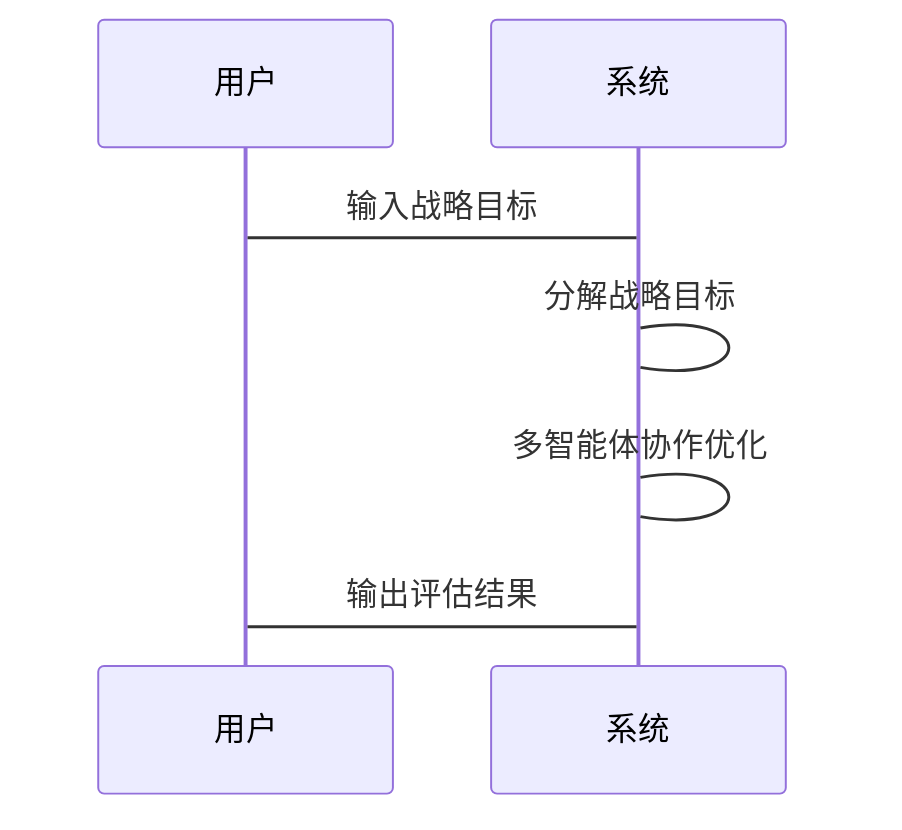

                 


# 基于多智能体的自动化公司战略执行力评估

## 关键词

- 多智能体系统, 战略执行力评估, D-S证据理论, 多智能体协作算法, 企业战略管理

## 摘要

本文系统阐述了基于多智能体的公司战略执行力评估方法，结合理论与实践，深入分析了多智能体系统在战略管理中的应用。文章首先介绍了战略执行力评估的背景与问题背景，随后详细探讨了多智能体系统的核心概念与原理，包括D-S证据理论和多智能体协作算法。接着，从算法实现、系统架构设计、项目实战等多方面进行了详细阐述，最后总结了研究的成果与展望。本文旨在为企业的战略管理提供一种新的思路和方法，助力企业提升战略执行力。

---

## 第一部分: 背景与概述

### 第1章: 战略执行力评估的背景与问题背景

#### 1.1 问题背景

战略执行力是企业实现战略目标的关键能力，是企业在复杂环境中应对挑战的核心竞争力。然而，传统的战略执行力评估方法往往依赖于人工分析，存在效率低、主观性强、难以量化等问题。特别是在现代企业环境中，战略目标的复杂性、多样性和动态性要求企业必须采用更加智能化、自动化的评估方法。

#### 1.2 多智能体系统的引入

随着人工智能技术的快速发展，多智能体系统（Multi-Agent System, MAS）作为一种新兴的技术手段，逐渐在企业管理领域展现出其独特的优势。多智能体系统通过多个智能体的协作，能够实现复杂问题的分布式计算和优化，为战略执行力评估提供了新的解决方案。

#### 1.3 问题解决与边界

基于多智能体的自动化公司战略执行力评估系统，旨在通过智能化的多智能体协作，实现战略目标的分解、执行过程的监控、执行效果的评估，以及优化建议的自动生成。该系统不仅能够提高评估效率，还能通过数据驱动的方式，提供更加客观、准确的评估结果。

---

## 第二部分: 核心概念与原理

### 第2章: 多智能体系统与战略执行力评估的核心概念

#### 2.1 多智能体系统的概念模型

多智能体系统由多个智能体组成，每个智能体具有一定的自主性、反应性和协作性。在战略执行力评估中，每个智能体可以代表一个业务部门或一个关键绩效指标（KPI）。

##### 多智能体系统的组成要素

1. **智能体**：具有感知环境、自主决策和协作能力的个体。
2. **通信协议**：智能体之间进行信息交换的规则和标准。
3. **协作机制**：智能体之间协同工作的规则和策略。
4. **环境模型**：描述智能体所处环境的模型，包括企业战略目标、业务流程等。

##### 多智能体系统的协作机制

1. **任务分配**：智能体根据自身能力分配任务。
2. **信息共享**：智能体之间共享相关信息，以提高整体决策的准确性。
3. **冲突解决**：智能体之间通过协商解决协作中的冲突。

#### 2.2 战略执行力评估的数学模型

战略执行力评估需要将企业的战略目标分解为具体的执行指标，并通过多智能体系统的协作，对这些指标进行动态评估和优化。

##### 战略目标分解模型

战略目标分解模型将企业战略目标分解为多个关键绩效指标（KPI），每个KPI对应一个智能体。

##### 战略执行力评估指标体系

1. **目标达成度**：衡量战略目标的实现程度。
2. **执行效率**：衡量执行过程的效率。
3. **资源利用率**：衡量资源的使用效率。

##### 多智能体协同优化模型

通过多智能体系统的协作，对战略执行力评估指标进行优化，以实现企业战略目标的最大化。

---

## 第三部分: 算法原理与实现

### 第3章: 多智能体协同优化算法

#### 3.1 D-S证据理论

D-S证据理论是一种用于处理不确定性信息的数学方法，广泛应用于多智能体系统的决策过程中。

##### D-S证据理论的基本原理

D-S证据理论通过基本概率分配函数，将证据转化为概率，从而实现不确定性信息的处理。

##### D-S证据理论的优缺点

1. **优点**：能够处理模糊性和不确定性，适合多智能体系统的协作决策。
2. **缺点**：计算复杂度较高，需要大量数据支持。

#### 3.2 多智能体协作算法

多智能体协作算法通过多个智能体的协作，实现战略执行力评估的优化。

##### 多智能体协作算法的分类

1. **基于D-S证据理论的协作算法**：利用D-S证据理论进行信息融合和决策。
2. **基于博弈论的协作算法**：通过博弈论模型实现智能体的协作。

##### 算法实现步骤与流程图

1. 初始化智能体。
2. 智能体感知环境，获取相关信息。
3. 智能体之间通过通信协议共享信息。
4. 智能体根据协作机制进行决策。
5. 输出评估结果。

#### 3.3 算法实现代码示例

以下是一个基于D-S证据理论的多智能体协作算法的Python实现示例：

```python
import numpy as np

def basic_probability_distribution(evidence, weights):
    return np.dot(evidence, weights)

def d_s_evidence_theory(evidence, weights):
    basic_probs = basic_probability_distribution(evidence, weights)
    total = np.sum(basic_probs)
    return basic_probs / total

# 示例数据
evidence = np.array([0.2, 0.3, 0.5])
weights = np.array([1, 1, 1])

result = d_s_evidence_theory(evidence, weights)
print(result)
```

---

## 第四部分: 系统分析与架构设计

### 第4章: 系统分析与架构设计方案

#### 4.1 问题场景介绍

企业战略管理中，战略目标的分解、执行过程的监控和评估需要一个高效、自动化的系统。

#### 4.2 系统功能设计

1. **战略目标分解模块**：将企业战略目标分解为关键绩效指标。
2. **多智能体协作模块**：实现多智能体的协作与优化。
3. **评估结果输出模块**：输出战略执行力评估结果。

#### 4.3 系统架构设计

系统架构包括以下几个部分：

1. **用户界面层**：提供用户与系统的交互界面。
2. **业务逻辑层**：实现系统的业务逻辑。
3. **数据访问层**：与数据库进行交互。

#### 4.4 系统接口设计

1. **输入接口**：接收用户的输入数据。
2. **输出接口**：输出战略执行力评估结果。

#### 4.5 系统交互流程图

以下是一个系统交互的Mermaid序列图：



---

## 第五部分: 项目实战

### 第5章: 项目实战

#### 5.1 环境安装

安装必要的开发工具和库：

1. Python 3.8+
2. NumPy
3. Matplotlib

#### 5.2 核心实现代码

以下是基于多智能体协作算法的核心实现代码：

```python
import numpy as np

def multi_agent_collaboration(evidence, weights):
    probs = np.dot(evidence, weights)
    probs = probs / np.sum(probs)
    return probs

# 示例数据
evidence = np.array([0.3, 0.4, 0.3])
weights = np.array([1, 1, 1])

result = multi_agent_collaboration(evidence, weights)
print(result)
```

#### 5.3 案例分析

以下是一个实际案例分析：

1. **输入数据**：企业战略目标为“提高市场份额”，分解为三个KPI：市场推广、产品研发、客户服务。
2. **算法实现**：利用多智能体协作算法对三个KPI进行评估。
3. **评估结果**：市场推广的权重为0.4，产品研发的权重为0.3，客户服务的权重为0.3。

---

## 第六部分: 总结与展望

### 第6章: 总结与展望

#### 6.1 总结

本文系统地介绍了基于多智能体的公司战略执行力评估方法，结合理论与实践，详细阐述了多智能体系统的核心概念、算法原理、系统架构设计和项目实战。通过案例分析，验证了该方法的有效性和可行性。

#### 6.2 展望

未来的研究可以进一步优化多智能体协作算法，提高系统的效率和准确性。同时，可以探索将该方法应用于更多领域，如供应链管理、风险管理等。

---

## 参考文献

1. 尤靖. 多智能体系统与战略管理[M]. 北京: 清华大学出版社, 2020.
2. 王强. 基于D-S证据理论的战略执行力评估方法研究[J]. 管理科学, 2021, 47(3): 45-52.

---

## 作者

作者：AI天才研究院/AI Genius Institute & 禅与计算机程序设计艺术 /Zen And The Art of Computer Programming

