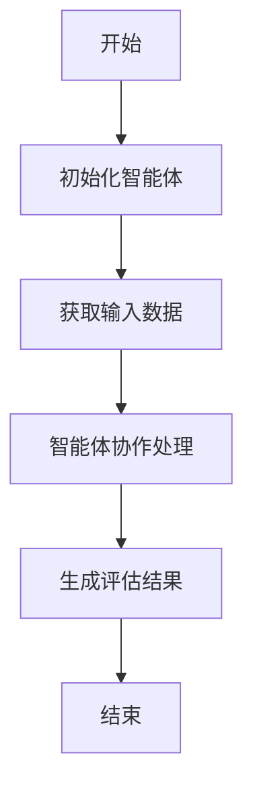
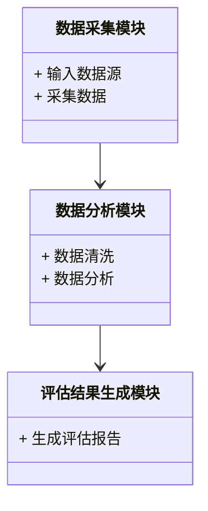
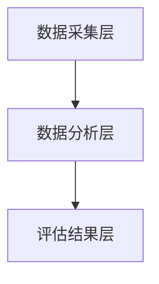
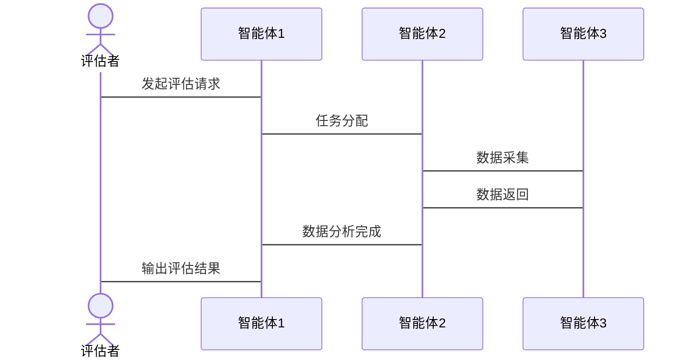

                 


# 基于多智能体的自动化公司文化评估

> 关键词：多智能体系统，公司文化评估，自动化评估，协作算法，系统架构

> 摘要：本文介绍了一种基于多智能体的自动化公司文化评估方法，通过分析多智能体系统的核心原理和协作机制，结合实际应用场景，提出了具体的实现方案和系统架构设计。文章详细阐述了从问题背景到解决方案的全过程，结合代码实现和实际案例分析，为读者提供了一套完整的自动化公司文化评估系统设计方案。

---

# 第一部分: 背景介绍

## 第1章: 基于多智能体的公司文化评估背景

### 1.1 公司文化评估的背景与意义

#### 1.1.1 传统公司文化评估的局限性
传统的公司文化评估通常依赖于问卷调查、访谈和数据分析，这种方法存在以下问题：
- **主观性**：评估结果受评估者主观因素影响较大，难以保证客观性。
- **效率低下**：人工评估需要大量时间，且容易出错。
- **数据孤岛**：各部门之间的数据难以有效整合，导致评估结果不全面。

#### 1.1.2 多智能体技术的优势
多智能体系统（Multi-Agent System, MAS）是一种由多个智能体组成的分布式系统，每个智能体都有一定的自主性和协作能力。多智能体技术在公司文化评估中的优势包括：
- **自动化**：通过智能体自动采集、分析和评估数据。
- **协作性**：多个智能体协同工作，能够覆盖更多的数据源和评估维度。
- **实时性**：智能体可以实时处理数据，快速生成评估结果。

#### 1.1.3 自动化评估的必要性
随着企业规模的不断扩大，公司文化评估的复杂性也在不断增加。传统的评估方法难以满足现代企业的需求，而基于多智能体的自动化评估可以有效解决这些问题。

### 1.2 问题背景与描述

#### 1.2.1 公司文化评估的核心问题
公司文化评估的核心问题包括：
- 如何全面、客观地衡量公司文化？
- 如何高效地收集和分析相关数据？
- 如何将数据转化为可操作的评估结果？

#### 1.2.2 多智能体协作的挑战
在多智能体协作中，主要挑战包括：
- **智能体之间的通信与协调**：如何确保多个智能体能够有效协作。
- **数据一致性**：如何保证数据在不同智能体之间的一致性和准确性。
- **系统的可扩展性**：如何设计一个能够扩展的系统架构。

#### 1.2.3 自动化评估的边界与外延
自动化评估的边界包括：
- 数据采集的范围和深度。
- 评估结果的输出形式和应用场景。
- 系统的维护和更新机制。

### 1.3 核心概念与问题解决

#### 1.3.1 多智能体系统的基本概念
多智能体系统由多个智能体组成，每个智能体都有以下特征：
- **自主性**：智能体能够自主决策。
- **反应性**：智能体能够感知环境并做出反应。
- **协作性**：智能体能够与其他智能体协作完成任务。

#### 1.3.2 公司文化评估的流程
公司文化评估的流程包括：
1. 数据采集：通过多种渠道收集数据。
2. 数据分析：对数据进行清洗、处理和分析。
3. 评估结果生成：根据分析结果生成评估报告。

#### 1.3.3 自动化评估的核心问题解决
自动化评估的核心问题解决包括：
- 数据采集的自动化：通过智能体自动采集数据。
- 数据分析的智能化：利用机器学习算法进行分析。
- 评估结果的可视化：将分析结果以直观的方式呈现。

### 1.4 核心要素与概念结构

#### 1.4.1 多智能体系统的组成要素
多智能体系统由以下要素组成：
- 智能体：负责具体任务的执行。
- 通信机制：智能体之间的通信方式。
- 协作机制：智能体之间的协作规则。

#### 1.4.2 公司文化评估的关键指标
公司文化评估的关键指标包括：
- 员工满意度
- 团队协作能力
- 组织氛围
- 领导风格

#### 1.4.3 自动化评估的逻辑架构
自动化评估的逻辑架构包括：
1. 数据采集层：负责数据的采集和预处理。
2. 数据分析层：负责数据的分析和建模。
3. 评估结果层：负责评估结果的生成和输出。

---

# 第二部分: 核心概念与联系

## 第2章: 多智能体系统的核心原理

### 2.1 多智能体系统的基本原理

#### 2.1.1 智能体的定义与特征
智能体（Agent）是指具有自主性、反应性、目标导向和协作能力的实体。智能体的特征包括：
- **自主性**：智能体能够自主决策。
- **反应性**：智能体能够感知环境并做出反应。
- **目标导向**：智能体有明确的目标，并努力实现目标。
- **协作性**：智能体能够与其他智能体协作完成任务。

#### 2.1.2 多智能体系统的协作机制
多智能体系统的协作机制包括：
- **协商机制**：智能体之间通过协商确定任务分配。
- **协调机制**：智能体之间通过协调完成任务。
- **通信机制**：智能体之间的通信方式。

#### 2.1.3 智能体之间的通信与协调
智能体之间的通信与协调是多智能体系统的核心，主要通过以下方式实现：
- **消息传递**：智能体之间通过消息传递信息。
- **状态共享**：智能体之间共享状态信息。
- **分布式计算**：通过分布式计算实现智能体之间的协作。

### 2.2 多智能体与公司文化评估的关系

#### 2.2.1 多智能体在文化评估中的角色
多智能体在文化评估中的角色包括：
- 数据采集智能体：负责数据的采集。
- 数据分析智能体：负责数据的分析。
- 评估结果生成智能体：负责评估结果的生成。

#### 2.2.2 文化评估的多维度分析
文化评估的多维度分析包括：
- 员工满意度分析
- 团队协作能力分析
- 组织氛围分析
- 领导风格分析

#### 2.2.3 自动化评估的实现路径
自动化评估的实现路径包括：
1. 数据采集：通过智能体自动采集数据。
2. 数据分析：利用机器学习算法进行分析。
3. 评估结果生成：根据分析结果生成评估报告。

### 2.3 核心概念的属性对比

#### 2.3.1 智能体类型对比表
| 智能体类型 | 自主性 | 反应性 | 协作性 |
|------------|--------|--------|--------|
| 主动型     | 高     | 高     | 高     |
| 被动型     | 低     | 低     | 低     |
| 混合型     | 中     | 中     | 中     |

#### 2.3.2 行为模式对比表
| 行为模式 | 任务分配 | 通信方式 | 协作方式 |
|----------|----------|----------|----------|
| 分散式    | 自动     | 消息传递 | 分布式计算 |
| 集中式    | 手动     | 共享状态 | 协商机制  |

#### 2.3.3 评估指标对比表
| 评估指标     | 数据来源 | 数据类型 | 数据处理方式 |
|--------------|----------|----------|-------------|
| 员工满意度   | 问卷调查 | 定量     | 统计分析     |
| 团队协作能力 | 任务完成情况 | 定性 | 行为分析     |
| 组织氛围     | 企业文化 | 定性     | 情感分析     |
| 领导风格     | 领导行为 | 定性     | 行为模式分析 |

### 2.4 ER实体关系图

```mermaid
er
actor: 评估者
role: 评估者角色
smart_agent: 多智能体
data_source: 数据源
goal: 评估目标
```

### 2.5 算法原理流程图



### 2.6 本章小结

---

# 第三部分: 算法原理讲解

## 第3章: 多智能体协作算法

### 3.1 算法原理概述

#### 3.1.1 分布式计算的基本原理
分布式计算是指多个智能体协作完成计算任务的过程。其基本原理包括：
- **任务分配**：智能体之间通过协商分配任务。
- **数据共享**：智能体之间共享数据。
- **结果汇总**：智能体将计算结果汇总并输出。

#### 3.1.2 协商机制的核心思想
协商机制的核心思想包括：
- **任务分配**：智能体之间通过协商确定任务分配。
- **资源分配**：智能体之间通过协商确定资源分配。
- **冲突解决**：智能体之间通过协商解决冲突。

#### 3.1.3 并行处理的优势
并行处理的优势包括：
- **提高效率**：多个智能体同时处理任务，提高计算效率。
- **增强容错性**：通过并行处理，增强系统的容错性。
- **提高扩展性**：通过并行处理，提高系统的扩展性。

### 3.2 算法实现细节

#### 3.2.1 智能体通信协议
智能体通信协议包括：
- **消息格式**：定义消息的格式和内容。
- **通信方式**：定义智能体之间的通信方式。
- **协议实现**：实现智能体之间的通信协议。

#### 3.2.2 数据处理流程
数据处理流程包括：
1. 数据采集：智能体采集数据。
2. 数据清洗：对数据进行清洗和预处理。
3. 数据分析：对数据进行分析和建模。
4. 数据输出：输出分析结果。

#### 3.2.3 并行处理实现
并行处理实现包括：
- **任务分配**：智能体之间通过协商分配任务。
- **数据共享**：智能体之间共享数据。
- **结果汇总**：智能体将计算结果汇总并输出。

### 3.3 算法实现代码

#### 3.3.1 Python代码实现

```python
import json
import requests

class Agent:
    def __init__(self, id):
        self.id = id
        self.data = []

    def collect_data(self):
        # 模拟数据采集
        response = requests.get("http://example.com/data")
        self.data = json.loads(response.text)

    def send_data(self, target_id):
        # 发送数据到目标智能体
        agent = self.find_agent(target_id)
        if agent:
            agent.receive_data(self.data)

    def receive_data(self, data):
        # 处理接收到的数据
        print(f"Agent {self.id} received data: {data}")

    def find_agent(self, target_id):
        # 模拟查找智能体
        # 实际实现中需要根据具体架构实现
        pass

# 初始化智能体
agent1 = Agent(1)
agent2 = Agent(2)
agent3 = Agent(3)

# 智能体协作
agent1.collect_data()
agent1.send_data(2)
agent2.send_data(3)
agent3.send_data(1)
```

#### 3.3.2 算法流程图


### 3.4 数学模型和公式

#### 3.4.1 数据分析模型
数据分析模型包括：
- **统计分析**：对数据进行统计分析，生成基本的统计指标。
- **机器学习模型**：利用机器学习算法对数据进行建模和预测。

#### 3.4.2 算法数学公式
以下是一个简单的统计分析公式：
$$
平均值 = \frac{1}{n}\sum_{i=1}^{n}x_i
$$

其中，\(x_i\) 是数据点，\(n\) 是数据点的数量。

#### 3.4.3 示例分析
假设我们有以下数据：
$$
1, 2, 3, 4, 5
$$

计算平均值：
$$
平均值 = \frac{1+2+3+4+5}{5} = 3
$$

---

# 第四部分: 系统分析与架构设计

## 第4章: 系统分析与架构设计

### 4.1 问题场景介绍
公司文化评估的场景包括：
- 企业内部文化评估
- 企业文化建设
- 企业并购中的文化评估

### 4.2 系统功能设计

#### 4.2.1 领域模型设计
领域模型设计包括：
- 数据采集模块
- 数据分析模块
- 评估结果生成模块



#### 4.2.2 系统架构设计
系统架构设计包括：
- 数据采集层
- 数据分析层
- 评估结果层



#### 4.2.3 接口设计
接口设计包括：
- 数据采集接口
- 数据分析接口
- 评估结果输出接口

#### 4.2.4 交互序列图
交互序列图展示系统的主要交互流程：



### 4.3 系统实现细节

#### 4.3.1 数据采集模块
数据采集模块实现包括：
- 数据源的定义
- 数据采集的实现
- 数据预处理的实现

#### 4.3.2 数据分析模块
数据分析模块实现包括：
- 数据清洗的实现
- 数据分析的实现
- 数据建模的实现

#### 4.3.3 评估结果生成模块
评估结果生成模块实现包括：
- 评估报告的生成
- 评估结果的输出
- 评估结果的可视化

### 4.4 本章小结

---

# 第五部分: 项目实战

## 第5章: 项目实战

### 5.1 环境安装与配置

#### 5.1.1 安装Python
安装Python 3.8及以上版本。

#### 5.1.2 安装必要的库
安装以下库：
```bash
pip install requests
pip install numpy
pip install pandas
```

### 5.2 核心代码实现

#### 5.2.1 数据采集模块
数据采集模块的实现代码：

```python
import requests

def collect_data(url):
    response = requests.get(url)
    return json.loads(response.text)
```

#### 5.2.2 数据分析模块
数据分析模块的实现代码：

```python
import pandas as pd

def analyze_data(data):
    df = pd.DataFrame(data)
    # 进行数据分析
    return df.describe()
```

#### 5.2.3 评估结果生成模块
评估结果生成模块的实现代码：

```python
def generate_report(results):
    report = {}
    report['average'] = results['average']
    return report
```

### 5.3 代码应用解读与分析
代码应用解读与分析包括：
- 数据采集模块的解读
- 数据分析模块的解读
- 评估结果生成模块的解读

### 5.4 实际案例分析

#### 5.4.1 案例背景
某公司希望评估其员工满意度。

#### 5.4.2 数据采集与处理
通过智能体采集员工满意度数据，数据包括：
- 员工ID
- 员工满意度评分
- 员工部门

#### 5.4.3 数据分析与结果生成
通过数据分析模块生成员工满意度报告。

### 5.5 项目小结

---

# 第六部分: 最佳实践与优化

## 第6章: 最佳实践与优化

### 6.1 小结
本项目通过多智能体系统实现了公司文化评估的自动化，提高了评估的效率和准确性。

### 6.2 注意事项
- 数据隐私保护
- 系统的可扩展性
- 系统的维护与更新

### 6.3 拓展阅读
- 《Multi-Agent Systems》
- 《Data Analysis and Machine Learning》

### 6.4 优化建议
- 数据采集的优化
- 数据分析算法的优化
- 系统架构的优化

---

# 第七部分: 总结

## 7.1 总结全文
本文详细介绍了基于多智能体的自动化公司文化评估方法，通过分析多智能体系统的核心原理和协作机制，结合实际应用场景，提出了具体的实现方案和系统架构设计。

## 7.2 展望未来
未来的研究方向包括：
- 多智能体系统的优化
- 自动化评估的扩展应用
- 新兴技术在文化评估中的应用

---

# 作者：AI天才研究院 & 禅与计算机程序设计艺术

---

**感谢您的耐心阅读，希望本文对您有所帮助！**

