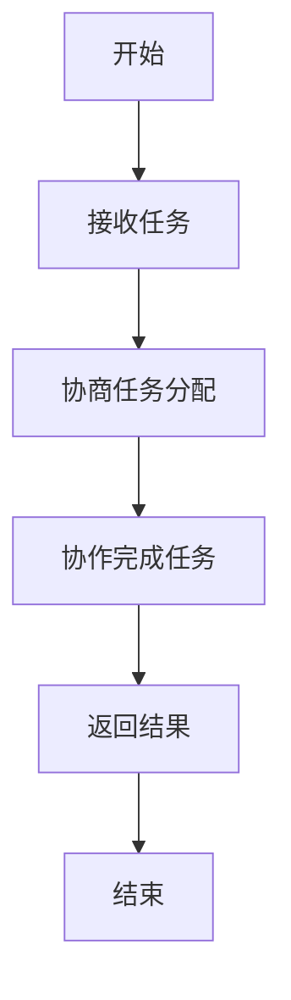
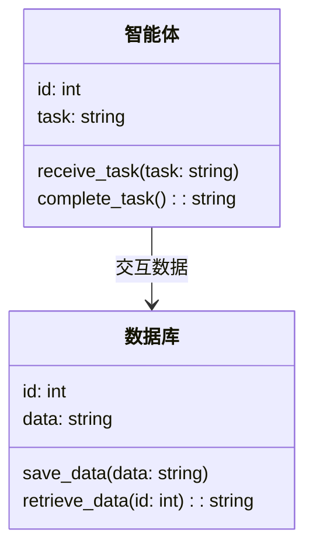
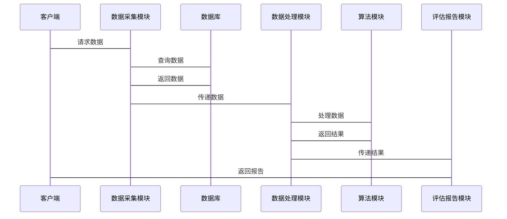

                 


# 基于多智能体的自动化公司文化评估系统

## 关键词：多智能体系统、自动化文化评估、组织文化分析、智能协作、数据驱动决策

## 摘要：  
本文介绍了一种基于多智能体的自动化公司文化评估系统，旨在通过智能化技术实现对公司文化的全面评估和优化。文章从公司文化评估的背景与挑战出发，详细阐述了多智能体系统的概念、协作机制、通信协议，以及系统的架构设计、算法实现和实际案例分析。通过理论与实践相结合的方式，本文为读者提供了一种全新的公司文化评估方法，具有重要的理论意义和实践价值。

---

## 第一部分: 基于多智能体的自动化公司文化评估系统概述

### 第1章: 公司文化评估的背景与挑战

#### 1.1 什么是公司文化  
公司文化是企业在长期经营过程中形成的共同价值观、行为规范和思维方式的总和。它包括企业愿景、使命、核心价值观、员工关系、管理风格等多个维度，是企业凝聚力和竞争力的重要来源。

#### 1.2 公司文化评估的重要性  
公司文化评估是企业管理中的重要环节，能够帮助企业发现文化中存在的问题，优化组织结构，提升员工满意度和企业绩效。传统的文化评估方法通常依赖人工调查和数据分析，效率低、成本高且难以量化。

#### 1.3 现有评估方法的局限性  
传统的文化评估方法存在以下问题：  
1. 人工调查耗时耗力，难以覆盖大规模员工。  
2. 数据分析缺乏深度，难以发现潜在问题。  
3. 结果难以量化，难以指导实际改进。  

#### 1.4 多智能体系统的优势  
多智能体系统（Multi-Agent System, MAS）是一种由多个智能体（Agent）协作完成复杂任务的系统。其优势在于：  
1. **分布式计算**：智能体可以并行处理数据，提高效率。  
2. **自主性**：每个智能体都能独立决策，减少对中心节点的依赖。  
3. **协作性**：智能体之间可以通过通信协议协作，完成复杂任务。  

---

### 第2章: 多智能体系统的基本概念

#### 2.1 多智能体系统的定义  
多智能体系统是由多个智能体组成的分布式系统，智能体是能够感知环境、自主决策并采取行动的实体。  

#### 2.2 多智能体系统的分类  
多智能体系统可以根据智能体的协作方式、通信方式和任务类型进行分类：  

| 分类维度 | 类型                          | 描述                                                                 |
|----------|-------------------------------|-----------------------------------------------------------------------|
| 协作方式  | 协作式多智能体系统             | 智能体之间通过协作完成任务。                                         |
|          | 竞争式多智能体系统             | 智能体之间存在竞争关系，例如拍卖系统。                               |
| 通信方式  | 基于消息的多智能体系统         | 智能体通过消息传递进行通信。                                         |
|          | 基于共享知识库的多智能体系统   | 智能体通过共享知识库进行协作。                                       |
| 任务类型  | 数据处理型多智能体系统         | 智能体负责数据的采集、处理和分析。                                   |
|          | 服务提供型多智能体系统         | 智能体提供特定服务，例如推荐系统。                                     |

#### 2.3 多智能体系统的应用场景  
多智能体系统广泛应用于以下几个领域：  
1. **分布式计算**：例如分布式数据库、云计算。  
2. **智能控制**：例如自动驾驶、智能家居。  
3. **经济仿真**：例如股票交易模拟、供应链管理。  

#### 2.4 多智能体系统的核心特点  
多智能体系统的核心特点包括：  
1. **自主性**：智能体能够自主决策。  
2. **反应性**：智能体能够感知环境并实时响应。  
3. **协作性**：智能体之间可以协作完成复杂任务。  
4. **分布式性**：智能体分布在不同的节点上，通过通信协议进行协作。  

---

## 第二部分: 多智能体系统的核心原理

### 第3章: 多智能体系统的协作机制

#### 3.1 协作的基本概念  
协作是指多个智能体为了完成共同目标而协同工作的过程。  

#### 3.2 协作的实现方式  
协作的实现方式包括：  
1. **直接协作**：智能体之间直接交换数据或服务。  
2. **间接协作**：智能体通过共享知识库或中间件进行协作。  

#### 3.3 协作的优化策略  
为了提高协作效率，可以采取以下优化策略：  
1. **任务分配**：根据智能体的能力分配任务。  
2. **负载均衡**：确保智能体之间的负载均衡，避免单点压力过大。  
3. **冲突解决**：通过协商或仲裁机制解决协作中的冲突。  

---

### 第4章: 多智能体系统的通信协议

#### 4.1 通信协议的定义  
通信协议是智能体之间进行数据交换的规则和格式。  

#### 4.2 常见的通信协议  
常见的通信协议包括：  
1. **HTTP/HTTPS**：用于Web服务之间的通信。  
2. **WebSocket**：用于实时双向通信。  
3. **Message Queue (MQ)**：用于异步消息传递。  

#### 4.3 自定义通信协议的设计  
在实际应用中，可以根据需求设计自定义通信协议。例如：  
1. **消息格式**：使用JSON格式传递数据。  
2. **消息类型**：定义不同的消息类型，例如“请求数据”、“发送结果”。  
3. **加密机制**：通过加密技术确保通信的安全性。  

#### 4.4 通信协议的实现  
以下是基于Python的简单通信协议实现示例：

```python
import json
import socket

# 创建socket对象
s = socket.socket(socket.AF_INET, socket.SOCK_STREAM)
s.bind(('localhost', 8000))
s.listen(1)

while True:
    conn, addr = s.accept()
    print(f"连接来自 {addr}")
    
    while True:
        data = conn.recv(1024).decode()
        if not data:
            break
        try:
            # 解析JSON数据
            request = json.loads(data)
            # 处理请求
            response = {"status": "success", "message": "Request received."}
            conn.send(json.dumps(response).encode())
        except json.JSONDecodeError:
            response = {"status": "error", "message": "Invalid request format."}
            conn.send(json.dumps(response).encode())
    
    conn.close()
```

---

## 第三部分: 自动化公司文化评估系统的设计与实现

### 第5章: 系统的需求分析

#### 5.1 问题场景介绍  
公司文化评估需要解决以下问题：  
1. **数据采集**：如何高效采集员工的文化数据？  
2. **数据分析**：如何从海量数据中提取有价值的信息？  
3. **结果呈现**：如何将评估结果转化为可操作的建议？  

#### 5.2 系统功能需求  
系统需要实现以下功能：  
1. **数据采集模块**：采集员工的问卷调查数据、绩效数据等。  
2. **数据分析模块**：对数据进行清洗、分析和建模。  
3. **评估报告模块**：生成评估报告并提出改进建议。  

#### 5.3 系统性能需求  
系统需要满足以下性能要求：  
1. **响应时间**：数据处理时间不超过5分钟。  
2. **可扩展性**：能够支持大规模数据处理。  

#### 5.4 系统安全需求  
系统需要确保数据的安全性，防止数据泄露和篡改。

---

### 第6章: 系统的架构设计

#### 6.1 系统架构概述  
系统采用分层架构，包括数据采集层、数据处理层和结果呈现层。  

#### 6.2 系统功能模块划分  
系统功能模块包括：  
1. **数据采集模块**：负责数据的采集和预处理。  
2. **数据分析模块**：负责数据的分析和建模。  
3. **评估报告模块**：负责生成评估报告。  

#### 6.3 系统数据流设计  
数据流设计如下：  
1. 数据采集模块接收输入数据。  
2. 数据处理模块对数据进行清洗和分析。  
3. 评估报告模块生成评估报告并输出结果。  

#### 6.4 系统组件交互设计  
系统组件交互设计如下：  
1. 数据采集模块与数据库交互。  
2. 数据分析模块与算法模块交互。  
3. 评估报告模块与用户交互。  

---

### 第7章: 系统的算法实现

#### 7.1 多智能体协作算法  
多智能体协作算法的流程如下：  
1. 智能体接收任务请求。  
2. 智能体协商任务分配。  
3. 智能体协作完成任务。  
4. 智能体返回结果。  

#### 7.2 算法的数学模型  
多智能体协作算法的数学模型如下：  
$$ C = \sum_{i=1}^{n} w_i x_i $$  
其中，$C$ 是协作度，$w_i$ 是权重，$x_i$ 是智能体的贡献。  

#### 7.3 算法的实现代码  
以下是基于Python的多智能体协作算法实现示例：

```python
class Agent:
    def __init__(self, id):
        self.id = id
        self.task = None

    def receive_task(self, task):
        self.task = task
        print(f"Agent {self.id} received task: {task}")

    def complete_task(self):
        # 处理任务
        result = f"Task completed by Agent {self.id}"
        return result

# 初始化智能体
agents = [Agent(i) for i in range(1, 5)]

# 任务分配
for i in range(len(agents)):
    agents[i].receive_task(f"Task {i}")

# 任务完成
results = []
for agent in agents:
    results.append(agent.complete_task())

print("All tasks completed successfully.")
```

---

## 第四部分: 项目实战与案例分析

### 第8章: 环境搭建与核心代码实现

#### 8.1 开发环境的安装与配置  
开发环境需要安装以下工具：  
1. **Python**：编程语言。  
2. **Mermaid**：用于绘制图表。  
3. **Socket**：用于通信协议实现。  

#### 8.2 系统核心模块的实现  
系统核心模块包括数据采集模块、数据分析模块和评估报告模块。  

#### 8.3 代码的功能解读与分析  
代码的功能解读与分析需要结合实际案例进行。  

#### 8.4 代码的优化与维护  
代码优化包括性能优化、代码复用和错误处理。  

---

### 第9章: 实际案例分析与详细讲解

#### 9.1 案例背景介绍  
以某公司为例，介绍公司文化评估的背景和需求。  

#### 9.2 案例问题分析  
分析公司文化中存在的主要问题。  

#### 9.3 系统解决方案设计  
设计基于多智能体的自动化公司文化评估系统。  

#### 9.4 系统运行结果与分析  
分析系统运行结果并提出改进建议。

---

## 第五部分: 最佳实践与总结

### 第10章: 最佳实践与注意事项

#### 10.1 系统设计中的注意事项  
在系统设计中需要注意以下几点：  
1. 确保系统的可扩展性。  
2. 确保系统的安全性。  
3. 确保系统的可维护性。  

#### 10.2 系统实现中的常见问题  
常见的问题包括：  
1. 数据同步问题。  
2. 通信协议设计问题。  
3. 智能体协作问题。  

#### 10.3 系统维护与优化的建议  
建议定期对系统进行维护和优化，包括：  
1. 数据备份。  
2. 性能优化。  
3. 功能升级。  

#### 10.4 系统扩展与升级的策略  
系统扩展和升级的策略包括：  
1. 模块化设计。  
2. 分阶段实施。  
3. 用户反馈机制。  

---

### 第11章: 小结与未来展望

#### 11.1 本项目的核心总结  
本文介绍了基于多智能体的自动化公司文化评估系统的设计与实现，提出了多智能体协作算法和通信协议的设计方案，并通过实际案例进行了验证。

#### 11.2 未来的发展方向  
未来的发展方向包括：  
1. 增强系统的智能化水平。  
2. 提高系统的可扩展性。  
3. 推广应用到更多领域。  

#### 11.3 对读者的建议与鼓励  
希望读者能够结合实际需求，灵活运用本文提出的方法，推动公司文化评估的智能化发展。

#### 11.4 结语  
基于多智能体的自动化公司文化评估系统是一种创新的解决方案，具有广阔的应用前景。希望通过本文的介绍，能够为读者提供有价值的参考。

---

## 图表目录

### 图表1: 多智能体系统的ER实体关系图  
```mermaid
er
    root
        rectangle 实体: 智能体
        rectangle 实体: 任务
        rectangle 实体: 数据
        智能体 --> 任务: 执行
        智能体 --> 数据: 采集
```

### 图表2: 多智能体协作算法的Mermaid流程图  


### 图表3: 系统领域模型的Mermaid类图  


### 图表4: 系统架构设计的Mermaid架构图  


### 图表5: 系统交互设计的Mermaid序列图  


---

## 作者：AI天才研究院/AI Genius Institute & 禅与计算机程序设计艺术 /Zen And The Art of Computer Programming

---

希望这篇文章能满足您的要求！如果需要进一步修改或补充，请随时告诉我。

