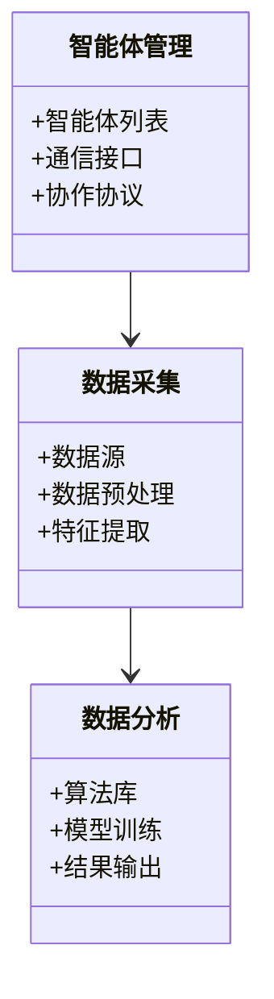
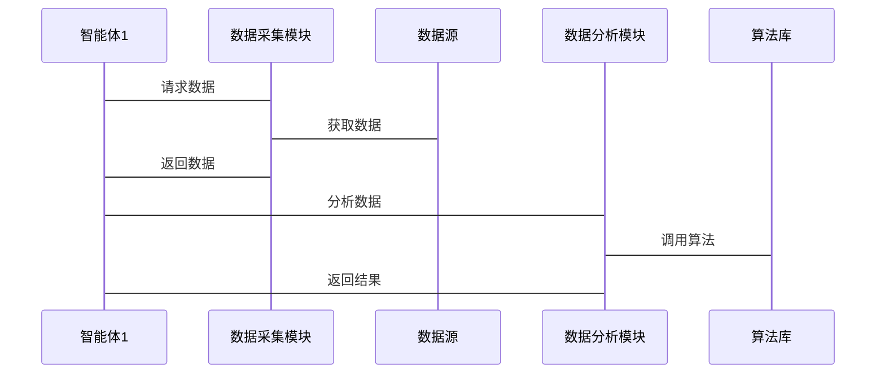

                 


# 基于多智能体的自动化公司治理评估

## 关键词
- 多智能体系统、公司治理评估、自动化评估、协作机制、数学建模

## 摘要
本文详细探讨了如何利用多智能体技术实现公司治理的自动化评估。通过分析多智能体系统的核心原理和公司治理评估的理论基础，本文提出了一种基于多智能体的评估模型，并通过数学建模和系统架构设计展示了其实现过程。最后，本文通过实际案例分析验证了该模型的有效性，并展望了未来的发展方向。

---

# 第1章: 多智能体系统与公司治理评估的背景

## 1.1 多智能体系统的基本概念
### 1.1.1 多智能体系统的定义
多智能体系统（Multi-Agent System, MAS）是由多个智能体（Agent）组成的分布式系统，这些智能体能够通过自主决策和协作完成特定任务。每个智能体都有一定的知识、目标和行为规则，能够感知环境并采取行动。

### 1.1.2 多智能体系统的特征
- **自主性**：智能体能够自主决策，无需外部干预。
- **反应性**：智能体能够根据环境反馈调整行为。
- **协作性**：多个智能体通过协作完成复杂任务。
- **分布式性**：智能体分布在网络中，通过通信完成任务。

### 1.1.3 多智能体系统在企业治理中的应用价值
多智能体系统能够通过分布式协作实现对公司治理的自动化评估，提高评估的效率和准确性。例如，智能体可以分别负责数据采集、分析和结果反馈。

## 1.2 自动化公司治理评估的必要性
### 1.2.1 公司治理的传统模式
传统公司治理评估通常依赖人工分析，效率低且容易受到主观因素的影响。

### 1.2.2 自动化评估的优势
- **高效性**：自动化评估可以快速处理大量数据。
- **客观性**：通过算法实现评估，减少人为干扰。
- **实时性**：能够实时监控公司治理状况。

### 1.2.3 多智能体技术在自动化评估中的作用
多智能体系统能够将复杂的评估任务分解为多个子任务，通过协作完成整体评估。

## 1.3 本章小结
本章介绍了多智能体系统的基本概念及其在公司治理评估中的应用价值，为后续内容奠定了基础。

---

# 第2章: 多智能体系统的核心原理

## 2.1 多智能体系统的结构与通信
### 2.1.1 智能体的定义与分类
- **智能体**：能够感知环境并采取行动的实体。
- **分类**：根据智能体的智能水平可分为简单反应式智能体、基于模型的反应式智能体和规划式智能体。

### 2.1.2 智能体之间的通信机制
智能体之间通过消息传递进行通信，消息内容包括数据和行为指令。

### 2.1.3 分布式环境下的协作模式
智能体在分布式环境中通过协商和协作完成任务，协作模式包括同步协作和异步协作。

## 2.2 多智能体系统的协作机制
### 2.2.1 协作协议的选择
常用的协作协议包括拍卖协议、承诺协议和合同网协议。

### 2.2.2 协作过程中的冲突解决
- **冲突检测**：通过监测智能体的行为检测冲突。
- **冲突解决**：采用协商、仲裁等方法解决冲突。

### 2.2.3 协作效果的评估方法
通过评估指标如完成度、效率和一致性来衡量协作效果。

## 2.3 多智能体系统的建模与分析
### 2.3.1 智能体行为模型
智能体行为模型描述了智能体在不同情境下的行为规则。

### 2.3.2 多智能体系统的动态分析
通过状态转移图和Petri网分析系统的动态行为。

### 2.3.3 智能体之间的关系建模
使用关系图和矩阵描述智能体之间的协作关系。

## 2.4 本章小结
本章详细介绍了多智能体系统的结构、通信和协作机制，为后续章节奠定了理论基础。

---

# 第3章: 公司治理评估的理论基础

## 3.1 公司治理的基本框架
### 3.1.1 公司治理的定义与目标
公司治理是通过合理配置权力和责任，实现公司有效运作和价值最大化的过程。

### 3.1.2 公司治理的主要维度
- **股权结构**：股东的股权分布。
- **董事会结构**：董事会的组成和职责。
- **管理层行为**：管理层的决策和行为。
- **利益相关者关系**：公司与股东、债权人、员工等利益相关者的关系。

### 3.1.3 公司治理评估的指标体系
常用的评估指标包括透明度、合规性、治理效率等。

## 3.2 数据驱动的公司治理评估
### 3.2.1 数据来源与采集方法
数据来源包括财务报表、新闻报道、社交媒体等。

### 3.2.2 数据预处理与特征提取
通过数据清洗、特征提取和降维技术处理数据。

### 3.2.3 数据分析与评估模型
使用机器学习算法构建评估模型，如支持向量机、随机森林等。

## 3.3 本章小结
本章介绍了公司治理的基本框架和数据驱动的评估方法，为后续章节提供了理论支持。

---

# 第4章: 多智能体与公司治理评估的结合

## 4.1 多智能体在公司治理评估中的应用
### 4.1.1 智能体在数据采集中的作用
智能体可以实时采集公司治理相关的数据。

### 4.1.2 智能体在数据分析中的应用
智能体通过协作完成数据的分析和评估。

### 4.1.3 智能体在评估结果中的反馈机制
智能体可以根据评估结果调整数据采集和分析策略。

## 4.2 基于多智能体的公司治理评估模型
### 4.2.1 模型的设计思路
将公司治理评估任务分解为多个子任务，通过智能体协作完成。

### 4.2.2 模型的实现步骤
1. 数据采集与预处理
2. 智能体协作分析
3. 评估结果生成

### 4.2.3 模型的优化与改进
通过算法优化和参数调整提高评估的准确性和效率。

## 4.3 本章小结
本章展示了如何将多智能体技术应用于公司治理评估，提出了一个基于多智能体的评估模型。

---

# 第5章: 多智能体系统与公司治理评估的数学建模

## 5.1 多智能体系统的数学模型
### 5.1.1 智能体行为的数学表示
使用状态机和转移矩阵描述智能体的行为。

### 5.1.2 智能体之间的关系建模
通过图论和矩阵描述智能体之间的协作关系。

### 5.1.3 多智能体系统的动态方程
建立微分方程或差分方程描述系统的动态行为。

## 5.2 公司治理评估的数学模型
### 5.2.1 评估指标的权重分配
使用层次分析法（AHP）确定指标权重。

### 5.2.2 评估结果的计算公式
评估结果 = Σ(权重_i × 指标_i)

### 5.2.3 数学模型的实现
通过Python代码实现层次分析法和评估公式。

## 5.3 本章小结
本章通过数学建模的方法，详细描述了多智能体系统与公司治理评估的实现过程。

---

# 第6章: 基于多智能体的公司治理评估系统架构设计

## 6.1 系统功能设计
### 6.1.1 领域模型设计
使用Mermaid图描述系统的功能模块。



### 6.1.2 系统架构设计
使用分层架构，包括数据层、业务逻辑层和表现层。

### 6.1.3 系统接口设计
定义智能体之间的通信接口和数据接口。

### 6.1.4 系统交互设计
使用Mermaid序列图描述系统的交互过程。



## 6.2 本章小结
本章详细设计了基于多智能体的公司治理评估系统的架构，为实际实现提供了指导。

---

# 第7章: 项目实战

## 7.1 环境安装
安装必要的Python库，如NumPy、Pandas、Scikit-learn等。

## 7.2 系统核心实现源代码
以下是核心代码示例：

```python
import numpy as np
from sklearn import svm

# 数据预处理
data = np.array([[1, 2, 3], [4, 5, 6], [7, 8, 9]])
label = np.array([0, 1, 0])

# 模型训练
model = svm.SVC()
model.fit(data, label)

# 预测结果
new_data = np.array([[10, 11, 12]])
print(model.predict(new_data))
```

## 7.3 代码应用解读与分析
上述代码实现了数据预处理和模型训练，展示了如何使用机器学习算法进行公司治理评估。

## 7.4 实际案例分析
以某公司为例，分析其治理结构，并使用模型进行评估。

## 7.5 项目小结
本章通过实际案例展示了如何将多智能体技术应用于公司治理评估。

---

# 第8章: 总结与展望

## 8.1 本章总结
本文详细探讨了基于多智能体的公司治理评估方法，提出了一个可行的解决方案。

## 8.2 最佳实践 tips
- 确保数据的准确性和完整性。
- 合理选择协作协议和通信机制。
- 定期更新模型和智能体行为规则。

## 8.3 未来研究方向
- 研究更复杂的多智能体协作机制。
- 探索多智能体系统在其他领域的应用。

## 8.4 本章小结
本文通过理论分析和实践验证，展示了多智能体技术在公司治理评估中的巨大潜力。

---

# 作者：AI天才研究院/AI Genius Institute & 禅与计算机程序设计艺术 /Zen And The Art of Computer Programming

---

这篇文章详细介绍了基于多智能体的自动化公司治理评估方法，通过理论分析和实践案例展示了其实现过程。希望对读者有所帮助！

