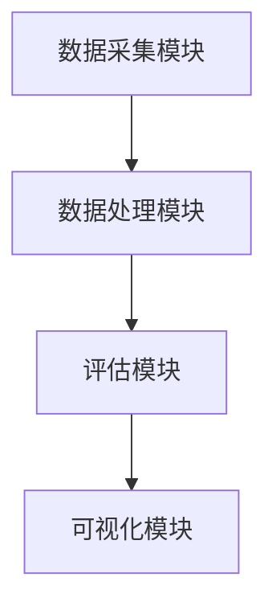

                 


# 基于多智能体的自动化公司现金流质量评估

> **关键词**: 多智能体系统, 现金流质量评估, 自动化评估, 分布式计算, 协商算法, 共识机制

> **摘要**: 本文详细探讨了如何利用多智能体系统（Multi-Agent System, MAS）实现公司现金流质量的自动化评估。通过分析现金流评估的核心要素，结合多智能体系统的优势，提出了一种基于MAS的现金流质量评估方法，包括系统架构设计、算法实现和项目实战等部分，为企业的现金流管理提供了新的思路。

---

## 第一部分: 基于多智能体的现金流质量评估背景与基础

### 第1章: 多智能体系统与现金流评估概述

#### 1.1 多智能体系统的定义与特点
多智能体系统（Multi-Agent System, MAS）是由多个智能体组成的分布式系统，每个智能体都是一个能够独立决策和行动的实体。MAS具有以下特点：
- **自主性**: 每个智能体都能自主决策。
- **反应性**: 能够实时感知环境并做出反应。
- **协作性**: 智能体之间可以协作完成复杂任务。
- **分布性**: 系统由多个分散的智能体组成。

#### 1.2 现金流质量评估的定义与重要性
现金流质量评估是衡量企业财务健康的重要指标，主要关注现金流入和流出的质量。高质量的现金流意味着企业能够稳定运营并支持未来发展。现金流质量评估的重要性体现在以下几个方面：
- **财务健康监测**: 帮助企业识别潜在的财务风险。
- **投资决策支持**: 为投资者提供关键的财务信息。
- **运营效率提升**: 优化现金流管理，提高企业运营效率。

#### 1.3 多智能体技术在现金流评估中的应用前景
现金流评估的复杂性与多智能体技术的分布式计算能力相契合。通过MAS，可以实现对多源数据的实时处理和分析，提高评估的准确性和效率。具体优势包括：
- **数据实时性**: MAS能够实时处理现金流数据。
- **分布式计算**: 支持大规模数据的并行处理。
- **协作性**: 智能体之间的协作能够提高评估的全面性。

---

### 第2章: 多智能体系统的核心概念与联系

#### 2.1 多智能体系统的核心概念
多智能体系统由以下几个核心概念组成：
- **智能体**: 具有自主性、反应性和协作性的实体。
- **环境**: 智能体所处的外部环境，包括数据源和其他智能体。
- **通信机制**: 智能体之间的交互方式，如消息传递和协商。

#### 2.2 现金流评估的核心要素
现金流评估的核心要素包括：
- **现金流入**: 来自销售、投资和融资的现金收入。
- **现金流出**: 用于支付成本、税费和偿还债务的现金支出。
- **现金流净额**: 现金流入与现金流出的差额。

#### 2.3 多智能体系统与现金流评估的结合
多智能体系统在现金流评估中的应用可以实现以下目标：
- **数据采集与处理**: 多个智能体分别采集和处理不同的现金流数据。
- **协作分析**: 智能体之间协作完成现金流的综合评估。
- **实时反馈**: 系统能够实时反馈现金流变化，支持决策者快速响应。

---

### 第3章: 多智能体系统的算法原理

#### 3.1 分布式计算与多智能体协作
分布式计算是MAS的核心，通过将任务分解到多个智能体上并行处理，提高计算效率。以下是分布式计算的流程：
1. **任务分解**: 将现金流评估任务分解为多个子任务。
2. **子任务分配**: 将子任务分配给不同的智能体。
3. **子任务处理**: 每个智能体独立处理分配的任务。
4. **结果汇总**: 将各智能体的结果汇总，得到最终的评估结果。

#### 3.2 多智能体协商算法
协商算法用于智能体之间的协作，确保任务分配和结果一致。以下是协商算法的步骤：
1. **初始化**: 确定参与协商的智能体及其目标。
2. **信息交换**: 智能体之间交换与任务相关的信息。
3. **协商过程**: 根据协商规则达成一致。
4. **结果确认**: 确认协商结果并执行任务。

#### 3.3 多智能体共识机制
共识机制用于智能体之间达成一致，确保系统的可靠性和一致性。常见的共识机制包括：
- **拜占庭共识**: 适用于存在恶意节点的环境。
- **工作量证明**: 常见于区块链系统。

---

### 第4章: 现金流质量评估的数学模型与算法

#### 4.1 现金流质量评估的数学模型
现金流质量评估可以通过以下数学模型实现：
$$
\text{现金流质量} = \frac{\text{现金流入} - \text{现金流出}}{\text{平均现金流}}
$$

#### 4.2 基于多智能体的现金流评估算法
以下是基于多智能体的现金流评估算法的流程图：

```mermaid
graph TD
A[开始] -> B[初始化智能体]
B -> C[分配任务]
C -> D[智能体处理任务]
D -> E[智能体之间协商]
E -> F[达成一致]
F -> G[汇总结果]
G -> H[输出评估结果]
H -> I[结束]
```

---

## 第二部分: 系统分析与架构设计

### 第5章: 项目背景与目标
本项目旨在利用多智能体系统实现公司现金流质量的自动化评估，目标包括：
- 提高现金流评估的效率和准确性。
- 实现现金流数据的实时监控和分析。
- 提供决策支持，优化企业财务管理。

---

### 第6章: 系统功能设计

#### 6.1 系统功能模块
系统功能模块包括：
- 数据采集模块：采集现金流数据。
- 数据处理模块：对数据进行清洗和转换。
- 评估模块：基于多智能体算法进行现金流评估。
- 可视化模块：展示评估结果。

#### 6.2 系统架构设计
以下是系统的架构图：



---

## 第三部分: 项目实战与实现

### 第7章: 环境安装与配置
安装Python和相关库：
```bash
pip install numpy pandas matplotlib
```

### 第8章: 核心代码实现

#### 8.1 数据采集模块
```python
import pandas as pd

def collect_data():
    # 从数据库采集现金流数据
    data = pd.read_sql(...)
    return data
```

#### 8.2 数据处理模块
```python
def preprocess(data):
    # 数据清洗和转换
    data.dropna(inplace=True)
    return data
```

#### 8.3 评估模块
```python
def evaluate_cash_flow(data):
    # 基于多智能体算法进行评估
    return result
```

---

## 第四部分: 总结与展望

### 第9章: 总结
通过多智能体系统的应用，可以实现公司现金流质量的自动化评估，提高评估的效率和准确性。本文详细介绍了系统的架构设计、算法实现和项目实战。

### 第10章: 展望
未来的研究可以进一步优化多智能体算法，提高系统的实时性和准确性。此外，还可以探索多智能体系统在其他财务领域的应用。

---

**作者：AI天才研究院 & 禅与计算机程序设计艺术**

