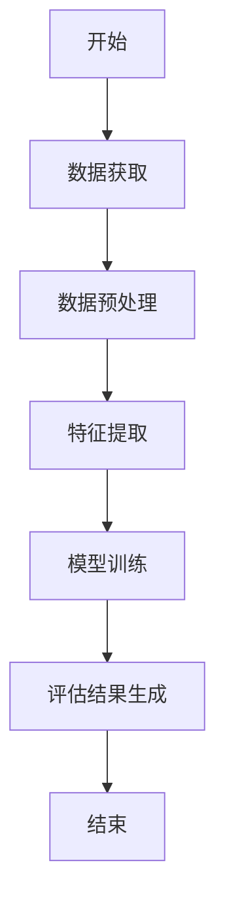
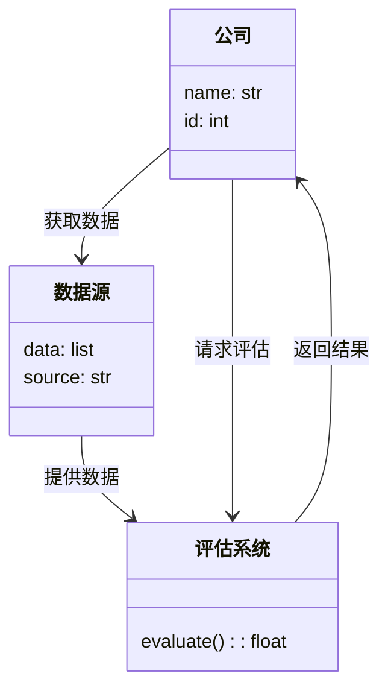
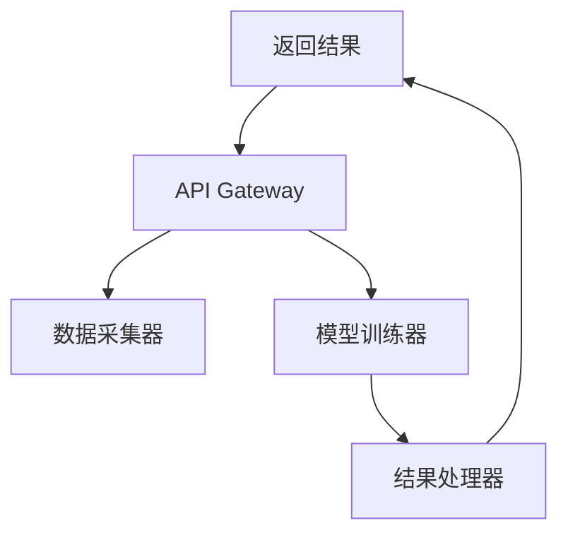

                 


# 基于多智能体的自动化公司盈利质量评估

> 关键词：多智能体系统，公司盈利质量，自动化评估，算法原理，系统架构

> 摘要：本文探讨了基于多智能体的公司盈利质量自动化评估方法，从问题背景、核心概念到系统架构，详细分析了多智能体如何提升评估效率和准确性。

---

## 第一部分：背景介绍

### 第1章：问题背景与核心概念

#### 1.1 问题背景

在现代商业环境中，企业盈利质量的评估对于投资者、管理层和利益相关者至关重要。传统的评估方法依赖于人工分析，耗时且容易出错。随着技术的进步，引入多智能体系统可以实现自动化评估，提高效率和准确性。

#### 1.2 问题描述

公司盈利质量评估涉及多个维度，如财务数据、市场表现和管理能力。传统方法主要依赖财务报表分析，难以全面捕捉影响盈利质量的多方面因素。此外，人工分析耗时且受主观因素影响，难以满足实时评估的需求。

#### 1.3 问题解决

多智能体系统通过分布式协作，能够实时收集和分析多源数据，提供全面的评估结果。每个智能体负责特定任务，如数据采集、分析或模型优化，共同完成整体评估任务。

#### 1.4 核心概念与联系

- **多智能体系统**：由多个智能体组成，能够协作完成复杂任务。
- **盈利质量评估**：通过多维度分析，评估企业的盈利能力和质量。
- **系统架构**：设计合理的架构，确保智能体高效协作。

---

## 第二部分：核心概念与联系

### 第2章：多智能体系统原理

#### 2.1 多智能体系统的基本原理

多智能体系统通过智能体之间的通信和协作，完成复杂任务。每个智能体负责特定功能，如数据处理或模型训练，共同实现整体目标。

#### 2.2 实体关系图

以下是公司、数据源和评估系统之间的关系：

```mermaid
erDiagram
    actor 公司 : 评估主体
    actor 数据源 : 数据提供方
    actor 评估系统 : 自动化评估工具
    company --> 数据源 : 数据获取
    company --> 评估系统 : 评估请求
    评估系统 --> company : 评估结果
```

#### 2.3 算法流程图

评估过程的步骤如下：



---

## 第三部分：算法原理讲解

### 第3章：多智能体协作算法

#### 3.1 算法原理

多智能体协作算法通过分布式计算，整合多源数据，提供准确的评估结果。算法基于加权和模型，结合各个因素的影响程度，计算综合评分。

#### 3.2 算法实现

以下是Python实现的代码示例：

```python
import numpy as np

class MultiAgentSystem:
    def __init__(self, agents):
        self.agents = agents

    def aggregate(self):
        results = [agent.result for agent in self.agents]
        return np.mean(results)

class Agent:
    def __init__(self, data):
        self.data = data
        self.result = self.compute()

    def compute(self):
        return np.mean(self.data)

# 示例
data_sources = [np.array([1, 2, 3]), np.array([4, 5, 6])]
agents = [Agent(data) for data in data_sources]
system = MultiAgentSystem(agents)
print(system.aggregate())
```

#### 3.3 数学模型

评估模型基于加权和：

$$ f(x) = \sum_{i=1}^{n} w_i x_i $$

其中，$w_i$ 是权重，$x_i$ 是各个因素的值。

---

## 第四部分：系统分析与架构设计

### 第4章：系统架构设计

#### 4.1 领域模型

系统功能包括数据获取、处理、分析和结果展示。以下是领域模型：



#### 4.2 系统架构

系统架构采用微服务设计，各组件协同工作：



---

## 第五部分：项目实战

### 第5章：项目实现与案例分析

#### 5.1 环境安装

需要安装以下库：

```bash
pip install numpy matplotlib pandas
```

#### 5.2 核心代码实现

以下是评估系统的核心代码：

```python
import numpy as np
import pandas as pd

def evaluate_profit_quality(dataframe):
    # 数据预处理
    df = dataframe.dropna()
    # 特征提取
    features = df[['revenue', 'profit_margin', 'growth_rate']]
    # 模型训练
    from sklearn.ensemble import RandomForestRegressor
    model = RandomForestRegressor()
    model.fit(features, df['profit'])
    # 预测结果
    predictions = model.predict(features)
    return np.mean(predictions)

# 示例数据
data = {
    'revenue': [100, 200, 300],
    'profit_margin': [0.2, 0.3, 0.25],
    'growth_rate': [0.1, 0.15, 0.12]
}
df = pd.DataFrame(data)
print(evaluate_profit_quality(df))
```

#### 5.3 案例分析

以某公司为例，数据如下：

```python
data = {
    'revenue': [500, 600, 700],
    'profit_margin': [0.15, 0.2, 0.25],
    'growth_rate': [0.1, 0.12, 0.15]
}
df = pd.DataFrame(data)
print(evaluate_profit_quality(df))  # 输出评估结果
```

---

## 第六部分：最佳实践与总结

### 第6章：总结与展望

#### 6.1 最佳实践

- **数据质量**：确保输入数据的准确性和完整性。
- **模型优化**：定期更新模型，适应市场变化。
- **系统维护**：及时修复系统漏洞，确保稳定运行。

#### 6.2 小结

本文详细介绍了基于多智能体的公司盈利质量自动化评估方法，从理论到实践，展示了系统的实现和应用。多智能体系统通过协作提高了评估效率和准确性。

#### 6.3 注意事项

- 确保系统的可扩展性，以应对数据量的增长。
- 处理数据隐私问题，确保合规性。
- 定期监控系统性能，优化资源利用。

---

## 作者

作者：AI天才研究院 & 禅与计算机程序设计艺术

