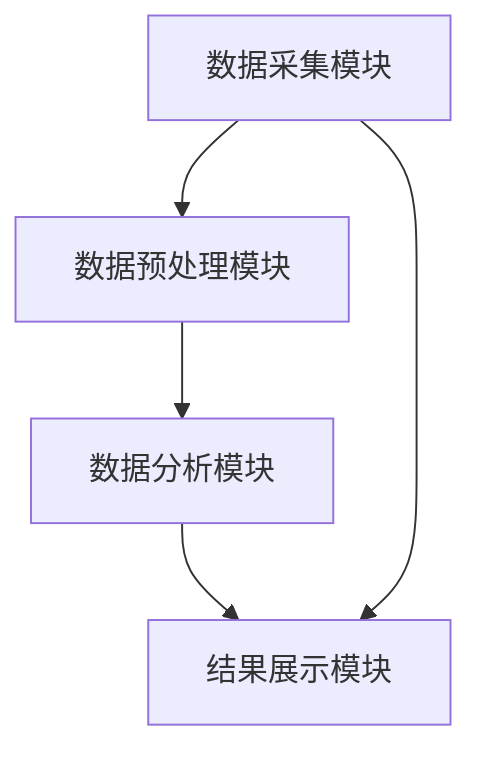

                 


```markdown
# 基于多智能体的自动化公司管理层薪酬分析

> 关键词：多智能体系统，公司管理层，薪酬分析，算法原理，系统设计，项目实战

摘要：本文详细探讨了基于多智能体的自动化公司管理层薪酬分析方法。通过分析多智能体系统的核心原理、算法实现、系统架构设计以及实际项目案例，本文为读者提供了一套高效、智能的薪酬分析解决方案。文章内容涵盖背景介绍、核心概念与联系、算法原理、系统设计、项目实战等多个方面，深入浅出地讲解了多智能体系统在公司管理层薪酬分析中的应用。

---

## 第一部分：背景介绍

### 第1章：多智能体系统与公司管理层薪酬分析概述

#### 1.1 问题背景
传统的公司管理层薪酬分析方法存在以下问题：
- 数据分散：薪酬数据、绩效数据、岗位数据等分布在不同的部门，难以统一分析。
- 分析复杂：需要综合考虑岗位职责、绩效表现、市场薪资水平等多因素，传统方法难以实现自动化。
- 缺乏实时性：人工分析耗时较长，难以满足企业对实时薪酬调整的需求。

#### 1.2 问题描述
公司管理层的薪酬分析需要解决以下问题：
- 如何高效整合分散的薪酬数据？
- 如何快速分析多维度的薪酬影响因素？
- 如何实现智能、自动化的薪酬优化建议？

#### 1.3 问题解决
多智能体系统的优势在于：
- 分布式计算：多个智能体协同工作，分别处理不同的数据和分析任务。
- 自适应性：智能体能够根据数据变化和任务需求动态调整行为。
- 高效协作：通过智能体之间的通信与协作，实现数据整合和分析的自动化。

#### 1.4 核心概念与联系
多智能体系统与公司管理层薪酬分析的核心要素包括：
- 公司管理层：包括不同岗位的管理人员，如CEO、 CFO等。
- 薪酬数据：包括基本工资、奖金、股票期权等。
- 绩效数据：包括KPI完成情况、员工满意度等。
- 市场数据：包括行业薪资水平、市场供需情况等。

### 第2章：多智能体系统的核心原理

#### 2.1 多智能体系统的基本原理
多智能体系统由多个智能体组成，每个智能体具有以下特点：
- 独立性：每个智能体能够独立完成特定任务。
- 反应性：智能体能够感知环境并做出反应。
- 协作性：智能体之间可以通过通信协作完成复杂任务。

#### 2.2 算法原理
多智能体协作算法的核心思想是通过智能体之间的通信与协作，实现数据的整合与分析。以下是算法的主要步骤：
1. 数据获取：智能体从各个数据源获取薪酬相关数据。
2. 数据预处理：对获取的数据进行清洗和标准化处理。
3. 数据分析：通过智能体协作，对数据进行多维度分析。
4. 结果输出：输出分析结果和优化建议。

#### 2.3 算法实现
以下是基于多智能体的薪酬分析算法的Python代码示例：

```python
class Agent:
    def __init__(self, role):
        self.role = role
        self.data = {}

    def communicate(self, other):
        # 智能体之间通信，共享数据
        other.data.update(self.data)

    def analyze(self, task):
        # 根据任务类型进行分析
        if task == "salary_analysis":
            # 示例：计算平均薪资
            avg_salary = sum(self.data['salary']) / len(self.data['salary'])
            return avg_salary
        elif task == "performance_analysis":
            # 示例：计算绩效与薪资的相关性
            pass

agent1 = Agent("薪酬计算")
agent2 = Agent("绩效分析")
agent1.data = {'salary': [100000, 120000, 90000]}
agent2.data = {'performance': [0.8, 0.9, 0.7]}
agent1.communicate(agent2)
result = agent2.analyze("performance_analysis")
print(result)
```

#### 2.4 数学模型与公式
以下是薪酬分析中常用的数学模型：
- 平均薪资计算：
  $$\text{平均薪资} = \frac{\sum_{i=1}^{n} s_i}{n}$$
  其中，\( s_i \) 表示第i个员工的薪资，\( n \) 表示员工总数。
  
- 绩效与薪资的相关性分析：
  $$\text{相关系数} = \frac{\sum_{i=1}^{n} (x_i - \bar{x})(y_i - \bar{y})}{\sqrt{\sum_{i=1}^{n} (x_i - \bar{x})^2} \sqrt{\sum_{i=1}^{n} (y_i - \bar{y})^2}}$$
  其中，\( x_i \) 表示绩效分数，\( y_i \) 表示薪资水平，\( \bar{x} \) 和 \( \bar{y} \) 表示平均绩效和平均薪资。

---

## 第二部分：系统分析与架构设计

### 第3章：系统功能设计

#### 3.1 项目背景
本项目旨在通过多智能体系统实现公司管理层薪酬分析的自动化，提高分析效率和准确性。

#### 3.2 系统功能设计
以下是系统的主要功能模块：
- 数据采集模块：从不同数据源获取薪酬相关数据。
- 数据预处理模块：清洗和标准化数据。
- 数据分析模块：通过多智能体协作进行分析。
- 结果展示模块：以可视化形式展示分析结果。

#### 3.3 系统架构设计
以下是系统架构的Mermaid图：



---

## 第三部分：项目实战

### 第4章：环境安装与核心代码实现

#### 4.1 环境安装
需要安装以下工具和库：
- Python 3.8+
- Mermaid图生成工具
- 数据分析库（如Pandas、NumPy）

#### 4.2 核心代码实现
以下是核心代码示例：

```python
import pandas as pd
import numpy as np

class SalaryAnalyzer:
    def __init__(self):
        self.data = pd.DataFrame()

    def load_data(self, file_path):
        self.data = pd.read_csv(file_path)

    def calculate_avg_salary(self):
        return self.data['salary'].mean()

    def calculate_correlation(self):
        return np.corrcoef(self.data['salary'], self.data['performance'])

analyzer = SalaryAnalyzer()
analyzer.load_data('salary_data.csv')
avg_salary = analyzer.calculate_avg_salary()
correlation = analyzer.calculate_correlation()
print(f"平均薪资：{avg_salary}")
print(f"相关系数：{correlation}")
```

---

## 第四部分：总结与展望

### 第5章：总结与展望

#### 5.1 总结
本文详细介绍了基于多智能体的公司管理层薪酬分析方法，通过算法实现和系统设计，展示了其在实际应用中的优势。

#### 5.2 展望
未来可以进一步研究多智能体系统在其他管理领域的应用，如人力资源管理、市场营销等。

---

## 作者

作者：AI天才研究院/AI Genius Institute & 禅与计算机程序设计艺术 /Zen And The Art of Computer Programming
```

---

### 总结
这篇技术博客文章详细讲解了基于多智能体的公司管理层薪酬分析方法，涵盖了背景介绍、算法原理、系统设计和项目实战等多个方面。通过使用Mermaid图和Python代码示例，文章内容更加直观和易于理解。

