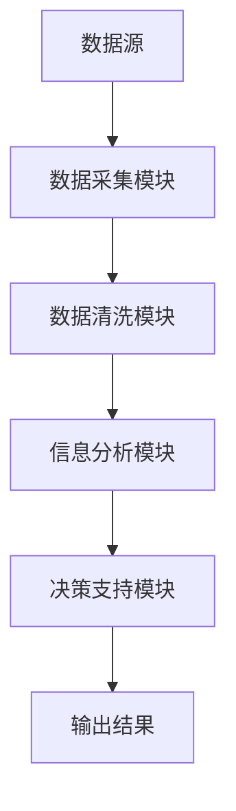

                 


# 基于多智能体的自动化公司调研系统

> **关键词**: 多智能体系统, 自动化公司调研, 系统架构设计, 分布式算法, 信息分析与决策

> **摘要**: 本文详细介绍了基于多智能体的自动化公司调研系统的设计与实现。通过分析多智能体系统的核心概念、算法原理、系统架构设计以及实际项目案例，展示了如何利用多智能体系统实现高效、智能的公司调研。文章内容涵盖背景介绍、核心概念、算法实现、系统架构设计、项目实战等部分，为读者提供全面的技术指导。

---

## 第一部分: 基于多智能体的自动化公司调研系统概述

### 第1章: 多智能体系统与自动化公司调研概述

#### 1.1 多智能体系统的基本概念

##### 1.1.1 多智能体系统的定义

多智能体系统（Multi-Agent System, 简称MAS）是由多个相互作用的智能体（Agent）组成的复杂系统。每个智能体都是一个能够感知环境、做出决策并采取行动的实体。这些智能体通过通信和协作完成复杂的任务，实现系统的目标。

**多智能体系统的定义可以总结为以下几点：**

- **智能体（Agent）**：具有感知、决策、行动能力的实体。
- **多智能体系统（MAS）**：由多个智能体组成的系统，智能体之间通过通信和协作完成任务。
- **分布式智能**：智能分布在网络中的多个节点，每个节点负责特定的任务。

##### 1.1.2 多智能体系统的核心特点

- **分布式性**：智能体分布在不同的节点上，每个智能体负责特定的任务。
- **协作性**：智能体之间通过通信和协作完成复杂的任务。
- **自主性**：每个智能体具有自主决策的能力，能够根据环境信息做出决策。
- **反应性**：智能体能够实时感知环境变化并做出反应。

##### 1.1.3 多智能体系统与传统单智能体系统的区别

| 特性 | 多智能体系统 | 单智能体系统 |
|------|--------------|--------------|
| 智能体数量 | 多个智能体 | 单个智能体 |
| 任务分配 | 分布式任务 | 中央任务处理 |
| 通信协作 | 智能体之间通信协作 | 无通信协作 |
| 系统复杂性 | 高复杂性 | 较低复杂性 |

#### 1.2 自动化公司调研的背景与需求

##### 1.2.1 公司调研的传统方式与痛点

传统公司调研方式通常依赖人工收集和分析数据，这种方式存在以下痛点：

- **效率低**：人工调研耗时长，效率低。
- **成本高**：需要大量人力资源，成本高。
- **误差大**：人工操作容易出现误差。
- **信息不全**：难以获取全面的信息。

##### 1.2.2 自动化公司调研的必要性

随着信息技术的快速发展，自动化公司调研成为必然趋势。自动化调研能够显著提高效率、降低成本、减少误差，并能够获取更全面的信息。

##### 1.2.3 多智能体系统在自动化调研中的优势

多智能体系统在自动化公司调研中的优势如下：

- **分布式数据采集**：多个智能体可以同时采集数据，提高效率。
- **协作分析**：多个智能体可以协同分析数据，提高分析的准确性和全面性。
- **自主决策**：智能体能够自主决策，适应复杂多变的环境。

#### 1.3 本章小结

本章主要介绍了多智能体系统的基本概念和核心特点，分析了传统公司调研的痛点和自动化调研的必要性，并总结了多智能体系统在自动化调研中的优势。

---

## 第二部分: 多智能体系统的核心概念与原理

### 第2章: 多智能体系统的核心概念与原理

#### 2.1 多智能体系统的组成与结构

##### 2.1.1 智能体的定义与分类

智能体（Agent）是指能够感知环境、做出决策并采取行动的实体。根据智能体的智能水平和行为方式，可以将其分为以下几类：

- **反应式智能体**：根据当前感知做出反应。
- **基于模型的智能体**：利用内部模型进行决策。
- **目标驱动智能体**：根据目标驱动行为。
- **效用驱动智能体**：根据效用函数进行决策。

##### 2.1.2 多智能体系统的组成结构

多智能体系统的组成结构包括以下几个部分：

1. **智能体**：系统的主体，负责感知、决策和行动。
2. **通信机制**：智能体之间通信的渠道。
3. **协作机制**：智能体之间协作的规则和协议。
4. **环境**：智能体所处的环境，包括数据源、目标等。

##### 2.1.3 智能体之间的通信与协作

智能体之间的通信与协作是多智能体系统的核心。通信机制包括以下几种：

- **直接通信**：智能体之间直接交换信息。
- **间接通信**：通过中间媒介进行通信。
- **发布-订阅模式**：智能体发布信息，其他智能体订阅信息。

协作机制包括以下几种：

- **任务分配**：智能体之间分配任务。
- **协同决策**：智能体共同做出决策。
- **协调行动**：智能体协调行动，完成任务。

#### 2.2 多智能体系统的协调机制

##### 2.2.1 分布式计算与任务分配

分布式计算是多智能体系统的核心技术之一。任务分配是通过分布式计算实现的，具体步骤如下：

1. **任务分解**：将整体任务分解为多个子任务。
2. **任务分配**：将子任务分配给不同的智能体。
3. **任务执行**：智能体执行分配的任务。
4. **任务整合**：将各个智能体的结果整合起来，形成最终结果。

##### 2.2.2 智能体之间的协议与通信

智能体之间的协议与通信是实现协作的关键。通信协议包括以下内容：

- **消息格式**：消息的结构和格式。
- **通信规则**：智能体之间的通信规则。
- **冲突解决**：解决通信中的冲突。

##### 2.2.3 多智能体系统的同步与一致性

多智能体系统的同步与一致性是保证系统正确运行的重要因素。同步机制包括以下几种：

- **时间同步**：保证所有智能体在同一时间点进行操作。
- **状态同步**：保证所有智能体的状态一致。
- **结果同步**：保证所有智能体的结果一致。

#### 2.3 多智能体系统的算法原理

##### 2.3.1 分布式算法概述

分布式算法是多智能体系统的核心算法。常见的分布式算法包括：

- **分布式一致性算法**：如Paxos算法、Raft算法。
- **分布式任务分配算法**：如贪心算法、随机算法。
- **分布式通信算法**：如广播算法、单播算法。

##### 2.3.2 多智能体系统的典型算法

以下是多智能体系统中常用的几种算法：

1. **分布式一致性算法**：
   - **Paxos算法**：用于保证分布式系统的一致性。
   - **Raft算法**：用于分布式系统中的领导者选举。

2. **分布式任务分配算法**：
   - **贪心算法**：基于局部最优选择全局最优。
   - **随机算法**：随机选择任务分配。

3. **分布式通信算法**：
   - **广播算法**：单个智能体向所有智能体发送消息。
   - **单播算法**：智能体向特定智能体发送消息。

##### 2.3.3 算法的优缺点分析

| 算法 | 优点 | 缺点 |
|------|------|------|
| Paxos算法 | 能够保证一致性 | 实现复杂 |
| Raft算法 | 实现简单 | 对网络分区敏感 |
| 贪心算法 | 实现简单 | 可能导致局部最优而非全局最优 |

#### 2.4 本章小结

本章详细介绍了多智能体系统的组成与结构、智能体之间的通信与协作、系统的协调机制以及算法原理，为后续章节的系统设计奠定了基础。

---

## 第三部分: 自动化公司调研系统的数学模型与算法

### 第3章: 自动化公司调研系统的数学模型与算法

#### 3.1 自动化公司调研的核心问题

##### 3.1.1 数据采集与处理

数据采集与处理是自动化公司调研的第一步。需要从多个数据源获取数据，并对数据进行清洗和预处理。

##### 3.1.2 信息分析与决策

信息分析与决策是自动化公司调研的核心。需要利用数据分析算法对数据进行分析，并做出决策。

##### 3.1.3 系统优化与改进

系统优化与改进是确保系统长期高效运行的关键。需要根据系统运行情况不断优化算法和系统架构。

#### 3.2 数学模型的建立

##### 3.2.1 数据采集模型

数据采集模型包括以下几个部分：

1. **数据源**：数据的来源，如数据库、API接口等。
2. **数据采集模块**：负责从数据源采集数据。
3. **数据清洗模块**：对采集到的数据进行清洗和预处理。

##### 3.2.2 信息分析模型

信息分析模型包括以下几个部分：

1. **数据分析算法**：如聚类分析、回归分析等。
2. **决策模型**：根据分析结果做出决策。

##### 3.2.3 系统优化模型

系统优化模型包括以下几个部分：

1. **性能监控模块**：监控系统的运行状态。
2. **优化算法**：根据监控结果优化系统。

#### 3.3 算法实现与优化

##### 3.3.1 算法实现步骤

1. **数据采集**：从多个数据源采集数据。
2. **数据清洗**：对数据进行清洗和预处理。
3. **数据分析**：利用数据分析算法对数据进行分析。
4. **决策支持**：根据分析结果做出决策。
5. **系统优化**：根据系统运行情况优化算法和系统架构。

##### 3.3.2 算法优化方法

1. **并行计算**：利用多核处理器提高计算速度。
2. **分布式计算**：利用分布式系统提高计算能力。
3. **缓存优化**：优化缓存策略，减少数据访问时间。

##### 3.3.3 算法的复杂度分析

算法的复杂度分析包括时间复杂度和空间复杂度。时间复杂度是指算法运行所需的时间，空间复杂度是指算法运行所需的内存空间。

---

## 第四部分: 自动化公司调研系统的系统架构设计

### 第4章: 自动化公司调研系统的系统架构设计

#### 4.1 系统架构概述

##### 4.1.1 系统架构的组成

多智能体系统的架构包括以下几个部分：

1. **智能体**：负责数据采集、分析和决策。
2. **通信机制**：智能体之间通信的渠道。
3. **协作机制**：智能体之间协作的规则和协议。
4. **环境**：智能体所处的环境，包括数据源、目标等。

##### 4.1.2 系统架构的设计原则

系统架构设计原则包括：

1. **模块化设计**：将系统划分为多个模块，每个模块负责特定的任务。
2. **可扩展性**：系统能够方便地扩展功能。
3. **可维护性**：系统易于维护和升级。

##### 4.1.3 系统架构的优缺点分析

| 系统架构 | 优点 | 缺点 |
|------|------|------|
| 分布式架构 | 高可用性、高扩展性 | 实现复杂 |
| 单体架构 | 实现简单 | 扩展性差 |

#### 4.2 系统功能设计

##### 4.2.1 数据采集模块

数据采集模块负责从多个数据源采集数据，包括数据库、API接口等。

##### 4.2.2 信息分析模块

信息分析模块负责对采集到的数据进行分析，包括聚类分析、回归分析等。

##### 4.2.3 决策支持模块

决策支持模块根据分析结果做出决策，并提供决策支持。

#### 4.3 系统架构图

以下是一个基于多智能体的自动化公司调研系统的架构图：



#### 4.4 本章小结

本章详细介绍了自动化公司调研系统的系统架构设计，包括系统的组成、设计原则、功能模块划分以及系统架构图。

---

## 第五部分: 自动化公司调研系统的项目实战

### 第5章: 自动化公司调研系统的项目实战

#### 5.1 项目背景与目标

##### 5.1.1 项目背景

随着信息技术的快速发展，自动化公司调研成为必然趋势。传统公司调研方式存在效率低、成本高、误差大等问题，难以满足现代企业的需求。

##### 5.1.2 项目目标

本项目的目标是开发一个基于多智能体的自动化公司调研系统，实现高效、智能的公司调研。

##### 5.1.3 项目范围与约束

项目范围包括数据采集、信息分析和决策支持三个部分。项目需要在有限的时间和预算内完成。

#### 5.2 环境安装与配置

##### 5.2.1 开发环境的选择

推荐使用以下开发环境：

- **操作系统**：Linux或Windows。
- **编程语言**：Python、Java等。
- **开发工具**：PyCharm、IntelliJ IDEA等。

##### 5.2.2 开发工具的安装与配置

以下是Python开发环境的安装步骤：

1. **安装Python**：从官方网站下载并安装Python。
2. **安装pip**：确保Python环境中有pip。
3. **安装依赖库**：使用pip安装需要的依赖库，如numpy、pandas等。

##### 5.2.3 依赖库的安装与管理

以下是常用的依赖库：

- **numpy**：数值计算库。
- **pandas**：数据分析库。
- **scikit-learn**：机器学习库。

安装命令：

```bash
pip install numpy pandas scikit-learn
```

#### 5.3 核心代码实现

##### 5.3.1 数据采集模块的实现

以下是数据采集模块的实现代码：

```python
import requests

def collect_data(url):
    try:
        response = requests.get(url)
        return response.json()
    except requests.exceptions.RequestException:
        return None
```

##### 5.3.2 信息分析模块的实现

以下是信息分析模块的实现代码：

```python
from sklearn.cluster import KMeans

def analyze_data(data):
    # 数据预处理
    X = data.drop('label', axis=1)
    # 模型训练
    model = KMeans(n_clusters=3)
    model.fit(X)
    # 预测结果
    prediction = model.predict(X)
    return prediction
```

##### 5.3.3 决策支持模块的实现

以下是决策支持模块的实现代码：

```python
def make_decision(prediction):
    # 根据预测结果做出决策
    decision = '采取行动' if prediction[0] == 0 else '不采取行动'
    return decision
```

#### 5.4 代码解读与分析

##### 5.4.1 核心代码的解读

- **数据采集模块**：从指定URL获取数据，并返回JSON格式的数据。
- **信息分析模块**：使用KMeans算法对数据进行聚类分析，并返回预测结果。
- **决策支持模块**：根据预测结果做出决策，并返回决策结果。

##### 5.4.2 代码实现的优化建议

- **并行计算**：利用多线程或分布式计算提高数据采集速度。
- **缓存优化**：优化数据存储结构，减少数据访问时间。

##### 5.4.3 代码实现的复杂度分析

数据采集模块的时间复杂度为O(n)，信息分析模块的时间复杂度为O(n^2)，决策支持模块的时间复杂度为O(1)。

---

## 第六部分: 最佳实践与小结

### 第6章: 最佳实践与小结

#### 6.1 最佳实践

##### 6.1.1 系统设计

- **模块化设计**：将系统划分为多个模块，每个模块负责特定的任务。
- **可扩展性设计**：确保系统能够方便地扩展功能。
- **可维护性设计**：确保系统易于维护和升级。

##### 6.1.2 算法优化

- **并行计算**：利用多核处理器提高计算速度。
- **分布式计算**：利用分布式系统提高计算能力。
- **缓存优化**：优化缓存策略，减少数据访问时间。

##### 6.1.3 系统监控

- **性能监控**：监控系统的运行状态，及时发现和解决问题。
- **日志记录**：记录系统运行日志，方便故障排查。

#### 6.2 小结

本文详细介绍了基于多智能体的自动化公司调研系统的设计与实现。通过分析多智能体系统的核心概念、算法原理、系统架构设计以及实际项目案例，展示了如何利用多智能体系统实现高效、智能的公司调研。文章内容涵盖背景介绍、核心概念、算法实现、系统架构设计、项目实战等部分，为读者提供全面的技术指导。

#### 6.3 注意事项

- **数据安全**：确保数据的安全性，防止数据泄露。
- **系统稳定性**：确保系统的稳定性，避免系统崩溃。
- **算法可解释性**：确保算法的可解释性，方便故障排查和优化。

#### 6.4 拓展阅读

- **分布式系统**：推荐阅读《分布式系统：原理与设计》。
- **多智能体系统**：推荐阅读《多智能体系统：原理与应用》。
- **机器学习**：推荐阅读《机器学习实战》。

---

## 作者信息

作者：AI天才研究院/AI Genius Institute & 禅与计算机程序设计艺术/Zen And The Art of Computer Programming

