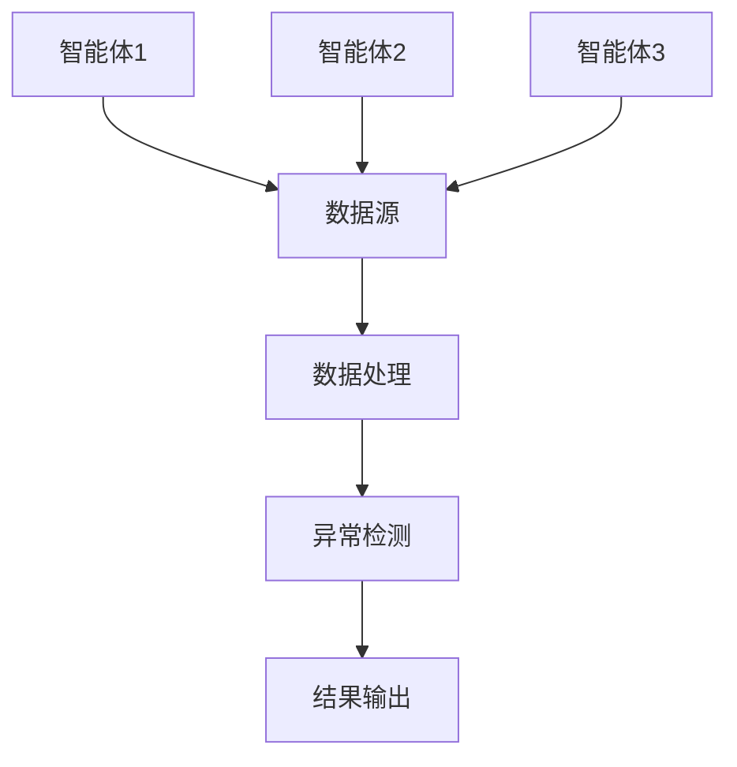
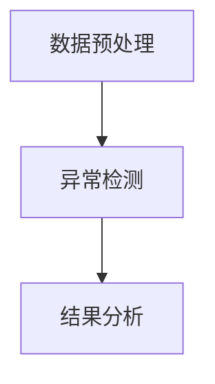

                 


# 基于多智能体的自动化公司财务舞弊检测系统

## 关键词：多智能体系统、财务舞弊检测、自动化检测、异常检测、系统架构

## 摘要：本文提出了一种基于多智能体的自动化公司财务舞弊检测系统，通过分析财务数据中的异常行为，利用多智能体系统的优势，实现高效、精准的财务舞弊检测。文章详细介绍了系统的背景、核心概念、算法原理、系统架构设计及项目实战，为读者提供了一个全面的技术解决方案。

---

# 第1章: 背景介绍

## 1.1 问题背景

### 1.1.1 财务舞弊的定义与特征
财务舞弊是指企业在财务报表或其他财务资料中故意提供虚假信息，以误导利益相关者的行为。常见的舞弊手段包括虚增收入、隐瞒债务、虚减费用等。财务舞弊的特征包括数据异常、交易不合理、逻辑不一致等。

### 1.1.2 财务舞弊对企业的影响
财务舞弊会严重损害企业的声誉，导致投资者信心下降，甚至可能引发法律风险和财务损失。例如，安然事件导致公司破产，对利益相关者造成巨大损失。

### 1.1.3 传统财务舞弊检测的局限性
传统财务舞弊检测依赖人工审计，存在效率低、成本高、覆盖面有限等问题。此外，人工审计容易受到主观因素影响，难以发现复杂的舞弊行为。

## 1.2 问题描述

### 1.2.1 财务舞弊检测的核心目标
财务舞弊检测的核心目标是通过技术手段，自动识别财务数据中的异常行为，帮助审计人员快速定位问题。

### 1.2.2 财务舞弊检测的关键挑战
财务数据复杂多样，舞弊行为隐蔽性强，传统方法难以应对。此外，数据量大、实时性要求高等因素也增加了检测的难度。

### 1.2.3 自动化检测的需求与优势
自动化检测可以提高效率，降低成本，同时能够处理大量数据，发现人工难以察觉的异常。

## 1.3 问题解决思路

### 1.3.1 多智能体系统的优势
多智能体系统能够并行处理数据，具备分布式计算能力，能够高效处理大规模数据。

### 1.3.2 自动化检测的实现路径
通过多智能体协同工作，对财务数据进行预处理、特征提取、模型训练和结果分析。

### 1.3.3 系统设计的基本原则
系统设计应遵循模块化、可扩展性、高效率和可维护性的原则。

## 1.4 边界与外延

### 1.4.1 系统适用的场景
适用于大型企业、上市公司等需要高频财务审计的场景。

### 1.4.2 系统不适用的场景
不适用于数据量小、舞弊行为简单的中小型企业。

### 1.4.3 系统与其他财务检测工具的对比
与传统人工审计相比，系统具有高效、精准的优势；与单一智能体系统相比，多智能体系统更具扩展性和容错性。

## 1.5 概念结构与核心要素组成

### 1.5.1 系统的核心要素
- 数据预处理模块
- 异常检测模块
- 结果分析模块

### 1.5.2 系统的组成模块
- 数据源：财务报表、交易记录
- 处理模块：数据清洗、特征提取
- 检测模块：异常检测、风险评估
- 输出模块：结果展示、报警提示

### 1.5.3 系统的输入输出关系
输入：财务数据  
输出：异常报告、风险评分

---

# 第2章: 多智能体系统的基本概念

## 2.1 多智能体系统的定义与特点

### 2.1.1 多智能体系统的定义
多智能体系统是由多个智能体组成的分布式系统，智能体能够协同工作，完成复杂任务。

### 2.1.2 多智能体系统的五大核心特点
1. **分布式性**：智能体独立运行，协同完成任务。
2. **协作性**：智能体之间通过通信协作，共同解决问题。
3. **反应性**：智能体能够实时感知环境变化，做出相应反应。
4. **自主性**：智能体具有自主决策能力，无需外部干预。
5. **可扩展性**：系统可扩展，适应不同的数据规模。

### 2.1.3 多智能体系统与传统单智能体系统的对比
| 特性          | 多智能体系统                | 单智能体系统                |
|---------------|-----------------------------|-----------------------------|
| 处理能力      | 强大，分布式计算            | 较弱，依赖单点计算            |
| 可扩展性      | 高                          | 中                          |
| 容错性        | 高                          | 中                          |
| 协作能力      | 强                          | 弱                          |

## 2.2 多智能体系统在财务舞弊检测中的应用

### 2.2.1 多智能体系统的优势
- **并行处理**：多智能体可以同时处理不同数据，提高效率。
- **协同分析**：多个智能体协同分析，能够发现单一智能体难以察觉的异常。
- **容错性**：某个智能体失效，其他智能体可以继续工作。

### 2.2.2 多智能体系统在财务舞弊检测中的具体应用
- 数据清洗与预处理
- 异常检测与风险评估
- 结果分析与报警提示

### 2.2.3 多智能体系统的实现框架
1. **数据采集**：从数据库中获取财务数据。
2. **任务分配**：将数据分配给多个智能体处理。
3. **协同分析**：智能体协同分析数据，识别异常。
4. **结果汇总**：汇总各智能体的分析结果，生成报告。

## 2.3 多智能体系统的核心概念与联系

### 2.3.1 实体关系图（ER图）展示


---

# 第3章: 财务舞弊检测的特征分析

## 3.1 财务舞弊的特征

### 3.1.1 交易异常
- 交易金额异常
- 交易时间集中
- 交易对手异常

### 3.1.2 数据异常
- 财务数据波动大
- 数据不一致
- 数据缺失

### 3.1.3 逻辑异常
- 财务报表勾稽关系不成立
- 费用与收入不匹配
- 资产与负债不匹配

## 3.2 财务舞弊检测的关键指标

### 3.2.1 财务比率分析
- 销售收入增长率
- 净利润率
- 资产负债率

### 3.2.2 财务趋势分析
- 财务数据的趋势变化
- 异常波动的识别

### 3.2.3 异常交易识别
- 大额交易的识别
- 交易集中度分析

## 3.3 基于多智能体的特征分析

### 3.3.1 多智能体协同分析
- 每个智能体负责分析不同特征
- 智能体之间协同，综合判断异常

### 3.3.2 多维度特征分析
- 时间维度：分析交易时间的集中性
- 空间维度：分析交易对手的地理分布
- 数值维度：分析金额的异常性

---

# 第4章: 基于多智能体的财务舞弊检测算法原理

## 4.1 算法概述

### 4.1.1 算法的总体流程
1. 数据预处理
2. 特征提取
3. 模型训练
4. 异常检测
5. 结果分析

### 4.1.2 算法的核心思想
通过多智能体协同工作，分别从不同维度分析财务数据，识别异常。

## 4.2 算法的数学模型

### 4.2.1 数据预处理
$$
\text{归一化公式：} \quad x_{\text{norm}} = \frac{x - \mu}{\sigma}
$$

其中，$\mu$ 是均值，$\sigma$ 是标准差。

### 4.2.2 异常检测模型
使用Isolation Forest算法，通过构建随机森林，隔离异常点。

### 4.2.3 模型训练
$$
\text{损失函数：} \quad L = \sum_{i=1}^{n} (y_i - \hat{y_i})^2
$$

其中，$y_i$ 是真实标签，$\hat{y_i}$ 是预测标签。

### 4.2.4 模型优化
使用Adam优化器：
$$
\text{优化器：} \quad \theta = \theta - \eta \frac{\partial L}{\partial \theta}
$$

其中，$\eta$ 是学习率，$\frac{\partial L}{\partial \theta}$ 是损失函数对参数的导数。

## 4.3 算法的实现步骤

### 4.3.1 数据预处理
```python
import pandas as pd
from sklearn.preprocessing import StandardScaler

# 数据加载
data = pd.read_csv('financial_data.csv')

# 数据清洗
data.dropna(inplace=True)

# 数据归一化
scaler = StandardScaler()
data_normalized = scaler.fit_transform(data)
```

### 4.3.2 特征提取
```python
from sklearn.decomposition import PCA

pca = PCA(n_components=10)
principal_components = pca.fit_transform(data_normalized)
```

### 4.3.3 模型训练
```python
from sklearn.ensemble import IsolationForest

model = IsolationForest(n_estimators=100, random_state=42)
model.fit(principal_components)
```

### 4.3.4 异常检测
```python
# 预测异常
outliers = model.predict(principal_components)
# 获取异常索引
outliers_indices = [i for i, val in enumerate(outliers) if val == -1]
```

---

# 第5章: 系统架构设计与实现

## 5.1 系统架构设计

### 5.1.1 系统组成模块
- 数据预处理模块
- 异常检测模块
- 结果分析模块

### 5.1.2 系统架构图


### 5.1.3 接口设计
- 数据输入接口：接收财务数据
- 模型训练接口：训练异常检测模型
- 结果输出接口：输出异常报告

### 5.1.4 交互流程
1. 数据预处理模块接收财务数据，进行清洗和归一化。
2. 异常检测模块调用Isolation Forest算法，识别异常。
3. 结果分析模块对异常结果进行分析，生成报告。

## 5.2 系统实现

### 5.2.1 数据预处理模块
```python
def preprocess_data(data):
    # 数据清洗
    data.dropna(inplace=True)
    # 数据归一化
    scaler = StandardScaler()
    normalized_data = scaler.fit_transform(data)
    return normalized_data
```

### 5.2.2 异常检测模块
```python
def detect_anomalies(normalized_data):
    pca = PCA(n_components=10)
    principal_components = pca.fit_transform(normalized_data)
    model = IsolationForest(n_estimators=100, random_state=42)
    model.fit(principal_components)
    outliers = model.predict(principal_components)
    return outliers
```

### 5.2.3 结果分析模块
```python
def analyze_results(outliers):
    # 统计异常点数量
    num_anomalies = sum(outliers == -1)
    # 生成报告
    report = f"检测到 {num_anomalies} 个异常点"
    return report
```

---

# 第6章: 项目实战与案例分析

## 6.1 项目实战

### 6.1.1 环境配置
```bash
pip install pandas scikit-learn mermaid4jupyter
```

### 6.1.2 核心代码实现
```python
import pandas as pd
from sklearn.preprocessing import StandardScaler
from sklearn.decomposition import PCA
from sklearn.ensemble import IsolationForest

# 数据加载
data = pd.read_csv('financial_data.csv')

# 数据预处理
data.dropna(inplace=True)
scaler = StandardScaler()
normalized_data = scaler.fit_transform(data)

# 特征提取
pca = PCA(n_components=10)
principal_components = pca.fit_transform(normalized_data)

# 异常检测
model = IsolationForest(n_estimators=100, random_state=42)
model.fit(principal_components)
outliers = model.predict(principal_components)

# 结果分析
num_anomalies = sum(outliers == -1)
report = f"检测到 {num_anomalies} 个异常点"
print(report)
```

### 6.1.3 代码解读
- 数据加载：从CSV文件加载财务数据。
- 数据预处理：删除缺失值，归一化数据。
- 特征提取：使用PCA降维。
- 异常检测：使用Isolation Forest算法识别异常。
- 结果分析：统计异常点数量，生成报告。

## 6.2 案例分析

### 6.2.1 数据分析
假设我们有以下财务数据：
```
收入：1000万元
成本：500万元
利润：500万元
```
异常情况：利润与收入的比例异常高，可能存在虚增收入的嫌疑。

### 6.2.2 异常检测结果
通过系统检测，发现收入与成本的匹配性异常，系统生成异常报告。

### 6.2.3 结果展示
报告：检测到1个异常点，主要集中在收入与成本不匹配的问题。

---

# 第7章: 总结与展望

## 7.1 总结
本文提出了一种基于多智能体的自动化公司财务舞弊检测系统，通过多智能体协同工作，实现高效、精准的财务舞弊检测。系统包括数据预处理、异常检测和结果分析三个模块，能够有效识别财务数据中的异常行为。

## 7.2 最佳实践
- 数据预处理是关键，确保数据质量。
- 异常检测模型的选择应根据具体场景调整参数。
- 结果分析模块应结合业务背景，提供有意义的报告。

## 7.3 小结
通过本文的介绍，读者可以了解基于多智能体的财务舞弊检测系统的核心思想和实现方法，为后续研究和应用提供参考。

---

# 作者：AI天才研究院 & 禅与计算机程序设计艺术

